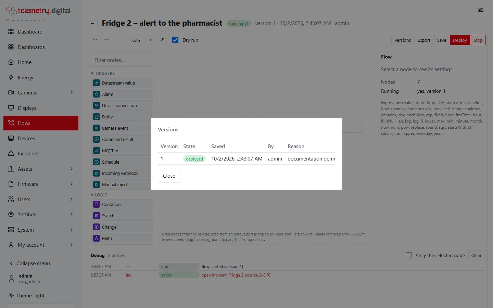
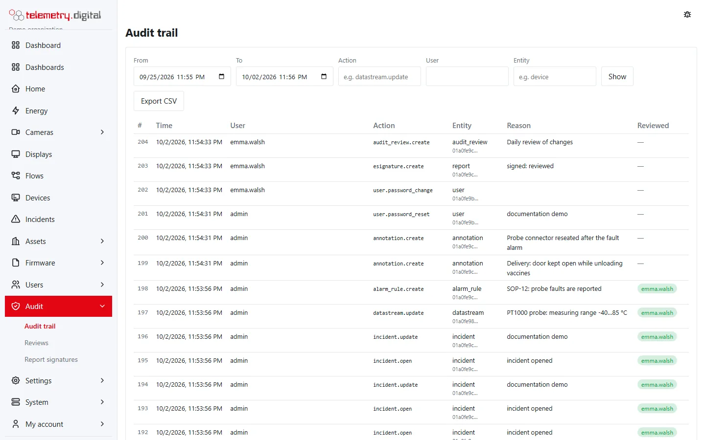
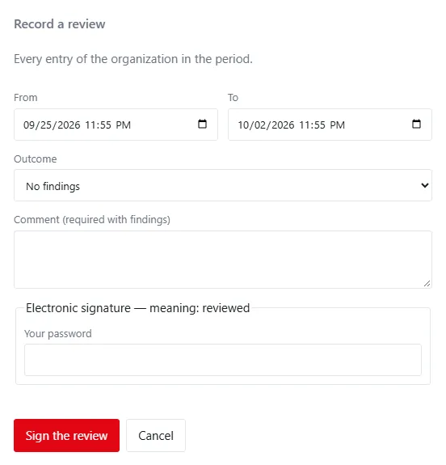
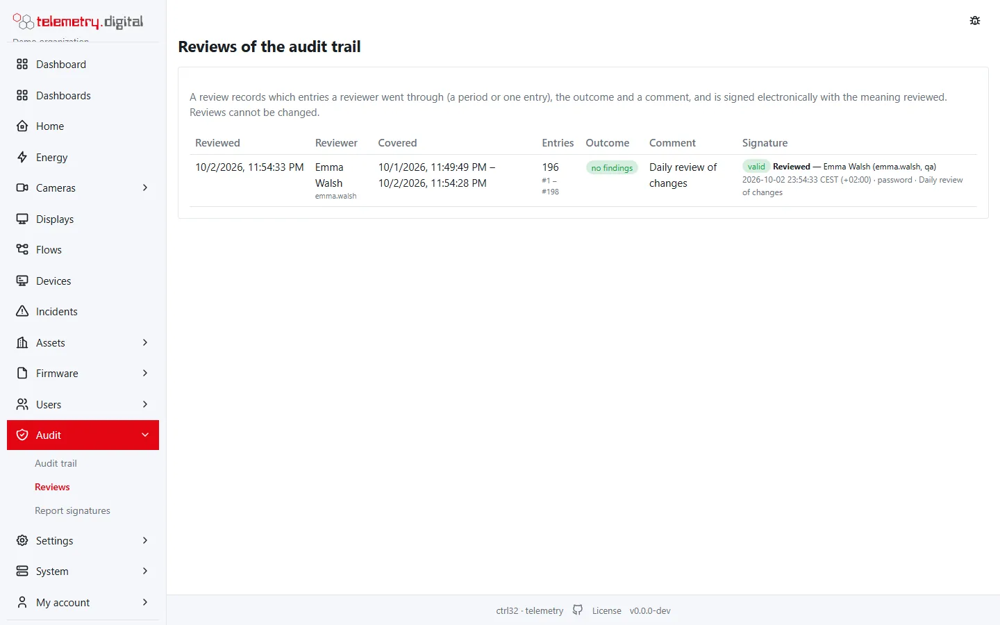

telemetry.digital keeps records you can prove.

## What is recorded

- **Every change** — of devices, datastreams, rules, flows, dashboards, cameras, users, settings — with who made it,
  when, the old and new values where it matters, and the **reason**. A change without a reason is refused.
- **Sensitive reads** — every video playback and export, unmasked viewing, listening to sound, data exports.
- **Commands** to devices, approvals and rejections; actions of flows with the flow, its version and node as origin;
  actions of AI assistants marked "via MCP".
- **Annotations** of measurements, **electronic signatures** of reports and **reviews** of the audit trail.
- **Sign-ins** in the access log.

## Why you can trust it

- Measurements, raw messages, the audit trail and other records are **append-only**: the application's database role
  cannot change or delete them.
- The audit trail is **hash-chained**: each entry includes the hash of the previous one, so a changed or removed entry
  breaks the chain.
- `ctrl32-telemetry audit verify` checks the chain on the server. A broken chain is also detected when the server
  starts, and opens an incident.
- Objects such as assets, datastreams, screens, rules and profiles are **versioned**: older versions stay readable.

*Versions of a flow, each with its author and reason.*

## The Audit trail page

**Audit → Audit trail** (with `audit.read`) lists the entries of your organization, newest first.

| Filter | Meaning |
|---|---|
| From, To | the period; the last 7 days when the page opens |
| Action | part of the action, for example `datastream.update` or `annotation` |
| User | part of the user name; AI assistants appear as "… via MCP" |
| Entity | part of the entity type, for example `device` |

| Column | Content |
|---|---|
| # | the sequence number of the entry in the hash chain |
| Time | when it happened |
| User | who did it |
| Action | what was done, as `entity.verb` |
| Entity | the type of the object and the start of its id |
| Reason | the reason given with the change |
| Reviewed | the reviewer of the latest review that covered the entry: green without findings, orange with findings |

Click an entry to see its old and new values and its hash. **Older entries** loads the next 100. **Export CSV**
exports the entries of the period.

## Reviews

A **review** records that a reviewer went through the audit trail: a period, or one entry. It needs the permission
`audit.review`, which only the built-in role **qa** has.

- **Review this period** (above the list) reviews every entry of the organization in the period of the filters.
- **Review** next to an entry reviews that entry alone.

| Field | Meaning |
|---|---|
| From, To | the period; it must have ended and be at most 366 days long |
| Outcome | **No findings**, or **Findings** |
| Comment | required with findings: what was found; at most 2000 characters |
| Your password | the reviewer's password, asked again |
| Authenticator code | the code from the authenticator app, when two-factor sign-in is on |

The review stores the first and last entry it covered, their number and the hash of the last one, so it is bound to
exactly those entries. It is **signed electronically** with the meaning *reviewed*, like a report (see
[Electronic signatures](../energy/pdf-and-exports.md#electronic-signatures)). Reviews cannot be changed or removed;
a later review simply adds another record.

**Audit → Reviews** lists the reviews with what they covered, the outcome, the comment and the signature, with a
badge *valid* or *invalid*.

!!! note "Only in the browser"
    A review is recorded by a signed-in person who enters the password again. API tokens and AI assistants can read
    the audit trail with `audit.read`, but cannot record a review.

## Reading and exporting

Reading the audit trail needs `audit.read` (administrators and quality reviewers). The audit trail and the access log
export to CSV.

## Deleting data

Data is not deleted by editing it. Removing a site, a device, a dashboard or reports is a separate, audited purge
operation done by an administrator; recordings of cameras follow their retention.

!!! note "Not a validated system by itself"
    These features support work under rules such as GxP, but telemetry.digital is not a validated system by itself.
    Validating your use of it stays with you.
