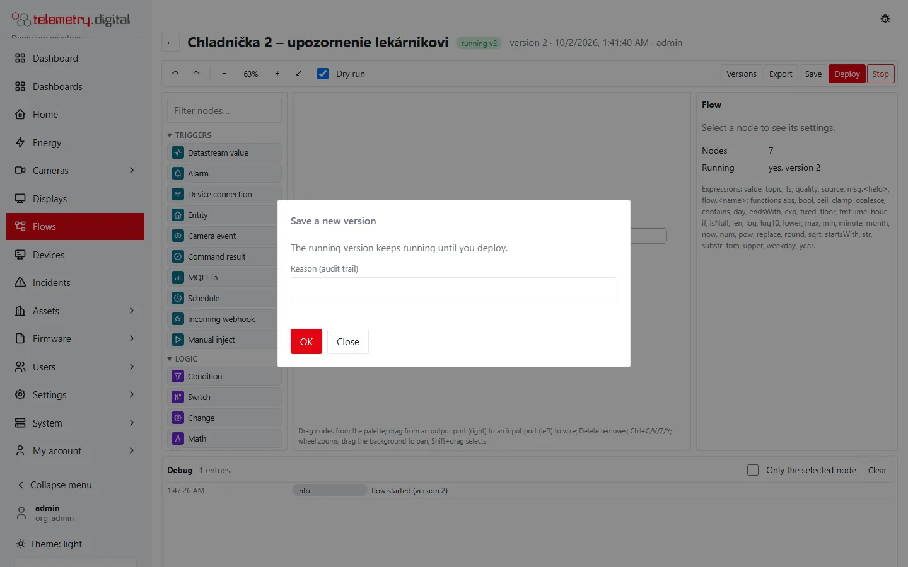

What an administrator of a telemetry.digital server takes care of.

## Pages in this section

1. [Users and permissions](users-and-permissions.md) — roles, the permission catalogue, two-factor sign-in, security
   policies, four eyes.
2. [Audit trail](audit.md) — the hash-chained record of every change, with its reason.
3. [White labeling and branding](white-labeling.md) — your logo and colours; your product name and footer (requires
   a licence).
4. [Server, backups and updates](server.md) — the Server page, HTTPS, WireGuard, backups, updates, a second database
   server.
5. [Apps for phones and tablets (PWA)](pwa-apps.md) — installable apps with their own start page and menu.
6. [Front page](front-page.md) — the public page visitors see before signing in.
7. [Remote management of PCs](remote-management.md) — remote desktop and terminal of the PCs at customers' sites.

## The rule behind all of it

Every configuration change asks for a **reason**, and the reason is stored with the change in the audit trail.

*Every save asks for a reason for the audit trail.*
Sensitive features — camera sound, unmasked video, evidence, AI access — are off by default and need their own
permission.
