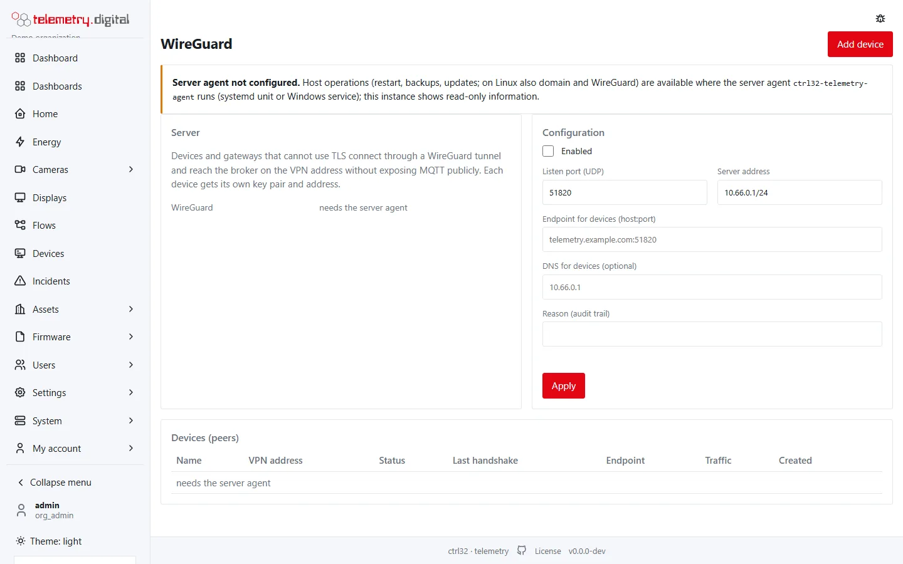

The **Server** page (permission `system.admin`) manages the machine the system runs on through a small privileged
agent that performs only a closed list of operations — it is never a general shell.

## What the Server page does

- **Restart** the service.
- **HTTPS** with Caddy and automatic certificates (Linux).
- **WireGuard** — connect remote sites or administrators to the server's own VPN.
- **Backups** — manual and scheduled, optionally encrypted.
- **Updates** — install a new version.

Every action is audited.

The Server pages work through the server agent `ctrl32-telemetry-agent` (a systemd unit or a Windows service, set up
by the installers). Where it does not run, the pages show read-only information and say so.

## Backups

A backup is one package with:

- the database;
- `config.toml` — including the secret keys without which password hashes and encrypted settings cannot be used;
- the web server and WireGuard configuration;
- `RESTORE.txt` — the steps of restoring it.

Backups can be **encrypted with a password**, made by hand or **on a schedule** (a time of day, keeping the last N),
downloaded and deleted (with a reason). A failed backup opens an incident.

**Restoring** is deliberately not a button: it is destructive and is done on the command line following
`RESTORE.txt` in the package.

!!! warning "Keep backups somewhere else"
    A backup on the same disk as the server does not survive the disk. Download backups or copy them to another
    machine, keep the encryption password apart from them, and try a restore before you need one.

Camera recordings are not in the backup — they live on their own disk (see
[Recording and storage](../video-nvr/recording.md)).

## Updates

The Server page offers new versions from `https://telemetry.digital/dl/`; downloads are **verified by SHA-256** before
they are installed (Linux and Windows). Running the installer again also updates an installation and keeps the
configuration.

## A second database server

Attach a second PC with a one-time code for:

- a **one-time copy** with a verified, safe detach;
- a **continuous replica** offsite;
- a **hot standby** with manual failover and fencing (the former primary cannot come back as a second primary).

## Health and monitoring

- `/healthz` for load balancers and monitoring.
- `/metrics` for Prometheus: data completeness, alarm latency, queues, flows, open incidents, the clock check.
- Logs can be forwarded to syslog; the server checks its clock against NTP.

## Configuration file

One file, `config.toml` (`/etc/ctrl32-telemetry/` on Linux, `C:\ProgramData\ctrl32-telemetry\` on Windows), with
sections for the web server, MQTT, database, e-mail, logs, security, reports, firmware, video, maps and time. Every key
can be overridden by an environment variable `CTRL32_<SECTION>_<KEY>`.
