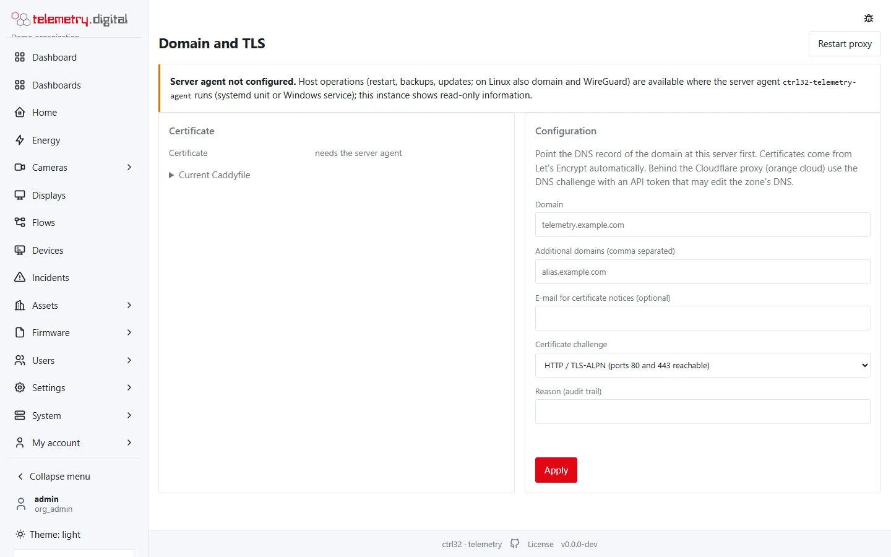
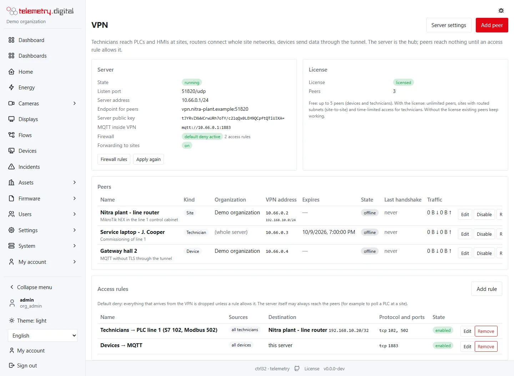
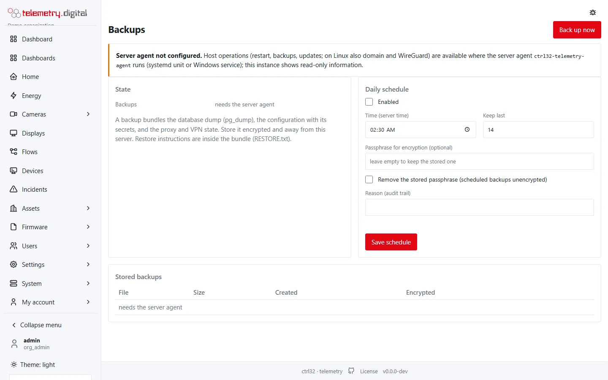
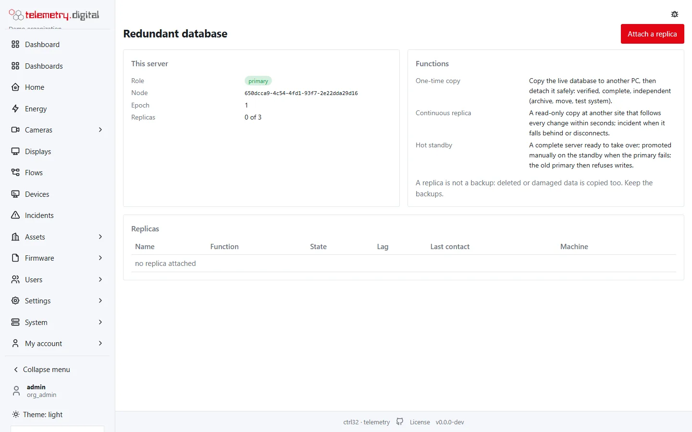

The **System** pages (permission `system.admin`) manage the machine the system runs on through a small privileged
agent, `ctrl32-telemetry-agent`, that performs only a closed list of operations — it is never a general shell. Every
action asks for a reason and is audited. Every field of these pages is listed in the
[System pages reference](system-reference.md).

## What the System pages do

- **Server** — the state of the service, host, network, database and files; restart the service and its parts.
- **Domain and TLS** — HTTPS with Caddy and automatic certificates (Linux).
- **VPN** — the server's own WireGuard network for technicians, site routers and devices, with access rules
  (Linux); see [VPN](../vpn/index.md).
- **Backups** — manual and daily, optionally encrypted.
- **Redundant database** — a one-time copy, a continuous replica or a hot standby on a second PC.
- **Updates** — install a new version.
- **License** — activate or install the licence; see the included updates and the number of cameras.

The agent is a systemd unit or a Windows service set up by the installers. Where it does not run, the pages show
read-only information and say so. On Windows, Domain and TLS and the VPN are not managed: set the certificate in
`config.toml`.

## Backups

A backup is one package with:

- the database;
- `config.toml` — including the secret keys without which password hashes and encrypted settings cannot be used;
- the web server and VPN (WireGuard) configuration;
- `RESTORE.txt` — the steps of restoring it.

Backups can be **encrypted with a passphrase**, made by hand or **daily** at a set time (default 02:30, keeping the
last 14), downloaded and deleted (with a reason). A failed scheduled backup opens an incident.

**Restoring** is deliberately not a button: it is destructive and is done on the command line following
`RESTORE.txt` in the package.

!!! warning "Keep backups somewhere else"
    A backup on the same disk as the server does not survive the disk. Download backups or copy them to another
    machine, keep the passphrase apart from them, and try a restore before you need one.

Camera recordings are not in the backup — they live on their own disk (see
[Recording and storage](../video-nvr/recording.md)).

## Updates

The Updates page offers new versions from the distribution point (`https://portal.telemetry.digital/dl/` by default).
Downloads are **verified by SHA-256** before they are installed; the agent then runs the database migrations and
restarts the service. Running the installer again also updates an installation and keeps the configuration.

With a licence, the page shows until when the licence includes updates; a version released later is not installed,
and the running system keeps working with everything it has (see [Licence](../licence/index.md#updates)). A server
without a licence can install every version.

## A second database server

Attach a second PC with a one-time pairing code (valid 15 minutes) for:

- a **one-time copy** with a verified, safe detach;
- a **continuous replica** offsite;
- a **hot standby** with manual failover and fencing (the former primary cannot come back as a second primary).

At most three replicas can be attached. A replica is not a backup: deleted data is copied too.

## Health and monitoring

- `/healthz` for load balancers and monitoring.
- `/metrics` for Prometheus (needs `data.read`): data completeness, alarm latency, queues, flows, open incidents, the
  clock check.
- `/.well-known/security.txt` publishes `security.contact` and points to `/security-policy`, the security policy
  of the product served as plain text by every server.
- Logs can be forwarded to syslog (`log.syslog`); the server checks its clock against NTP (`[time]`).

## Reporting a vulnerability

If you find a security problem, write to **info@telemetry.digital** and do not publish it before it is fixed.
The full policy is on the `/security-policy` page of every server, for example
`https://portal.telemetry.digital/security-policy`.

## Configuration file

One file, `config.toml` (`/etc/ctrl32-telemetry/` on Linux, `C:\ProgramData\ctrl32-telemetry\` on Windows), with
sections for the web server, MQTT, database, e-mail, logs, gaps, time, security, reports, firmware, video, licence,
agent and maps. A fixed list of keys — the profile, listen addresses, database, e-mail, logs, secrets, reports and the
licence service — can also be set by environment variables `CTRL32_…`. Every key, its default and the variables are
in the [configuration reference](config-reference.md).
