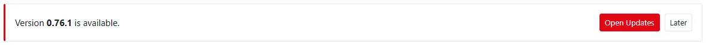

The **System** pages (permission `system.admin`) manage the machine the system runs on through a small privileged
agent, `ctrl32-telemetry-agent`, that performs only a closed list of operations — it is never a general shell. Every
action asks for a reason and is audited. Every field of these pages is listed in the
[System pages reference](system-reference.md).

## What the System pages do

- **Server** — the state of the service, host, network, database and files; restart the service and its parts.
- **Domain and TLS** — HTTPS with Caddy and automatic certificates (Linux).
- **VPN** — the server's own WireGuard network for technicians, site routers and devices, with access rules
  (Linux); see [VPN](../vpn/index.md).
- **Backups** — manual and daily, optionally encrypted.
- **Redundant database** — a one-time copy, a continuous replica or a hot standby on a second PC.
- **Updates** — how new versions arrive (manually, with a notice, or automatically in a maintenance window), install
  one from the distribution point or from an uploaded offline package.
- **E-mail (SMTP)** — the outgoing e-mail of the server, with a test message.
- **License** — activate or install the licence; see the included updates and the number of cameras.

The agent is a systemd unit or a Windows service set up by the installers. Where it does not run, the pages show
read-only information and say so. On Windows, Domain and TLS and the VPN are not managed: set the certificate in
`config.toml`.

## Backups

A backup is one package with:

- the database;
- `config.toml` — including the secret keys without which password hashes and encrypted settings cannot be used;
- the web server and VPN (WireGuard) configuration;
- `RESTORE.txt` — the steps of restoring it.

Backups can be **encrypted with a passphrase**, made by hand or **daily** at a set time (default 02:30, keeping the
last 14), downloaded and deleted (with a reason). A failed scheduled backup opens an incident.

**Restoring** is deliberately not a button: it is destructive and is done on the command line following
`RESTORE.txt` in the package.

!!! warning "Keep backups somewhere else"
    A backup on the same disk as the server does not survive the disk. Download backups or copy them to another
    machine, keep the passphrase apart from them, and try a restore before you need one.

Camera recordings are not in the backup — they live on their own disk (see
[Recording and storage](../video-nvr/recording.md)).

## Updates

### Only signed releases

Every release carries a **signed manifest**: the version, the release date and the size and SHA-256 checksum of every
file, signed with the project's release key. The server installs a release only when the signature verifies with a
key built into the running version and every file matches the manifest — a changed file, an unknown key, a missing
signature or another version than requested refuses the update before anything on the server changes. This holds for
the distribution point, a mirror in your network and an uploaded package alike.

### Update modes

| Mode | What happens |
|---|---|
| Manual | nothing by itself; a system administrator checks and installs |
| Notify (default) | the server checks once a day; system administrators see a banner, server administrators get one e-mail per version (when e-mail works) |
| Automatic | in a weekly one-hour maintenance window the server installs **patch versions** (for example 0.76.0 → 0.76.1) — with the option also minor versions, never major ones |

The maintenance window is a day of the week and a start time in a time zone you choose (by default the server's).
An automatic update always takes a backup first. A version whose automatic installation failed is not tried again by
itself.

### Installation and automatic rollback

1. The release is verified (signature, files, the licence's included updates) — nothing is changed yet.
2. Optionally (always in the automatic mode) a **backup** of the database and the configuration is taken.
3. The running program is kept, the new one is put in place and the database is migrated.
4. The service restarts and the server waits until the new version reports itself healthy.

When the **database migration fails**, the previous program returns at once and the database is restored from the
backup of step 2. When the new version **does not become healthy** within the rollback time (default 10 minutes), the
previous program returns automatically. The database then keeps the new structure — migrations only add — so the
data written in the meantime is kept; if the older version cannot work with it, restore the backup named in the
history. Every installation and its result (installed, rolled back, failed) is listed in the history and written to
the [audit trail](audit.md); server administrators get an e-mail about a rollback.

With a licence, the page shows until when the licence includes updates; a version released later is not installed,
and the running system keeps working with everything it has (see [Licence](../licence/index.md#updates)). A server
without a licence can install every version. Running the installer again also updates an installation and keeps the
configuration.

### Updates without the Internet

Each release has an **offline package**, `ctrl32-telemetry-<version>-offline.zip`, on the download page. It holds the
signed manifest, the programs for Linux (x86-64, ARM 64-bit, ARM 32-bit) and Windows, the checksums and the parts of
the object counting detector with their licences. Three ways to use it:

- **Upload package** on the Updates page: choose the file, give a reason and your password (and authenticator code).
  The server verifies the whole package before keeping anything, then installs it exactly like an online update —
  backup, migration, automatic rollback. Uploading is possible only in the browser, not with an API token or an AI
  assistant. The limit is 2048 MB (`[agent] max_package_mb`).
- **Command line** on the server: `ctrl32-telemetry update --file ctrl32-telemetry-0.76.0-offline.zip`. It shows what
  the package contains and asks before installing (`--yes` skips the question, `--no-backup` skips the backup). When
  the agent service does not run, the command installs by itself (run it as root or administrator).
  `ctrl32-telemetry update verify --file …` only checks a package.
- **A mirror in your network**: on a machine with the Internet, `ctrl32-telemetry update mirror --to /srv/ctrl32-mirror`
  copies the latest release with full verification (`--no-detector` leaves out the detector parts). Serve the
  directory with any web server and set `[agent] update_url = "http://mirror.example.local/ctrl32-mirror"` on each
  server. The servers then check, notify and update from the mirror; a mirror cannot change what is installed,
  because the signature is checked on every server.

The detector installation (see [Counting with cameras](../object-counting/cameras.md#install-the-detector)) uses the
parts of an uploaded package or of the mirror when they are there.

## E-mail (SMTP)

*System → Server → E-mail (SMTP)* sets the outgoing e-mail used for alarm notifications, scheduled reports, password
reset links and the notices of the server:

- the SMTP server and port, the **security** — STARTTLS (port 587), SSL/TLS (port 465) or none (only for a relay on
  the server itself or in the local network; the page warns about it);
- the user name and **password** — the password is stored encrypted and never shown again; leave the field empty to
  keep it;
- the sender address and name, an optional reply-to address and the recipients of alarm e-mails.

**Send test e-mail** sends a message with the values of the form, even before you save them, and shows the
conversation with the mail server — so a wrong port, a refused login or a missing encryption is visible at once. Test
messages appear in the delivery log of notifications.

Settings saved on the page take precedence over the `[smtp]` section of `config.toml`; *Use config.toml* removes them.
With `override = true` in `[smtp]` the file always applies and the page is read-only.

## A second database server

Attach a second PC with a one-time pairing code (valid 15 minutes) for:

- a **one-time copy** with a verified, safe detach;
- a **continuous replica** offsite;
- a **hot standby** with manual failover and fencing (the former primary cannot come back as a second primary).

At most three replicas can be attached. A replica is not a backup: deleted data is copied too.

## Health and monitoring

- `/healthz` for load balancers and monitoring.
- `/metrics` for Prometheus (needs `data.read`): data completeness, alarm latency, queues, flows, open incidents, the
  clock check.
- `/.well-known/security.txt` publishes `security.contact` and points to `/security-policy`, the security policy
  of the product served as plain text by every server.
- Logs can be forwarded to syslog (`log.syslog`); the server checks its clock against NTP (`[time]`).

## Reporting a vulnerability

If you find a security problem, write to **info@telemetry.digital** and do not publish it before it is fixed.
The full policy is on the `/security-policy` page of every server, for example
`https://portal.telemetry.digital/security-policy`.

## Configuration file

One file, `config.toml` (`/etc/ctrl32-telemetry/` on Linux, `C:\ProgramData\ctrl32-telemetry\` on Windows), with
sections for the web server, MQTT, database, e-mail, logs, gaps, time, security, reports, firmware, video, licence,
agent and maps. A fixed list of keys — the profile, listen addresses, database, e-mail, logs, secrets, reports and the
licence service — can also be set by environment variables `CTRL32_…`. Every key, its default and the variables are
in the [configuration reference](config-reference.md).
