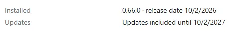
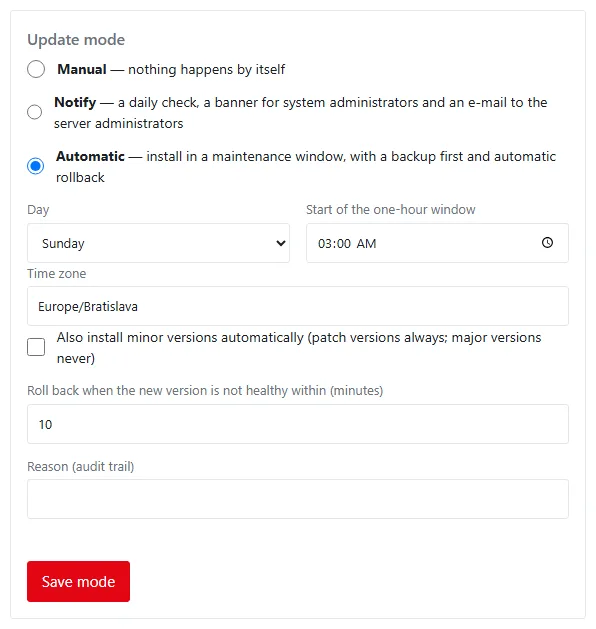
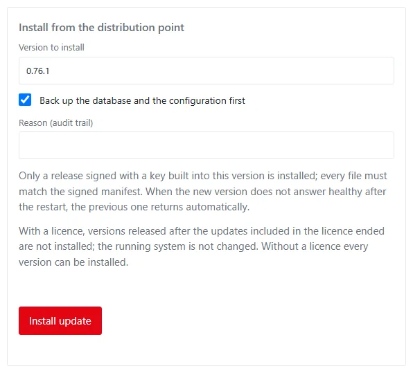
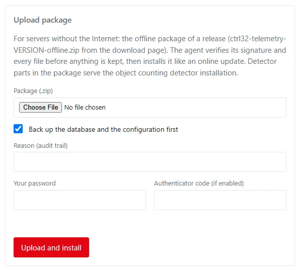
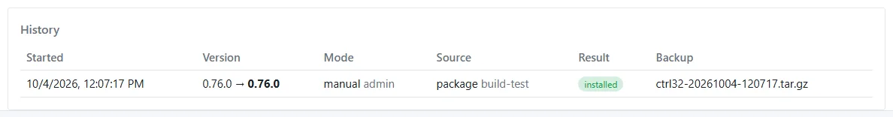
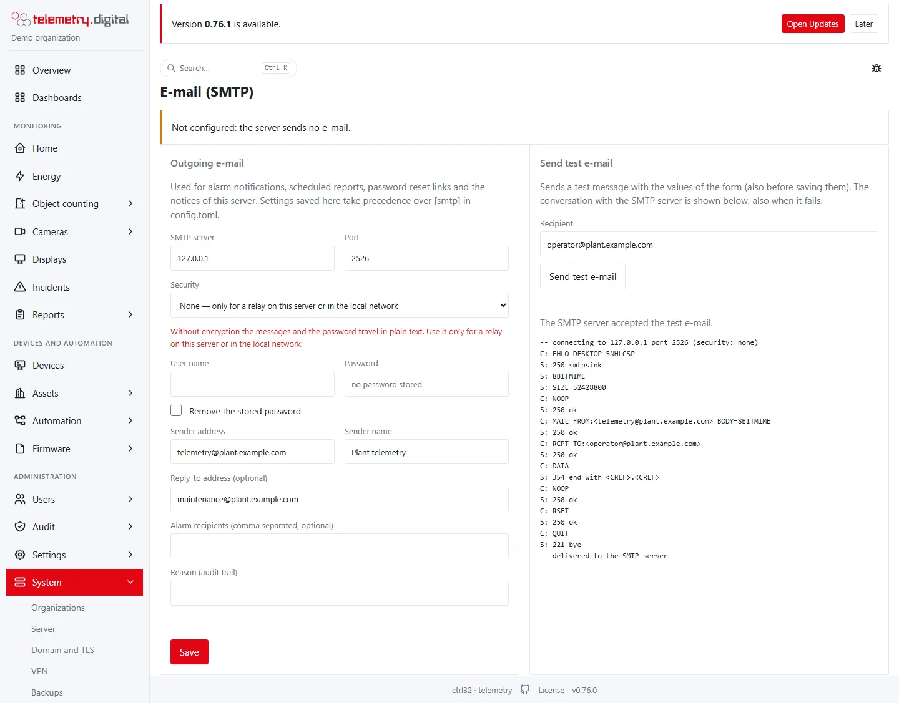

The **System** menu manages the server itself. All its pages need `system.admin` — the built-in role `server_admin`
(see [Users and permissions](users-and-permissions.md#server-administration)). Every change asks for a **reason**
(up to 200 characters) and is written to the [audit trail](audit.md).

| Page | Address |
|---|---|
| Organizations | `/organizations` |
| Server | `/server` |
| Domain and TLS | `/server/domain` |
| VPN | `/server/vpn` (the earlier `/server/wireguard` leads there) |
| Backups | `/server/backups` |
| Redundant database | `/server/redundancy` |
| Updates | `/server/updates` |
| E-mail (SMTP) | `/server/email` |
| License | `/server/license` |
| Front page | `/landing/edit` |

## The server agent

Restarts, the domain and TLS proxy, the VPN, backups and updates are carried out by the **server agent**
`ctrl32-telemetry-agent`, a separate service with the privileges the web service lacks. It performs only a closed
list of operations and never runs commands it receives. The installers set it up as a systemd unit (Linux) or a
Windows service.

- When the agent is **not configured** (`[agent] socket` is empty), the pages show read-only information and say
  *Server agent not configured*.
- When it is configured but **not reachable**, the pages show the error; on Linux check
  `systemctl status ctrl32-telemetry-agent`.
- On **Windows** the pages *Domain and TLS* and *VPN* are hidden: set `http.tls_cert` and `http.tls_key` in
  [config.toml](config-reference.md) instead.

## Organizations

Each organization is a separate tenant on the server: its own users and roles, devices, sites, alarm rules,
templates, branding, languages and reports. Nothing is shared between organizations.

!!! warning "This page covers the whole server"
    Every holder of `system.admin` sees and changes all organizations here. See
    [Permissions reference](permissions-reference.md).

The list shows *Name* (with *this one* for your own), *Slug*, *Administrator*, *Users* and *Devices* (active only),
*Time zone*, *Created* and *Status* (active or disabled), with the buttons **Edit**, **Reset admin password** and
**Disable** or **Enable**.

### New organization

| Field | Default | Limits |
|---|:---:|---|
| Name | — | required, up to 128 characters |
| Slug | made from the name | 2–63 characters: lowercase letters, digits, dashes, starting with a letter or digit; unique on the server |
| Time zone | Europe/Bratislava | a valid IANA time zone, up to 64 characters |
| Default language | English | one of the 19 languages |
| First administrator: Username | `<slug>-admin` | 2–64 characters; unique on the server |
| First administrator: Full name | — | up to 128 characters |
| First administrator: E-mail | — | up to 254 characters; unique on the server |
| Reason (audit trail) | — | required |

The administrator gets the `org_admin` role — the organization only, not the server — and a one-time password shown **once**. They must change it at the first
sign-in and set up an authenticator.

### Edit, disable, reset

- **Edit**: name, time zone, default language.
- **Disable**: every session of its users is signed out, sign-in is refused and its devices are rejected at their
  next connection. Data stays intact. You cannot disable your own organization.
- **Enable**: users can sign in and devices can connect again.
- **Reset admin password**: a new one-time password for an active user of that organization (the administrator's
  user name is filled in); it is shown once and must be changed at the next sign-in.

## Server

The overview of the running service. **Refresh** reloads it; **Restart service** restarts the web service (users and
devices reconnect within seconds; requires the agent).

| Card | Shows |
|---|---|
| Service | version, profile, process start, PID, Go version, goroutines, connected MQTT devices, time synchronisation (offset, NTP server, last check) |
| Host | host name, system, kernel and architecture, uptime, load, CPUs, memory, free space of each disk, time zone, server time (with the agent) |
| Network | public URL, HTTP listen address (TLS), public read-only access, MQTT, MQTT over TLS, MQTT over WebSocket, MQTT inside VPN, SMTP, agent socket |
| Database | server, PostgreSQL version, size, number of organizations, users, devices, sites, stored reports, pending commands |
| Storage and files | report and firmware directories (with the firmware size limit), Typst, log file and level, gap check interval, links to `/metrics` and `/.well-known/security.txt` |
| Components | versions of the parts installed on the host (with the agent) |
| Object counting | the self-check of the detector for object counting on cameras: ffmpeg (version, LGPL or GPL build), ONNX Runtime (version) and the nano and tiny models (SHA-256, test inference), with **Check again**, and for server administrators **Install the detector** (or **Repair or update** and **Remove**) with the progress of the server agent; see [Install the detector](../object-counting/cameras.md#install-the-detector) |

**Services and containers** lists the systemd units and Docker containers with their state and whether they start at
boot. The agent, WireGuard and the reverse proxy have a **Restart** button (each asks for a reason).

The time synchronisation row says *ok*, *unreachable* or *not configured (no NTP server)*, and warns when the
operating system reports its clock as not synchronized.

## Domain and TLS

HTTPS for the server through the Caddy reverse proxy (Linux, Docker required). Point the DNS record of the domain at
the server first; certificates come from Let's Encrypt automatically.

| Field | Limits | Meaning |
|---|---|---|
| Domain | a valid lowercase host name | the server's address |
| Additional domains | comma separated, each a valid host name | more names on the same certificate |
| E-mail for certificate notices | optional, a valid e-mail address | where the certificate authority writes |
| Certificate challenge | HTTP / TLS-ALPN, or Cloudflare DNS | HTTP / TLS-ALPN needs ports 80 and 443 reachable; Cloudflare DNS works behind the Cloudflare proxy |
| Cloudflare API token | required for Cloudflare DNS (Zone:DNS:Edit); blank keeps the stored one | used for the DNS challenge |
| Reason (audit trail) | required | — |

**Apply** writes the proxy configuration, reloads the proxy and sets `http.base_url` to `https://<domain>`; when that
changes, the service restarts with the new address. With Cloudflare DNS the first apply builds a proxy image with the
DNS module, which can take a few minutes. **Restart proxy** restarts Caddy (HTTPS is unavailable for a few seconds).

The **Certificate** card shows the domain, additional domains, whether the proxy is managed from the page, the
challenge, the certificate's names, issuer and expiry (red under 10 days), the current Caddyfile, and that MQTT over
TLS on port 8883 uses the same certificate (copied every 10 minutes).

## VPN

The VPN page — server settings, peers (technicians, devices, site routers), access rules with default deny and the
generated firewall rules — has a section of its own: [VPN](../vpn/index.md). Every field of the server settings is in
[Set up the VPN](../vpn/setup.md), the peer fields in [Peers](../vpn/peers.md) and the rule fields in
[Access rules](../vpn/access-rules.md).

## Backups

A backup bundles the database dump, `config.toml` with its secrets, and the proxy and VPN (WireGuard) state, plus
`RESTORE.txt` with the steps of restoring it. Camera recordings are not included.

| State row | Meaning |
|---|---|
| Database | PostgreSQL in Docker, native PostgreSQL, or not found |
| Directory | Linux `/var/lib/ctrl32-telemetry/backups`, Windows `%ProgramData%\ctrl32-telemetry\backups` |
| Running now | whether a backup is in progress (only one runs at a time) |
| Schedule | daily time, number kept, encrypted or not |
| Last run | time and the file, or the error |
| Stored | number of backup files |

### Daily schedule

| Field | Default | Limits |
|---|:---:|---|
| Enabled | off | — |
| Time (server time) | 02:30 | 00:00–23:59 |
| Keep last | 14 | 1–365 |
| Passphrase for encryption | — | optional; blank keeps the stored one |
| Remove the stored passphrase | off | scheduled backups become unencrypted |
| Reason (audit trail) | — | required |

After each scheduled backup, the oldest backup files beyond *Keep last* are deleted — this counts every file in the
directory, including backups made by hand.

### Back up now and stored backups

**Back up now** asks for an optional passphrase and a reason. With a passphrase the bundle is encrypted (AES-256,
`.enc` file; the host needs OpenSSL). The list shows *File*, *Size*, *Created* and *Encrypted*, with **Download** and
**Delete** (with a reason; only the file is removed).

A failed scheduled backup opens an incident. **Restoring** is done on the command line following `RESTORE.txt`, never
from the page.

!!! warning "Keep backups somewhere else"
    A backup on the server's own disk does not survive that disk. Download backups or copy them to another machine,
    keep the passphrase apart from them, and try a restore before you need one.

## Redundant database

Attach a second PC with the same release and the same PostgreSQL major version as a replica. At most **3** replicas
can be attached.

| Function | Meaning |
|---|---|
| One-time copy | copy the live database to another PC, then detach it safely: verified, complete, independent |
| Continuous replica | a read-only copy at another site that follows every change within seconds; an incident opens when it falls behind or disconnects |
| Hot standby | a complete server ready to take over; promoted by hand on the standby when the primary fails; the old primary then refuses writes |

The **This server** card shows its role (primary or replica), node id, epoch, where it was promoted from, and the
number of replicas. A replica is not a backup: deleted or damaged data is copied too.

### Attach a replica

| Field | Default | Limits |
|---|:---:|---|
| Function | Continuous replica | One-time copy, Continuous replica, Hot standby |
| Name | — | 1–64 characters |
| Lag limit (seconds) | 10 | 1–86 400 |
| Reason (audit trail) | — | required |

**Create pairing code** shows a 12-character code, valid **15 minutes**, shown once, and the command to run as root
on the second PC:

```text
sudo ctrl32-telemetry replica attach -primary https://<this server> -code <code>
```

A hot standby also needs `-standby-url https://<the standby>`. The local database of the second PC is replaced by the
copy (its old data directory is kept aside). Too many pairing attempts from one address are refused for a minute.

### Replica list and settings

The list shows *Name*, *Function*, *State* (waiting for the replica, copying with percent and time left, in sync,
lagging, disconnected, detaching, detached, detach failed, lost, dropped), *Lag* (seconds and bytes), *Last contact*
and *Machine*. Click a row for details: replayed position, limits, machine, standby URL, the detachment and its
verification, and the history of events.

| Settings field | Default | Limits |
|---|:---:|---|
| Function | as attached | One-time copy, Continuous replica, Hot standby |
| Lag limit (seconds) | 10 | 1–86 400 |
| Maximum kept for it on this server (MB) | 10 240 | 64–10 485 760 |
| Standby public URL | — | `http(s)://host`; required for a hot standby |

- **Detach safely**: the primary counts its records and writes a detachment entry; the replica catches up, becomes
  independent and verifies the audit chain and the counts. When the replica is not in sync you may accept a
  **partial** copy (marked partial). The primary keeps collecting data.
- **Drop**: removes the replica's access; its copy stays as it is and is no longer fed.
- **Promote** a hot standby on the standby itself: `ctrl32-telemetry replica promote`.

## Updates

### Status

| Row | Meaning |
|---|---|
| Installed | the running version and its release date |
| Updates | *Updates included until* a date, *Updates ended on* a date (the system keeps running), or *all versions* |
| Available | the newest version at the distribution point, with *update available* or *up to date* |
| Signature | *signed* and the key that signed it, or *not signed* (a release before 0.76.0 or a mirror without the manifest — not installed) |
| Step | patch, minor or major, and whether the licence includes the version |
| Distribution point | `[agent] update_url`, default `https://portal.telemetry.digital/dl` |
| Checked, Next check | the last and the next check |
| Next maintenance window | automatic mode: when the next window opens, or why the available version is not installed automatically |
| Trusted release keys | the keys this version accepts signatures of |
| Staged package | the last verified offline package on the server |

**Check now** asks the distribution point at once (otherwise once a day).



### Update mode

| Field | Values | Default |
|---|---|:---:|
| Mode | Manual, Notify, Automatic | Notify |
| Day | a day of the week | Sunday |
| Start of the one-hour window | a time | 03:00 |
| Time zone | a time zone name such as `Europe/Bratislava`; empty for the server's | empty |
| Also install minor versions automatically | patch versions are always installed, major versions never | off |
| Roll back when the new version is not healthy within | 2–60 minutes | 10 |
| Reason | up to 200 characters | — |

Day, time, time zone and minor versions apply only to the automatic mode; the rollback time applies to every
installation.



### Install from the distribution point

**Install update** asks for the **Version to install** (filled in with the available one), whether to **back up the
database and the configuration first** (on by default) and a reason. The agent verifies the signed manifest and the
program, takes the backup, runs the database migrations and restarts the service; the page reloads after 15 seconds.
Refusals:

| Message | Meaning |
|---|---|
| offers no signed release manifest | the distribution point publishes no signature; nothing installed |
| does not match the release manifest / signed by keys this server does not trust | the signature is wrong or of an unknown key |
| offers version X, not Y | the distribution point has another version than requested |
| does not match the signed manifest | a file was changed or is incomplete |
| updates included in the licence ended | the release is newer than the licence's updates; the running system stays |
| migration failed … restored | the previous program (and the database from the backup) came back |



### Upload package

| Field | Rule |
|---|---|
| Package (.zip) | an offline package of a release, at most `[agent] max_package_mb` (2048 MB) |
| Back up the database and the configuration first | on by default |
| Reason | required |
| Your password | required; and the authenticator code with two-factor sign-in |

The upload shows its progress, then *Verifying the signature and the files, then installing*. A package is refused
when its signature does not verify, a file is missing from the manifest, differs from it or lies outside the package.
A package without the program for this server's platform is verified and kept for the detector installation; nothing
is installed. Uploads, refusals included, are audited.



### History

The last 20 installations: start, from → to version, mode (manual, automatic, command line) with who started it,
source (online or package) with the signing key, result (installed, waiting for the new version, rolled back,
failed — with the reason) and the backup taken before.



### Command line

| Command | Purpose |
|---|---|
| `ctrl32-telemetry update --file PACKAGE.zip` | verify and install an offline package (asks first; `--yes`, `--no-backup`, `--reason`) |
| `ctrl32-telemetry update verify --file PACKAGE.zip` | only verify a package and show its content |
| `ctrl32-telemetry update mirror --to DIR` | copy the latest release with verification into a directory for a web server in your network (`--from URL`, `--no-detector`) |

## E-mail (SMTP)

| Field | Rule | Default |
|---|---|:---:|
| SMTP server | a host name or an IP address | — |
| Port | 1–65535 | 587, 465 with SSL/TLS |
| Security | STARTTLS, SSL/TLS, or None — only to the server itself or the local network (a private address or a local name) | STARTTLS |
| User name, Password | the password is stored encrypted and never shown; empty keeps the stored one | — |
| Remove the stored password | clears it | off |
| Sender address, Sender name | the address and the display name of the sender | — |
| Reply-to address | optional | — |
| Alarm recipients | comma separated, at most 50 | — |
| Reason | required | — |

The note at the top says where the settings in use come from: saved on this page, `[smtp]` of `config.toml`, or not
configured. **Use config.toml** removes the saved settings. **Send test e-mail** sends a message to a recipient with
the values of the form and shows the conversation with the mail server (the login is hidden); the attempt is in the
delivery log and the audit trail. Changes are audited without the password.



## License

The software is free to use with up to 4 cameras; more cameras, white labeling, changes through AI assistants and the
VPN extras require a licence issued for this server. The licence includes updates for its validity period.

| Row | Meaning |
|---|---|
| Status | none, valid, or not valid with the reason (expired, issued for another server name) |
| Licensee | name and e-mail |
| License | the licence id |
| Features | for example `white_label` |
| Valid until | a date, or *no expiry date* |
| Updates | *Updates included until* a date; after it *Updates ended on* that date — the system keeps running, only newer versions are not installed until the licence is renewed |
| Server names | names the licence is issued for, and this server's name |
| Installed | when and by whom |
| Cameras | *N of 4 without a licence*, or the number of cameras with *no limit with the licence* |
| Type | a 30-day licence from the online activation (refund period) |
| Order number | the stored order, when and by whom it was activated |
| Activation | renewed automatically, activated, last attempt failed (retried the next day), or refused (automatic renewal stopped) |
| Last check | the last request to the licence service |

- **Activate with the order number**: enter the order number from the purchase confirmation (up to 128 characters)
  and a reason. The server sends it with its host name (from `http.base_url`) to the licence service and installs the
  licence it gets. During the refund period the licence runs 30 days and renews itself; after it, the licence
  without an expiry date arrives on its own. The server checks once a day while the installed licence expires within 20 days.
- **Install a license key (offline)**: paste a key starting with `c32l1.` and a reason; it is verified offline. A key
  whose included updates ended before the installed version was released is refused.
- **Renew now** asks the licence service at once (with a reason).
- **Remove license** (with a reason) brings back the product name and footer; white-label settings stay.

See [White labeling and branding](white-labeling.md) and [Licence](../licence/index.md).

## Front page

The public page before sign-in is edited under *System → Front page*. See [Front page](front-page.md).

## Command-line administration

Some operations are deliberately not on any page; run them on the server.

| Command | Purpose |
|---|---|
| `ctrl32-telemetry audit verify` | check the hash chain of the audit trail |
| `ctrl32-telemetry admin bootstrap` | create the first organization and administrator (`-org-name`, `-org-slug`, `-username`, `-name`, `-email`, `-password`) |
| `ctrl32-telemetry admin reset-password` | set a new password for a user (`-username`, `-password`; `-permanent` skips the forced change) |
| `ctrl32-telemetry admin purge` | the one audited way to delete records: `-site`, `-device`, `-dashboard` or `-reports`, with `-reason`; shows counts and deletes only with `-yes` |
| `ctrl32-telemetry replica attach`, `status`, `promote` | the second database server |
| `ctrl32-telemetry service install`, `uninstall`, `start`, `stop`, `restart` | the system service; append `-agent` or `-relay` (for example `install-agent`) for the server agent or the camera relay |
| `ctrl32-telemetry verify-evidence` | verify a signed evidence package of camera recordings |
| `ctrl32-telemetry update --file`, `update verify`, `update mirror` | offline updates and a mirror of the distribution point (see [Updates](#updates)) |
