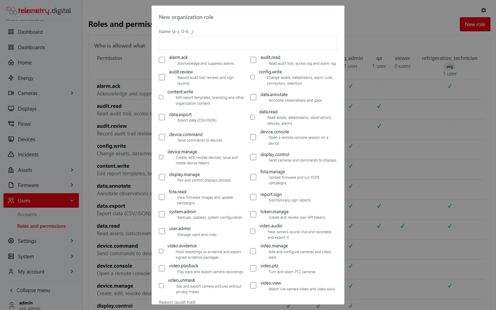
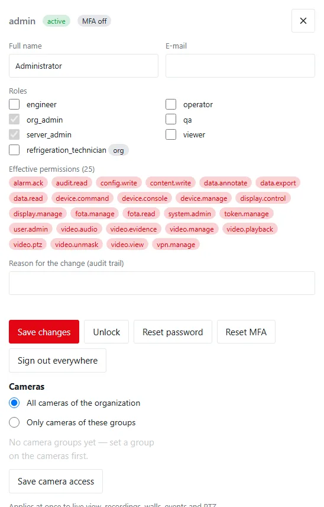
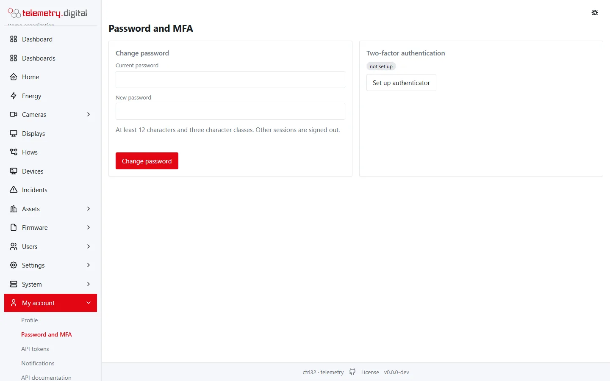
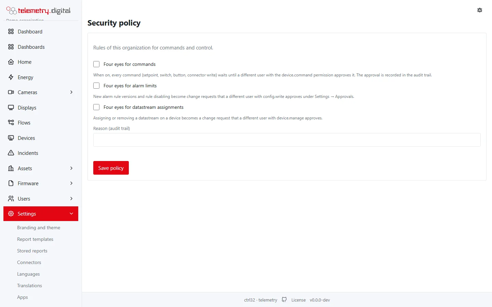
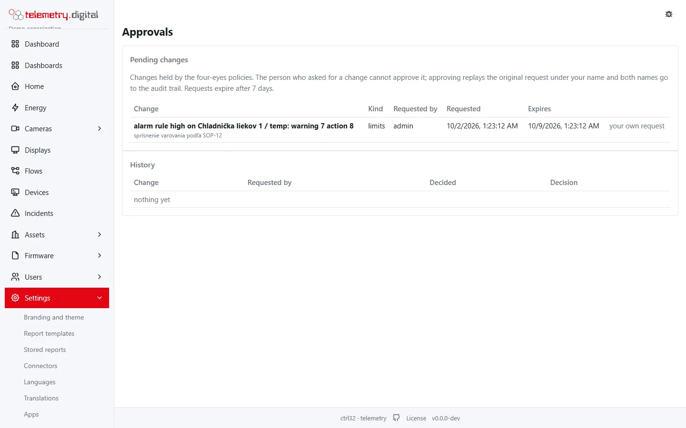
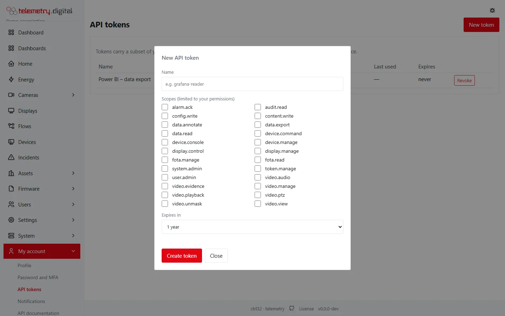
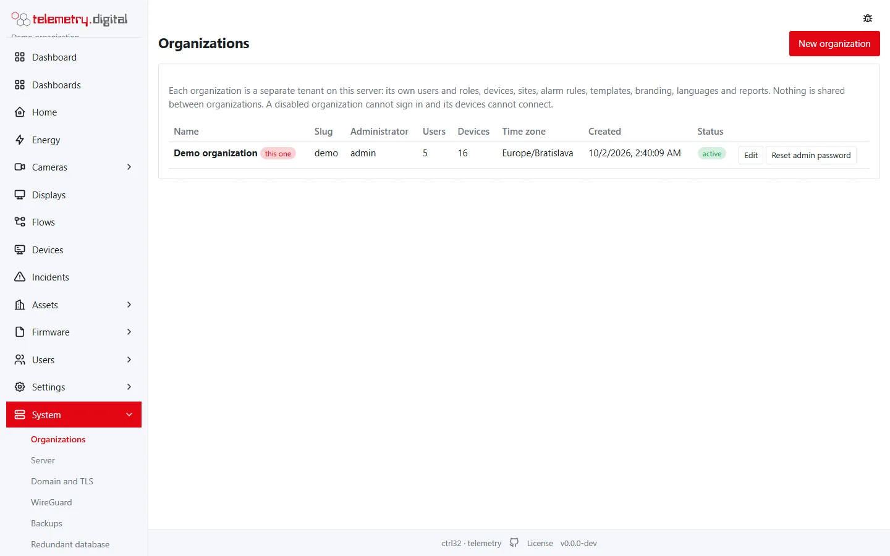
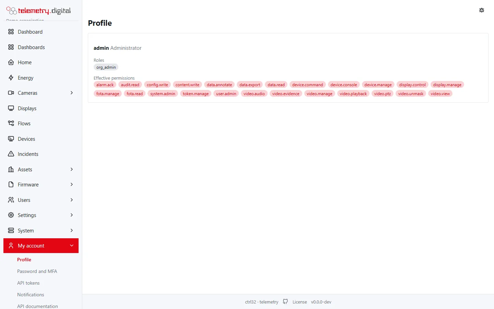

The **Users** menu (permission `user.admin`) manages the accounts and roles of your organization. Every change needs
a **reason** and is written to the [audit trail](audit.md).

| Page | Address |
|---|---|
| Accounts | `/users` |
| Roles and permissions | `/users/roles` |

## Roles

A user has one or more roles; a role is a set of permissions. A user's **effective permissions** are the union of the
permissions of all their roles. The built-in roles cannot be changed; your organization can create its own roles from
the permission catalogue.

| Role | Typical person |
|---|---|
| viewer | reads data |
| operator | operator on shift: acknowledges alarms, sends commands, watches live cameras, turns PTZ cameras, controls displays |
| qa | quality reviewer: reads data, exports and the audit trail |
| engineer | sets up devices, connectors, firmware, dashboards, flows, cameras, video walls and displays |
| org_admin | the organization's administrator: users and roles, the security policy, approvals, the organization's VPN, the organization export, sensitive camera permissions |
| server_admin | the server's administrator: every organization and the *System* pages (server settings, VPN of the whole server, backups, updates, licence); usually given together with `org_admin` |

The exact permissions of each role are in the [Permissions reference](permissions-reference.md).

### Roles and permissions page

**Who is allowed what** is a matrix of every permission (with its description) against every role, with the number of
users of each role. Organization roles are marked *org*.

### Server administration

The built-in role **server_admin** administers the whole server: every organization, the server settings, the VPN of
the whole server, backups, updates and the licence (permission `system.admin`). **org_admin** administers one
organization only. The *Server administration* card under the matrix says how many users hold `server_admin`.

- Only a server administrator can grant or remove `server_admin` (or any role with `system.admin`), and every change
  needs a reason and goes to the role history and the audit trail.
- Only a server administrator can change the account of a server administrator: its name and e-mail, roles,
  disabling, password reset, two-factor reset, unlocking and signing out.
- The server refuses — not only the dialog — to let anyone disable their own account or remove their own
  administration roles, and to remove `server_admin` from the last server administrator.

!!! warning "Review server_admin after the upgrade to 0.65"
    Before 0.65 every `org_admin` could administer the whole server. So that nobody lost access, the upgrade gave
    `server_admin` to every user who held `org_admin` at that moment (the role history shows it with the reason
    *migration 0045*). Open each of them and remove `server_admin` where the person should administer only their
    organization. New organization administrators do not get it.

**New role** creates an organization role:

| Field | Rule |
|---|---|
| Name | 2–32 characters: a lowercase letter first, then `a-z`, `0-9` or `_`; unique |
| Permissions | a check box for every permission, with its description |
| Reason (audit trail) | required |

Under **Organization roles** each role opens to its permission check boxes; **Save permissions** (with a reason)
changes it. The change applies at once to every user with the role and to their API tokens.

## Accounts

The list shows *Username*, *Name*, *E-mail*, *Roles*, *MFA* (on or off), *Status* and *Last login*. The status is
*active*, *disabled*, *locked* (too many failed sign-ins) or *password change* (the user must change the password at
the next sign-in).

### New user

| Field | Default | Rule |
|---|:---:|---|
| Username | — | required, 2–64 characters, unique on the server |
| Full name | — | required, up to 128 characters |
| E-mail | — | optional, a valid address, up to 254 characters |
| Roles | viewer | any built-in or organization roles |
| Reason (audit trail) | — | required |

After **Create** the dialog shows a **one-time password**, once. The user must change it at the first sign-in.

### A user's page

Click a user to open their page:

- **Full name**, **E-mail** and **Roles**, saved with **Save changes**. You cannot remove `org_admin` or
  `server_admin` from yourself; `server_admin` and roles with `system.admin` can be ticked only by a server
  administrator.
- **Effective permissions** of the user.
- Actions, each with the reason typed in *Reason for the change*:

| Action | Effect |
|---|---|
| Disable / Enable | a disabled user cannot sign in; not offered for yourself, and refused for the last server administrator |
| Unlock | clears a lock after failed sign-ins |
| Reset password | generates a one-time password, shown once; it must be changed at the next sign-in |
| Reset MFA | removes the user's authenticator; they set it up again at the next sign-in |
| Sign out everywhere | ends every session of the user |

- **Cameras**: *All cameras of the organization*, or *Only cameras of these groups* with a check box for every camera
  group (including *cameras without a group*). **Save camera access** applies at once to live view, recordings, walls,
  events and PTZ. Groups are set on the cameras (see [Cameras](../video-nvr/cameras.md)).
- **API tokens** of the user: name, scopes, created, last used, expires, state.
- **Role history**: every grant and revocation with time, role, who did it and the reason.

Accounts of server administrators are changed only by server administrators: for anyone else the server refuses
every change and action on such an account.

### Account requests

People without an account can ask for one from the sign-in page (full name up to 128 characters, e-mail, a message up
to 1000 characters). Requests appear under **Account requests** on the Accounts page with *Name*, *E-mail*, *Message*
and *Received*:

- **Create account** opens *New user* filled in from the request; the request is then marked as handled.
- **Dismiss** closes the request (asks for a reason).

## Two-factor sign-in

Sign-in with an authenticator app (TOTP) and 8 one-time recovery codes; see [My account](my-account.md). Two-factor
sign-in is required:

- for the roles `server_admin`, `org_admin`, `qa` and `engineer`;
- for **every user** on a server in the internet profile.

Users who must use it and have not set it up are asked to do so after signing in. New registrations show your
product name in the authenticator app when white labeling is active.

## Sign-in rules

| Rule | Value |
|---|:---:|
| Shortest password | 12 characters |
| Character classes | at least 3 of lowercase, uppercase, digits, other |
| Failed sign-ins before the account locks | 5 |
| Lock duration | 15 min |
| Sign-out after inactivity | 30 min |
| Longest session | 8 h |
| Time to enter the authenticator code after the password | 5 min |
| Sign-in attempts per address | 10 per minute |

## Security policy and four eyes

*Settings → Security policy* (permission `user.admin`) switches on the four-eyes rules of the organization: for
commands, for alarm limits, for datastream assignments and for technicians' VPN access. Held changes wait under
*Settings → Approvals*; the person
who asked cannot approve their own request, approving replays it under the approver's name, both names go to the
audit trail, and requests expire after 7 days. Every option is described in
[Settings pages](settings-reference.md).

## API tokens

Every user with `token.manage` creates personal tokens under *My account → API tokens*. A token carries a chosen
subset of its owner's permissions (its scopes) and an expiry, and never more than its owner currently has.

## Organizations

Organizations are separate tenants of one server. Server administrators manage them under *System → Organizations*
(see [System pages](system-reference.md)); an organization's administrator sees only their own organization.

Everyone sees their own roles and effective permissions under *My account → Profile*.

!!! tip "Least privilege"
    Give people the smallest role that lets them work. `video.unmask`, `video.audio`, `video.evidence`,
    `device.command`, `vpn.manage` and `system.admin` (the role `server_admin`) are the permissions worth thinking
    about twice.
