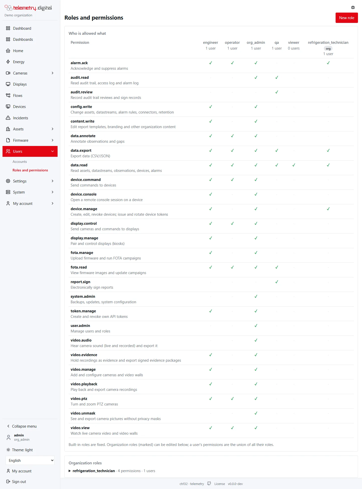

## Roles

A user has one or more roles; a role is a set of permissions. The built-in roles cannot be changed; an organization
can create its own roles from the permission catalogue.

*Who is allowed what, for every role.*

| Role | Typical person |
|---|---|
| viewer | reads data |
| operator | operator on shift: acknowledges alarms, sends commands, watches live cameras, controls displays |
| qa | quality reviewer: reads and reviews the audit trail, signs reports |
| engineer | sets up devices, connectors, firmware, dashboards, cameras and displays |
| org_admin | the organization's administrator: everything, including users and the system |

## The permission catalogue

| Permission | Allows |
|---|---|
| `data.read` | read assets, datastreams, measurements, devices, alarms |
| `data.export` | export data |
| `data.annotate` | annotate measurements and gaps |
| `alarm.ack` | acknowledge and suppress alarms |
| `device.manage` | create, edit and revoke devices; issue and rotate device tokens |
| `device.console` | open a remote console on a device |
| `device.command` | send commands to devices |
| `fota.read`, `fota.manage` | see firmware and campaigns; upload firmware and run campaigns |
| `config.write` | change assets, datastreams, alarm rules, connectors, retention |
| `content.write` | edit dashboards, flows, report templates, branding, apps |
| `token.manage` | create and revoke own API tokens |
| `user.admin` | manage users and roles, security policies, AI access |
| `audit.read`, `audit.review` | read the audit trail, access log and alarm log; record reviews |
| `report.sign` | sign reports electronically |
| `system.admin` | backups, updates, system configuration |
| `video.view`, `video.playback`, `video.manage`, `video.ptz` | cameras: live, recordings and export, configuration, PTZ |
| `video.evidence`, `video.unmask`, `video.audio` | evidence, unmasked pictures, sound — see [Privacy](../video-nvr/privacy.md) |
| `display.control`, `display.manage` | send content to displays; pair and change displays |

**New role** creates an organization role: a name and the permissions it grants.

A user's **effective permissions** and the history of granted and revoked roles are shown on the user's page.
Everyone sees their own roles and effective permissions under *My account → Profile*.

## Two-factor sign-in

Sign-in with an authenticator app (TOTP) and recovery codes. It is required by default for administrators,
engineers and quality reviewers, and for **every user** on a server in the internet profile. New registrations show
your product name in the authenticator app when white labeling is active.

## Security policies

*Settings → Security policy* (permission `user.admin`, changes audited):

- **Four eyes for commands** — every command (widgets, connector writes, device commands, flows, AI assistants)
  waits as *pending* until a different user approves it.
- Which roles must use two-factor sign-in, and the organization's other security rules.
- **Four eyes for alarm limits** — new versions of alarm rules and disabling a rule become change requests that a
  different user with `config.write` approves.
- **Four eyes for datastream assignments** — assigning or removing a datastream on a device becomes a change request
  that a different user with `device.manage` approves.

Change requests wait under *Settings → Approvals*. The person who asked cannot approve their own request; approving
replays it under the approver's name, both names go to the audit trail, and requests expire after 7 days.

## Accounts

- **Self-service registration**: people can ask for an account; an administrator approves it.
- **Camera groups**: limit a user to some cameras (*Users → user → Cameras*).
- **API tokens**: *My account → API tokens*, for scripts and integrations; a token acts with its owner's permissions.
  A token carries a chosen subset of its owner's permissions (its scopes) and an expiry.
- **Organizations** are separate tenants; a system administrator manages them.

!!! tip "Least privilege"
    Give people the smallest role that lets them work. `video.unmask`, `video.audio`, `video.evidence`,
    `device.command` and `system.admin` are the permissions worth thinking about twice.
