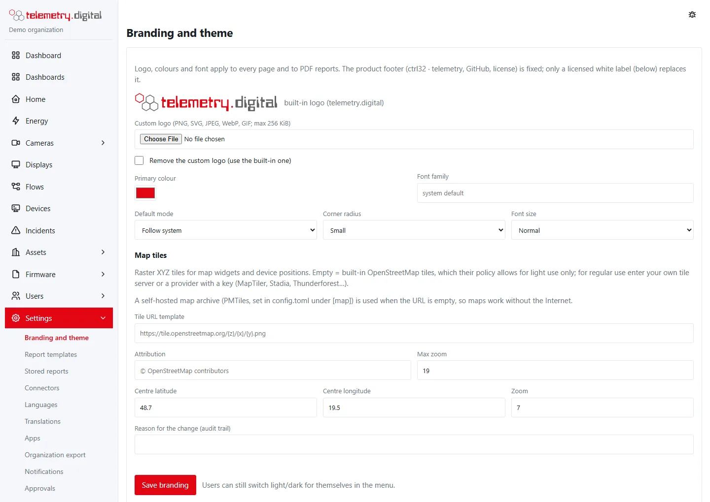
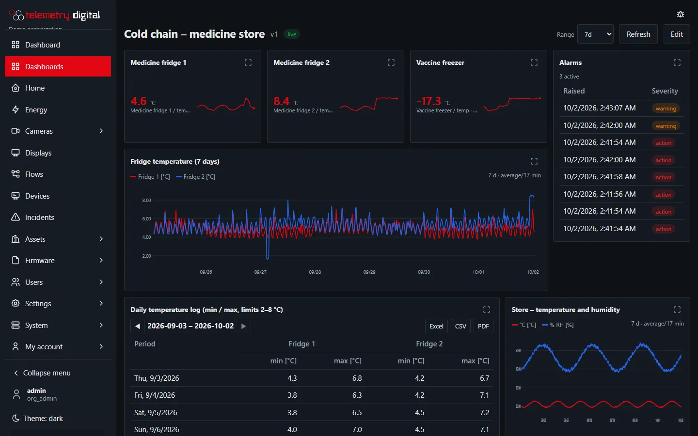
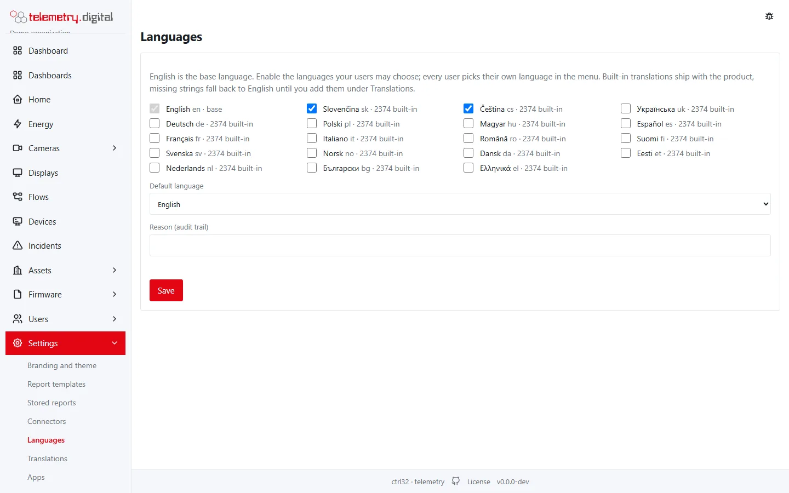
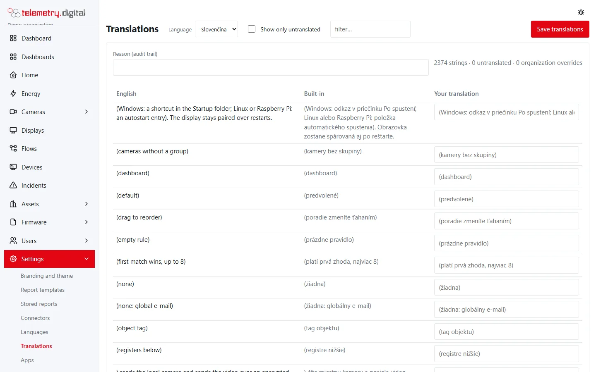

There are two levels of making the system look like yours: **branding**, which needs no licence, and **white
labeling**, which requires a [licence](../licence/index.md).

## Branding

*Settings → Branding and theme*: your **logo**, **colours**, **font**, themes and map tiles. No licence needed.

The default mode is light, dark or following the system; every user can still switch light or dark for themselves in
the menu.

*The dark theme.*

*Settings → Languages* chooses which of the 19 interface languages the organization's users may pick and the default
language; *Settings → Translations* replaces any built-in text with your own wording.

## White labeling (requires a licence)

With an active licence an organization's users see your product instead of *ctrl32 telemetry*:

| Where | What |
|---|---|
| Every page | your product name in titles and texts, your footer text and up to four links (support, terms, imprint …), the version only if you want it |
| Browser and installed apps | your icon and app name |
| Start page | your introduction text |
| E-mails | password resets, account requests and test notifications name your product |
| Authenticator apps | new two-factor registrations show your product name |
| PDF reports | the footer names your product |

The `/license` page keeps showing the software licence.

## Activate the licence

1. **Get** a licence: *System → License* links to where it is ordered. Keep the **order number** from the confirmation.
2. Check that `http.base_url` in `config.toml` holds the name the server is reached at — the licence is issued for
   that host name.
3. **System → License → Activate with the order number**: enter the order number and a reason. The server asks the
   licence service, checks the licence it gets (signature, server name) and installs it. Activation is audited.
4. **Settings → Branding and theme → White label**: product name, app name, footer text and links, icon,
   introduction, *Use the white label*, a reason, save.

**A server without internet access**: ask for a licence key instead (give the order number and the server's host
name) and install it under *System → License → Install a licence key (offline)*. It is verified offline.

**Removing the licence** brings back the product footer and name; your white-label settings stay and apply again once
a licence is installed.

!!! warning "The footer stays without a licence"
    The licence terms require the product footer (ctrl32 · telemetry, the link to the source and to the licence) on
    every deployment that has no valid white-label licence. Removing it in any other way — including by changing the
    software — is not permitted.
