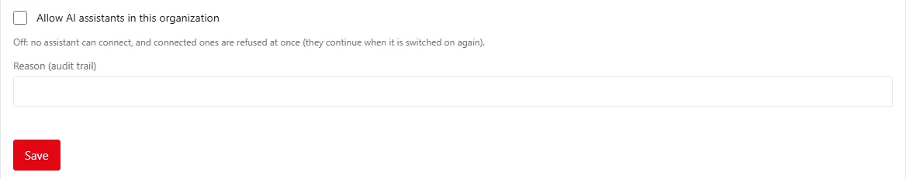
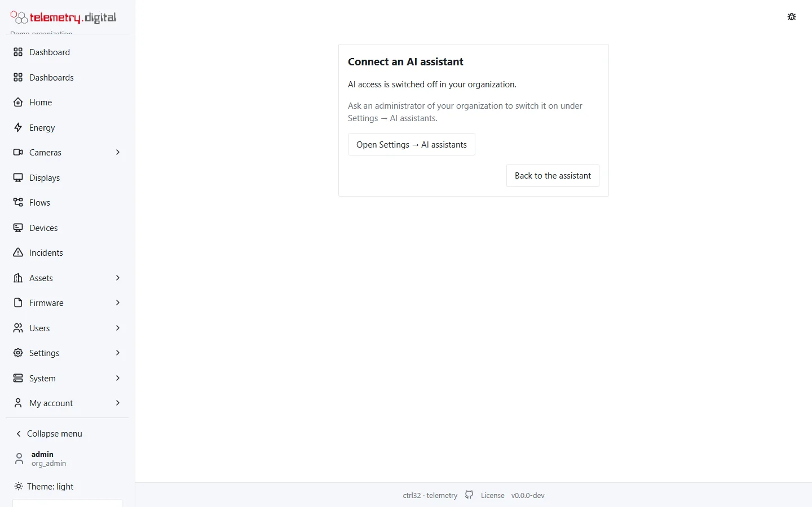

An AI assistant — any client of the **Model Context Protocol (MCP)**, on the web, on a desktop or on a phone — can
work in telemetry.digital on behalf of a user: read data, find out why an alarm fired, create a dashboard, change a
flow, send a command to a device or turn a camera.

It does so **through the same API as the web interface, with the permissions of the user who approved it**. Every
change it makes carries a reason and is written to the audit trail with the note "via MCP".

## Reading and changes

| Through an assistant | Without a licence | With a licence |
|---|---|---|
| Reading through an assistant | yes | yes |
| Changes through an assistant | no — the change tools are not offered, and the consent page offers only *Reading only* | yes, within the user's permissions |

Changes through assistants require a [licence](../licence/index.md). The web interface and the REST API with your own
API token work without one.

## Off until you switch it on

AI access is **off in every organization** until an administrator (permission `user.admin`) switches it on under
*Settings → AI assistants*, with a reason. Switching it off refuses every connected assistant at once.

An assistant that tries to connect while AI access is off gets a page that says so, with a link to the setting.

## Pages in this section

1. [Connecting an assistant](connecting.md) — the MCP address, OAuth sign-in, API tokens.
2. [What an assistant can do, and security](security.md) — tools, what is not offered, permissions, tokens, audit.
