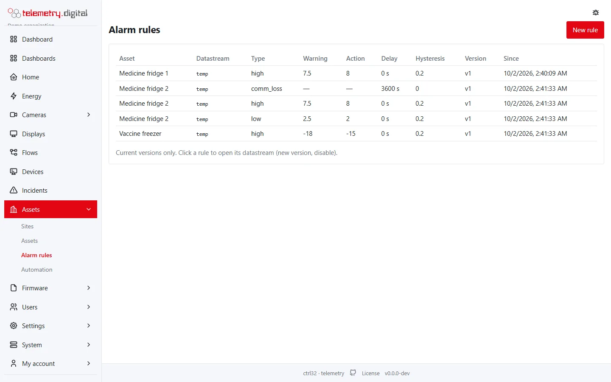
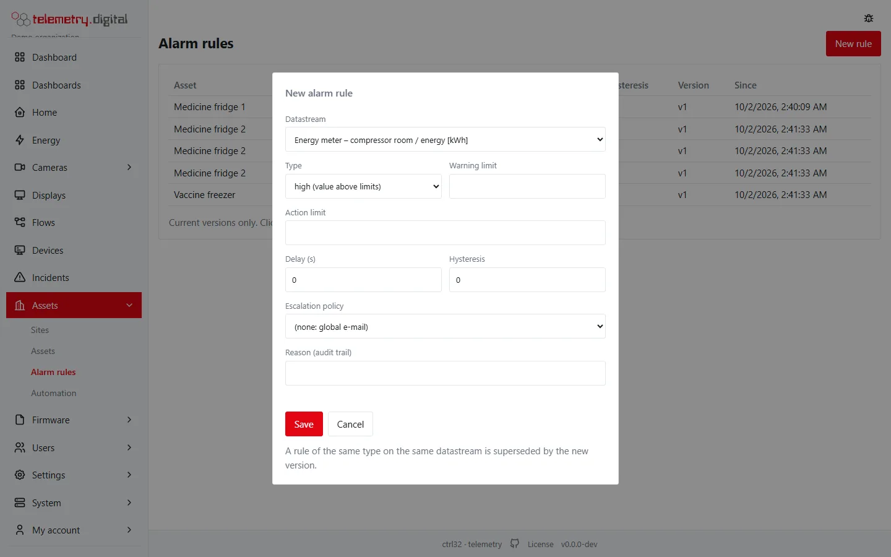
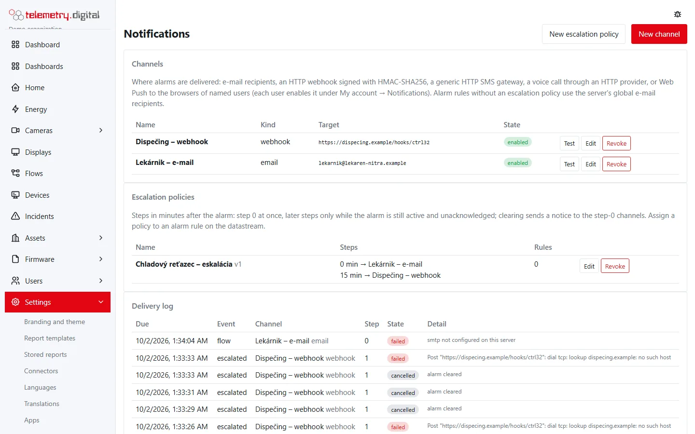
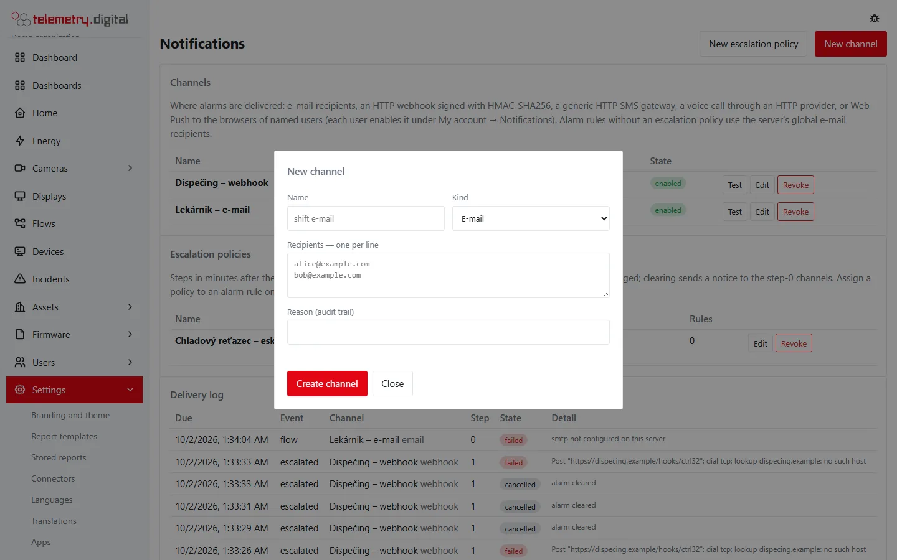
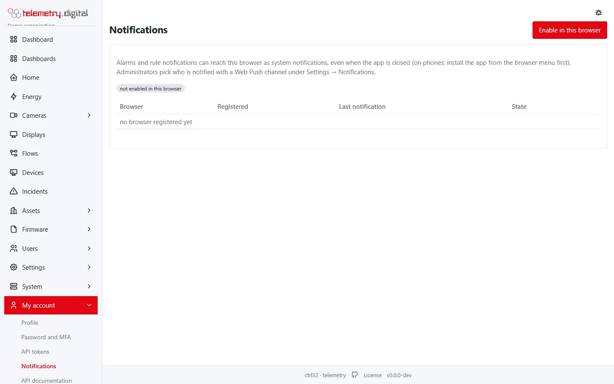
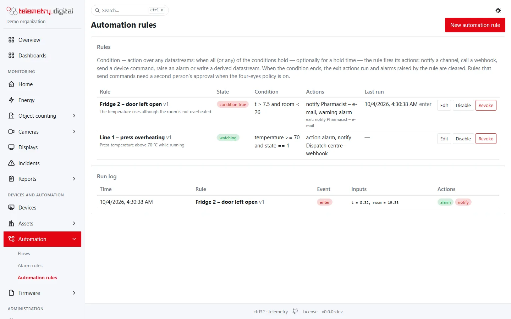
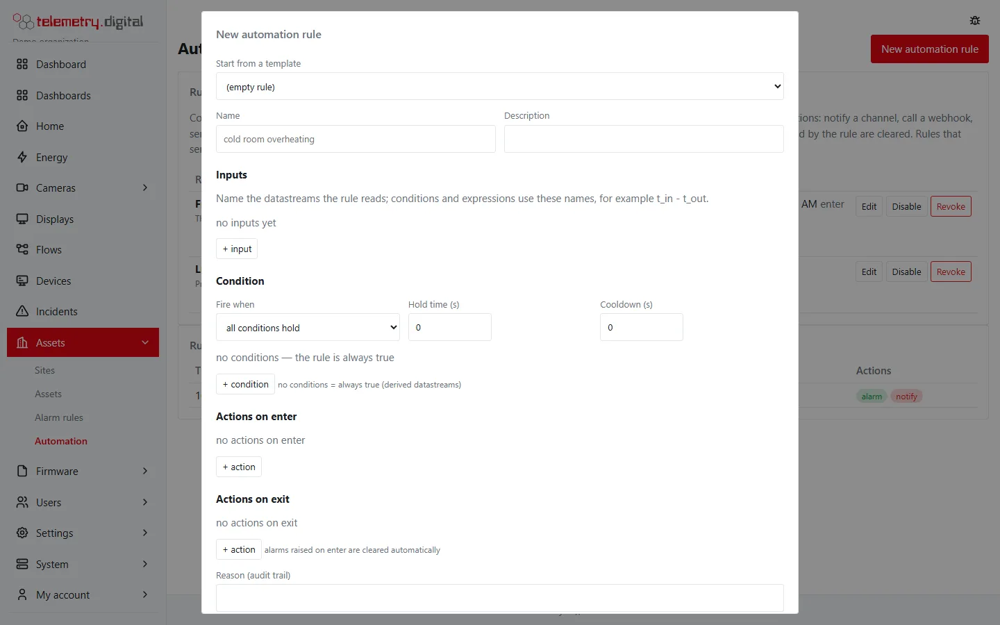
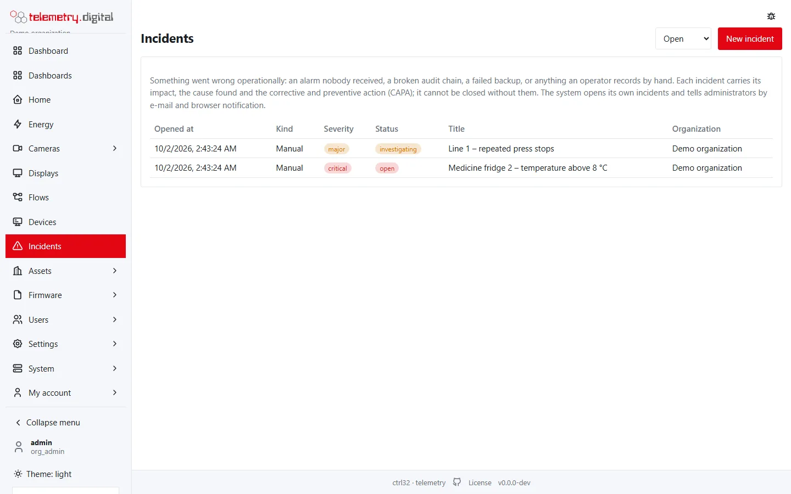
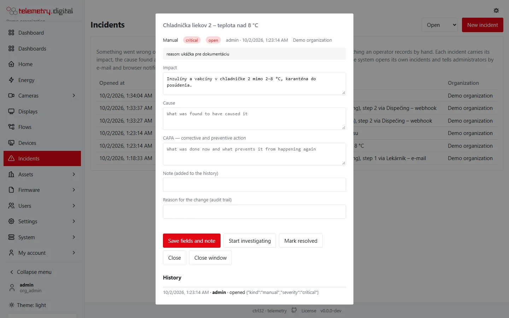
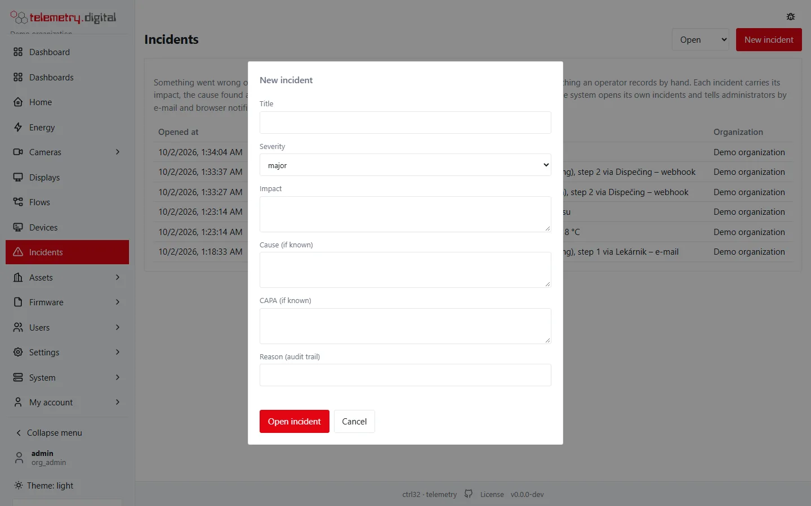

## Alarm rules

An alarm rule watches a datastream — for example a limit — and **raises** an alarm
when it is met and **clears** it when the value returns to normal. Operators **acknowledge** alarms (permission
`alarm.ack`). Every raise, escalation, acknowledgement and clearing is recorded.

Alarms found in data replayed later from a device's offline buffer are flagged as **retrospective**, so you know they
were not seen live.

Alarm rules are listed under *Assets → Alarm rules* with their type (high, low, loss of data), the warning and action
limits, a delay, a hysteresis and the version. A new version of a rule of the same type on the same datastream
replaces the old one.

## Escalation and notification channels

An **escalation policy** decides who is told, how, and what happens when nobody reacts. Notification channels:

- **E-mail** (configure `[smtp]` in `config.toml`)
- **Webhooks**, signed with HMAC so the receiver can check they came from your server
- **SMS** and **voice** through HTTP gateways
- **Web Push** to browsers and installed apps

Every delivery is recorded, so you can show who was notified and when. An alarm whose notification could not be
delivered opens an incident — a failed notification is never silent.

Channels, escalation policies and the delivery log are under *Settings → Notifications*. An escalation policy is a
list of steps in minutes: step 0 at once, later steps only while the alarm is still active and unacknowledged.

Each user switches Web Push on for their own browser under *My account → Notifications*.

## Automation rules

Simple automation rules — **condition → action** with an expression language, including conditions held for a while
and "no data for N seconds" — notify, call a webhook, send a command,
raise an alarm or store a derived value. For anything larger use [flows](flows.md); a rule converts into a flow.

They are under *Assets → Automation*, with a run log of what each rule did.

## Incidents

The **Incidents** page is the log of what went wrong: impact, cause and **corrective and preventive action (CAPA)**.

An incident goes from *open* to *investigating*, *resolved* and *closed*. Resolving needs the cause; closing needs the
cause and the CAPA. Everything is kept as history and audited.

*The incident log.*

Incidents open **automatically** for:

- alarms whose notifications were not delivered;
- a broken audit chain;
- cameras that stop recording, displays that stop showing and a nearly full video disk (see
  [Video settings](../video-nvr/settings.md));
- MQTT bridges and accounts disconnected too long;
- flows, through their *Incident* node.

Administrators are notified of system incidents by e-mail and Web Push. You can also open an incident by hand.

