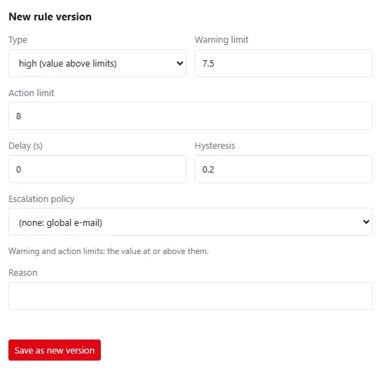
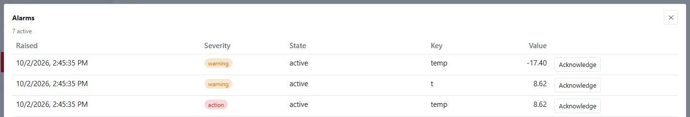

An **alarm rule** watches a datastream: it **raises** an alarm when a value crosses a limit and **clears** it when
the value is back in range. Who is told, and how, is decided by the rule's
[escalation policy](notifications.md). Every raise, escalation, notification, acknowledgement and clearing is
written to the append-only alarm log.

## Alarm rules

*Assets → Alarm rules* lists the current version of every alarm rule: asset, datastream, type, warning and action
limit, delay, hysteresis, version (hover for the reason) and since when it applies. Click a row to open the
datastream, where you can save a new version or disable the rule.

Reading rules needs `data.read`; **New rule**, new versions and disabling need `config.write`.

### New alarm rule

| Field | Type | Default | Allowed | Notes |
|---|---|:---:|:---:|---|
| Datastream | datastream | — | a datastream of your organization | required |
| Type | choice | high | high, low, low battery, power loss, door open, communication loss, sensor fault | see *Rule types*; a hint under the form says what the type checks |
| Warning limit | number | — | any number | *high*, *low* and *low battery* need a warning or an action limit, or both; off for power loss, door open and sensor fault |
| Action limit | number | — | any number | the stronger limit; for communication loss both limits are seconds |
| Delay (s) | number | 0 | 0–604800 | how long the condition must last before the alarm is raised |
| Hysteresis | number | 0 | 0 or more | how far the value must come back before the alarm clears |
| Escalation policy | choice | (none: global e-mail) | a policy of *Settings → Notifications* | who is told and when |
| Reason (audit trail) | text | — | up to 200 characters | required |

A rule is **versioned**: saving a rule of the same type on the same datastream closes the current version and
starts the next one (*A rule of the same type on the same datastream is superseded by the new version*). Old
versions stay in the database; alarms keep a link to the version that raised them.

In the datastream's detail, **New rule version** offers type, warning and action limit, delay, hysteresis,
escalation policy and a reason. The form starts from the current version of the chosen type, so a new version keeps
the limits and the policy unless you change them. **Disable** closes the current version with a reason — the rule
stops applying.

### Four eyes for alarm limits

With *Four eyes for alarm limits* on (*Settings → Security policy*), creating a rule version or disabling a rule is
not executed: it becomes a change request (*change request recorded — waiting for approval by a second person*).
Another user with `config.write` approves or rejects it under *Settings → Approvals*; the approval replays the
original request under the approver's name, and both names go to the audit trail. Requests expire after 7 days.

### Rule types

| Type | Raises when | Clears when |
|---|---|---|
| high | the value reaches the warning limit (≥) — severity *warning* — or the action limit (≥) — severity *action* | the value falls below the warning limit minus the hysteresis (the action limit when there is no warning limit) |
| low | the value reaches the warning limit (≤) or the action limit (≤) | the value rises above the warning limit plus the hysteresis (the action limit when there is no warning limit) |
| low battery (`low_battery`) | the battery level, in the datastream's unit (% or V), reaches the warning or action limit (≤) — like *low* | as *low* |
| power loss (`power_loss`) | the value is 0 (false) — severity *action*; no limits | any other value |
| door open (`door_open`) | the value is other than 0 (true) — severity *warning*; no limits; the delay is how long the door may stay open | the value is 0 |
| communication loss (`comm_loss`) | no new value for longer than the warning or action limit in **seconds**; without limits 1.5 × the datastream's expected interval (severity *action*) | a new value arrives; the alarm's value is the number of seconds without data |
| sensor fault (`sensor_fault`) | a value arrives with the quality *sensor fault* — severity *action*; no limits; the delay is how long the fault may last | the next value with another quality |

What is refused when a rule is saved, because the server would ignore it:

- limits or hysteresis on *power loss*, *door open* and *sensor fault*, and hysteresis on *communication loss*;
- *communication loss* without limits on a datastream without an expected interval, and limits of 0 or less.

Communication loss is checked every 5 seconds.

### Sensor faults

A value gets the quality **sensor fault** when

- the device marks it as faulty in its telemetry — with `"fault": ["temp"]`, `{"temp": "open circuit"}` or, next to
  `v`/`values`, `"fault": true` for every value of the message (see [MQTT and HTTP](../devices/mqtt-http.md)); or
- the value lies outside the **physical range** of the datastream — what the sensor can measure at all, set in the
  datastream's detail (*Physical range from … to …*, with a reason). A PT1000 probe measures −40 to 85 °C; a
  disconnected probe that reports −127 °C is a fault, not a cold fridge.

Such a value is stored like any other, so nothing is lost, but it is **not a reading**: the rules *high*, *low*,
*low battery*, *power loss* and *door open* skip it, so a broken probe raises one *sensor fault* alarm instead of a
false temperature alarm. It still proves that the device communicates, so it ends a *communication loss*. Charts
mark it in red, and minimum, maximum and average leave it out.

How a high rule with warning 8, action 10 and hysteresis 0.5 behaves:

| Value | Result |
|---|---|
| 7.9 | nothing |
| 8.2 | alarm raised, severity *warning* |
| 10.1 | the same alarm rises to *action* (event *escalated*) |
| 8.4 | the alarm stays at *action* — severity never goes back down |
| 7.6 | still active: not yet below 8 − 0.5 |
| 7.4 | alarm cleared |

- Only numeric values are evaluated; a value without a number is skipped.
- One rule has at most one alarm that is not cleared. A new alarm is raised only after the previous one cleared.
- Rule changes take effect within 30 seconds.
- An alarm found in data that a device sends late from its offline buffer is flagged **retrospective**, so you know
  it was not seen live.

### Delay

With a **delay**, the condition must last that long before the alarm is raised. The time is measured between the
values' measurement times; when no newer value arrives, a clock raises the waiting alarm once the delay has passed.
A value back in range during the delay cancels it. Waiting delays are kept in memory only: after a server restart
the delay starts again with the next value. Without a delay an alarm is raised on the first value that crosses the
limit.

For conditions over several datastreams (for example "above the limit while the line runs"), use an
[automation rule](automation-rules.md) or a flow with a *True for* node.

## Alarm states

| State | Meaning |
|---|---|
| active | raised and not yet acknowledged or cleared |
| acknowledged | someone confirmed they know about it; it stays until the value clears it |
| cleared | the value is back in range (or, for alarms of automation rules, the rule's condition ended) |

| Severity | Raised by |
|---|---|
| warning | alarm rules (warning limit) and automation rules |
| action | alarm rules (action limit) and automation rules |
| critical | automation rules |

### The alarm log

Every alarm has an append-only history:

| Event | Written when |
|---|---|
| raised | the alarm was raised, with its severity and value |
| retrospective | the value came from late data |
| escalated | the severity rose from warning to action |
| notified | a notification was sent (channel, kind and event) |
| delivery_failed | a notification could not be sent (with the error) |
| acknowledged | someone acknowledged it, with name and reason |
| cleared | the alarm cleared, with the value |

The *Alarm log PDF* (permission `data.export`) and the export `GET /api/v1/export/alarms` contain the alarms with
their history. The **Alarms** widget on a dashboard lists active alarms first — see
[Widgets](../dashboards/widgets.md).

## Acknowledging an alarm

Acknowledging confirms that a person knows about an active alarm. It:

- needs the permission `alarm.ack` and a **reason** of at least 3 characters,
- works only on an *active* alarm,
- stops the escalation: later steps of the escalation policy are cancelled,
- is written to the alarm log with your name and reason and to the audit trail as `alarm.acknowledge`.

Acknowledge an alarm with the **Acknowledge** button next to an active alarm — in the *Alarms* widget of a dashboard
and in the alarm list of the home page (shown when no dashboard is the home page) — or through the API:
`POST /api/v1/alarms/{id}/ack` with `{"reason": "…"}`. The button asks for the reason and is shown only to users with `alarm.ack`; a public link never
shows it. The acknowledgement updates every open list at once and starts flows whose
[Alarm trigger](flow-nodes-triggers.md) listens for *acknowledged*.

There is no shelving or suppression of alarms in this version: to silence a rule, disable it (with a reason), and
save it again when the cause is fixed.

## Who is told

| The rule has | Raised alarm | Cleared alarm |
|---|---|---|
| an escalation policy | the policy's steps — see [Notifications and escalation](notifications.md) | a notice to the step-0 channels |
| no policy | one e-mail to the server's global recipients (configured by the server administrator) | nothing |

When the global e-mail is not configured, the alarm log records that the notification was skipped. A failed global
e-mail is recorded as *delivery_failed*; only failed steps of an escalation policy open an
[incident](incidents.md).

Flows can react to alarms too: the [Alarm trigger](flow-nodes-triggers.md) starts a message when an alarm is raised,
cleared or acknowledged.
