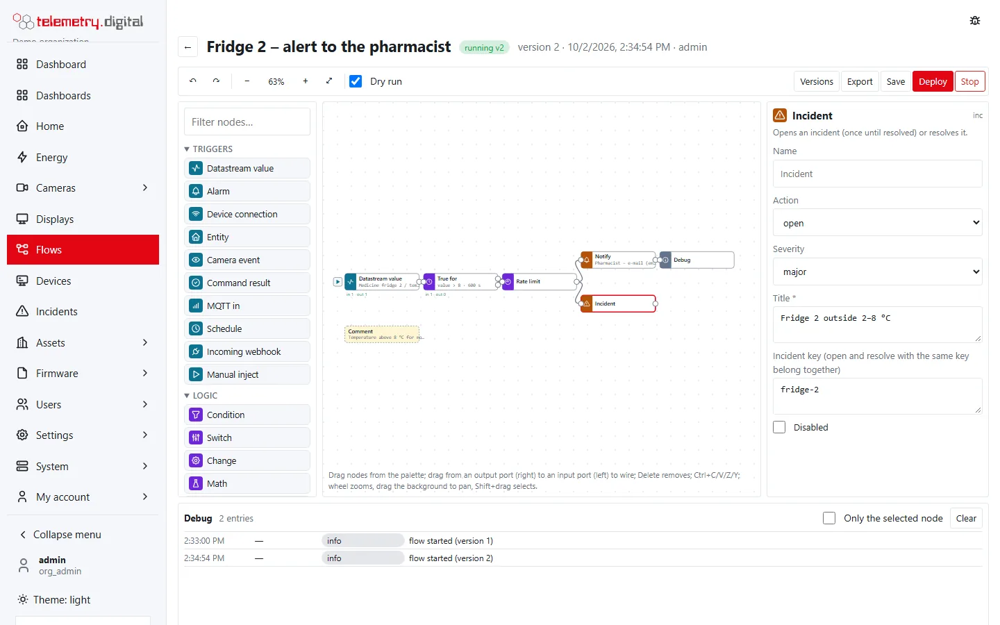

Action nodes do something outside the flow. They have one input and one output (except *Debug*, which has no
output).

## How actions run

- **In order, outside the flow.** Each action node works through its messages one by one, in the order they arrived,
  without holding up the rest of the flow. An action has 30 seconds; at most 64 messages can wait at one node —
  more are dropped with the error *too many actions waiting at this node; message dropped*.
- **On success** the debug panel gets an *action* entry (for example `notified: Too hot: 8.4`) and the message
  continues on the output with the result fields listed for each node.
- **On failure** the debug panel gets an *error* entry with the message; the message goes no further. There is no
  automatic retry.
- **Dry run.** In a dry-run test message, and always in a test of an edited (unsaved or not running) flow, nothing is
  executed: the debug panel gets a *dry action* entry saying what would have happened (for example
  `would send write {"key":"cooling","value":true} to the device`), and the message continues without result fields.
- **Audit.** Commands, attributes, entity actions and scenes are recorded in the audit trail with the actor
  `flow:<flow name>` and the reason `flow <name> v<version> node <id> (<what triggered the message>)`.

Nodes marked **commanding** below make the whole flow a commanding flow: deploying it needs `device.command`, and
with the four-eyes policy for commands a second person approves the deploy — see [Flows](flows.md).

## Store value

Stores the result as a value of a (derived) datastream.

| Setting | Type | Default | Allowed | Notes |
|---|---|:---:|:---:|---|
| Datastream | datastream | — | a datastream of your organization | required |
| Value (expression) | expression | `value` | an expression | required; must give a finite number |

The value is stored with the message's time (`ts`), or the current time when the message has none.

| Result field | Content |
|---|---|
| `msg.stored` | the datastream's name |

Errors: *value … is not a number* when the expression gives text, null or infinity.

## Device command

Sends a command to a device or connector — an MQTT device, or an OPC UA or Modbus connector writing a node or
register. **Commanding.**

| Setting | Type | Default | Allowed | Notes |
|---|---|:---:|:---:|---|
| Device | device | — | a device of your organization that is not revoked | required |
| Key (datastream key / register) | text | — | up to 500 characters | required |
| Value (expression) | expression | `value` | an expression | required |
| Method | text | `write` | up to 500 characters | the command's method |

The device receives the method with the arguments `{"key": <key>, "value": <value>}`. The command is valid for 5
minutes, recorded with the flow as its issuer and dispatched at once — the four-eyes check happened when the flow
was deployed. Connector limits (writable registers, value ranges) apply as for any command.

| Result field | Content |
|---|---|
| `msg.command_id` | the command's identifier |
| `msg.status` | the command's status when it was sent |

Errors: *command failed: …* when the command fails at once; *device not found*, *device is revoked*. To react to a
command that fails or expires later, use the [Command result](flow-nodes-triggers.md) trigger.

## Device attribute

Sets one shared attribute of a device — configuration the device receives over MQTT. **Commanding.**

| Setting | Type | Default | Allowed | Notes |
|---|---|:---:|:---:|---|
| Device | device | — | a device | required |
| Attribute | text | — | 1–64 characters | required; a longer key fails when the node runs |
| Value (expression) | expression | `value` | an expression | required |

The change is audited as `device.attributes` with the old and the new attributes. No result fields.

## Entity action

Controls a smart-home entity — a switch, light, blind, lock, thermostat, fan, number, select, button — as an audited
command. **Commanding.**

| Setting | Type | Default | Allowed | Notes |
|---|---|:---:|:---:|---|
| Entity | entity | — | an entity | required |
| Action | choice | turn_on | see the table below | required; the entity must offer it |
| Value (expression, empty = none) | expression | — | an expression | its meaning depends on the action |

| Action | Entities | The value means |
|---|---|---|
| turn_on | switch, light, fan, siren, humidifier, climate, scene | light: brightness in % when it is a number; climate: switches to the first mode of the device that is not *off*, or *heat* |
| turn_off, toggle | switch, light, fan, siren, humidifier; `turn_off` also climate | — |
| open, close, stop | cover, valve; `open` also lock | — |
| set_position | cover, valve | position in %, a number |
| lock, unlock | lock | — |
| press | button | — |
| set_value | number, text | the value; numbers must be within the entity's range |
| select_option | select | one of the entity's options |
| set_temperature | climate | target temperature, a number within the device's range |
| set_hvac_mode | climate | the mode as text, for example `heat` |
| set_percentage | fan | speed in %, a number |

| Result field | Content |
|---|---|
| `msg.command_id` | the command's identifier |
| `msg.status` | the command's status when it was sent |

Errors: *value … is not a number* for position, temperature and percentage; the entity's own checks, for example
*temperature must be between 7 and 35*, *"x" is not one of the options*; *command failed: …*.

Example — *door opened → hall light on at 60 %*: an *Entity* trigger with *Only to state* `on`, wired to an
*Entity action* `turn_on` with value `60`.

## Scene

Activates a scene of the [Home page](home-and-scenes.md). **Commanding.**

| Setting | Type | Default | Allowed | Notes |
|---|---|:---:|:---:|---|
| Scene | scene | — | a scene of your organization | required |

Every action of the scene is sent as an entity command with the flow as origin and the reason extended by
*(scene name)*.

| Result field | Content |
|---|---|
| `msg.ok` | the number of commands sent |
| `msg.failed` | the number of commands that failed |

The node fails only when every command of the scene failed (*all N commands of the scene failed*) or the scene no
longer exists.

## Camera mark

Marks a camera's timeline, for example *door opened*, and on a camera that records on events records the given time
with the pre-roll before it.

| Setting | Type | Default | Allowed | Notes |
|---|---|:---:|:---:|---|
| Camera | camera | — | a camera of your organization | required |
| Label (template) | template | `{{topic}}: {{value}}` | up to 200 characters are kept | empty = the flow's name |
| Record for (s) | number | 30 | 0–3600 | only on cameras that record on events |

| Result field | Content |
|---|---|
| `msg.event_id` | the mark's identifier |

A mark is itself a camera event of the kind *mark*, which a [Camera event](flow-nodes-triggers.md) trigger can
receive. See [Events and motion](../video-nvr/events-and-motion.md).

## MQTT out

Publishes a message on an MQTT account or bridge — for example a Tasmota or zigbee2mqtt command for a device without
automatic device discovery. **Commanding.**

| Setting | Type | Default | Allowed | Notes |
|---|---|:---:|:---:|---|
| MQTT account or bridge | MQTT source | — | an account or bridge of your organization | required |
| Topic (template) | template | — | a topic without `+` or `#`, not starting with `$` | required |
| Payload (template; empty = the value) | template | — | up to 4 000 characters | empty sends the value as text |
| Retain | yes/no | no | — | the broker keeps the message for new subscribers |

No result fields. Errors: *invalid topic …*; the bridge is not connected; the source is not found or not active.

## Notify

Sends a notification through a channel of *Settings → Notifications* — e-mail, SMS, voice, Web Push or webhook. See
[Notifications and escalation](notifications.md).

| Setting | Type | Default | Allowed | Notes |
|---|---|:---:|:---:|---|
| Channel | channel | — | a channel of your organization | required |
| Subject | template | `{{ topic }}: {{ value }}` | up to 4 000 characters | the e-mail subject; SMS and voice channels send it in front of the text |
| Text | template | `{{ topic }} = {{ value }} at {{ fmtTime(ts, 'HH:mm:ss') }}` | up to 4 000 characters | the body of the notification |

Every notification appears in the delivery log with the event `flow`; a webhook channel also receives the flow's
name, version, node, topic and value. No result fields.

Errors: *channel not found or disabled*; the channel's own error, for example *smtp not configured on this server*
or *no browser is subscribed for these users*. A failed notification from a flow does **not** open an incident —
wire an *Incident* node or a *Command result* trigger where a missed notification matters.

## Incident

Opens an incident, or resolves it. See [Incidents](incidents.md).

| Setting | Type | Default | Allowed | Notes |
|---|---|:---:|:---:|---|
| Action | choice | open | open, resolve | see below |
| Severity | choice | major | minor, major, critical | used when opening |
| Title | template | `{{ topic }}: {{ value }}` | up to 4 000 characters | required |
| Incident key | template | — | up to 200 characters | open and resolve nodes with the same key belong together |

- **open** creates an incident of the kind *Flow* with the flow, version, node, topic, value and trigger as detail
  (and the incident key, when set). While an incident with the same key is open or being investigated, further
  *open* messages do nothing — one incident per key until it is resolved. Without a key the incident belongs to the
  opening node itself. Administrators are notified.
- **resolve** with an incident key resolves the open incident of that key, whichever node opened it. **resolve
  without a key** resolves **every** open incident of the flow. It keeps a cause someone already wrote, or sets
  *Resolved by the flow: title*. When nothing is open, nothing happens.

The key is a template, so one pair of nodes can keep one incident per machine or datastream — for example
`{{ topic }}`, or `fridge-2`. Converting an automation rule into a flow gives its open and resolve nodes a shared key
(`alarm-1`, `alarm-2`, …). In a test run the debug panel says which key a node would use, or *every open incident of
the flow*.

No result fields.

## HTTP request

Calls a URL on a host of the organization's allow-list (*Flows → Settings*).

| Setting | Type | Default | Allowed | Notes |
|---|---|:---:|:---:|---|
| Method | choice | POST | POST, PUT, GET | — |
| URL | URL | — | `http://` or `https://`, up to 1 000 characters, host on the allow-list | required |
| Body (template; empty = the message as JSON) | template | — | up to 4 000 characters | GET sends no body |

The request has `Content-Type: application/json` and a timeout of 15 seconds. Up to three redirects are followed,
each only to an allowed host.

| Result field | Content |
|---|---|
| `msg.status` | the HTTP status code; 4xx and 5xx answers are results, not errors |
| `msg.body` | the first 4 096 bytes of the answer |

Errors: *host … is not on the allow-list*, *redirect to a host not on the allow-list*, *timeout*, network errors.

Example — check the answer: wire a *Condition* `msg.status >= 200 && msg.status < 300` after the request.

## Debug

Shows the message, or an expression, in the debug panel.

| Setting | Type | Default | Allowed | Notes |
|---|---|:---:|:---:|---|
| Show (expression, empty = the whole message) | expression | — | an expression | for example `msg.status` |
| Active | yes/no | yes | — | an inactive debug node shows nothing |

No output.

## Comment

A note on the canvas; it has no ports and does nothing.

| Setting | Type | Default | Allowed | Notes |
|---|---|:---:|:---:|---|
| Text | multi-line text | — | up to 4 000 characters | the first line is shown on the node |
