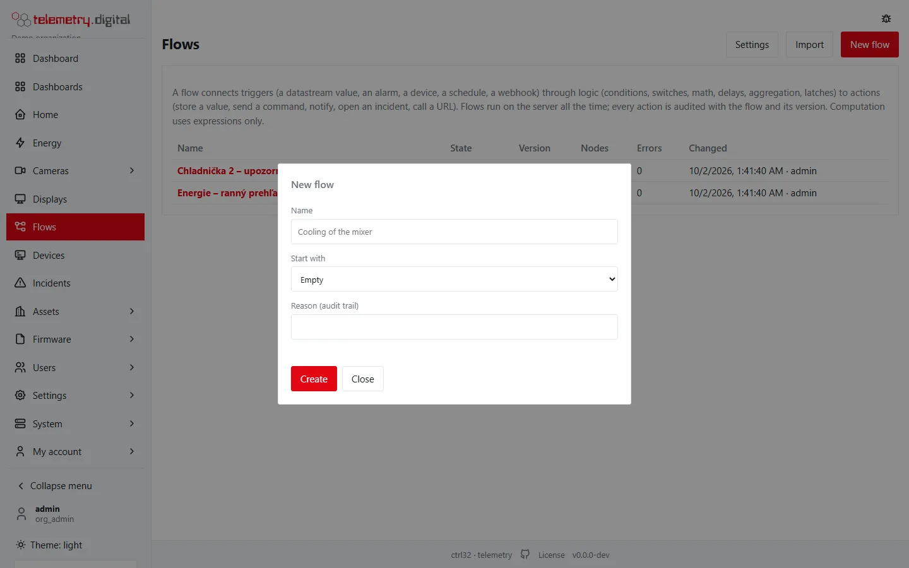
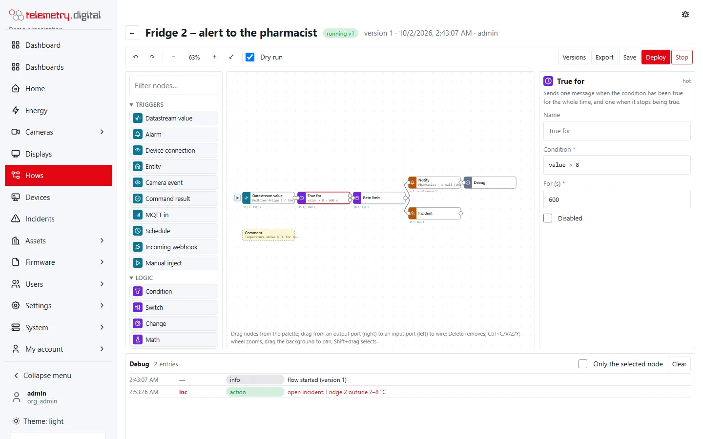
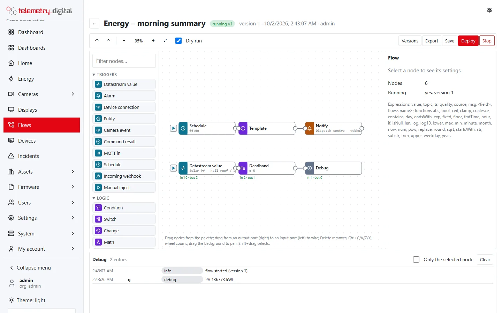

Flows are visual automation in the style of Node-RED, built into the server: triggers, logic and actions wired on a
canvas, running on the server all the time — whether or not a browser is open. There is **no separate runtime and no
user code**: every node comes from a closed library, and calculations use a small
[expression language](flow-expressions.md) with limits.

## Quick start

1. **Automation → Flows → New flow**, name it, pick *Example: value above a limit for a while → notify* and give a reason.

    

2. Click the *Datastream value* node and choose the datastream; click *Notify* and choose a channel.

    

    *A click on a node opens its settings on the right.*

3. Press ▶ on the trigger to send a test message. With **Dry run** checked, the debug panel shows what the actions
   *would* do, and nothing is executed.
4. **Deploy** with a reason. The flow runs until you **Stop** it; the header shows `running vN`.

Editing a running flow saves a new draft; the deployed version keeps running until you deploy again.

*A running flow: above 8 °C for 10 minutes → notify and open an incident.*

The example flow contains a *Datastream value* trigger, a *True for* node named *Too hot for 2 min*
(`value > 80` for 120 s), a *Notify* node, a *Debug* node and a comment. You only choose the datastream and the
channel.

## How a flow works

- A **trigger** node starts a message: a stored value, an alarm, a schedule, a webhook call and so on — see
  [triggers](flow-nodes-triggers.md).
- The message travels along the **wires** from an output of one node to the input of the next. A node with several
  outputs (Condition, Switch, Time window, True for, Subflow) decides which output gets it.
- **Logic** nodes filter, route, delay, count or calculate — see [logic](flow-nodes-logic.md).
- **Action** nodes do something outside the flow: store a value, send a command, notify, open an incident, call a
  URL — see [actions](flow-nodes-actions.md). After a successful action the message continues on the action's
  output with the result added, so you can chain further steps.
- When an output is wired to several nodes, each of them gets its own copy of the message.

### The message

| Field | Type | Meaning |
|---|---|---|
| `value` | number, text, true/false or null | the payload — a measured value, a state, a count, a text |
| `topic` | text | what the message is about; a datastream trigger sets `Asset / key`, other triggers the name of the device, entity, camera or node |
| `ts` | number | time in seconds since 1970 (with fractions); the measurement time for datastream values |
| `quality` | text | the quality flag of a stored value; empty for other triggers |
| `source` | text | the name of the source (datastream, device, entity…) or its kind |
| `msg.<name>` | any of the above | extra fields set by triggers, actions or your Change nodes |

A message is at most 16 KiB when serialized; a larger one is dropped with an error at the node that received it.

## The flow list

*Flows* lists every flow and subflow of your organization.

| Column | Shows |
|---|---|
| Name | the flow's name; the badge *subflow* for subflows and *commands* for flows that send device commands |
| State | *running*, *stopped* or *draft*; subflows show *used in flows* |
| Version | the newest version; *(running vN)* when an older version is the one running |
| Nodes | the number of nodes of the newest version |
| Errors | node errors since the flow started, and the number of dropped messages |
| Changed | when the newest version was saved, and by whom |

Above the list:

- **Settings** (permission `config.write`) — the allow-list of hosts for the *HTTP request* node, see
  *Allowed hosts* below.
- **Import** — creates a flow from an exported JSON file.
- **New flow** (permission `content.write`).

### New flow

| Field | Values | Notes |
|---|---|---|
| Name | 1–128 characters | must be unique in the organization; the flow's address (slug) is derived from it |
| Start with | Empty, Example, Subflow, Converted automation rule | *Converted automation rule* appears only when your organization has automation rules and you may read them (`config.write`) |
| Automation rule | a rule | only for *Converted automation rule* |
| Reason (audit trail) | up to 200 characters | required |

*Subflow* creates a [subflow](flow-subflows.md) with one *Subflow input* and one *Subflow output*.

## Life cycle

A flow is versioned content. Every save is a **new version**; nothing is ever overwritten.

| State | Meaning |
|---|---|
| draft | saved, not running |
| running | a version is deployed and the engine runs it |
| stopped | the deployed version was stopped with *Stop*; its versions stay |

| Step | What happens | Permission | Reason |
|---|---|---|---|
| Save | stores the canvas as a new draft version; problems are allowed and listed | `content.write` | required |
| Deploy | checks the newest version, saves your unsaved changes first, then runs it in place of the running version | `content.write`, plus `device.command` when the flow sends commands | required |
| Stop | the running version stops processing; deploy again to start it | `content.write` | required |
| Restore | copies an old version into a new draft version; deploy it to run it | `content.write` | required |
| Test message | sends a message into the running flow or into a temporary copy of the edited flow | `content.write`, plus `device.command` for a real (not dry) test of a flow that sends commands | — |
| Export | downloads the newest version as JSON | `data.read` | — |
| Import | creates a new flow from an exported file | `content.write` | required |

### Deploy

**Deploy** first validates the canvas. When there are problems, a dialog *The flow cannot be deployed* lists them
and the nodes are marked red; nothing changes. Otherwise you give a reason and:

- unsaved changes are saved as a new version with the same reason,
- the previously running version stops and the new one starts at once,
- the header changes to `running vN`.

A flow **sends commands** when it contains an enabled *Device command*, *Device attribute*, *Entity action*,
*Scene* or *MQTT out* node, or a subflow that contains one. Deploying such a flow needs `device.command`. When the
organization's policy *Four eyes for commands* is on (*Settings → Security policy*), the deploy is not executed:
it becomes a change request under *Settings → Approvals*, and the editor shows *waiting for approval by another
user (four eyes)*. A different user who holds both `content.write` and `device.command` approves it; the request
expires after 7 days.

!!! warning "The approver deploys the newest version"
    An approved deploy request deploys the flow's newest version at the moment of approval. Do not save further
    changes to the flow while the request waits, or the approver deploys those too.

An organization can have at most **500 deployed flows**; deploying one more is refused.

### Versions and restore

**Versions** in the editor lists up to 200 versions: number, state, when saved, by whom and the reason. **Restore**
on an older version copies its content into a new version with the reason *restore version N: your reason*. Deploy
it to run it.

### Stop and delete

**Stop** appears while the flow runs. The flow stops processing messages; counters and latches are saved. Deleting
a flow is only possible through the API (`DELETE /api/v1/flows/{slug}` with a reason): it stops the flow, removes it
from the list and deletes its stored node memory. Its versions stay in the database for the audit trail.

### Export and import

**Export** downloads `flow-<slug>.json` with the format `ctrl32-flow/1`, the name, the slug, the version, a checksum
and the nodes and wires. **Import** on the flow list reads such a file, asks for a reason (proposed:
*import* and the flow's name) and creates a new flow as version 1 draft.

- The file must have the format `ctrl32-flow/1`; other files are refused.
- The flow keeps the slug from the file. When a flow with that slug already exists, the import is refused — rename
  or delete the existing one first.
- Datastreams, devices, channels, entities, scenes, cameras and subflows are referenced by their identifiers. On
  another server they usually do not exist: the flow is imported with problems, and you choose the right items in
  each node before you can deploy.

## What blocks deployment

The server checks every flow against the closed node library on every save, before every deploy and before every
test message of an edited flow.

| Problem | Example message |
|---|---|
| Unknown node type or setting | `unknown node type "x"`, `unknown setting "y"` |
| Missing required setting | `datastream is required` |
| Value out of range or of the wrong type | `delay (s): must be 0.01–86400` |
| Bad expression or template | `condition: unexpected ")"`, `placeholder {{x}}: …`, `unbalanced {{ }}` |
| Missing reference | `channel: not found in this organization` |
| Host not on the allow-list | `url: host api.example.com is not on the organization's allow-list` |
| No trigger | `the flow has no trigger (…)` (only enabled triggers count) |
| Wiring errors | `has no input (a schedule starts messages itself)`, `is wired to itself`, `duplicate wire`, `has no output 3` |
| Loop without a pause | `is part of a loop without a delay, debounce, rate limit, aggregate or "true for" node` |
| Daily schedule without times | `times of day are required for a daily schedule` |
| Subflow problems | `subflow x (version 3) not found`, `subflows nested deeper than 4` |
| Too large | `at most 200 nodes per flow`, `at most 600 wires per flow`, `at most 50 groups` |
| Node identifiers and names | `node id must be 1–40 letters, digits, _ or -`, `name longer than 64 characters` |

On save, the server also fills in the default of every setting you left empty.

## Allowed hosts

The *HTTP request* node can only call hosts on the organization's allow-list. **Automation → Flows → Settings** (permission
`config.write`) edits it:

- one host name per line, for example `api.example.com`;
- `*.example.com` allows every subdomain of `example.com` (not `example.com` itself);
- no scheme, port, path, user or spaces; at most 100 hosts of up to 253 characters;
- a reason is required and the change is audited with the old and the new list.

The list is checked when you save and deploy, and again on every request and every redirect.

## Running flows

- Each running flow has its own **queue of 1 000 messages**. When it is full, new messages are dropped and counted:
  the list shows *N dropped*, and the debug panel adds a note about once a minute.
- Messages are processed one at a time per flow. **Action nodes** run outside the flow's queue, so a slow e-mail
  does not hold up the other nodes; the actions of one node run in the order they arrived (a command *on* then *off*
  arrives in that order). Each action has 30 seconds; at most 64 actions can wait at one node — more are dropped
  with an error.
- A message can pass at most 250 nodes in a row; beyond that it stops with *message path too long*.
- A node that fails records an **error** in the debug panel and in its error counter; that message stops there and
  the flow carries on with the next one. There are no automatic retries.
- **Disabled** nodes do not process messages: a message wired into a disabled node stops there, and a disabled
  trigger never fires.

### After a server restart

Deployed flows start again automatically. Counters, latches and flow memory are saved every 30 seconds and when the
flow stops, and are loaded again. Everything else starts empty: pending delays, debounce and *True for* timers,
aggregate windows, rate-limit windows, deadband and join memory, and the entity trigger's knowledge of the previous
state.

The **deployed version** is the one that starts, even when you saved newer drafts after deploying it: saving a
draft never stops a running flow, not even across a restart. The draft runs only when you deploy it.

## Audit trail

| Entry | When |
|---|---|
| `flow.create`, `flow.update` | a flow is created, imported, saved or restored (version, checksum, number of nodes and problems) |
| `flow.deploy` | a version is deployed (the previous running version, whether it sends commands) |
| `flow.disable` | a flow is stopped |
| `flow.delete` | a flow is deleted |
| `flow.inject` | a real (not dry) test message was sent into a running flow |
| `flow_settings.update` | the allow-list changed |
| `change_request.create` | a deploy waits for four eyes |
| `device.command`, `device.attributes` | an action node sent a command or set an attribute; the actor is `flow:<name>` and the reason `flow <name> v<version> node <id> (<trigger>)` |

## Converting automation rules

[Automation rules](automation-rules.md) convert into an equivalent draft flow: *Automation → Flows → New flow → Start with:
Converted automation rule*. The converted flow has:

- one *Datastream value* trigger per input, each followed by a *Change* node that sets the topic to the input name,
- a *Join* of all inputs, so the inputs are available as `msg.<input>`,
- a *True for* node with the rule's conditions and hold time,
- a *Rate limit* (one message per cooldown) when the rule has a cooldown,
- the enter actions on the first output and the exit actions on the second.

| Rule action | Becomes |
|---|---|
| Notify a channel | *Notify* with the rule's placeholders turned into templates |
| Call a webhook | *HTTP request* (POST) — the host must be on the allow-list |
| Send a device command | *Device command* |
| Raise an alarm | *Incident* that opens on enter and resolves on exit (warning → minor, action → major, critical → critical) |
| Write a derived datastream | *Store value* |

Some parts have no flow equivalent: *stale* conditions, webhook signing secrets, custom command arguments and the
escalation policy of an alarm action. They are listed before the flow is created and in a comment node on the
canvas; you confirm whether to create the flow anyway. The rule stays as it is: stop it once the flow runs, so the
actions do not happen twice.

## Limits

| Limit | Value |
|---|:---:|
| Nodes per flow | 200 |
| Wires per flow | 600 |
| Groups per flow | 50 |
| Deployed flows per organization | 500 |
| Queue per flow | 1 000 messages |
| Message size | 16 KiB |
| Nodes one message can pass in a row | 250 |
| Actions waiting at one node | 64 |
| Time for one action | 30 s |
| Debug entries kept per flow | 500 |
| Subflow nesting | 4 levels |

## Monitoring

The server's `/metrics` endpoint reports `ctrl32_flows_running`, `ctrl32_flow_messages_total`,
`ctrl32_flow_errors_total` and `ctrl32_flow_dropped_total`. Each node shows its own counters on the canvas — see
[the flow editor](flow-editor.md).
