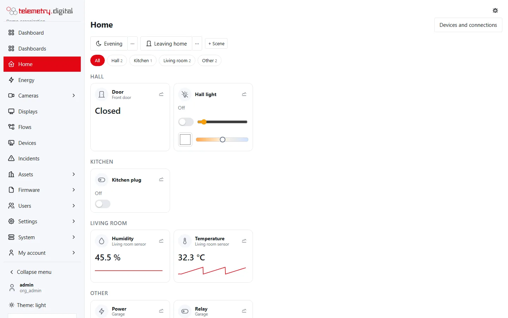

Devices found by [automatic device discovery](../devices/automatic-discovery.md) are controlled from the **Home**
page, grouped by rooms. **Scenes** set several of them at once, and flows automate them.

## The Home page

Cards show values with units and a 24-hour trend, switches, brightness, colour and colour temperature of lights,
blinds with open, stop, close and position, locks, thermostats with target temperature and mode, numbers, selects,
texts and buttons. Changes appear live. A card's chart button opens the history (24 hours, 7 or 30 days).

*The Home page with two scenes and the devices grouped by rooms.*

### Every control action is a command

Every switch, slider and button on a card sends a **device command** through the normal command path:

- the permission `device.command`;
- the four-eyes policy for commands when the organization requires it — the command then waits for a second person;
- the audit trail with a reason, by default *Home:* followed by the action and the entity's name, for example
  *Home: turn on Hall light*;
- a status: *sent* until the device reports the requested state, then *acknowledged*; *failed* when it does not
  within 15 seconds. The command itself is valid for 60 seconds.

The entity first checks the request: a value outside a number's range, an option a select does not have, a target
temperature outside the thermostat's range (7–35 °C unless the device says otherwise) or a text longer than allowed
is refused with a message.

## Scenes

A scene sets several devices at once — *Evening*: hall light at 30 % warm white, plug on, boiler off.

| To | Permission |
|---|---|
| See and use the scene buttons | `device.command` (the buttons are disabled without it) |
| Create, edit and delete scenes | `device.manage` |

### Create a scene

1. Set the devices on **Home** the way you want them.
2. Press **+ Scene**.
3. Fill in the dialog and select the devices. The scene remembers their **current** states.

| Field | Default | Allowed | Notes |
|---|:---:|:---:|---|
| Name | — | 1–80 characters, no `<` or `>` | required, for example *Evening* |
| Icon | bulb | bulb, moon, sun, sofa, bed, door-exit, home, snowflake, flame | shown on the scene button |
| Devices | — | 1–50 controllable devices | buttons and device scenes are not offered |
| Reason (audit trail) | — | up to 200 characters | required |

What a scene remembers from each device:

| Device | Remembered |
|---|---|
| Switch, fan, siren, humidifier | on or off |
| Light | off; or on with brightness (%), and the colour — or the colour temperature when the light is in colour-temperature mode |
| Blind (cover), valve | the position, or open / closed when the device reports no position |
| Lock | locked or unlocked |
| Thermostat (climate) | the mode, and the target temperature unless the mode is *off* |
| Number | the value |
| Select | the option |

Texts, buttons and read-only sensors are not captured. When none of the selected devices can be captured, the scene
is refused (*none of the entities can be restored by a scene*).

### Edit, capture again, delete

The *⋯* next to a scene button opens it again:

- change the **name** and **icon**;
- **Keep the saved actions (do not capture again)** is checked by default; uncheck it to capture the selected devices'
  current states again;
- **Delete** removes the scene (with the reason from the dialog).

Every create, change and delete is audited as `scene.create`, `scene.update` or `scene.delete`, with the actions
before and after.

### Activate a scene

Press the scene's button. The scene sends **one ordinary command per device**, in the stored order, each with your
permission, four eyes where required, the reason *Scene: Evening* in the audit trail and the device's confirmation.
The message says *scene activated*, *scene activated with errors: N* when some commands failed, or that the
commands wait for approval. When every command fails, activation fails as a whole.

Scenes can also be defined with explicit actions through the API (`POST /api/v1/scenes` with entity, action and
parameters for each) and activated by flows with the [Scene](flow-nodes-actions.md) node.

## Smart-home flows

[Flows](flows.md) have nodes for discovered devices and for plain MQTT:

| Node | Does |
|---|---|
| [Entity](flow-nodes-triggers.md) trigger | a state change, optionally only from or to given states, or also attribute changes |
| [Command result](flow-nodes-triggers.md) trigger | a command ended as acknowledged, failed, expired or rejected |
| [MQTT in](flow-nodes-triggers.md) trigger | every message on a topic filter of an MQTT account or bridge |
| [Entity action](flow-nodes-actions.md) | turn on or off, toggle, open, close, stop, position, lock, unlock, press, set a value, select an option, temperature, mode, fan speed |
| [Scene](flow-nodes-actions.md) | activates a scene |
| [MQTT out](flow-nodes-actions.md) | publishes on an MQTT account or bridge, for devices without discovery |

Commands from flows carry the flow as their origin in the audit trail; a flow with *Entity action*, *Scene* or *MQTT
out* nodes needs `device.command` to deploy and, with four eyes, a second person's approval.

Example: *door opened → hall light on at 60 %* is an *Entity* trigger (*Only to state* `on`) wired to an *Entity
action* (`turn_on`, value `60`).
