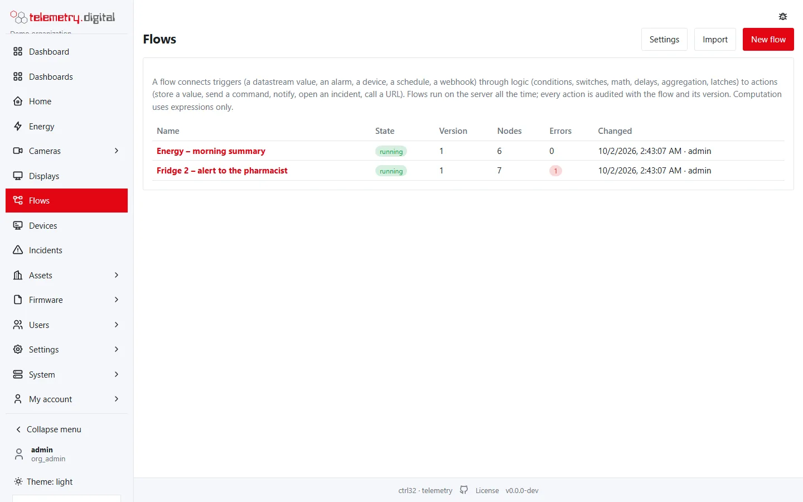

telemetry.digital watches your data and acts on it: it raises alarms and notifies people, runs automation flows and
automation rules, controls smart-home devices with scenes and keeps an incident log of what went wrong and why.

## Which tool for which job

| You want to | Use | Where |
|---|---|---|
| Be told when a value crosses a limit | an alarm rule | *Automation → Alarm rules* |
| Decide who is told, how, and what happens when nobody reacts | notification channels and escalation policies | *Settings → Notification channels* |
| React to a simple condition over a few datastreams | an automation rule | *Automation → Automation rules* |
| Build anything larger: timers, routing, memory, several triggers, HTTP, MQTT, smart home | a flow | *Flows* |
| Set several smart-home devices at once | a scene | *Home* |
| Record what went wrong, its cause and the corrective action | an incident | *Incidents* |

## Pages in this section

1. [Flows](flows.md) — what a flow is, its life cycle (save, deploy, stop, versions, import and export), permissions
   and limits.
2. [The flow editor](flow-editor.md) — palette, canvas, mouse and keyboard, property panel, toolbar, test messages
   and the debug panel.
3. [Flow nodes: triggers](flow-nodes-triggers.md) — every node that starts a message.
4. [Flow nodes: logic](flow-nodes-logic.md) — conditions, routing, timing, aggregation and memory.
5. [Flow nodes: actions](flow-nodes-actions.md) — store, command, notify, incident, HTTP, MQTT, smart home, debug.
6. [Flow expressions](flow-expressions.md) — the expression and template language used by the nodes.
7. [Subflows and groups](flow-subflows.md) — reusable parts and tidy canvases.
8. [Alarms](alarms.md) — alarm rules, alarm states, acknowledgement and the alarm log.
9. [Notifications and escalation](notifications.md) — channels, escalation policies, the delivery log and Web Push.
10. [Incidents](incidents.md) — the incident log with impact, cause and CAPA.
11. [Automation rules](automation-rules.md) — condition → action rules under *Automation → Automation rules*.
12. [Home page and scenes](home-and-scenes.md) — control discovered devices and run scenes.

## Rules of the house

- **Every change asks for a reason.** Saving or deploying a flow, changing an alarm rule, a channel, a policy, an
  automation rule, a scene or an incident is refused without one, and the reason goes to the audit trail.
- **Every action is audited** with its origin — the flow, its version and the node, or the rule.
- **Commands keep their rules** when automation sends them: deploying a flow or saving a rule that sends commands
  needs the permission `device.command`, and with the four-eyes policy a second person approves it first.
- **Problems block deployment.** A flow with an unknown node, a bad expression, a missing reference or a host that
  is not allowed can be saved as a draft but cannot be deployed.

!!! danger "Automation is not a safety system"
    A flow or an alarm can be late or fail — a network outage, a full queue, an undelivered e-mail. Never use them as
    a safety function. An escalation step that could not be delivered opens an incident so that the failure itself
    is not silent.
