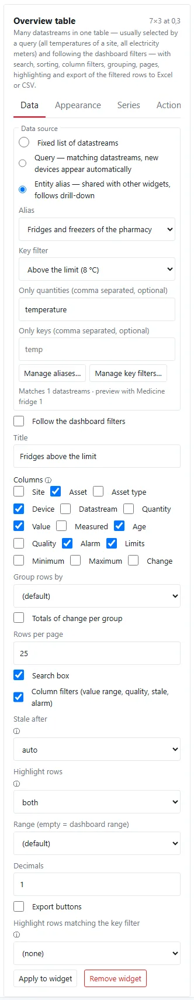
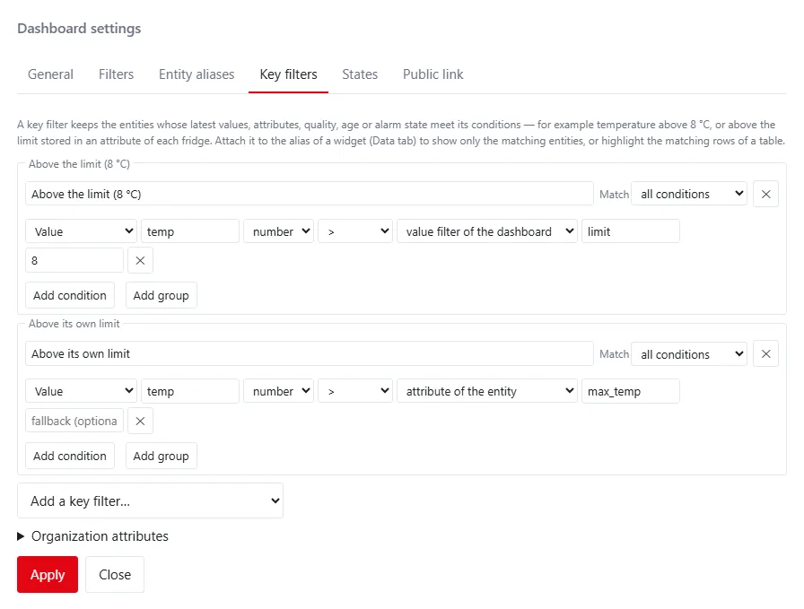
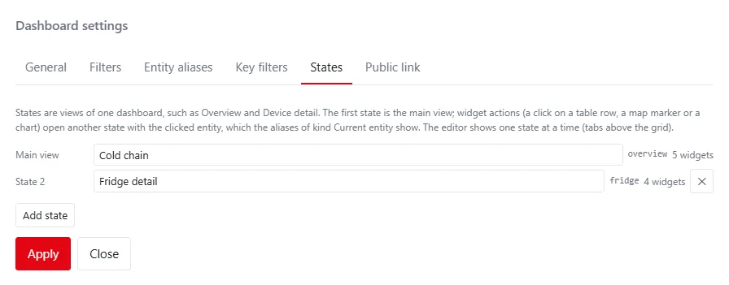
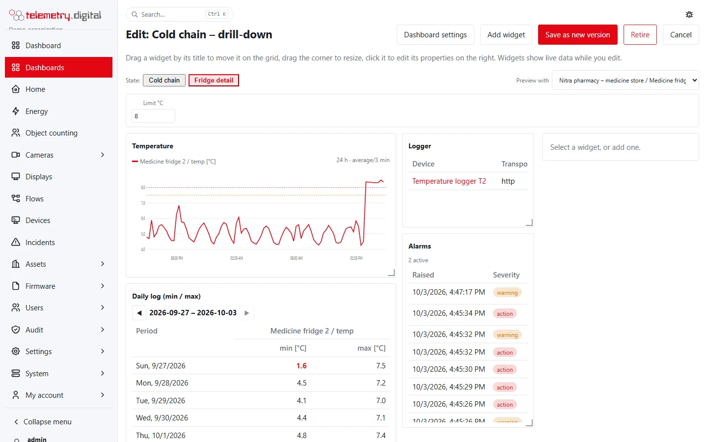
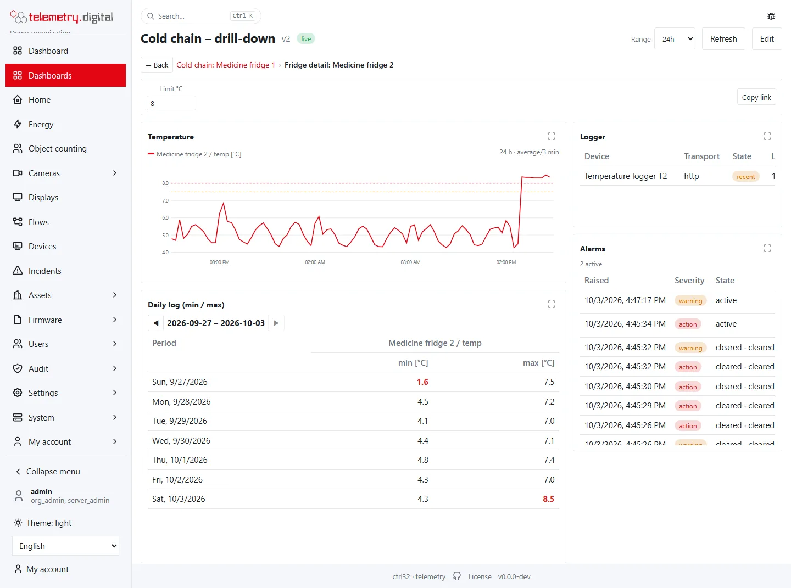
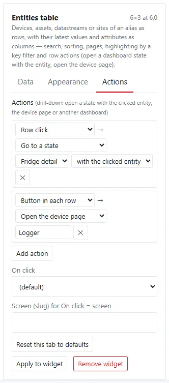
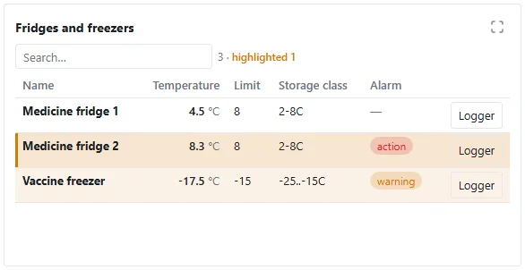
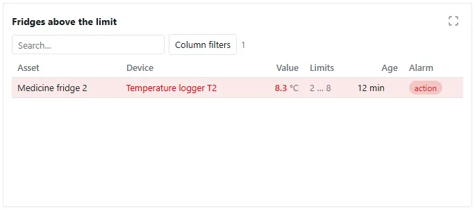
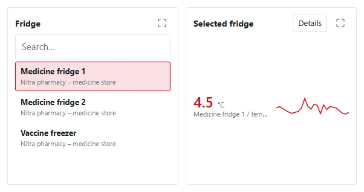

Three features let one dashboard serve many similar objects — dozens of fridges, pumps or meters — without a widget
per object:

- **Entity aliases** — named sets of devices, assets, datastreams or sites that many widgets share: *all fridges*,
  *everything under one building*, *the fridge the viewer clicked*. New devices appear on their own.
- **Key filters** — conditions on the latest values and attributes of those entities: *temperature above 8 °C*,
  *above the limit stored with each fridge*, *in alarm*, *no recent value*.
- **Dashboard states** — several views of one dashboard, for example *Cold chain* and *Fridge detail*. A click on a
  table row, a map marker or a chart opens the detail view with the clicked entity; the breadcrumb leads back.

Two widgets go with them: the **Entities table** (entities as rows, their values and attributes as columns) and the
**Entity selector** (choose the entity the dashboard shows).

*The main view of a drill-down dashboard: an entity selector, an entities table with one highlighted row, an overview
table with a key filter and a map.*

## How it fits together

| Part | Defined in | Used by |
|---|---|---|
| Entity alias | Dashboard settings → Entity aliases | the Data tab of a widget |
| Key filter | Dashboard settings → Key filters | the alias of a widget (only matching entities), or a table (highlight matching rows) |
| State | Dashboard settings → States | widgets (each belongs to one state) and actions (go to a state) |
| Action | the Actions tab of a widget | a row click, a marker click, a chart click, a widget click or a button |
| Current entity | set by an action or an entity selector | aliases of kind *Current entity* |

The server resolves aliases and key filters for your organization only, every time a widget refreshes.

## Entity aliases

In the editor, **Dashboard settings → Entity aliases** lists the aliases of the dashboard. **Add an alias…** offers
ready-made starting points; each alias shows how many entities it matches now and the first of them.

### Kinds

| Kind | Selects | Settings |
|---|---|---|
| Current entity (drill-down, entity selector) | the entity passed by an action or chosen in an entity selector | entity type (*as passed*, or converted to devices, assets, datastreams, sites); a default for when none is chosen |
| Everything under an asset or a site | the assets below a site or an asset, and what they carry | under (a site, an asset, or *the current entity*), levels deep (1–10), show datastreams, devices or assets, only assets of some types |
| By type | devices of a device profile, assets of a type, datastreams of a quantity | the types, separated by commas; `*` selects all, `energy*` every quantity starting with *energy* |
| By name | devices, assets, datastreams or sites whose name starts with, contains or ends with a text | entity type, match, text |
| Chosen entities | the entities you pick | entity type, the entities |
| One entity | one device, asset, datastream or site | entity type, the entity |
| Datastreams by query | datastreams by sites, asset types, quantities and a name pattern | as the [query data source](filters-and-overviews.md#query-data-sources) |

- **Levels deep** counts from the root: the top-level assets of a site, or the children of an asset, are level 1.
- A device belongs to the assets whose datastreams are assigned to it; a device's *type* is its device profile.
- Names are matched without regard to case.

### Presets

| Preset | Creates |
|---|---|
| All sensors of a site | everything under the first site, showing datastreams |
| Devices of the selected asset | everything under the current entity, showing devices |
| The selected entity (drill-down) | the current entity as passed |
| Assets of a type (e.g. fridges) | assets of the type `fridge` |
| All devices | devices of every profile (`*`) |

Change the name and the settings after adding a preset.

### What a widget makes of an alias

| Widget | Shows |
|---|---|
| Widgets with datastreams (charts, values, tables, the overview table, period tables) | the datastreams of the entities: a device's assigned datastreams, an asset's or a site's own datastreams |
| Devices, Map | the devices of the entities |
| Alarms, Alarm count | the alarms of the datastreams of the entities |
| Entities table, Entity selector | the entities themselves |

On the **Data** tab of a widget, **Data source → Entity alias** binds the widget to an alias:

| Field | Content |
|---|---|
| Alias | one of the dashboard's aliases |
| Key filter | (none), or a key filter: only matching entities |
| Only quantities | widgets with datastreams: for example `temperature` |
| Only keys | widgets with datastreams: for example `temp` |

The panel shows how many datastreams, devices or entities match now. **Manage aliases…** and **Manage key filters…**
open the dashboard settings.

## Key filters

A key filter keeps the entities whose latest values, attributes, quality, age or alarm state meet its conditions.
**Dashboard settings → Key filters** lists them; **Add a key filter…** offers presets.

### Conditions

| Source | Compares | Comparisons |
|---|---|---|
| Value | the latest value of a datastream key (a datastream itself: its own value when the key is empty) | number: `>` `≥` `<` `≤` `=` `≠` between; text: equals, does not equal, contains, starts with, ends with, one of; yes/no: is, is not |
| Attribute | an attribute of the entity, else of its asset, else of its site | as for a value |
| Quality | the quality of the latest value | is, is not: good, doubtful, stale, sensor fault |
| No recent value | whether the latest value is stale | is, is not |
| Alarm | the active alarms of the entity | is, is not: in alarm, warning, action, critical |

- **Match** decides whether *all conditions* or *any condition* must hold. **Add group** adds a group with its own
  *all of* / *any of*, for example *temperature below 0 or (door open and temperature above 7)*.
- A value is **stale** when it is older than 1.5 × the expected interval of its datastream, or older than one hour
  without one. An entity without a value for the key counts as stale.
- Text comparisons ignore the case. *between* accepts the two bounds in any order.

### Dynamic values

Instead of a constant, a value or an attribute can be compared with:

| Dynamic value | Example |
|---|---|
| value filter of the dashboard | a *Limit* field in the filter bar the viewer types into |
| attribute of the entity | each fridge's own `max_temp` |
| attribute of the current entity | the limit of the fridge chosen in the entity selector |
| attribute of the organization | an organization-wide `max_temp_default` |

When the dynamic value is missing, the constant entered next to it applies; without a constant the condition does
not hold. **Organization attributes** (at the bottom of the Key filters tab) are edited one per line as
`name = value` and saved with a reason (permission `config.write`).

### Presets

| Preset | Condition |
|---|---|
| Values above a limit | value `> 8` |
| Above the entity's own limit (attribute) | value of `temp` `>` attribute `max_temp` of the entity |
| Above a limit the viewer types | value `>` the value filter `limit` (adds a value filter *Limit* with the default 8) |
| In alarm | alarm is *in alarm* |
| No recent value | no recent value is true |

### Value filters

A **Value** filter (Dashboard settings → Filters, kind *Value (for key filters)*) puts a field into the filter bar.
It narrows nothing by itself; key filters compare with it. Its value is part of the address (`f.v.limit=8`) like the
other filters, and viewers of a public link may change it when it is marked *public*.

## Dashboard states

**Dashboard settings → States** lists the states. The first one is the **main view**; the dashboard opens with it.
**Add state** adds another; the name can be changed, the identifier stays.

- Every widget belongs to one state. Above the grid the editor shows a tab per state; **Add widget** adds to the
  state shown.
- **Preview with** chooses an entity for the widgets of a *Current entity* alias, so that the detail state shows data
  while you edit.
- Removing a state moves its widgets to the main view and removes the actions that open it.

### The viewer

- The state and its entity are part of the address (`?st=fridge.asset.<id>.Medicine fridge 2`), so a copied link
  opens the same detail view.
- Above a state other than the main view a **breadcrumb** shows the way back, for example *Cold chain: Medicine
  fridge 1 › Fridge detail: Medicine fridge 2*; **← Back**, a click on an earlier level and the browser's Back button
  go back.

## Actions

The **Actions** tab of a widget lists what clicks do, up to 6 actions per widget.

| Event | Widgets | Entity passed |
|---|---|---|
| Row click | Entities table, Overview table, Devices | the entity of the row (an overview-table row is a datastream) |
| Button in each row | Entities table, Overview table | the entity of the row |
| Marker click | Map | the device of the marker |
| Chart click | Trend chart | the datastream of the series nearest to the click |
| Widget click | every widget | the widget's first datastream, else the current entity |
| Button on the widget | every widget | as for a widget click |

| Action | Effect |
|---|---|
| Go to a state | opens the state with the entity as its current entity |
| Open the device page | opens the page of the entity's device |
| Open the asset page | opens the [page of the entity's asset](../devices/asset-page.md) (an asset itself, or the asset of a datastream) |
| Open another dashboard | opens another dashboard (by its slug) with the entity as the current entity of its main view |

- **with its device** and **with its asset** pass the device or the asset of the clicked entity instead, for example
  the logger of a fridge.
- Buttons need a label.
- An action replaces the older *On click* setting of the same widget for clicks on the widget.

## Entities table

The **Entities table** (group *Lists*) shows the entities of an alias as rows.

| Setting | Type | Default | Allowed values |
|---|---|:---:|---|
| Title | text | Entities table | — |
| Columns | list | name, site, alarm, last_seen | see below, separated by commas |
| Rows per page | number | 25 | 5–200 |
| Search box | checkbox | on | — |
| Highlight rows matching the key filter | list | (none) | a key filter of the dashboard |
| Highlight colour | colour | the warning colour | a colour |
| Decimals | number | 2 | any |

| Column | Content |
|---|---|
| `name`, `type` | the entity's name (a link to its page: device, asset, site, or the asset page of a datastream) and type |
| `site`, `asset`, `asset_type` | where the entity belongs; site and asset link their pages |
| `device`, `profile` | its device (a link to the device page) and the device profile |
| `alarm` | the highest severity of the active alarms |
| `last_seen` | when a device was last seen |
| `t:<key>` | the latest value of the datastream with that key, with its unit and a *stale* badge |
| `a:<name>` | an attribute (of the entity, else its asset, else its site) |

- A label after `=` names the column, for example `t:temp=Temperature` or `a:max_temp=Limit`.
- A click on a column header sorts by it; the search box keeps rows whose name, site, asset, device or profile
  contains the text; ◀ ▶ move between pages.
- With a highlight key filter, matching rows are tinted and the toolbar counts them (*highlighted 1*). Rows with an
  active alarm are tinted otherwise.
- The **Overview table** has the same *Highlight rows matching the key filter* setting and the row actions; see
  [Filters and overviews](filters-and-overviews.md#the-overview-table).

## Entity selector

The **Entity selector** (group *Other*) lists the entities of an alias; the chosen entity becomes the current entity
of the state shown, so every widget of a *Current entity* alias switches to it.

| Setting | Type | Default | Allowed values |
|---|---|:---:|---|
| Title | text | Entity selector | — |
| Style | list | dropdown | dropdown, list |
| Search box (list) | checkbox | on | — |
| Choose the first entity when none is chosen | checkbox | on | — |

The choice is part of the address, like a state.

## Example: the cold chain drill-down

1. **Aliases**: *Fridges and freezers of the pharmacy* (everything under the site, assets of the types `fridge` and
   `freezer`); *Temperatures of the selected fridge* (current entity as datastreams); *Loggers of the selected
   fridge* (current entity as devices).
2. **Key filters**: *Above the limit (8 °C)* — value of `temp` `>` the value filter `limit`, 8 when empty; *Above its
   own limit* — value of `temp` `>` attribute `max_temp`.
3. **Filters**: a value filter *Limit °C* (key `limit`, default 8, public).
4. **States**: *Cold chain* (main view) and *Fridge detail*.
5. **Main view**: an entity selector and a latest value of the selected fridge with a button *Details* (go to *Fridge
   detail*); an entities table with `name, t:temp=Temperature, a:max_temp=Limit, a:storage_class=Storage class,
   alarm`, highlighting *Above its own limit*, row click → *Fridge detail*, a row button *Logger* → the device page;
   an overview table with the key filter *Above the limit*; a map of the loggers, marker click → *Fridge detail*.
6. **Fridge detail**: a trend chart, a daily log (period table), the logger (devices) and the alarms — all bound to
   the aliases of the current entity.

## Public links

A public link of a dashboard with aliases, key filters and states works like the dashboard: the viewer drills down,
uses the entity selector and the value filters marked public.

!!! warning "What a public link can read"
    A public link reads what the dashboard's aliases select **without** key filters and without a current entity —
    those entities, all their datastreams and devices — in addition to the fixed and query datastreams of its
    widgets. An entity passed in the address is ignored when it is outside that scope, and the aliases, key filters
    and columns always come from the saved dashboard. Before you publish a dashboard with a broad alias (for example
    *All devices*), check that all of it may be public.

- *Open the device page*, *Open the asset page* and *Open another dashboard* are not offered on a public link, and
  the names in tables are plain text there.

## Limits

| Item | Limit |
|---|:---:|
| Aliases per dashboard | 20 |
| Key filters per dashboard | 20 |
| Conditions per key filter or group | 12 |
| Group levels | 1 |
| States per dashboard | 10 |
| Actions per widget | 6 |
| Entities an alias considers | 2000 |
| Rows of one answer | 500 |
| Levels of a hierarchy | 10 |
| Organization attributes | 50 |

## For integrators

- `GET /api/v1/entities/query` (`data.read`) resolves an alias given as JSON (`alias`), with an optional key filter
  (`filter`), a highlight (`highlight`), the current entity (`current=type:id`), the answer as `entities`,
  `datastreams` or `devices` (`want`), and the columns (`values`, `attrs`).
- `GET /api/v1/public/{token}/entities/query?widget=` does the same for a widget of a public dashboard.
- `GET` and `PUT /api/v1/organization/attributes` read and set the organization attributes.

In the screen format (version 1, minor 2) a dashboard carries `aliases`, `key_filters` and `states`, a widget
`alias`, `state` and `actions`; older dashboards are unchanged. AI assistants with access to the dashboards can read
the same entities (see `/api/docs`).
