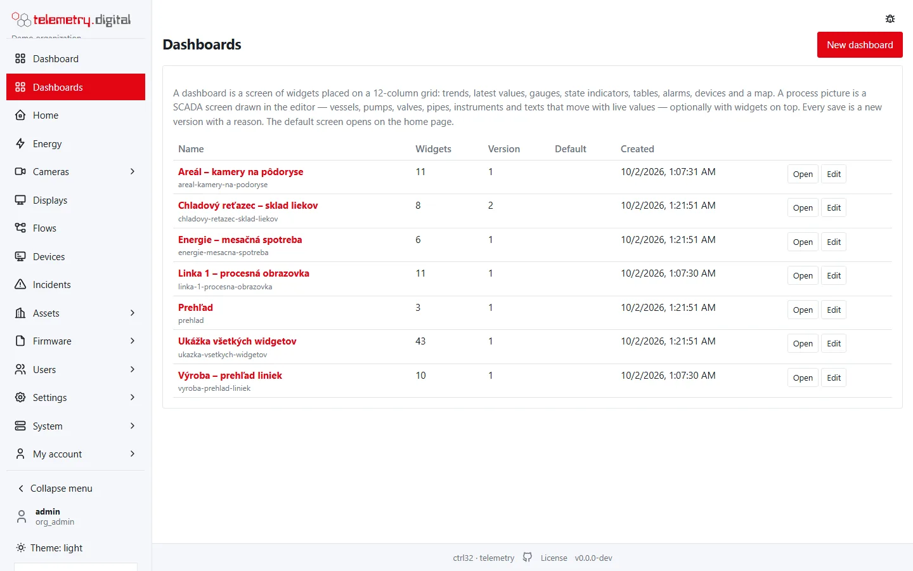
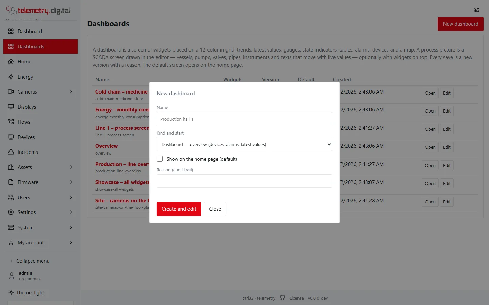
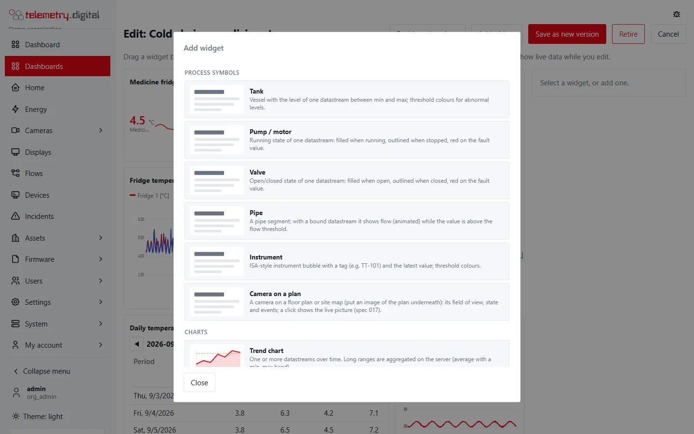
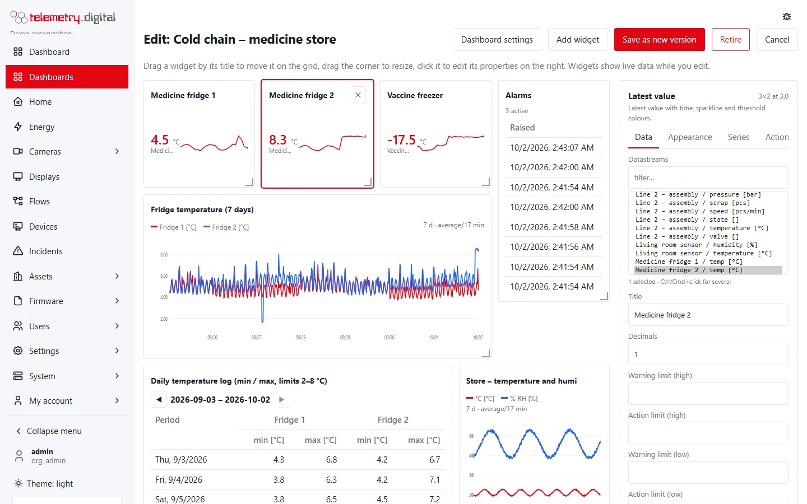
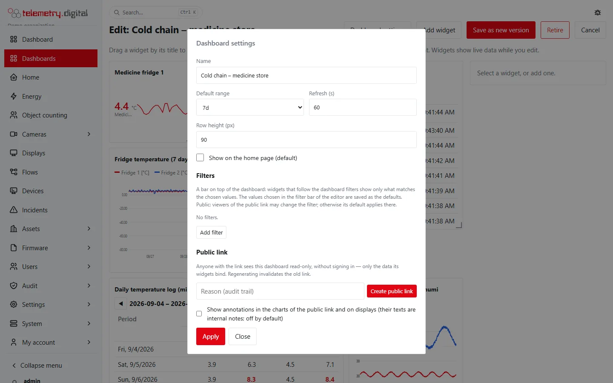

This page describes how you create, view, edit, share and retire dashboards. The widgets themselves are described in
the [widget catalogue](widgets.md); the drawing of process pictures in the [process picture editor](scada.md).

## The Dashboards list

**Dashboards** lists the current version of every dashboard and process picture of your organization, the default one
first, then by name.

| Column | Content |
|---|---|
| Name | the name, with the slug (the part of the address) below it |
| Widgets | the number of widgets (drawing elements of a process picture are not counted) |
| Version | the current version number |
| Default | the badge *default* on the dashboard shown on the home page |
| Created | when the current version was saved |
| — | **Open**, and **Edit** for users with `content.write` |

## Create a dashboard

**New dashboard** (needs `content.write`) opens a dialog:

| Field | Type | Default | Allowed values |
|---|---|:---:|---|
| Name | text | — | required, at most 128 characters |
| Kind and start | list | Dashboard — overview | see the table below |
| Show on the home page (default) | checkbox | off | — |
| Reason (audit trail) | text | — | required, at most 200 characters |

**Create and edit** saves version 1 and opens the editor.

The address of the dashboard (its **slug**) is made from the name: lower-case letters and digits, Slovak and Czech
letters without diacritics, everything else becomes a dash, at most 63 characters. The slugs `default`, `catalog` and
`starter` are reserved. If a dashboard with the same slug exists, the dialog shows *a dashboard with this slug exists*
— choose another name.

### Kinds and starters

| Kind and start | Layout | What you get |
|---|---|---|
| Dashboard — overview (devices, alarms, latest values) | grid | a values table of the first three datastreams of your organization, a devices list and an alarms list |
| Dashboard — showcase (all widget types) | grid | one widget of every type, bound to your first datastreams, with examples of series settings, a right axis, legend values and conditional formatting |
| Dashboard — empty | grid | no widgets |
| Process picture — empty drawing | canvas 1600 × 900 px | a title text with the dashboard name |
| Process picture with widgets — drawing and a trend | canvas 1600 × 900 px | a title text and an empty trend chart widget |
| Process picture — mixing plant (demo) | canvas 1600 × 900 px | a complete plant: silos, screw conveyor, reactor with agitator, steam valve, heat exchanger, pump, product tank, instruments, pipes with flow, a status panel, a trend and an alarm list, bound to your first three datastreams |
| Process picture — widget symbols (legacy showcase) | canvas 1600 × 900 px | a tank, pump, valve, pipes and an instrument built from widgets |

!!! warning "A screen needs content"
    The server saves a dashboard or process picture only when it has at least one widget or drawing element; otherwise
    it answers *at least one widget or drawing element is required*. This also applies to *Dashboard — empty* and to
    saving after you removed every widget. Start from the overview instead and remove what you do not need.

## View a dashboard

Opening a dashboard shows its name, the version (for example *v3 · default*) and these controls:

| Control | Effect |
|---|---|
| Range | the time range of the whole dashboard: `1h`, `6h`, `8h`, `12h`, `today`, `24h`, `7d`, `30d`, `90d`; starts at the dashboard's default range |
| Refresh | reloads every widget now |
| Edit | opens the editor (only with `content.write`) |
| *live* badge | shown while the page receives values as they arrive |

- `today` runs from local midnight to now — the output of the day on production screens; `8h` and `12h` cover a
  shift.
- A widget with its own range (*Range* setting, a fixed time window or a viewer filter) ignores the dashboard range.
- Every widget reloads at the dashboard's refresh interval. In addition, a widget bound to a datastream redraws
  within about half a second of a new value; device lists and maps redraw when a device connects or disconnects;
  alarm widgets redraw when an alarm changes.
- The range you pick here is not saved; the next visit starts at the default range again.

### Full screen

Every framed widget has a **Full screen** button in its title bar (or in its corner when the title is hidden). It
opens the widget in a window over the whole page; **Esc** or ✕ closes it. The button is missing when the widget's
*Full-screen button* setting is off, and on process symbols without a frame.

### Phone and narrow screens

Below a width of 900 px the grid becomes a single column: the widgets are stacked in the order they were added to the
dashboard (not by their position on the grid), each at least 180 px high. Process pictures keep their drawing and
scale to the width of the screen (between 10 % and 150 % of their size).

## The home page

The home page shows the **default dashboard** with the same Range selector and, for users with `content.write`, an
Edit button. Only one dashboard of an organization is the default: marking another one as default and saving clears
the flag on the previous one. When no dashboard is marked as default, the home page shows the oldest dashboard; when
there is none, it shows the built-in overview.

## Edit a grid dashboard

**Edit** opens the editor with live data. The toolbar holds **Dashboard settings**, **Add widget**, **Save as new
version**, **Retire** and **Cancel**.

- **Move** a widget by dragging its title bar; it snaps to the 12 columns and to the rows.
- **Resize** it by dragging its bottom-right corner: 1 to 12 columns wide, 1 to 40 rows high.
- A widget dropped onto another one slides down until nothing overlaps.
- **Remove** it with ✕ in its title bar (shown on hover) or **Remove widget** in the property panel.
- **Click** a widget to open its properties on the right. The panel shows its type, a short help text, and its size
  and position (for example *6×3 at 0,2*).

Unsaved changes add a dot to *Save as new version*, and the browser warns you before you leave the page.

### Add widget

**Add widget** lists every type with a small drawing and a description, in the groups *Process symbols*, *Charts*,
*Values*, *Lists*, *Control* and *Other*. A new widget gets its default size, the type name as its title and the
default data settings; on a grid it is placed in the first column below the lowest widget, on a process picture near
the top-left corner. The [widget catalogue](widgets.md) lists the default size of every type.

### The property panel

The settings are grouped into tabs; a tab appears only when the widget has settings in it.

| Tab | Content |
|---|---|
| Data | bindings (datastreams, devices) and the settings that define what the widget shows |
| Appearance | title, fonts, colours, borders, frame, conditional formatting |
| Series | per-datastream label, colour, unit, decimals and visibility; legend |
| Time | time window, aggregation, viewer filters |
| Actions | what a click on the widget does |

- **Datastreams** is a multi-select list (*asset / key [unit]*) with a filter field above it; hold Ctrl (Cmd on a Mac)
  to select several. The list shows how many are selected. Until you select one, the panel shows *No datastream
  selected yet* and the widget itself *Select datastreams in the widget properties*.
- **Devices** is the same kind of list. For lists and maps an empty selection means *all devices*; control widgets use
  the first selected device.
- A change applies to the widget as soon as you leave the field; **Apply to widget** applies everything at once.
- **Reset this tab to defaults** (on every tab except Data) returns the tab's settings to their defaults.
- On a process picture the Data tab also shows the widget's position and size in pixels (x, y, w, h; step 10,
  minimum size 20 × 20).

Number fields accept any number between −10¹² and 10¹² unless the setting has its own range; text fields accept up to
4000 characters; a list setting (such as *States*) takes up to 40 comma-separated entries of up to 120 characters.

### Save, cancel, retire

| Button | Effect |
|---|---|
| Save as new version | asks for a **reason** (required, at most 200 characters) and saves the dashboard as the next version; you return to the view |
| Cancel | returns to the view without saving |
| Retire | asks for a reason; the dashboard disappears from the list and loses the default flag; its versions stay in the database |

When a stored dashboard carries a setting that the widget type no longer knows, saving drops it and shows a warning
such as *widget 3: unknown setting legend_size dropped* for a few seconds before returning to the view.

When the server refuses a save, the reason is shown in the save dialog — for example *widget 2: decimals out of range*
or *element 14: points must be a list of [x, y]*. In the process picture editor the element named in the message is
selected.

!!! note "Versions"
    Every save keeps the previous version and records who saved it, when and why. The application shows the current
    version number; it has no page for opening or restoring an earlier version.

## Dashboard settings

**Dashboard settings** in the editor:

| Field | Type | Default | Allowed values |
|---|---|:---:|---|
| Name | text | — | required, at most 128 characters; the slug does not change |
| Default range | list | `24h` | `1h`, `6h`, `8h`, `12h`, `today`, `24h`, `7d`, `30d`, `90d` |
| Refresh (s) | number | 30 | 5–3600 |
| Row height (px) | number | 96 | 60–240; grid dashboards only |
| Canvas width (px) | number | 1600 | 600–4000; process pictures only |
| Canvas height (px) | number | 900 | 300–3000; process pictures only |
| Show on the home page (default) | checkbox | off | — |

**Apply** puts the values into the edited dashboard; they take effect when you save it as a new version.

## Public link

The **Public link** section of *Dashboard settings* publishes the dashboard read-only at an address of the form
`https://<server>/p/<token>`, for anyone with the link, without signing in — for example for a screen in a
reception. Each action asks for a reason in the field next to the buttons and takes effect immediately, without
saving the dashboard.

| Button | Effect |
|---|---|
| Create public link | creates the link (a random 43-character token) and shows it with a QR code |
| Copy link | copies the address |
| Open | opens the public page in a new tab |
| Regenerate link | creates a new link; the old one stops working at once |
| Disable public link | the link stops working |

Creating, regenerating and disabling are written to the audit trail with the first eight characters of the token.

What a public link shows and allows:

- The **current version** of the dashboard: a later save changes what the link shows.
- Only what the widgets bind: their datastreams, the selected devices (all devices when a map or devices list has no
  selection), the tags of drawing elements, the library graphics the picture uses, and alarms of the bound
  datastreams when the dashboard has an *Alarms* widget.
- The page has a Range selector and a Refresh button and updates live; search engines are asked not to index it.
- **No commands**: control widgets show *read-only*, faceplates have no operation part.
- **No navigation**: navigation cards, Markdown links to screens and *Go to screen* actions do nothing; device names
  in the *Devices* list are not links.
- **No exports**: period tables show no Excel, CSV or PDF buttons.
- **No cameras**: camera widgets show *Cameras are not shown on public dashboards*; camera pins are drawn without
  state and cannot be clicked.

An *Alarm count* widget on a public link always shows 0, because public links serve alarms only to the *Alarms*
list. A link that was regenerated or disabled, or whose dashboard was retired, shows *This link is no longer valid*.

!!! danger "Anyone with the link sees the data"
    A public link needs no sign-in. Share it only where everyone who can read it may see the bound values, and
    disable or regenerate it when a screen is removed.

## Copy a dashboard to another server

The application has no import or export button for dashboards. A dashboard is a JSON document (*screen format v1*):
`GET /api/v1/dashboards/{slug}` returns it in the field `spec`, and `POST /api/v1/dashboards` with `name`, `spec` and
`reason` creates it on another server (both need `content.write`; see `/api/docs`). Bindings are datastream and device
ids, so rebind the widgets after copying between organizations.

## Limits

| Item | Limit |
|---|:---:|
| Widgets per dashboard or picture | 60 |
| Datastreams or devices bound to one widget | 24 each |
| Per-series settings per widget | 24 |
| Conditional formatting rules per widget | 8 |
| Drawing elements per picture | 1500 |
| Size of one saved dashboard | 512 KiB |
| Points of a trend (aggregated) | 5000 |
| Readings of a trend (raw) | 10 000 |
