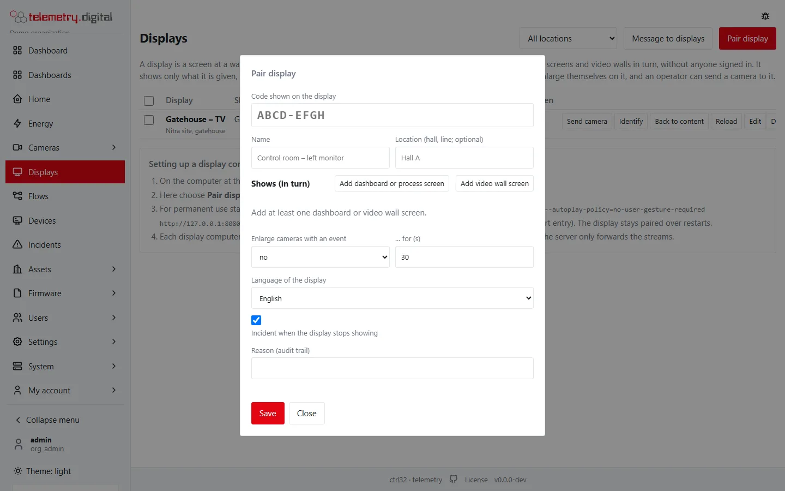
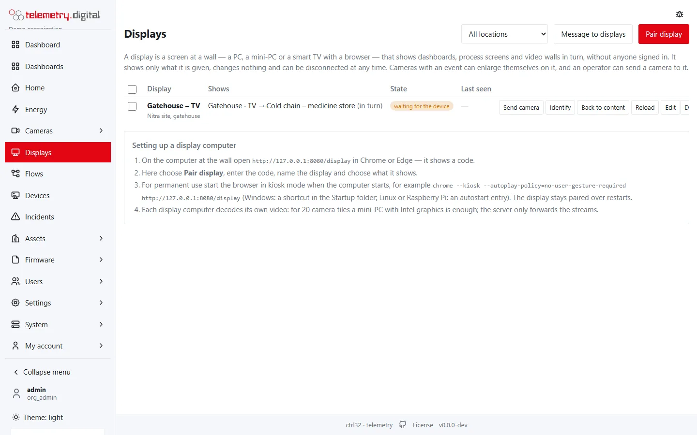
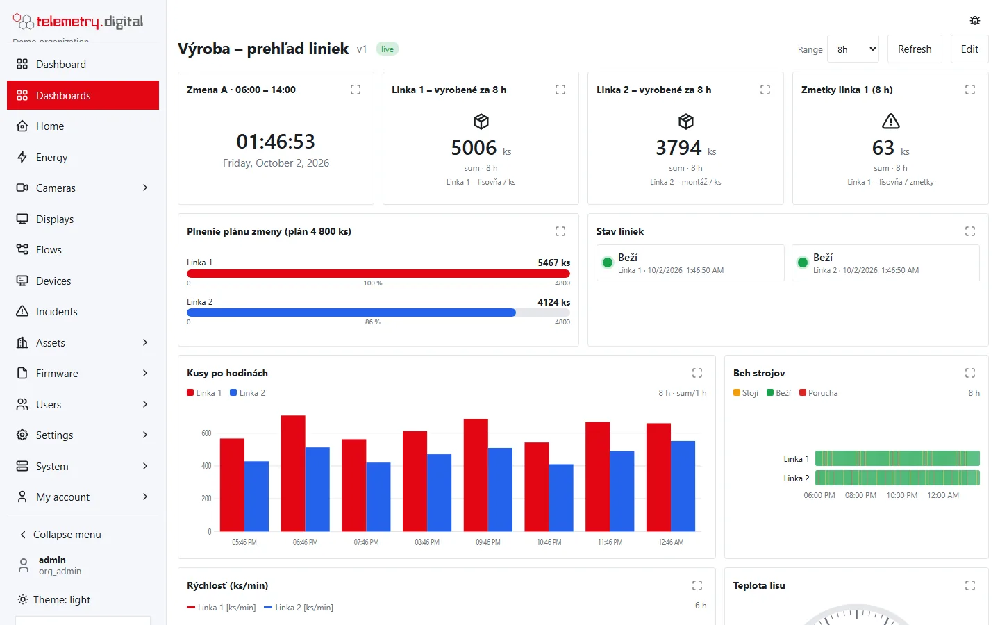

A **display** is a screen at a wall — a PC, a mini-PC or a smart TV with a browser — that shows dashboards, process
pictures and video wall screens **in turn, without anyone signed in**. It shows only what it is given, changes
nothing and can be disconnected at any time. Cameras with an event can enlarge themselves on it, and operators can
send cameras and messages to it.

## Pair a display

1. On the computer at the wall open `https://<server>/display` in Chrome or Edge. It shows a code such as
   `K7QM-4TZP` and how many minutes it stays valid.
2. In the application open **Displays → Pair display** (needs `display.manage`), enter the code, name the display
   and choose what it shows.
3. The display collects its credential and starts showing its content within a few seconds.

- The code has eight characters without the easily confused 0, O, 1 and I; letter case does not matter. It is valid
  for **15 minutes** and pairs once; the kiosk page asks for a new code when it expires.
- Knowing the code is not enough to become the display: only the browser that showed the code can collect the
  credential, within 10 minutes of the pairing. The credential is a random token kept in a cookie of that browser for
  400 days; the server stores only its hash.
- Ten wrong codes within 10 minutes block the user from pairing for a while; one network address can start at most
  60 pairings in 10 minutes.
- Pairing, the credential being collected, changes, commands and disconnecting are written to the audit trail with
  the display's address and browser.

### Pairing and edit settings

| Field | Type | Default | Allowed values |
|---|---|:---:|---|
| Code shown on the display | text | — | the 8-character code; only when pairing |
| Name | text | — | required, 1–80 characters, for example *Control room – left monitor* |
| Location (hall, line; optional) | text | — | at most 60 characters; suggestions from existing locations |
| Shows (in turn) | items | — | 1–20 items, see below |
| Enlarge cameras with an event | list | no | no, cameras of its video walls, all cameras |
| … for (s) | number | 30 | 5–600 seconds |
| Language of the display | list | your language | *as the browser*, or one of the languages enabled on the server |
| Incident when the display stops showing | checkbox | on | — |
| Reason (audit trail) | text | — | required, at most 200 characters |

**Items** are added with *Add dashboard or process screen* and *Add video wall screen*:

| Item setting | Allowed values |
|---|---|
| Dashboard or process screen | any current dashboard or process picture of the organization |
| Video wall screen | any screen of a video wall (shown with its layout, for example *5×4*); needs `video.view` to list walls |
| for … s | 10–3600 seconds, default 60 |
| ↑ / ✕ | move the item up / remove it |

A single item stays on the screen; several items rotate in the listed order.

A user limited to camera groups cannot choose *all cameras*, and cannot put on a display a wall screen or a dashboard
whose cameras lie outside their groups.

## The Displays page

**Displays** (needs `display.control`) lists the displays, filtered by location when locations exist.

| Column | Content |
|---|---|
| Display | the name, the location and an *alarms* badge when it enlarges cameras with events |
| Shows | the items in turn, for example *Line 1 → Line 2 (in turn)* |
| State | *waiting for the device* (paired but the credential not collected yet), *showing*, *not showing*; the current message and command |
| Last seen | the last contact and the device's address |
| — | the command buttons, and **Edit** and **Disconnect** for `display.manage` |

The page refreshes every 10 seconds while no dialog is open. **Disconnect** asks for a reason; the display returns to
the pairing screen and must be paired again.

## Operator commands

Operators with `display.control` send commands from the Displays page or from a camera's page (*show on display*):

| Command | Settings | Effect |
|---|---|---|
| Send camera | camera (enabled cameras the operator may see; needs `video.view`), for 5–3600 s (default 120), stream: main or sub (default main) | the camera fills the display for the chosen time, labelled *sent by* and the operator's name |
| Identify | — | the display shows its name in large letters for 10 seconds |
| Back to content | — | closes the cameras sent or enlarged, and ends the current message |
| Reload | — | the display reloads its page |
| Message to displays | To, Text, Kind, For (min) | see below |

### Messages

| Field | Allowed values |
|---|---|
| To | all displays, the displays of one location, or the selected displays (tick them in the list) |
| Text | 1–200 characters; shown as plain text |
| Kind | information (a band at the bottom), warning (a band at the top), alarm (the whole screen, flashing) |
| For (min) | 1–60 minutes, default 10 |

The display shows the text with the sender and the time. **End messages** ends the messages and closes the cameras
on the chosen displays. One command can address at most 500 displays by selection.

## How a display behaves

- It asks the server for its content, commands and messages every 4 seconds; a change of its settings restarts the
  rotation from the first item.
- A grid dashboard gets the row height that fills the screen (at least 36 px), so the display never scrolls; a
  process picture is scaled to fit the width and height. Values update live and at the dashboard's refresh interval.
- The time range is the dashboard's default range.
- **Cameras with an event** — motion, tampering, line crossing and others — fill the display for the set time when
  *Enlarge cameras with an event* is on: *cameras of its video walls* means the cameras on its wall screens, *all
  cameras* every camera. At most four cameras are shown at once, the oldest giving way; they play the main stream.
  Wall tiles of cameras with an event are outlined.
- A display plays only the cameras of its content (wall tiles, camera widgets, camera pins), cameras sent by an
  operator and, with *all cameras*, cameras with an active event. It never plays sound. Its credential opens no other
  part of the system.
- A camera pin clicked on a display closes its window after one minute.
- When the server cannot be reached, the display shows *Connection to the server lost — retrying…* in red and goes on
  by itself.
- The page keeps the screen awake, hides the pointer after 3 seconds without movement and switches to full screen on
  the first click.
- With **Incident when the display stops showing** on, an incident is opened when the display stops reporting, after
  the time set under *Cameras → Settings → Monitoring*.

## Production screens

Any dashboard or process picture can be on a display — for example one screen per production line with the pieces
made in the shift (*Aggregated value*, sum, range *8h* or *12h*), the plan fulfilment (*Progress bar* with the plan
as maximum), pieces per hour (*Bars over time*, sum per hour), machine states (*State indicator*, *State timeline*),
speeds and temperatures, and the line's process picture. The range *today* runs from local midnight.

*A production screen for a display.*

## Setting up the computer

- Start the browser in kiosk mode when the computer starts, for example
  `chrome --kiosk --autoplay-policy=no-user-gesture-required https://<server>/display` (Windows: a shortcut in the
  Startup folder; Linux or Raspberry Pi: an autostart entry). The display stays paired over restarts.
- Each display decodes its own video; the server only forwards the streams. For 20 camera tiles on the sub-stream a
  mini-PC with Intel graphics is enough.
- Several monitors on one computer: pair one display per monitor (a browser window on each), or open a video wall
  with *Open on all monitors* as a signed-in user.

!!! tip "Raspberry Pi kiosk"
    For a Raspberry Pi with a touch display, the public repository
    [kiosk_setup_raspberry](https://github.com/telemetry-digital/kiosk_setup_raspberry) sets up a fullscreen Chromium
    kiosk on Raspberry Pi OS Lite.

## Video walls

A **video wall** is a set of 1 to 8 screens (monitors), each with a grid of camera tiles. Walls are created under
*Cameras → Video walls* and opened by a signed-in user with `video.view`; a display shows any screen of a wall as
one of its items.

| Wall screen feature | Behaviour |
|---|---|
| Screen selector | switches the screen; the address keeps it (`?screen=`) |
| Click on a tile | enlarges the camera to the whole screen with the main stream; Esc or another click returns |
| Layout buttons | grid, or one camera per row (used on phones) |
| Full screen | switches the browser to full screen |
| Open on all monitors | opens one window per screen, on its own monitor when the browser allows window placement |
| Stream | per screen: automatic (sub-stream above a number of tiles, by default 4), sub-stream or main stream |
| Events | tiles of cameras with an event are outlined |
| Toolbar | hides after 3 seconds without mouse movement |

Creating and editing walls is described in [Video walls, floor plans and widgets](../video-nvr/video-walls.md).
