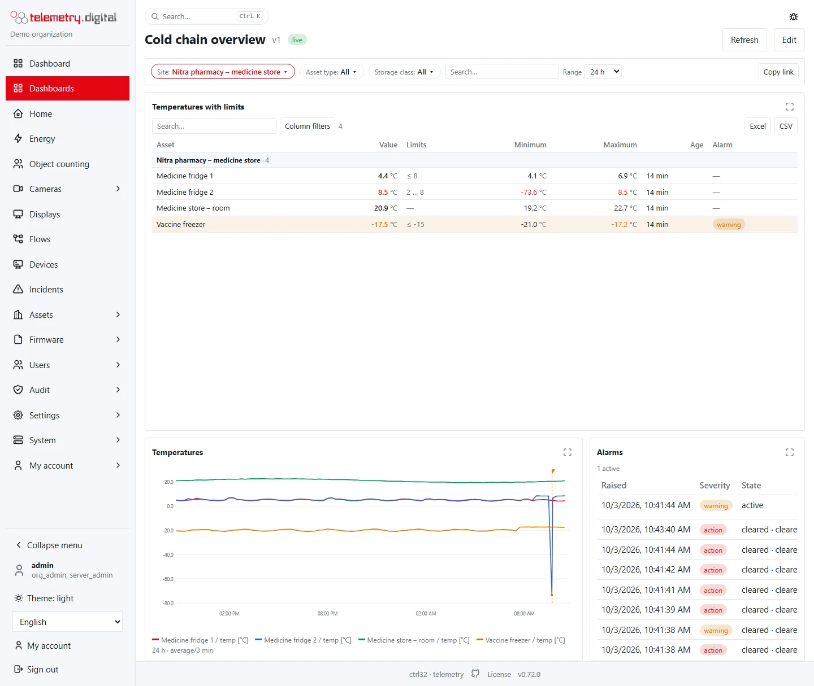
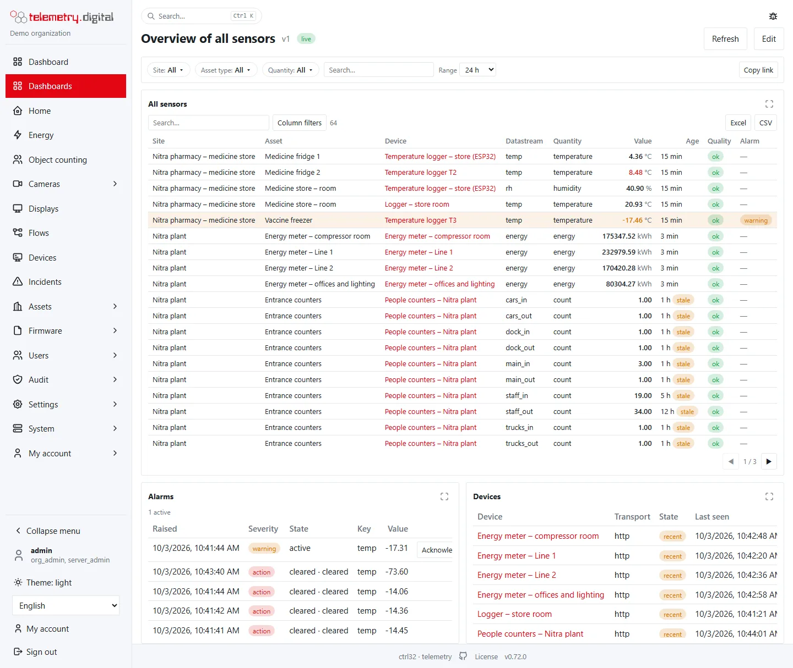
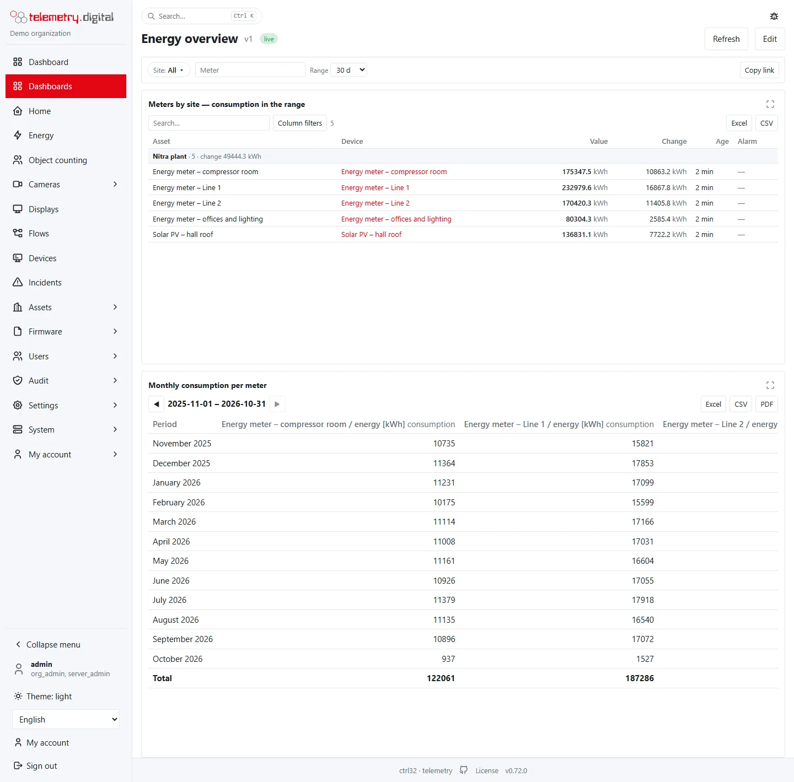
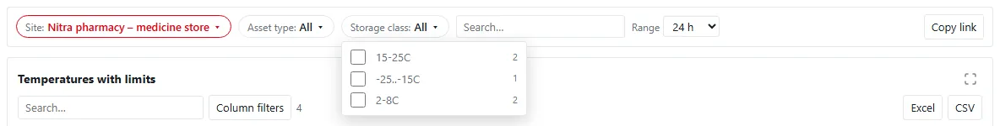
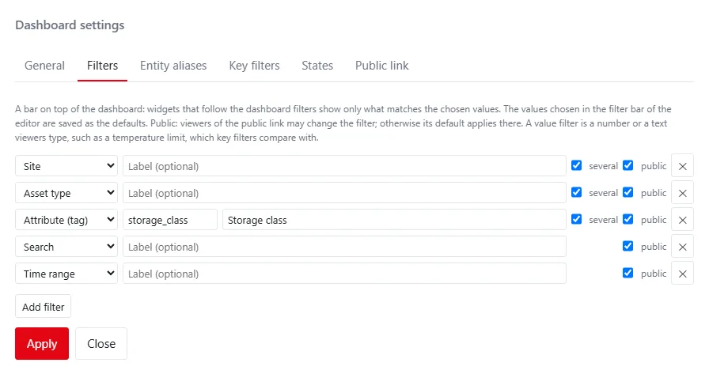
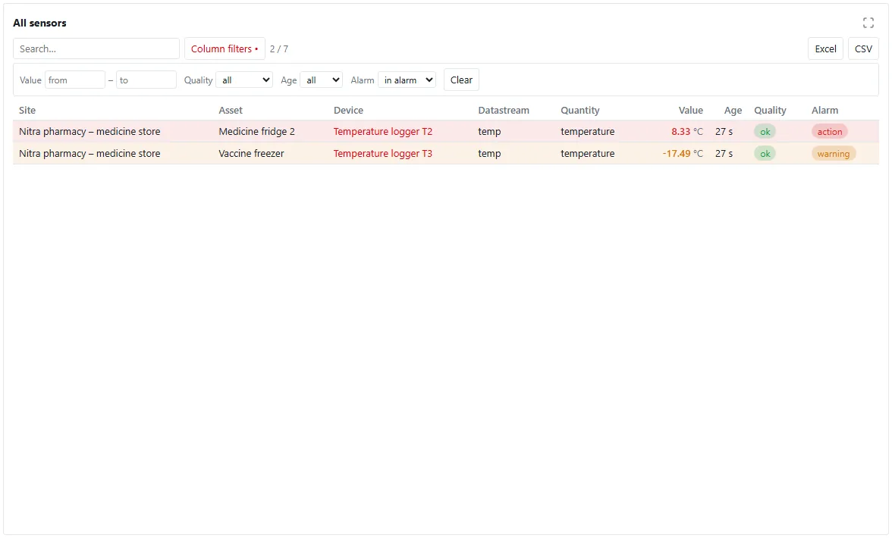
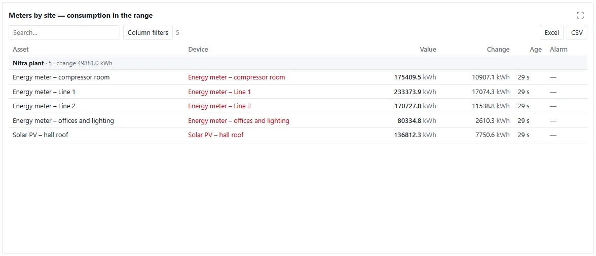
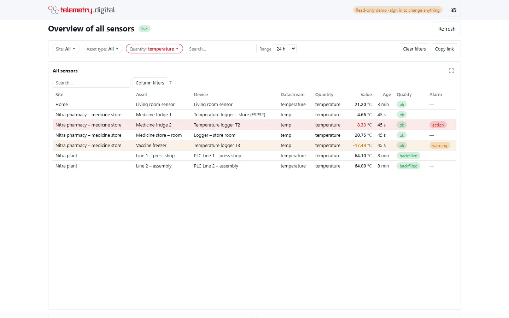
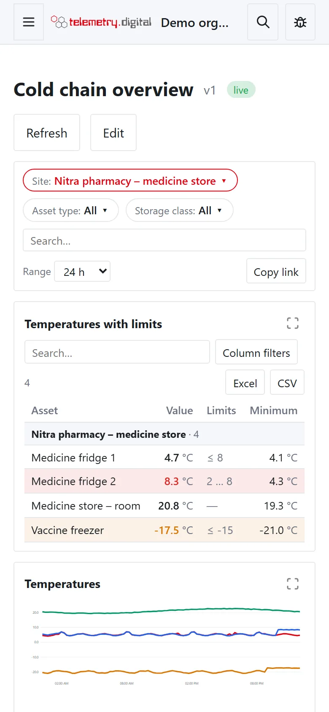

An **overview** answers questions such as *"how are all the fridges of this site?"* or *"how much did every meter
consume this month?"* without picking datastreams one by one. Three things make it work:

- **Dashboard filters** — a bar on top of the dashboard with site, asset type, device, quantity, an attribute, a search
  field and the time range. Widgets that follow the filters show only what matches the chosen values.
- **Query data sources** — a widget selects its datastreams by a query (for example *every temperature of the
  pharmacy*) instead of a fixed list, so new devices appear on their own.
- **The overview table** — many datastreams in one table with search, sorting, column filters, grouping, pages,
  highlighting and export of the filtered rows.

Three ready-made overviews put these together: *Overview of all sensors*, *Energy overview* and *Cold chain
overview*.

*The cold chain overview, filtered to one site.*

## Ready-made overviews

Choose one in **New dashboard → Kind and start**, group *Overview*. They bind nothing fixed: their widgets select
datastreams by query and follow the dashboard filters, so they work for any organization.

| Overview | Filters | Widgets |
|---|---|---|
| Overview of all sensors | site, asset type, quantity, search, range (24 h) | an overview table of every datastream with site, asset, device, datastream, quantity, value, age, quality and alarm; the alarms and the devices of the filtered datastreams |
| Energy overview | site, search (*Meter*), range (30 d) | the meters (quantity `energy…`) grouped by site with their consumption in the range and the total per site; the monthly consumption of each meter for the last 12 months |
| Cold chain overview | site, asset type, storage class, search, range (24 h) | every temperature with the limits of its alarm rules, minimum and maximum in the range, age and alarm state, grouped by site; a trend of the temperatures; the alarms |

Every filter of a ready-made overview is marked *public*. Change the filters, the widgets and their sources in the
editor like on any other dashboard.

*Overview of all sensors.*

*Energy overview: the consumption per meter and the total per site.*

## The filter bar

A dashboard with filters shows a bar between its title and the widgets. Each filter is a button with its current value
(*All* when nothing is chosen); a click opens the list of choices.

| Filter | Choices | Narrows to |
|---|---|---|
| Site | the sites of your organization | datastreams of assets at the chosen sites |
| Asset type | the asset types (fridge, freezer, meter, machine, …) | datastreams of assets of the chosen types |
| Device | the devices that feed datastreams | datastreams assigned to the chosen devices |
| Quantity | the quantities (temperature, humidity, energy, …) | datastreams of the chosen quantities |
| Attribute | the values of one attribute of assets or datastreams, for example `storage_class` | datastreams whose asset or datastream has the chosen value |
| Search | free text | datastreams whose key, quantity, asset, asset type, site, device or name contains the text |
| Range | `1h`, `6h`, `8h`, `12h`, `today`, `24h`, `7d`, `30d`, `90d` | the time range of the whole dashboard; it replaces the Range selector in the title |

- Each choice shows how many datastreams have it. The choices follow the other filters: with a site chosen, *Asset
  type* lists only the types at that site. A filter never narrows its own list, so you can always add another site.
- A filter with **several values** lets you tick more than one; a datastream then matches any of them. Different
  filters must all match.
- Lists with more than eight choices have a filter field on top.
- **Clear filters** returns every filter to the dashboard's defaults; it appears when a filter differs from them.
- **Copy link** copies the address of the current view.

### Values in the address and per viewer

The chosen values are part of the address (`?f.site=…&f.quantity=temperature&f.range=7d`, an attribute as
`f.a.storage_class=2-8C`), so a copied link opens the same view. Your browser also remembers the values per dashboard
and user: the next visit starts where you left. A value in the address wins over the remembered one, the remembered
one over the dashboard's default.

!!! note "Filters only narrow"
    A filter never shows more than a widget shows without it. A widget with a fixed list of datastreams shows at most
    those; a widget with a query source shows at most what its query selects.

### Which widgets follow the filters

A widget follows the filters when **Follow the dashboard filters** is ticked on its Data tab.

| Widget | What the filters narrow |
|---|---|
| Widgets with datastreams (charts, values, tables, the overview table, period tables) | the datastreams: the fixed list, or the result of the query source |
| Devices, Map | the devices that feed the filtered datastreams |
| Alarms, Alarm count | the alarms of the filtered datastreams |

Widgets that do not follow the filters ignore them, except for the range: the dashboard range applies to every widget
without a range of its own.

## Define the filters

In the editor, **Dashboard settings → Filters** lists the filters of the dashboard; **Add filter** adds one.

| Field | Content |
|---|---|
| Kind | Site, Asset type, Device, Quantity, Attribute (tag), Search, Time range |
| Attribute | for *Attribute (tag)*: the attribute name, for example `storage_class`; the field offers the names used in your organization |
| Label | the text on the button; empty = the name of the kind (or of the attribute) |
| several | the viewer may choose several values (not for Search and Time range) |
| public | viewers of the public link may change the filter |

- A dashboard has at most 8 filters, each kind once (an attribute filter once per attribute).
- The editor shows the filter bar above the grid. Widgets that follow the filters show the chosen values while you
  edit, and **the values chosen there are saved as the defaults** with the next version.
- **Apply** in the dialog, then **Save as new version**.

## Query data sources

On the **Data** tab of a widget with datastreams, **Data source** has two choices:

| Data source | Meaning |
|---|---|
| Fixed list of datastreams | the datastreams picked in the list below (as before 0.68) |
| Query — matching datastreams, new devices appear automatically | the server selects the datastreams each time the widget refreshes |

| Query field | Effect |
|---|---|
| Sites, Asset types, Quantities, Devices | lists; empty selects everything, several values match any of them |
| Quantity pattern | a quantity ending in `*` matches every quantity starting with it, for example `energy*` |
| Attributes | `key=value`, separated by commas, for example `storage_class=2-8C` |
| Name | asset name, key or *asset / key*; `*` and `?` are wildcards, without them the text only has to be contained |
| At most | the largest number of datastreams the widget shows |

- The panel shows how many datastreams match the query now.
- Datastreams are ordered by site, asset and key. When more match than the widget shows, its title bar shows a badge
  such as *24 / 57*; narrow the query or the filters.
- The query is evaluated on the server for your organization only.

| Widget | At most |
|---|:---:|
| Values table, Entity table, Overview table | 500 |
| Every other widget | 24 (default 12) |

## The overview table

The **Overview table** (group *Lists*) shows many datastreams in one table — usually with a query source and following
the dashboard filters.

| Setting | Type | Default | Allowed values |
|---|---|:---:|---|
| Title | text | Overview table | — |
| Columns | choice of several | Site, Asset, Datastream, Value, Age, Quality, Alarm | Site, Asset, Asset type, Device, Datastream, Quantity, Value, Measured, Age, Quality, Alarm, Limits, Minimum, Maximum, Change |
| Group rows by | list | (default) = no grouping | Site, Asset, Asset type, Quantity, Device |
| Totals of change per group | checkbox | off | — |
| Rows per page | number | 25 | 5–200 |
| Search box | checkbox | on | — |
| Column filters | checkbox | on | — |
| Stale after | list | auto | auto, 15m, 1h, 6h, 24h |
| Highlight rows | list | both | both, alarms, limits, none |
| Range (empty = dashboard range) | list | (default) | 1h, 6h, 8h, 12h, today, 24h, 7d, 30d, 90d |
| Decimals | number | 2 | any |
| Export buttons | checkbox | on | — |

### Columns

| Column | Content |
|---|---|
| Site, Asset, Asset type, Datastream, Quantity | where the datastream belongs and what it measures |
| Device | the device that feeds the datastream, a link to its page |
| Value | the latest value with its unit |
| Measured, Age | when the latest value was measured; *Age* adds a *stale* badge when it is older than *Stale after* |
| Quality | the quality of the latest value; *stale* when it is older than 1.5 × the datastream's expected interval (see [Data model](../devices/data-model.md#quality-of-a-value)) |
| Alarm | the highest severity of the active alarms (✓ when acknowledged) |
| Limits | the warning and action limits of the high and low alarm rules, for example `2 … 8` or `≤ 8` |
| Minimum, Maximum, Change | over the range of the widget; the change of a meter is its consumption |

- *Stale after: auto* follows the datastream's expected interval: the value is stale when it is older than 1.5 × the
  interval, as on the device page; without an expected interval after 1 hour.
- With **Group rows by** the rows are sorted into groups with a header line (name, number of rows and, with *Totals
  of change per group*, the sum of their change); the grouped column is not repeated.
- **Highlight rows**: *alarms* tints the rows with an active alarm (red for action, amber for warning); *limits*
  colours values, minimum and maximum outside the limits of the alarm rules; *both* does both. Conditional formatting
  of the widget colours the values too.

### Search, sorting, column filters and pages

- The **search box** keeps the rows whose site, asset, asset type, device, key, name or quantity contains the text.
- A click on a column header sorts by it; another click reverses the order. Numbers and alarms start with the highest.
- **Column filters** opens a row with **Value** from–to, **Quality** (good or doubtful), **Age** (fresh or stale) and
  **Alarm** (in alarm or no alarm); **Clear** removes them. The button carries a dot while a column filter is set.
- The count next to the buttons shows the shown rows and all rows, for example *8 / 56*.
- Below the table ◀ ▶ move between pages.
- A double click on a row opens the trend of the datastream.

### Export

**Excel** and **CSV** download the rows as they are filtered and sorted — every page, not only the shown one — with the
chosen columns (*Value* adds a *Unit* column). The Excel file has the title, the organization, the time, your name
and the range above the table. The export needs the permission `data.export`, is written to the audit trail and is
never offered on a public link.

## Public links

A public link of a dashboard with filters shows only the filters marked **public**; the others keep their defaults and
the viewer cannot change them — not even by editing the address.

!!! warning "What a public link can read"
    A public link reads only what the dashboard shows: the fixed datastreams of its widgets and everything their query
    sources select. Filters only narrow that. Before you publish a dashboard with a broad query source (for example
    *every datastream*), check that all of it may be public.

## On a phone

The filter bar wraps onto several lines and the overview table scrolls sideways inside its widget.

## Limits

| Item | Limit |
|---|:---:|
| Filters per dashboard | 8 |
| Values per filter | 50 |
| Datastreams of a query source: tables | 500 |
| Datastreams of a query source: other widgets | 24 |
| Rows of one export | 2000 |
| Datastreams updated live per dashboard | 200 |

Widgets beyond the live limit refresh at the dashboard's refresh interval.

## For integrators

The same queries are available in the API (see `/api/docs`, with `data.read`):

- `GET /api/v1/datastreams/query` — datastreams by `site`, `asset_type`, `quantity` (with `*`), `device`, `attr`
  (`key=value`), `q`, `name`, `ids`; `latest=1` adds the latest value, the active alarm and the limits; `from`/`to`
  add minimum, maximum and change.
- `GET /api/v1/datastreams/facets` — the choices of the filters with their counts.
- `POST /api/v1/datastreams/export` — the export of an overview table (`data.export`).

In the screen format (version 1, minor 1) a dashboard carries `filters` and a widget `source` and `follow`; dashboards
without them are unchanged. See [Copy a dashboard to another server](dashboard-editor.md#copy-a-dashboard-to-another-server).
