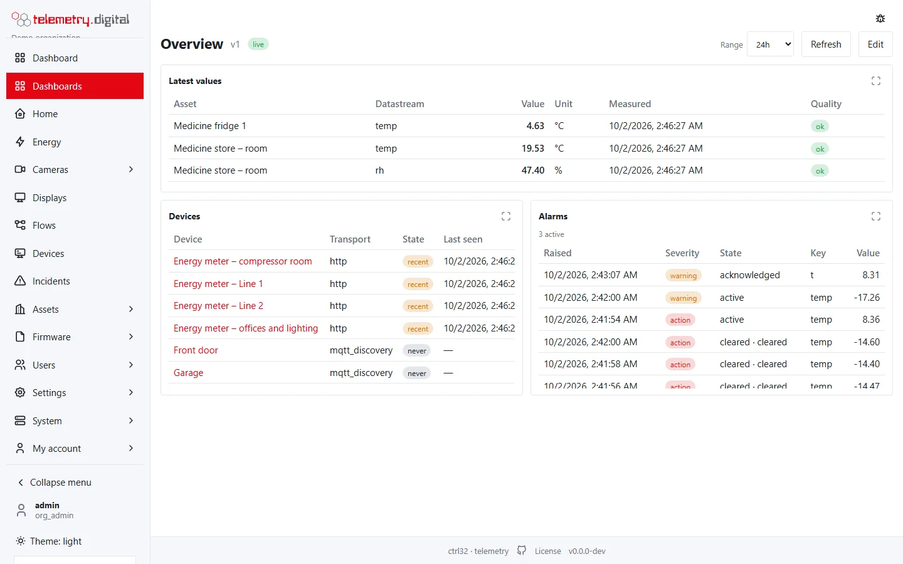
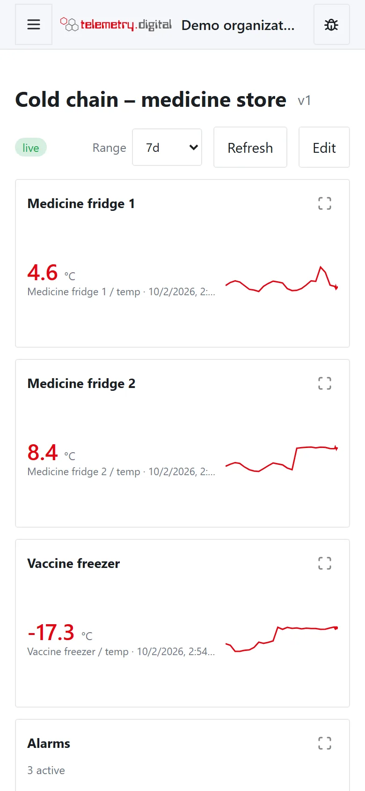

There are three ways to show your data, and you can mix them on one screen:

- **Dashboards** — widgets on a 12-column grid: values, gauges, charts, tables, maps, cameras and controls. Quick to
  build and readable on a phone.
- **Process pictures (SCADA)** — the plant drawn in a vector editor with industrial symbols, pipes with flow, texts
  with live values, faceplates and commands.
- **Process pictures with widgets** — any widget can sit on the drawing, at a pixel position.

Values update live while the page is open, without reloading.

*A dashboard with latest values, devices and alarms.*

*On a phone the widgets are stacked in one column.*

## Pages in this section

| Page | What it covers |
|---|---|
| [Dashboard editor](dashboard-editor.md) | the list, new dashboards and starters, viewing, time range, the grid editor, the property panel, dashboard settings, public link, default dashboard, versions, phone layout |
| [Widget catalogue](widgets.md) | every widget type at a glance and the settings all widgets share: appearance, click actions, series, conditional formatting, time window, viewer filters |
| [Value widgets](widgets-values.md) | latest value, value card, aggregated value, gauges, progress, level, thermometer, battery, signal, compass, LEDs, state indicator, alarm count |
| [Chart widgets](widgets-charts.md) | trend chart, bars over time, state timeline, heatmap, compare values, share, pie, polar area, radar |
| [List widgets](widgets-lists.md) | values table, entity table, overview table, time-series table, period table, alarms, devices |
| [Control widgets](widgets-controls.md) | setpoint, switch, button, knob, slider, round switch — commands with a reason |
| [Other widgets and process symbols](widgets-other.md) | map, text, Markdown, clock, image, QR code, navigation card, camera, tank, pump, valve, pipe, instrument, camera on a plan |
| [Process picture editor](scada.md) | the SCADA editor: tools, selection, snap, zoom, layers, library, SVG import, keyboard shortcuts |
| [Drawing elements, dynamics and faceplates](scada-elements.md) | element types, the symbol library, element properties, dynamics, click actions, faceplates, writing values |
| [Displays (kiosks)](displays.md) | pairing a screen at a wall, what it shows, operator commands and messages, video wall screens |
| [Period tables](period-tables.md) | daily, weekly and monthly tables with Excel, CSV and PDF export |
| [Filters and overviews](filters-and-overviews.md) | the dashboard filter bar, widgets that select datastreams by query, the overview table with search, column filters, grouping and export, the ready-made overviews |
| [Entity aliases, key filters and drill-down](aliases-filters-states.md) | entity aliases shared by widgets, key filters on latest values and attributes, dashboard states with drill-down, the entities table and the entity selector |

## Permissions

| Action | Permission |
|---|---|
| Open the list, view dashboards and process pictures | `data.read` |
| Create, edit, retire dashboards; create, regenerate or disable public links; import graphics into the library | `content.write` |
| Send commands from control widgets, faceplates and picture objects | `device.command` |
| Download Excel, CSV and PDF from period tables, Excel and CSV from overview tables | `data.export` |
| See camera widgets and camera pins with live state | `video.view` |
| Send content, cameras and messages to displays | `display.control` |
| Pair, change and disconnect displays | `display.manage` |

Which roles carry these permissions is described in
[Users and permissions](../administration/users-and-permissions.md).

## Versions and reasons

Dashboards and process pictures are **versioned**: every save creates a new version and asks for a reason, which is
written to the audit trail together with the version number, the number of widgets and drawing elements and the
default flag. Retiring a dashboard, creating or disabling a public link and changing a display also ask for a reason.

!!! note "Changes through AI assistants"
    Reading dashboards through an AI assistant is free. Creating or changing them through an AI assistant requires a
    licence; in the web application no licence is needed. See [Licence](../licence/index.md).

## Maps

Devices with a position — fixed on the device or reported in its heartbeat — can be shown on a map widget. The map
tiles come from *Settings → Branding*: your own tile server, a provider with a key, or a self-hosted map archive
(PMTiles), so maps work without any external service. See [Other widgets](widgets-other.md).
