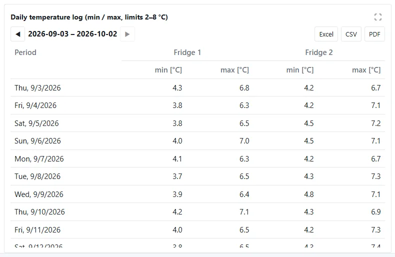
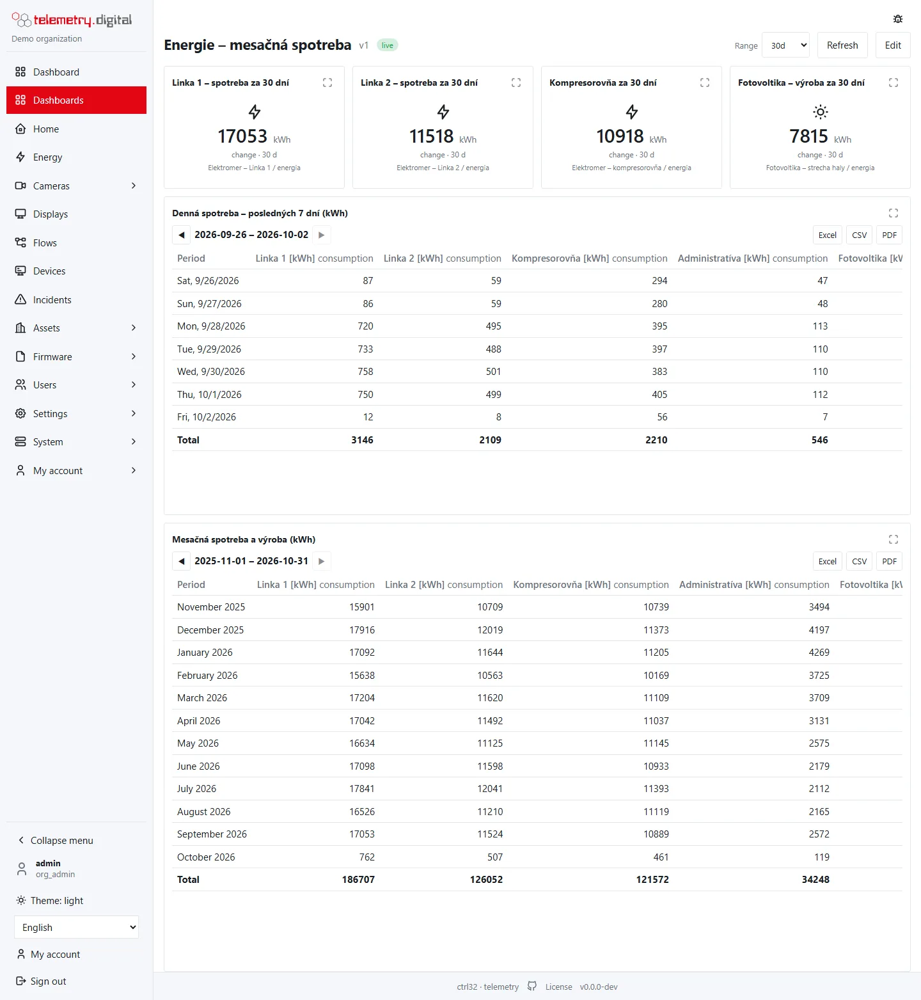

The **Period table** widget shows datastream values per local period — hour, day, week, month or year in your
organization's time zone — and exports exactly that table to **Excel (XLSX)**, **CSV** and a **PDF report**. Typical
uses are a daily temperature log of a fridge, the monthly consumption of electricity meters, or meter readings for
accounting.

*A daily temperature log with limits 2–8 °C; the value above the limit is red.*

## Add a period table

*Add widget → Lists → Period table*, then bind the datastreams on the Data tab. The names in the table come from the
widget's **Series** tab (*Label*, for example "Main meter", "Heating"); without a label the table shows *asset / key*.
The default size is 6 × 5 grid cells.

## Settings

| Setting (Data tab) | Type | Default | Allowed values |
|---|---|:---:|---|
| Title | text | Period table | the title of exports; an export with a title over 120 characters is refused |
| Datastreams | datastreams | — | 1–24 |
| Row per | list | day | hour, day, week, month, year |
| Values | list | min and max | see below |
| Period | list | this month | see below |
| Rows | list | a row per period | a row per period, a row per datastream |
| Total row | checkbox | off | — |
| Lower limit | number | — | readings below it are marked and counted by *out of limits* |
| Upper limit | number | — | readings above it are marked and counted by *out of limits* |
| Decimals | number | 2 | 0–6 |
| Export buttons | checkbox | on | — |

### Values

| Choice | Columns per datastream |
|---|---|
| min and max | min, max |
| min, max and average | min, max, average |
| average | average |
| min | min |
| max | max |
| last value | end |
| consumption | consumption |
| start, end and consumption | start, end, consumption |
| min, max and out of limits | min, max, out of limits |
| samples | samples |
| sum | sum |
| sum and max | sum, max |

| Value | Meaning |
|---|---|
| min, max | the lowest and highest reading in the period |
| average | the average of the readings in the period |
| start, end | the first and the last reading in the period |
| consumption | the sum of the increases of a counter between readings (see below) |
| samples | the number of readings |
| sum | the sum of the readings — passages counted by [object counting](../object-counting/index.md), people or vehicles per period |
| out of limits | the number of readings below the lower or above the upper limit |

**Consumption** of a meter is computed from consecutive readings: an increase counts fully; a drop to less than half
of the previous reading is a meter reset and counts the new reading; a smaller drop counts as 0. The last reading in
the two days before the period is the baseline, so consecutive periods add up to the total. Readings older than that
do not serve as a baseline.

### Period

| Choice | Range |
|---|---|
| today, yesterday | the local day |
| this week, last week | Monday to Sunday |
| this month, last month | the calendar month |
| this year, last year | the calendar year |
| last 7 days, last 30 days | the days up to and including today |
| last 12 months | the current month and the eleven before it |

A table has at most **1000 periods**; *Row per hour* over *last 12 months*, for example, is refused with *… periods of
hour: choose a longer interval or a shorter period*.

## Reading the table

- **A row per period**: the first column is the period, then a column per datastream and value. With several values
  the datastream name spans its value columns. A **Total** row closes the table.
- **A row per datastream**: the first column is the datastream with its unit, then the periods as columns, then the
  totals.
- Periods are labelled in the user's language: a day with its short weekday and date, a month with its name, an hour
  with day and time; weeks are labelled *2026-W36 (2026-08-31)*, years *2026*.
- Periods start at local midnight, on Mondays and on the local first of the month or year — also on the days the clocks
  change, which have 23 or 25 hours.
- Periods without readings stay empty.
- Values are **red and bold** when they break a limit: a minimum below the lower limit, a maximum above the upper
  limit, *out of limits* above 0, and the average, start and end of a period with readings out of limits.
- A `*` marks a period with a reading of doubtful quality (other than *ok* and *backfilled*); the tooltip says so.
- **Totals**: the lowest minimum, the highest maximum, the average of all readings, the first start and the last end,
  the total consumption, all samples and all readings out of limits — in bold.

### Moving between periods

**◀** shows the previous period of the same length (the previous month for *this month*, the previous 7 days for
*last 7 days*), **▶** the next one up to the current period, and **Current** returns to it. The label between the
arrows names the shown range — *2026-09*, *2026*, *2026-09-28*, or *2026-09-22 – 2026-09-28*. You can move up to 1000
periods back. The export takes the period shown.

## Export

The **Excel**, **CSV** and **PDF** buttons appear for users with the permission `data.export`, when *Export buttons*
is on. They are hidden in the editor and on public links. Every export is written to the audit trail.

| Format | Content |
|---|---|
| Excel (XLSX) | a sheet named after the title: the title (bold), a line with the period, the interval and the time zone, a line with the organization, the time of the export and the user, an empty line, the header (bold) and the rows; the first five rows stay frozen when scrolling; numbers are real numbers with the chosen decimals |
| CSV | UTF-8 with a byte-order mark (Excel opens it correctly), comma-separated, the header and the rows only; numbers with a decimal point |
| PDF | a report with the organization's logo, the title, the period, the interval and the time zone, the table (numbers aligned right), the number of periods and datastreams, the server version and a reference to the audit trail; stored under *Settings → Stored reports* with its hashes |

- Column headers are in the user's language (or English). With one datastream and one value the header also names
  the value; units are added in brackets, except for *samples* and *out of limits*.
- The file name is the title, the shown range and the time of the export, for example
  `Fridge-log_2026-09_20261002-0815.xlsx`; letters with diacritics are written without them.
- Without *Decimals* the export uses 2; samples and out of limits have none.
- PDF reports need the report renderer on the server; without it the PDF button answers *PDF reports unavailable*.

!!! note "Records for inspections"
    A daily temperature log is often a regulated record. The measurements are stored append-only and every export is
    audited, but the application is not a validated system by itself — the validation of your use stays with you.

## Typical set-ups

| Need | Datastreams | Row per | Values | Period | Rows | Other |
|---|---|:---:|---|---|---|---|
| Daily temperature log of a medicine fridge | the fridge sensor | day | min and max | this month | a row per period | lower limit 2, upper limit 8, total row |
| Monthly consumption of electricity meters | all meters (kWh counters) | month | consumption | last 12 months or this year | a row per datastream | total row |
| Meter readings for accounting | the meters | month | start, end and consumption | last month | a row per datastream | — |
| Hourly load of one day | a meter | hour | consumption | today | a row per period | — |

*Daily and monthly consumption of meters as period tables.*

## Public links and AI assistants

On a [public link](dashboard-editor.md) the period table shows its data but no export buttons; it reads only the
datastreams bound by the dashboard. The table and its exports are also available to AI assistants and over the REST
API (`GET /api/v1/period-table`, `GET /api/v1/period-table/export?format=xlsx|csv|pdf`), where a custom period with
dates is possible as well.
