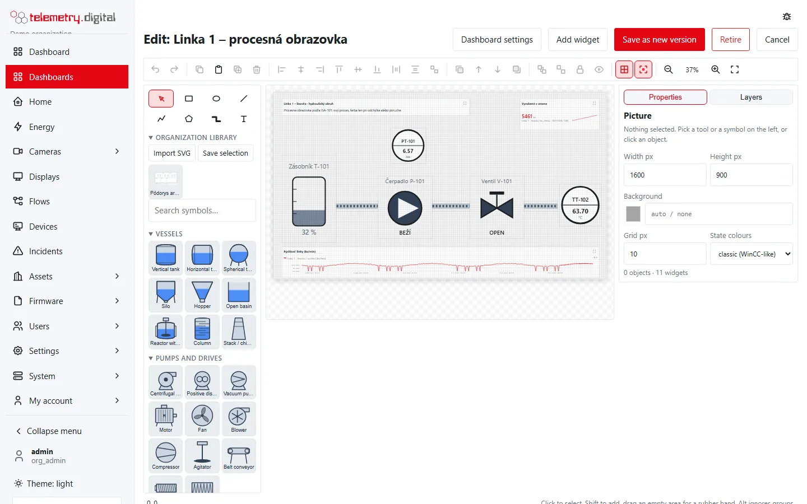

A **process picture** shows the plant as an engineer drew it: vessels filled to their level, pumps and motors coloured
by state, valves open or closed, pipes with moving flow, instrument bubbles with live values, and widgets placed on
the drawing. This page describes the editor; the objects, their dynamics and click actions are described in
[Drawing elements, dynamics and faceplates](scada-elements.md).

*A process screen with widgets over the drawing.*

## Create a process picture

**Dashboards → New dashboard → Kind and start**, then one of:

- *Process picture — empty drawing*,
- *Process picture with widgets — drawing and a trend*,
- *Process picture — mixing plant (demo)* — a complete example bound to your first datastreams,
- *Process picture — widget symbols (legacy showcase)*.

A process picture is a dashboard with a **canvas**: a fixed drawing area (default 1600 × 900 px) on which elements and
widgets have pixel positions. In view mode the canvas scales to the width of the window. Saving, versions, the
default flag, public links and retiring work as for dashboards — see [Dashboard editor](dashboard-editor.md).

## The editor window

| Area | Content |
|---|---|
| Toolbar (top) | undo and redo, clipboard, align and distribute, order, group, lock and hide, grid and snap, zoom |
| Left panel | drawing tools, the organization library, symbol search and the symbol library by category |
| Canvas | the picture with live values; a grid when *Show grid* is on |
| Right panel | **Properties** of the selection (or of the picture when nothing is selected) and **Layers** |
| Status bar | the pointer position in picture pixels, the selection (name, type, size, position, rotation) and a hint for the current tool |

Values update live while you edit. Unsaved changes mark *Save as new version* and the browser warns before you leave.
Below a window width of 1100 px the panels are stacked under the canvas.

## Drawing tools

| Tool | Key | How to draw | Default style |
|---|:---:|---|---|
| Select | V | click, Shift-click, drag on an empty area | — |
| Rectangle | R | drag; a click makes a 120 × 60 px rectangle | fill `#e2e8f0`, line `#334155`, width 1 |
| Ellipse | E | drag; a click makes a 120 × 60 px ellipse | fill `#e2e8f0`, line `#334155`, width 1 |
| Line | L | drag; Shift keeps it horizontal or vertical; a click makes a 100 px line | line `#334155`, width 2 |
| Polyline | P | click the points; double-click or Enter finishes, Esc cancels; Shift keeps a segment horizontal or vertical | line `#334155`, width 2 |
| Polygon | G | click the corners (at least 3); double-click or Enter finishes | fill `#e2e8f0`, line `#334155`, width 1 |
| Pipe | I | click the corners; segments are horizontal or vertical, hold Alt for free angles; double-click or Enter finishes | diameter 12 px, medium `#94a3b8` |
| Text | T | drag the text box; a click makes a 200 × 30 px box with the text *Text* | font 16 px, colour `#111827` |
| Symbol | — | click a symbol in the library, then click the canvas — or drag the symbol onto the canvas | metallic shading, the symbol's own size |

After drawing one object the editor returns to *Select*. For rectangles, ellipses, lines, texts and symbols, hold
**Shift** while finishing to keep the tool for the next one. Points and boxes snap to the grid while *Snap to grid* is on.

## Select, move, resize, rotate

- **Click** an object to select it; **Shift**, **Ctrl** or **Cmd** + click adds it to the selection or removes it.
- **Drag on an empty area** for a rubber band; it selects the objects lying completely inside it. With Shift the
  band adds to the selection.
- Objects of a **group** are selected together; **Alt** + click selects a single object of a group.
- Clicking an object of a multi-selection without moving it selects only that object.
- **Drag** the selection to move it, in grid steps while snapping is on; **Shift** while dragging keeps the movement
  horizontal or vertical.
- **Eight handles** resize the selection; **Shift** keeps the proportions, **Alt** ignores the grid. Several selected
  objects are scaled together.
- The **round handle** above the object rotates it in 15° steps; **Shift** rotates in 1° steps. Lines have no
  rotation handle and no box handles — move their end points instead.
- **Points** of lines, polylines, polygons and pipes: drag a point to move it, **double-click a segment** to add a
  point, **Alt + click** a point to remove it (a polyline keeps at least 2 points, a polygon 3; at most 200).
- **Arrow keys** move the selection by 1 px, **Shift + arrow** by one grid step.
- **Locked** objects cannot be selected on the canvas or moved; select them in the Layers panel.

Widgets on the canvas are selected, moved, resized, aligned, copied and deleted like drawing elements. A selected
widget shows its widget properties on the right — see [Dashboard editor](dashboard-editor.md).

## Toolbar commands

| Button | Shortcut | Effect |
|---|:---:|---|
| Undo | Ctrl+Z | undo the last change; the editor keeps the last 100 changes |
| Redo | Ctrl+Y, Ctrl+Shift+Z | redo |
| Copy | Ctrl+C | copy the selection; the copy stays in the browser, so you can paste it into another picture |
| Paste | Ctrl+V | paste, shifted by one grid step more with every paste |
| Duplicate | Ctrl+D | copy and paste in one step |
| Delete | Del, Backspace | delete the selection |
| Align left, centre, right | — | align two or more objects to the selection's box |
| Align top, middle, bottom | — | the same vertically |
| Distribute horizontally, vertically | — | equal gaps between three or more objects |
| Same size as the first selected | — | gives the other objects the size of the first one |
| Bring to front, Bring forward, Send backward, Send to back | — | the drawing order of elements (widgets are always above the drawing) |
| Group | Ctrl+G | group two or more elements |
| Ungroup | Ctrl+Shift+G | dissolve the group |
| Lock / unlock | — | locked elements cannot be selected on the canvas or moved |
| Hide in operation / show | — | hidden elements are not drawn in view mode; in the editor they are pale |
| Show grid | — | shows or hides the grid |
| Snap to grid | — | snapping on or off |
| Zoom out, Zoom in | −, + | zoom by a factor of 1.25, between 25 % and 400 % |
| Fit | 0 | fits the whole picture into the window |

**Ctrl + mouse wheel** zooms by a factor of 1.1. Buttons that do not apply to the selection are disabled.

## Keyboard shortcuts

Shortcuts work when the focus is on the canvas, not in a text field or a dialog. On a Mac use Cmd instead of Ctrl.

| Keys | Action |
|---|---|
| V, R, E, L, P, G, I, T | tools: select, rectangle, ellipse, line, polyline, polygon, pipe, text |
| Ctrl+Z / Ctrl+Y / Ctrl+Shift+Z | undo / redo / redo |
| Ctrl+C / Ctrl+X / Ctrl+V / Ctrl+D | copy / cut / paste / duplicate |
| Ctrl+A | select all unlocked elements and all widgets |
| Ctrl+G / Ctrl+Shift+G | group / ungroup |
| Del, Backspace | delete |
| Enter | finish a polyline, polygon or pipe |
| Esc | cancel drawing, then return to the select tool, then clear the selection |
| Arrow keys / Shift + arrow keys | move by 1 px / by one grid step |
| + or =, −, 0 | zoom in, zoom out, fit |

## Layers

The **Layers** tab lists everything on the picture, topmost first: the widgets, then the drawing elements with their
name (or symbol, text or type), their type and group. A click selects an object, Shift + click adds it. The lock and
eye buttons of an element lock it or hide it in operation.

## The picture properties

With nothing selected the Properties panel shows the picture:

| Setting | Type | Default | Allowed values |
|---|---|:---:|---|
| Width px | number | 1600 | 600–4000 |
| Height px | number | 900 | 300–3000 |
| Background | colour | none | hex colour, or empty |
| Grid px | number | 10 | 1–100; the snap and grid step |
| State colours | list | classic (WinCC-like) | classic, ISA-101 high performance |

The panel also counts the objects and widgets. Widgets must stay inside the canvas, so a smaller canvas can make a
save fail with *geometry outside the canvas*. The state colours are listed in
[Drawing elements](scada-elements.md).

## Organization library

The **Organization library** in the left panel holds your own graphics and composites, shared by all pictures of your
organization. Adding to it needs `content.write` and asks for a name and a reason.

| Button | Effect |
|---|---|
| Import SVG | imports an SVG file (at most 512 KiB) as a graphic and places it in the centre of the view |
| Save selection | stores the selected elements as a **composite** — a reusable group; bound tags become placeholders |

- **Imported graphics** are sanitised on the server: scripts, event handlers, embedded images, links and references
  outside the file are removed, and the editor tells you what was removed. A graphic may have at most 20 000 elements
  and a nesting depth of 64. On the picture it is a static image element; it is at most 240 px large when placed and
  can be resized.
- **Composites** (at most 500 elements) keep their drawing, dynamics and click actions. Placing one asks for a
  datastream for each tag placeholder (*— none —* leaves it unbound); the placed elements form a group.
- A click on a library item places it in the centre of the view.

## Saving

**Save as new version** asks for a reason. The server checks every element: unknown types or properties, colours
that are not hex, numbers out of range and texts that are too long are refused with the element's number, for
example *element 14: style.font must be 4..400*, and the editor selects that element.

| Item | Limit |
|---|:---:|
| Drawing elements per picture | 1500 |
| Points of one line, polyline, polygon or pipe | 200 |
| Dynamics per element | 8 |
| Click actions per element | 4 |
| Rows of a dynamic mapping | 16 |
| Widgets per picture | 60 |

!!! danger "A screen is not an interlock"
    Operator commands from a process picture go through the server, which is not in the control loop. Interlocks,
    emergency stops and other safety functions belong in the PLC and in hard wiring.
