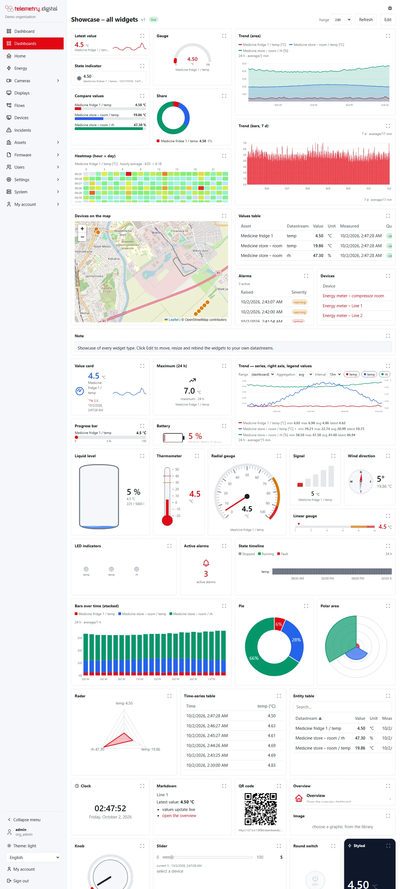

A dashboard is built from **widgets**. There are 51 widget types in six groups. This page lists them all and describes
the settings every widget shares; the settings of each type are on the group pages linked in the table.

Start from the starter *Dashboard — showcase (all widget types)* to see every type with your own data.

*The showcase dashboard.*

## All widget types

The default size is in grid columns × rows; on a process picture a new widget is 100 times larger in pixels (a 3 × 2
widget becomes 300 × 200 px).

| Widget | Group | Binds | Default size | Settings |
|---|---|---|:---:|---|
| Latest value | Values | datastreams | 3 × 2 | [Value widgets](widgets-values.md) |
| Value card | Values | datastreams | 3 × 2 | [Value widgets](widgets-values.md) |
| Aggregated value | Values | datastreams | 3 × 2 | [Value widgets](widgets-values.md) |
| Gauge | Values | datastreams | 3 × 2 | [Value widgets](widgets-values.md) |
| Radial gauge | Values | datastreams | 3 × 3 | [Value widgets](widgets-values.md) |
| Linear gauge | Values | datastreams | 4 × 1 | [Value widgets](widgets-values.md) |
| Progress bar | Values | datastreams | 4 × 1 | [Value widgets](widgets-values.md) |
| Liquid level | Values | datastreams | 3 × 3 | [Value widgets](widgets-values.md) |
| Thermometer | Values | datastreams | 2 × 3 | [Value widgets](widgets-values.md) |
| Battery level | Values | datastreams | 2 × 2 | [Value widgets](widgets-values.md) |
| Signal strength | Values | datastreams | 2 × 2 | [Value widgets](widgets-values.md) |
| Compass / wind | Values | datastreams | 3 × 3 | [Value widgets](widgets-values.md) |
| State indicator | Values | datastreams | 3 × 2 | [Value widgets](widgets-values.md) |
| LED indicators | Values | datastreams | 4 × 2 | [Value widgets](widgets-values.md) |
| Alarm count | Values | — | 2 × 2 | [Value widgets](widgets-values.md) |
| Occupancy | Values | datastreams | 3 × 2 | [Object counting](../object-counting/outputs.md#widgets) |
| Trend chart | Charts | datastreams | 6 × 3 | [Chart widgets](widgets-charts.md) |
| Bars over time | Charts | datastreams | 6 × 3 | [Chart widgets](widgets-charts.md) |
| State timeline | Charts | datastreams | 6 × 2 | [Chart widgets](widgets-charts.md) |
| Heatmap (hour × day) | Charts | datastreams | 6 × 3 | [Chart widgets](widgets-charts.md) |
| Compare values | Charts | datastreams | 4 × 3 | [Chart widgets](widgets-charts.md) |
| Share (donut) | Charts | datastreams | 4 × 3 | [Chart widgets](widgets-charts.md) |
| Pie / doughnut | Charts | datastreams | 4 × 3 | [Chart widgets](widgets-charts.md) |
| Polar area | Charts | datastreams | 4 × 3 | [Chart widgets](widgets-charts.md) |
| Radar | Charts | datastreams (at least 3) | 4 × 3 | [Chart widgets](widgets-charts.md) |
| In and out per entrance | Charts | datastreams | 6 × 3 | [Object counting](../object-counting/outputs.md#widgets) |
| Share per entrance | Charts | datastreams | 4 × 3 | [Object counting](../object-counting/outputs.md#widgets) |
| Values table | Lists | datastreams | 6 × 3 | [List widgets](widgets-lists.md) |
| Entity table | Lists | datastreams | 6 × 4 | [List widgets](widgets-lists.md) |
| Overview table | Lists | datastreams | 12 × 5 | [Filters and overviews](filters-and-overviews.md) |
| Entities table | Lists | an entity alias | 12 × 5 | [Aliases and drill-down](aliases-filters-states.md#entities-table) |
| Time-series table | Lists | datastreams | 6 × 3 | [List widgets](widgets-lists.md) |
| Period table | Lists | datastreams | 6 × 5 | [Period tables](period-tables.md) |
| Alarms | Lists | — | 6 × 3 | [List widgets](widgets-lists.md) |
| Devices | Lists | devices | 6 × 3 | [List widgets](widgets-lists.md) |
| Vehicle speeds | Lists | datastreams | 6 × 4 | [Object counting](../object-counting/outputs.md#widgets) |
| Setpoint | Control | devices, datastreams | 3 × 2 | [Control widgets](widgets-controls.md) |
| Switch | Control | devices, datastreams | 3 × 2 | [Control widgets](widgets-controls.md) |
| Button | Control | devices | 3 × 2 | [Control widgets](widgets-controls.md) |
| Knob | Control | devices, datastreams | 3 × 3 | [Control widgets](widgets-controls.md) |
| Slider | Control | devices, datastreams | 4 × 2 | [Control widgets](widgets-controls.md) |
| Round switch | Control | devices, datastreams | 2 × 2 | [Control widgets](widgets-controls.md) |
| Map | Other | devices | 6 × 4 | [Other widgets](widgets-other.md) |
| Text | Other | — | 4 × 2 | [Other widgets](widgets-other.md) |
| Markdown card | Other | datastreams | 4 × 2 | [Other widgets](widgets-other.md) |
| Clock | Other | — | 3 × 2 | [Other widgets](widgets-other.md) |
| Image | Other | — | 3 × 2 | [Other widgets](widgets-other.md) |
| QR code | Other | — | 2 × 2 | [Other widgets](widgets-other.md) |
| Navigation card | Other | — | 3 × 1 | [Other widgets](widgets-other.md) |
| Entity selector | Other | an entity alias | 4 × 1 | [Aliases and drill-down](aliases-filters-states.md#entity-selector) |
| Camera | Other | — | 4 × 3 | [Other widgets](widgets-other.md) |
| Tank | Process symbols | datastreams | 2 × 3 | [Other widgets](widgets-other.md) |
| Pump / motor | Process symbols | datastreams | 2 × 2 | [Other widgets](widgets-other.md) |
| Valve | Process symbols | datastreams | 2 × 2 | [Other widgets](widgets-other.md) |
| Pipe | Process symbols | datastreams | 3 × 1 | [Other widgets](widgets-other.md) |
| Instrument | Process symbols | datastreams | 2 × 2 | [Other widgets](widgets-other.md) |
| Camera on a plan | Process symbols | — | 1 × 1 | [Other widgets](widgets-other.md) |

Process symbols work on grid dashboards too. For drawings with many objects use the drawing elements of a
[process picture](scada-elements.md) instead — they have more symbols and dynamics.

## How widgets read data

- A widget with datastreams reads either a **fixed list** or the result of a **query source** (sites, asset types,
  quantities, devices, attributes, name), and can **follow the dashboard filters** — see
  [Filters and overviews](filters-and-overviews.md).

- **Latest value** widgets show the newest reading of each bound datastream (from the last 400 days).
- **Time** widgets read the readings in their time window. Over long windows the server aggregates them into buckets
  (average, minimum, maximum and count per bucket) so that a chart has at most a few hundred to two thousand points.
- Readings whose quality is not *ok* are marked: an orange dot in trend charts, the quality name next to the value in
  value widgets, a badge in tables, `*` in period tables.
- Numbers are shown with the widget's **Decimals** (default 2) unless a series sets its own.
- A widget without data shows `—` for values, *no value yet* under a value, or *no data in this range* in a chart.
  An error from the server is shown as text inside the widget; the other widgets keep working.

## Thresholds

Widgets with limits use four optional numbers:

| Setting | Meaning |
|---|---|
| Warning limit (high) | a value **at or above** it is in the warning zone |
| Action limit (high) | a value **at or above** it is in the action zone |
| Warning limit (low) | a value **at or below** it is in the warning zone |
| Action limit (low) | a value **at or below** it is in the action zone |

The action zone wins over the warning zone. Values in the warning zone are amber (`#d97706`), in the action zone red
(`#dc2626`). Widgets with limits have **Warning colour** and **Action colour** on the Appearance tab: they recolour
the values of Latest value, Gauge and Compare values and the zones of the Radial gauge, Linear gauge and Thermometer;
the limit lines of the Trend chart, the zone arcs of the Gauge, the Tank and the Instrument keep amber and red.
Limits on a widget only colour the display — alarms are configured in [alarm rules](../automation/alarms.md).

## Settings every widget has

### Appearance

| Setting | Type | Default | Allowed values |
|---|---|:---:|---|
| Show title | checkbox | on | — |
| Title colour | colour | theme | hex colour |
| Title alignment | list | left | left, center, right |
| Bold title | checkbox | on | — |
| Font | list | default | default, mono, serif, condensed |
| Title icon | icon | none | an icon of the built-in catalogue |
| Title size px | number | theme | 8–48 |
| Value size px | number | theme | 8–120; the size of the main value where the widget shows one |
| Text colour | colour | theme | hex colour |
| Background | colour | theme | hex colour |
| Border colour | colour | theme | hex colour |
| Border width px | number | theme | 0–8; 0 removes the border |
| Corner radius px | number | theme | 0–40 |
| Padding px | number | theme | 0–40 |
| Shadow | checkbox | off | — |
| Transparent card | checkbox | off | removes background, border and shadow |
| Tooltip | text | — | shown when the pointer rests on the widget |
| Full-screen button | checkbox | on | — |
| Framed card | checkbox | on | on a process picture, off draws the widget without a card |

A colour field has a colour picker, a text field for `#rrggbb` (also `#rgb`, `#rgba` and `#rrggbbaa`) and ✕ to clear
it; a cleared colour follows the theme, light or dark. The title is the widget's **Title** setting on the Data tab;
without one the widget shows its type name.

Widgets that show values also have:

| Setting | Type | Default | Allowed values |
|---|---|:---:|---|
| Value colour | colour | series colour or theme | hex colour |
| Show datastream name | checkbox | on | off hides the datastream name under the value |
| Conditional formatting | rules | none | up to 8 rules, see below |

Widgets with limits (Trend chart, Compare values, Latest value, Gauge, Radial gauge, Linear gauge, Thermometer, Tank,
Instrument) also have **Warning colour** and **Action colour**. Share widgets (Share, Pie, Polar area, Radar, Compare
values, LED indicators) have **Legend position**: right, bottom or none — Pie and Polar area follow it.

### Conditional formatting

A rule colours the widget when the current value matches it. Rules are checked from the top; the **first match
wins**.

| Part | Allowed values |
|---|---|
| Operator | `>`, `>=`, `<`, `<=`, `==`, `!=`, `between` (both ends included; a second field *to* appears) |
| Value | a number |
| Target | Value colour, Background (the whole card), Icon colour |
| Colour | hex colour |

**Add range** adds a rule (`> 0`, value colour, red); ✕ removes it. A rule wins over the threshold colours. With
several datastreams on one widget, Background applies to the first datastream only. The widgets *Compare values* and
*Values table* carry this setting but colour their values only by the thresholds.

### Series

Every widget bound to datastreams has a **Series** tab with one box per bound datastream:

| Setting | Type | Default | Allowed values |
|---|---|:---:|---|
| Label | text | *asset / key* | at most 64 characters |
| Colour | colour | from the palette | hex colour |
| Unit | text | the datastream's unit | at most 16 characters |
| Decimals | number | the widget's Decimals | 0–6 |
| Style | list | the widget's style | line, area, step, bar, scatter (Trend chart only) |
| Axis | list | left | left, right (Trend chart only) |
| Points | checkbox | off | a dot on every point (Trend chart only) |
| Fill | checkbox | off | fills the area under the line (Trend chart only) |
| Hidden | checkbox | off | the datastream is bound but not drawn |

The palette of series colours is red, blue, green, amber, violet, pink, cyan, lime, orange, grey, teal and purple,
in this order. The Series tab of the time widgets also holds **Legend position** (top, bottom, right, none) and
**Legend values** (any of min, max, avg, total, latest — computed over the points shown).

### Time window

The Trend chart, Bars over time, State timeline and Time-series table have a **Time** tab; the Aggregated value has
the first three of these settings.

| Setting | Type | Default | Allowed values |
|---|---|:---:|---|
| Time window | list | relative | relative (the widget's or the dashboard's range up to now), fixed |
| From (fixed window) | date and time | — | local date and time; stored in UTC |
| To (fixed window) | date and time | — | after *From* |
| Aggregation | list | auto | auto, none, avg, min, max, sum, count |
| Aggregation interval | list | auto | auto, 1m, 5m, 15m, 1h, 6h, 1d |
| Filters for viewers (shown on the widget) | multi-choice | none | range, agg, interval, series |

- **auto** aggregation splits the window into about 600 buckets of whole minutes and draws the average with a
  minimum–maximum band; under 10 hours the raw readings are drawn.
- **none** draws raw readings for windows up to 366 days.
- **sum** is the sum of the readings in a bucket, **count** their number.
- When the chosen interval would give more than about 2000 points, the widget raises it and shows *interval raised*.
- The widget shows its window and aggregation, for example *24 h · average/5 min*.

### Viewer filters

With *Filters for viewers* the widget shows selectors above its content, so that viewers can change it without
editing the dashboard: **Range** (or *(dashboard)*), **Aggregation**, **Interval**, and a chip per series to hide or
show it. The choices are remembered per widget in the viewer's browser; ↺ returns to the widget's settings.

### Click actions

The **Actions** tab:

| Setting | Type | Default | Allowed values |
|---|---|:---:|---|
| On click | list | (none) | (none), screen, trend, faceplate |
| Screen (slug) for On click = screen | text | — | the slug of another dashboard or process picture |

- **screen** opens the other screen (not on public links).
- **trend** opens a window with the trend of the widget's first datastream: the latest value, its quality and time,
  and the ranges 1 h, 6 h (default), 24 h and 7 d.
- **faceplate** opens the same window; for a widget with a bound device and a *Key* (control widgets) it adds the
  operation part described in [faceplates](scada-elements.md).

A click on buttons, fields, links, the legend or the map does not trigger the action.

Above *On click*, the Actions tab lists the widget's **actions**: a row click, a marker click, a chart click, a widget
click or a button can open a dashboard state with the clicked entity, the device page, the asset page or another
dashboard. See [Actions](aliases-filters-states.md#actions).
