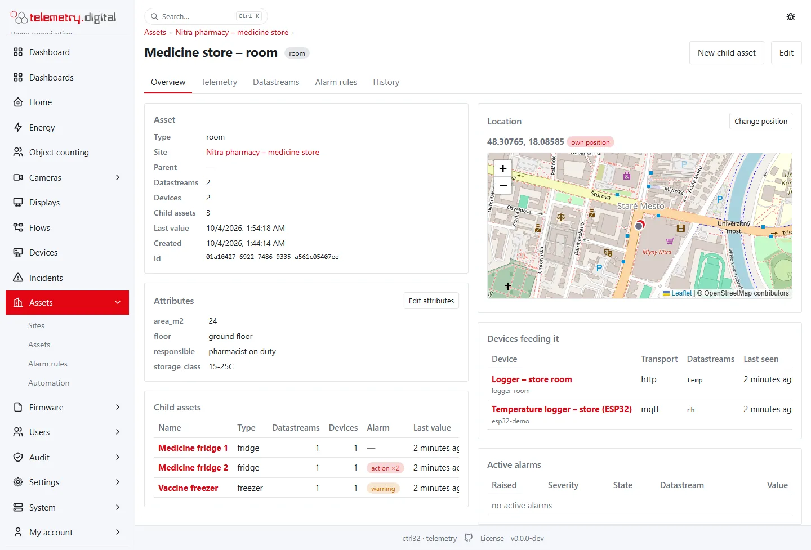
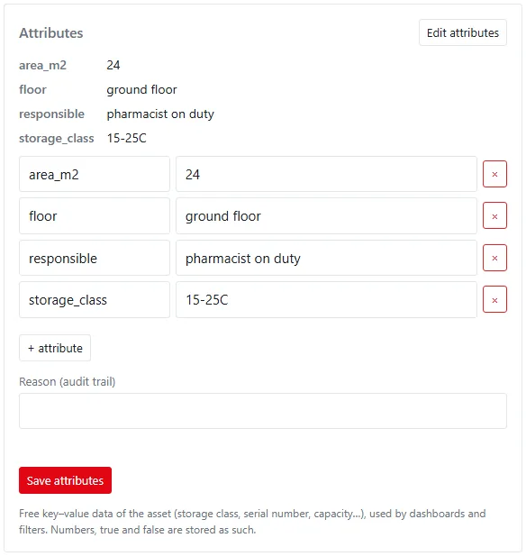
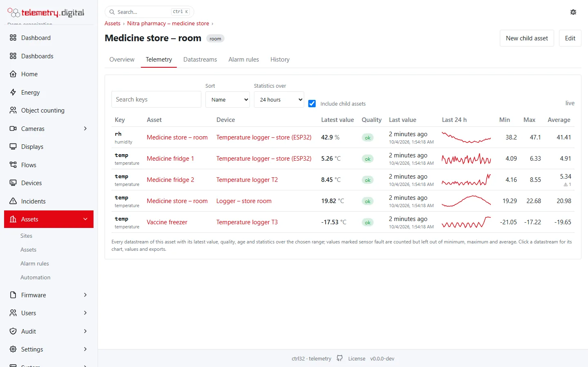
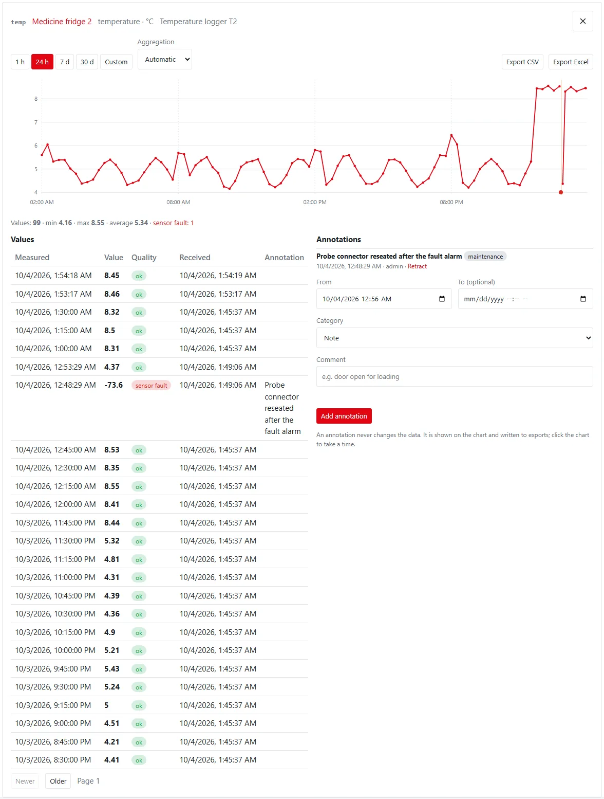
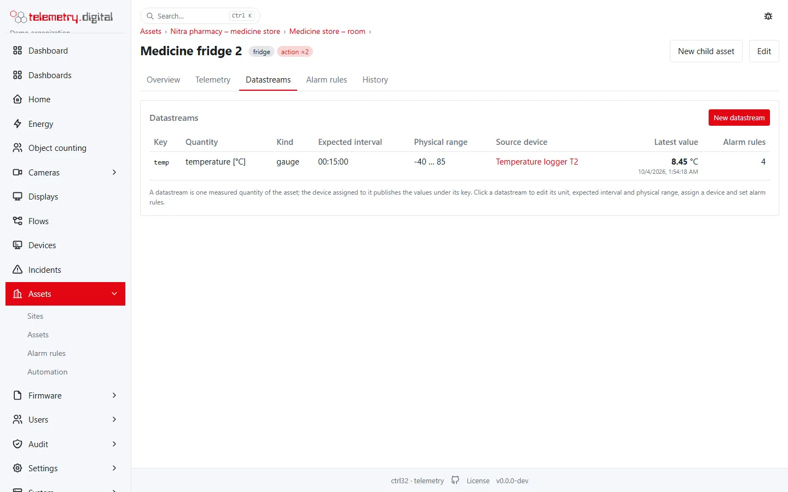
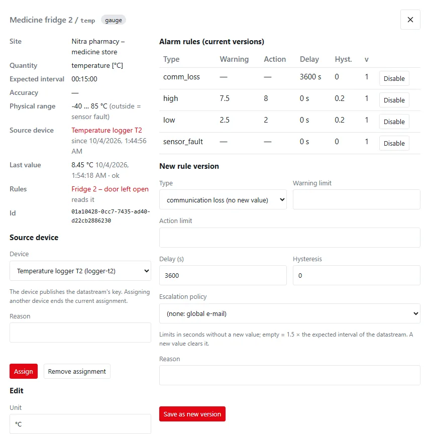
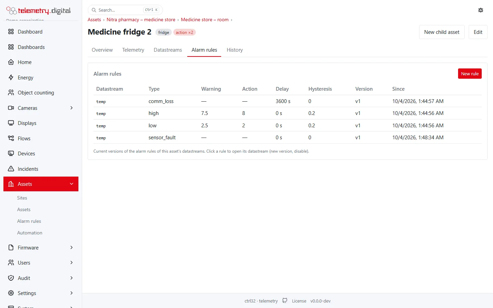
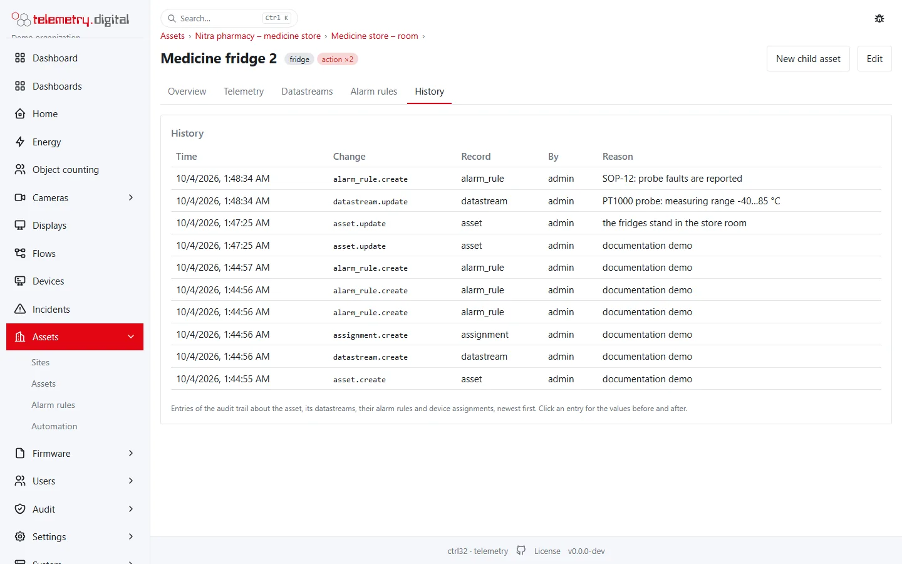
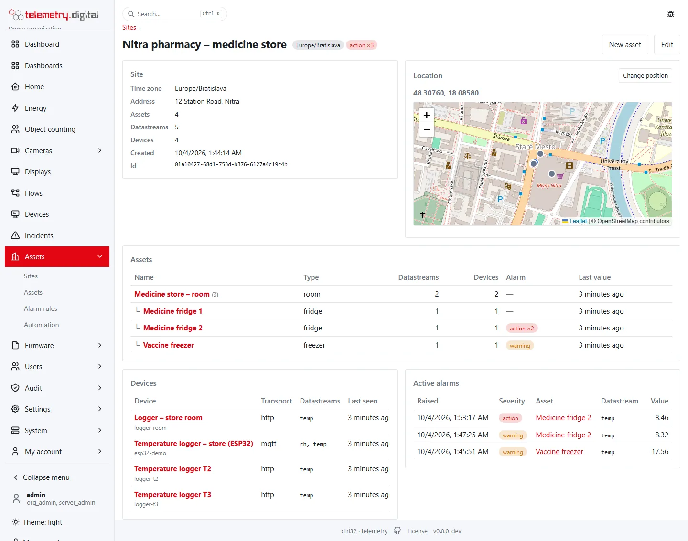

Every asset has its own page with everything that belongs to it: its place in the hierarchy, its attributes and
position, the child assets, the devices that feed it, the active alarms, the values of all its datastreams, the
datastreams themselves, their alarm rules and the history of changes. Every site has a page too: its assets as a
tree, its devices, its alarms and its place on the map.

You open them from the **Assets** and **Sites** lists, from the global search (Ctrl+K), from the breadcrumb of
another asset, from the *Datastreams* and *Telemetry* tabs of a device page, from the alarm rules list, and from
entity tables, overview tables and map pop-ups on dashboards. What sites, assets and datastreams are is described in
[Sites, assets and datastreams](data-model.md).

## Permissions

| What | Permission |
|---|:---:|
| See the lists, the pages, the values and the alarm rules | `data.read` |
| Export the values of a datastream to CSV or Excel | `data.export` |
| Annotate measurements | `data.annotate` |
| The *History* tab | `audit.read` |
| Edit an asset or a site, its attributes and position; new assets, datastreams and alarm rules | `config.write` |
| Assign a device to a datastream or end the assignment | `device.manage` |

Buttons, tabs and forms you have no permission for are not shown. Every change asks for a **reason** and is written
to the audit trail with the values before and after.

## The assets list

**Assets → Assets** is one table over every site of the organization.

| Column | Content |
|---|---|
| Name | the asset, a link to its page; the number of child assets in brackets |
| Type | fridge, room, meter or any other word |
| Site | the site, a link to the site page |
| Parent | the parent asset, a link to its page, or a dash for a top-level asset |
| Datastreams | how many datastreams the asset has |
| Devices | how many devices feed its datastreams now |
| Alarm | the worst active alarm of its datastreams (*warning*, *action* or *critical*, with the count; ✓ when all are acknowledged) |
| Last value | when the newest value of any of its datastreams was measured |

- **Search** finds assets by name, type, site or parent.
- **Site** and **Type** narrow the list. The filters and the search are kept in the address, so a filtered list can
  be bookmarked or sent.
- **Hierarchy** (the default) shows child assets indented under their parents, siblings by name. Click a column
  heading to sort the whole list by it instead (again to reverse); **Hierarchy** goes back.
- Long lists are shown 50 rows a page with **Previous** and **Next**.
- Click a row to open the asset page. **New asset** (with `config.write`) asks for the site, the parent asset (or
  top level), the type, the name and a reason, and opens the new asset's page.

## The sites list

**Assets → Sites** lists the sites with their name, time zone, address, the number of assets and of the devices
feeding them, the worst active alarm and the creation time. **Search** finds sites by name, address or time zone;
click a heading to sort. Click a row for the site page; **Edit** changes the name, the time zone and the address.

## The asset page

The head of the page shows the **breadcrumb** — *Assets › site › parent assets* — so you can climb the hierarchy,
then the name, the type and the worst active alarm. With `config.write` there are two buttons:

- **Edit** — the name, the type and the **parent asset**. The parent can be any asset of the same site or the top
  level; the asset itself and the assets below it are not offered, so the hierarchy never forms a loop. Moving an
  asset moves its child assets with it.
- **New child asset** — a new asset under this one, on the same site.

The page has five tabs: **Overview**, **Telemetry**, **Datastreams**, **Alarm rules** and **History**. Each tab has
its own address (`/assets/<id>/telemetry`), so it can be bookmarked.

### Overview

| Card | Content |
|---|---|
| Asset | type, site, parent, the number of datastreams, devices and child assets, the last value, the creation time and the id (for the API) |
| Attributes | the free key–value data of the asset, such as a storage class or a serial number |
| Child assets | the assets directly below it with their counts, alarm and last value; click a row to open one |
| Location | its position on the map with the devices that have one (green when connected) |
| Devices feeding it | the devices assigned to its datastreams, the keys they feed, last contact and state |
| Active alarms | the alarms of its datastreams that are not cleared: raised, severity, state, datastream and value |

**Edit attributes** opens a key–value editor: change a value, remove a row with ×, add one with **+ attribute**, give
a reason and **Save attributes**. Numbers, `true` and `false` are stored as such (a dashboard key filter can compare
them), anything else as text. The position is kept separately (below), so `lat` and `lon` are not edited here.

**Location.** An asset has either its own position or shows the position of its site (the badge says which). The map
also shows the devices that feed the asset and have a position; their pop-ups link to the device page. **Change
position** (with `config.write`) opens latitude and longitude — or click the map to take a point — with a reason;
**Remove position** goes back to the site's. The map needs map tiles under *Settings → Branding*; without them only
the coordinates are shown.

### Telemetry

The *Telemetry* tab works like the one on the device page, but for the asset: every datastream of the asset with its
latest value and unit, quality, age (*2 minutes ago*, refreshed while you watch), the device that feeds it (a link),
a sparkline of the last 24 hours and the minimum, maximum and average over the chosen range (1 hour, 24 hours,
7 days, 30 days or a custom range). Values arrive live without reloading.

- **Include child assets** (shown when the asset has children) adds the datastreams of every asset below it, with an
  **Asset** column linking each to its own page — the store room shows the temperatures of all its fridges at once.
- Values marked *sensor_fault* are counted but left out of the minimum, maximum and average; a latest value older
  than 1.5 × the expected interval is shown as *stale*.
- Click a datastream for its **chart** (raw values or aggregated per bucket with the min–max band, average, minimum
  or maximum), its **values** page by page with quality, receive time and annotations, its **annotations** (with
  `data.annotate`), and **Export CSV** and **Export Excel** (with `data.export`). An export is written to the audit
  trail against the asset.

### Datastreams

The datastreams of the asset are managed here: key, quantity with unit, kind, expected interval, physical range,
the source device (a link), the latest value and the number of current alarm rules.

**New datastream** (with `config.write`) asks for the key the device publishes, the kind, the quantity, the unit,
the expected interval, the required accuracy, the physical range and a reason; every field is described in
[Sites, assets and datastreams](data-model.md#new-datastream).

Click a datastream for its detail:

- **Source device** (with `device.manage`) — choose the device that publishes the datastream's key and **Assign**;
  assigning another device ends the current assignment, **Remove assignment** ends it without a successor. With the
  four-eyes policy for assignments the change waits for a second person.
- **Edit** (with `config.write`) — unit, expected interval and physical range.
- **Alarm rules** — the current versions with **Disable**, and **New rule version**, filled from the current version
  of the chosen type.

A link of the form `/assets/<asset>/datastreams?ds=<datastream>` opens the page with that datastream's detail; the
global search links datastreams this way.

### Alarm rules

The current versions of the alarm rules of the asset's datastreams: datastream, type, warning and action limit,
delay, hysteresis, version (hover for the reason) and since when. Click a rule to open its datastream (new version,
disable). **New rule** offers the asset's datastreams only. The rule types are described in
[Alarms](../automation/alarms.md).

### History

The entries of the audit trail about the asset, its datastreams, their alarm rules and device assignments, newest
first, 50 at a time (**Older** for more): time, change, record, who and the reason. Click an entry for the values
before and after. The tab needs `audit.read`; the whole trail is under *Audit*.

## The site page

**Assets → Sites → a site** (or the site in a breadcrumb) shows:

| Card | Content |
|---|---|
| Site | time zone, address, the number of assets, datastreams and devices, the creation time and the id |
| Location | the site on the map with its assets and devices that have a position; each pop-up links to the asset or device page |
| Assets | every asset of the site as a tree with its type, counts, alarm and last value; click a row to open one |
| Devices | the devices feeding the datastreams of the site |
| Active alarms | the active alarms of the site with the asset (a link) and the datastream |

With `config.write`, **Edit** changes the name, time zone and address, **New asset** adds a top-level asset to the
site, and **Change position** sets the site's position (assets without their own position show it).

!!! tip "Positions for the map"
    Give the site a position first: every asset without its own position shows the site's. Set a position on an
    asset only when it is somewhere else, for example a tank in the yard.

## Links to the asset and site pages

| Where | What opens |
|---|---|
| The global search (Ctrl+K) | an asset, a site, or the asset page with the datastream's detail |
| The device page, tabs *Datastreams* and *Telemetry* | the asset of each datastream |
| *Automation → Alarm rules* | the asset of a rule; a row opens the rule's datastream on the asset page |
| Dashboards: entity tables and overview tables | the name, asset and site cells (not on public links) |
| Dashboards: the map widget | the assets a device feeds, in the device's pop-up |
| Dashboards: widget actions | *Open the asset page* for the clicked row, marker or chart |

Links of earlier versions (`/assets?site=…&asset=…` and `/assets?ds=…`) open the new pages.
