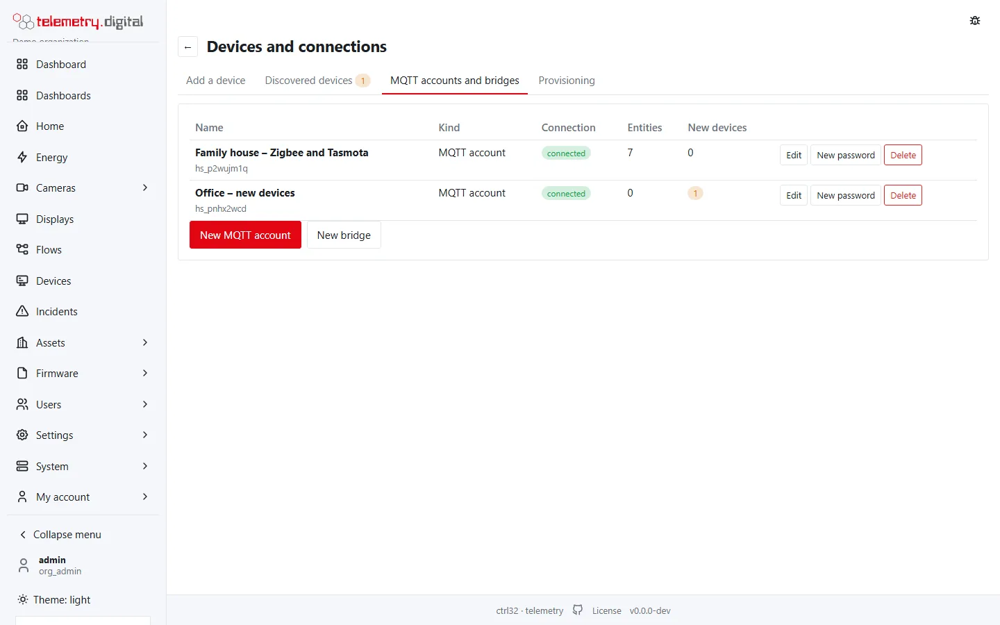
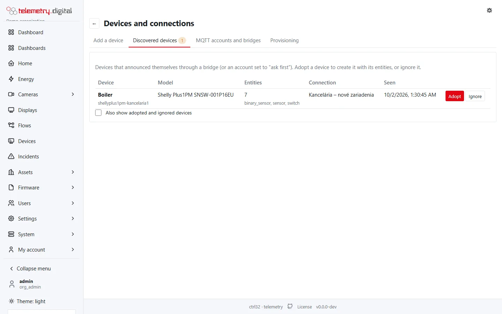

Devices that announce themselves over MQTT are **recognized automatically** — with their rooms and entities —
recorded, controlled from the **Home** page and available in flows. Everything runs inside the server: the MQTT broker,
the automatic device discovery and the bridges. No other home-automation software, Mosquitto or Node-RED is needed
(an existing installation can keep running next to it).

Supported: zigbee2mqtt, Tasmota, ESPHome, Z-Wave JS UI, OpenMQTTGateway, Shelly Gen2 and later, and any device that
publishes the common MQTT discovery format.

## Give the devices an MQTT account

*Devices and connections → Add a device → MQTT account*. The account gets a generated user name (`hs_…`) and a
password shown once (*New password* issues another and disconnects the account's clients). Its devices use whatever
topics they like inside a **private namespace**: two accounts never see each other's
messages.

Ready-to-paste settings:

- **zigbee2mqtt** (`configuration.yaml`): `mqtt.server`, `mqtt.user`, `mqtt.password`, and
  `homeassistant.enabled: true` (that is zigbee2mqtt's own name for publishing discovery messages).
- **Tasmota** (console): `Backlog MqttHost …; MqttPort 1883; MqttUser …; MqttPassword …; SetOption19 1`. Without
  `SetOption19 1` Tasmota's own discovery is understood natively.
- **ESPHome** (YAML): `mqtt:` with `broker`, `username`, `password`, `discovery: true`.
- **Shelly Gen2 and later** (the device's web page, *Settings → MQTT*): enable, server `host:1883`, the account's
  user and password, keep *RPC status notifications* on. Switches, covers, lights (also RGB/RGBW), inputs and power,
  energy, voltage, current, temperature, humidity and battery values are added.

New devices are added automatically, or — with *New devices: ask first* — collected in an inbox for you to adopt or
ignore.

*A device waiting in Discovered devices.*

## Devices already on your own broker

A **bridge** connects the server to your existing broker (for example the Mosquitto of zigbee2mqtt) as a client:
host, port, TLS, user and password (stored encrypted). Discovered devices wait under **Discovered devices** until you
adopt or ignore them. The connection is re-established automatically; its state and last error are shown.

When a bridge — or an account whose devices have entities — stays disconnected longer than the set time (default 10
minutes), an *MQTT connection* incident opens and administrators are notified.

**Publishing values to other systems**: select datastreams in the bridge dialog and they are published to the broker
together with discovery messages, so another system on that broker — for example an existing Home Assistant — shows
them as sensors.

## Entities

A discovered device appears in the room of its suggested area, with one **entity** per announced function: sensor,
binary sensor, switch, light, cover, valve, fan, lock, climate, number, select, text, button, scene, siren,
humidifier, event, device tracker, update.

Every state is recorded as a measurement — numbers every report, other states when they change — so charts,
reports, alarm rules and flows work with them like with any telemetry. Renaming an entity keeps your name even when
the device announces itself again.

Next: [Home page and scenes](../automation/home-and-scenes.md) to control the devices, and
[Energy](../energy/index.md) for their consumption.

!!! note "Not yet supported"
    Shelly Gen1 (`shellies/…`), camera and image entities, and light effects on the cards.
