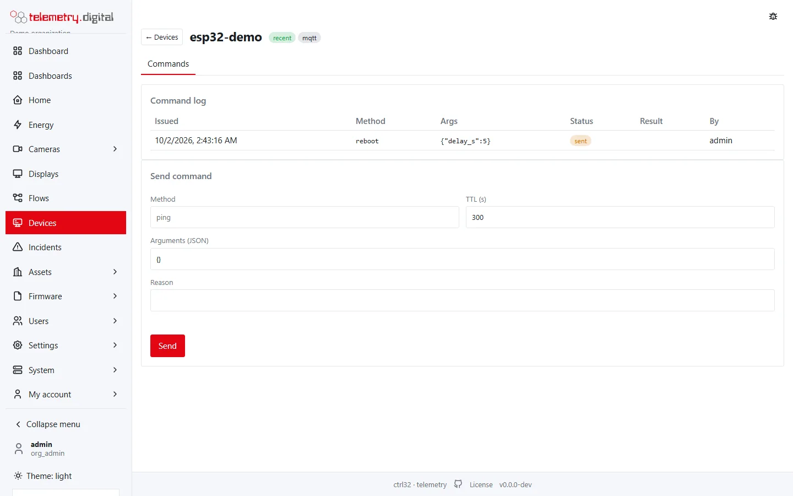
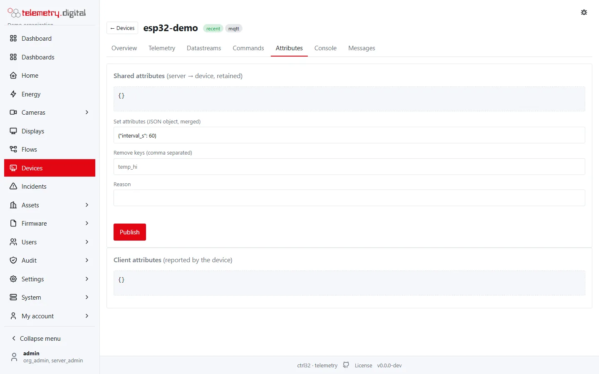
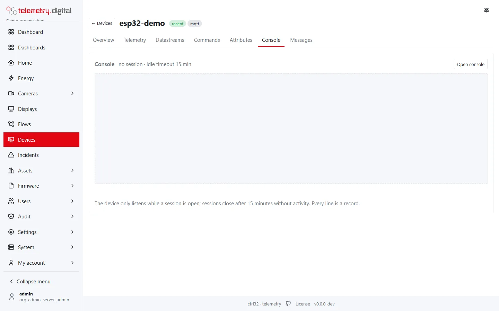
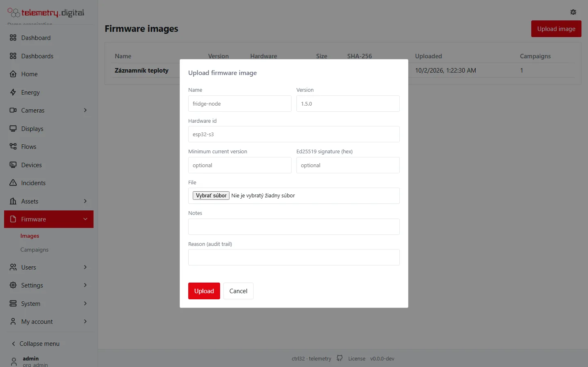
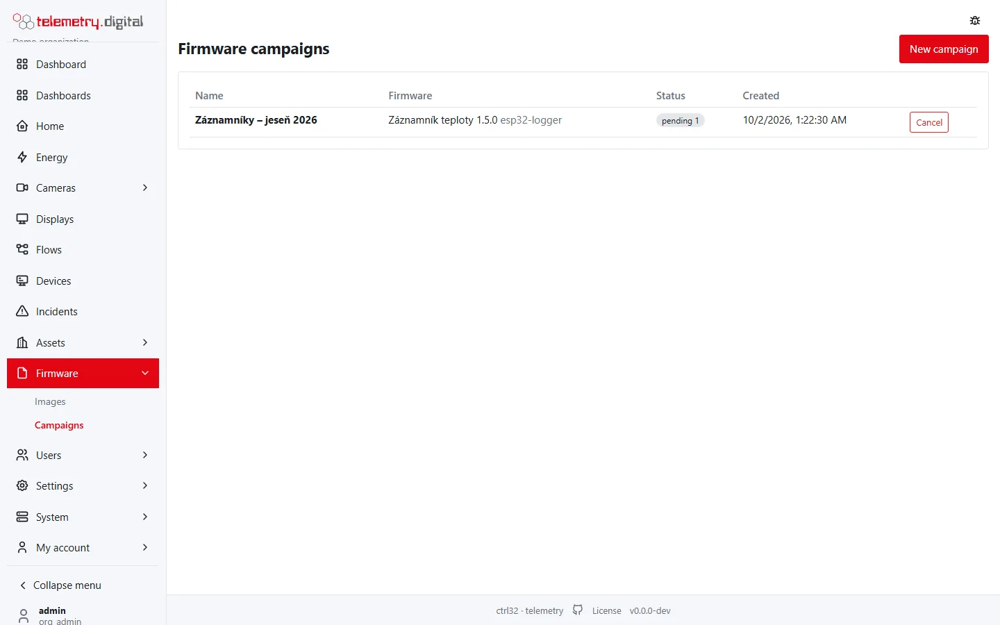

This page explains how commands, shared attributes, the remote console and firmware updates travel between the server
and a device. The controls on the device page are described field by field in [The device page](device-page.md).

## Commands with acknowledgement

A command goes to an MQTT device on `d/{id}/cmd` as `{"id": "…", "m": "<method>", "a": {…}, "exp": <unix time>}`;
devices with ThingsBoard firmware receive the same command as an RPC request. An HTTP device picks it up with
`GET /api/v1/d/cmd?wait=30`. The device answers with the same id on `d/{id}/cmd/ack` (or
`POST /api/v1/d/cmd/{id}/ack`). For OPC UA and Modbus devices the server performs the write itself and reads the value
back.

| Status | Meaning |
|---|---|
| pending | waiting for approval by a second person |
| queued | recorded, not yet delivered |
| sent | published to the device |
| acked | confirmed, with the device's result |
| failed | the device or connector reported an error |
| expired | not acknowledged (or not approved) within the time to live |
| rejected | a second person rejected it |

- Sending a command needs the permission `device.command` and a reason. The time to live is 1 second to 7 days
  (default 300 s), the arguments are JSON of at most 8 KiB.
- With the organization's **four-eyes policy for commands** (*Settings → Security policy*) every command — set point,
  switch, button, connector write — waits as *pending* until a **different** user with `device.command` approves it;
  the device sees only approved commands. A command that expires before approval becomes *expired*.
- Every command, approval and rejection is in the audit trail.

## Shared attributes (configuration)

Shared attributes are the device's configuration kept on the server — for example a reporting interval or a limit.
When someone changes them, the server republishes the whole document **retained** on `d/{id}/attributes/shared`, so a
device that reconnects always gets the current configuration. The document is at most 16 KiB, keys are 1–64
characters. The device reports its own state (firmware, hardware, IP) as **client attributes** on `d/{id}/attributes`,
shown next to the shared ones.

Changing shared attributes needs `device.manage` and a reason; the old and new documents are in the audit trail.

## Remote console

The device page can open a **remote console** — a text channel into the device's firmware (for example
`wifi status`). It is never a shell into the server.

- Needs the permission `device.console`; one open session per device.
- The server switches the shared attribute `console.enabled` on while a session is open and off when it closes, so
  the device listens only during a session.
- Lines to the device go on `d/{id}/console/in` (1–512 bytes, at most 5 lines per second); the device answers line
  by line on `d/{id}/console/out`.
- A session closes on **Close** or after **15 minutes without activity**. Opening a session and every line are
  recorded.

## Firmware updates over the air (FOTA)

**Firmware** in the main menu has two pages, **Images** and **Campaigns**. Seeing them needs `fota.read`; uploading
images and starting or cancelling campaigns needs `fota.manage`.

### Firmware images

**Upload image**:

| Field | Default | Limits | Meaning |
|---|:---:|:---:|---|
| Name | — | required, at most 64 characters | the firmware's name, for example `fridge-node` |
| Version | — | required, 1–32 characters from `A–Z a–z 0–9 . _ + -` | for example `1.5.0` |
| Hardware id | — | required, at most 32 characters | the hardware the image is for, for example `esp32-s3` |
| Minimum current version | — | optional, same format as the version | the device must already run at least this version |
| Ed25519 signature (hex) | — | optional, 64 bytes as 128 hexadecimal characters | the author's signature; the device verifies it |
| File | — | required, at most the configured maximum (16 MiB by default, `max_size_mb` in `config.toml`) | the image |
| Notes | — | at most 500 characters | — |
| Reason (audit trail) | — | required | — |

The same name, version and hardware id can be uploaded only once. The list shows each image's name (with a *signed*
badge), version, hardware, size, SHA-256 (first 12 characters, the whole hash as a tooltip), upload time (the uploader
as a tooltip) and the number of campaigns.

### Campaigns

**New campaign**:

| Field | Default | Limits | Meaning |
|---|:---:|:---:|---|
| Firmware | — | required | one of the uploaded images |
| Name | `<name> <version> <date>` | at most 64 characters | — |
| Devices | none | 1–1000 active devices | tick the devices; each shows its transport, reported firmware and whether it is online |
| Reason (audit trail) | — | required | — |

**Start campaign** publishes a **retained target** on `d/{id}/fota/target` to every selected MQTT device — the version,
hardware id, size, SHA-256, minimum version, signature and the download address. The message says how many devices
were targeted and how many were notified.

The campaign list shows the name (*closed* when cancelled), firmware and hardware, a count per target status, the
creation time and **Cancel**. Clicking a campaign opens its detail, refreshed every 3 seconds: for each device its
status, a progress bar, the version it reported, its current firmware, an error and the time of the last update.

| Target status | Meaning |
|---|---|
| pending | the device has not started yet |
| downloading | the device is downloading the image (resumable, with its own token) |
| verifying | the device is checking the SHA-256 and the signature |
| applying | the device is installing the image into its second slot |
| updated | the device runs the new version |
| failed | the update failed; the error is shown |
| rolled_back | the device did not confirm the new version and went back to the old one |
| cancelled | the campaign was cancelled before the device finished |

The device reports progress on `d/{id}/fota/status` (or `POST /api/v1/d/fota/status`) with
`{"fw_id", "st", "pct", "ver", "err"}`. Only devices targeted by an open campaign can download the image.

**Cancel** (with a reason) closes the campaign, marks unfinished targets *cancelled* and clears the retained target on
every device. Every campaign and its cancellation are in the audit trail.

!!! note "Device side"
    FOTA, the console and command handling need support in the device's firmware. The client libraries for Arduino
    and ESP-IDF implement them; other devices follow the device protocol. A campaign targets the devices you tick —
    there is no automatic staged rollout; start a campaign for a few devices first, then another for the rest.
