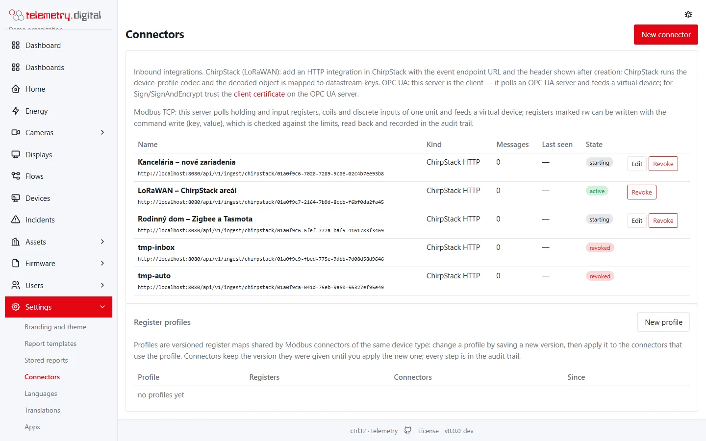
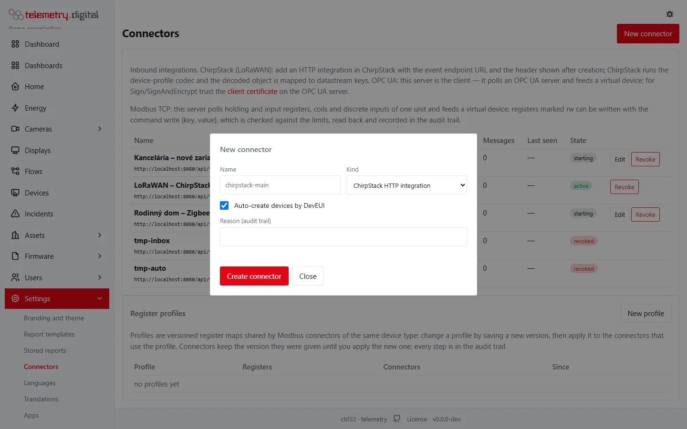

A **connector** is the server reaching out to a device that does not send data on its own — a PLC with an OPC UA
server, a controller with Modbus TCP — or receiving data from a LoRaWAN network server (ChirpStack). Connectors are set
up under **Settings → Connectors**. Each connector feeds a device, so datastreams, alarms, gaps, dashboards and
reports work exactly as with MQTT devices.

Connectors need the permission `config.write`. Every create, change and revocation asks for a **reason** and is in
the audit trail.

## The connector list

| Column | Content |
|---|---|
| Name | the connector's name and its address: the OPC UA endpoint, `host:port unit N` for Modbus, the ingest URL for ChirpStack; for Modbus also the register profile and version, with a warning when a newer version is available |
| Kind | OPC UA client, Modbus TCP client or ChirpStack HTTP |
| Messages | number of messages received (ChirpStack) |
| Last seen | time of the last message (ChirpStack) |
| State | see below |
| Actions | **Edit** (OPC UA and Modbus), **Revoke** |

| State | Meaning |
|---|---|
| active | a ChirpStack connector that accepts messages |
| starting | the poller has not reported yet |
| connecting | the poller is connecting |
| connected | polling works; the last poll time, the number of polls and the number of unreadable nodes or registers are shown, the last values as a tooltip |
| error | the connection failed; the last error is shown |
| stopped | the poller stopped |
| revoked | the connector was revoked |

**Revoke** asks for a reason and stops the connector for good; a revoked ChirpStack connector refuses its secret.

## New connector

| Field | Default | Limits | Meaning |
|---|:---:|:---:|---|
| Name | — | required, 1–64 characters, unique; cannot be changed later | identifies the connector |
| Kind | ChirpStack HTTP integration | ChirpStack HTTP integration, OPC UA client (polling), Modbus TCP client (polling); cannot be changed later | which fields follow |
| Reason (audit trail) | — | required | why you made the change |

## ChirpStack (LoRaWAN)

LoRaWAN sensors come in through a **ChirpStack** network server, which decodes their frames with the codec of the
device profile.

| Field | Default | Meaning |
|---|:---:|---|
| Auto-create devices by DevEUI | on | an uplink from an unknown DevEUI creates a device of transport `lorawan` (external id = the DevEUI in lower case, name from ChirpStack or `LoRaWAN <DevEUI>`); when off, such uplinks are refused |

After **Create connector** the dialog shows what to enter in **ChirpStack → Applications → Integrations → HTTP**:

- the **event endpoint URL**, `…/api/v1/ingest/chirpstack/<connector id>?event=up`;
- the header `Authorization: Bearer c32c_…` — the secret is **shown once**.

What the server does with the events:

| Event | Effect |
|---|---|
| up | the decoded object becomes telemetry with the ChirpStack time; RSSI, SNR, frame counter and gateway of the best reception are stored in the device status |
| status | battery level and link margin are stored in the device status |
| other events (join, ack, …) | kept as raw messages of the device |

An uplink without a decoded object (no codec in the device profile) is kept as a raw message. Requests are at most
256 KiB and rate limited; a wrong secret is refused. ChirpStack connectors have no editable settings.

## OPC UA client

The server is the OPC UA client: it connects to an OPC UA server, reads the listed nodes every N seconds and feeds a
virtual device.

| Field | Default | Limits | Meaning |
|---|:---:|:---:|---|
| Endpoint | — | required, `opc.tcp://host:port/path` | the OPC UA server |
| Security policy | None | None, Basic256Sha256, Basic256, Basic128Rsa15, Aes128_Sha256_RsaOaep, Aes256_Sha256_RsaPss | message security |
| Security mode | None | None, Sign, SignAndEncrypt | policy None requires mode None and vice versa |
| Authentication | anonymous | anonymous, username and password | how the server signs in |
| Username | — | required for username authentication | — |
| Password | — | blank keeps the stored one | stored with the connector |
| Polling interval (s) | 10 | 1–3600 | how often the nodes are read |
| Virtual device id | `opcua-<name>` | — | external id of the device that receives the values (created automatically with transport `opcua` and the name `<connector> (OPC UA)`) |
| Nodes | — | 1–500 lines | what to read, see below |

Each node is one line `node id | key | scale | offset | rw | min | max`:

| Part | Required | Meaning |
|---|:---:|---|
| node id | yes | `ns=<n>;i=<number>`, `ns=<n>;s=<string>`, `ns=<n>;g=<guid>` or `ns=<n>;b=<base64>` (the `ns=` part may be omitted) |
| key | yes | the datastream key, `^[a-z][a-z0-9_]{0,31}$`, unique in the connector |
| scale | no | the read value is multiplied by it |
| offset | no | added after scaling |
| rw | no | `rw` marks a writable node |
| min, max | no | limits of a written value (scaled); min must not exceed max |

Numbers are scaled; booleans and strings are stored as they are, times as ISO text.

**Test connection** connects with the current form values, reads the nodes once and disconnects. It shows the
security that was used, each key with its value and the nodes that could not be read. Use it before saving.

For **Sign** or **SignAndEncrypt** the server uses its own client certificate (application URI
`urn:ctrl32:telemetry:opcua-client`). Download it with the link *client certificate* on the Connectors page and trust
it on the OPC UA server.

Nodes that cannot be read are reported, not fatal. A lost connection is retried after 5 seconds, then 10, 20, … up to
about a minute.

!!! note "The server must reach the PLC"
    With OPC UA and Modbus the server is the client. A server in a data centre cannot reach a PLC behind a NAT —
    install the server at the site (see [Cloudflare Tunnel](../getting-started/cloudflare-tunnel.md)) or connect the
    site with WireGuard.

## Modbus TCP client

The server polls holding and input registers, coils and discrete inputs of one unit — a Modbus TCP device or RTU
devices behind a Modbus TCP gateway — and feeds a virtual device.

| Field | Default | Limits | Meaning |
|---|:---:|:---:|---|
| Host | — | required, host name or IP address, no `/`, `:` or spaces | the device or gateway |
| Port | 502 | 1–65535 | — |
| Unit id | 1 | 1–255 (0 is treated as 1) | the Modbus unit (slave) address |
| Polling interval (s) | 10 | 1–3600 | how often the registers are read |
| Timeout (ms) | 2000 | 100–30 000 | per request |
| Framing | Modbus TCP | Modbus TCP, RTU over TCP (gateway) | RTU over TCP for serial devices behind a transparent gateway |
| Byte order | big (ABCD) | big (ABCD), big words swapped (CDAB), little (DCBA), little words swapped (BADC) | order of 32- and 64-bit values |
| Virtual device id | `modbus-<name>` | — | external id of the device that receives the values (created automatically with transport `modbus` and the name `<connector> (Modbus)`) |
| Register profile | (registers below) | an active profile | take registers and byte order from a profile; the register field becomes read-only |
| Registers | — | 1–500 lines | what to read, see below |

Each register is one line `key | table | address | type | scale | offset | rw | min | max`:

| Part | Default | Meaning |
|---|:---:|---|
| key | — | the datastream key, `^[a-z][a-z0-9_]{0,31}$`, unique in the connector |
| table | holding | holding, input, coil or discrete |
| address | — | 0-based; the value with all its words must fit up to 65535 |
| type | int16 (registers), bool (coils, discrete) | int16, uint16, int32, uint32, float32, int64, uint64, float64 for registers (1, 2 or 4 words); bool only for coils and discrete inputs |
| scale | — | multiplier, must not be 0 |
| offset | — | added after scaling |
| rw | — | `rw` marks a writable register; only holding registers and coils can be writable |
| min, max | — | limits of a written value (scaled); min must not exceed max |

**Test connection** reads all registers once and shows the address, the unit, each key with its value and the
registers that could not be read.

### Register profiles

Devices of the same type share a **register profile** — a versioned register map. The section **Register profiles**
below the connector list shows each profile with its version, description, number of registers (and writable ones),
the connectors using it (with a warning when some use an older version) and since when.

| Field | Default | Limits | Meaning |
|---|:---:|:---:|---|
| Name | — | required, at most 64 characters, unique; fixed after creation | for example the device model |
| Byte order | big | big, big_swap, little, little_swap | as in the connector |
| Description | — | at most 200 characters | — |
| Registers | — | 1–500 lines, same format as in the connector | the register map |
| Changelog | — | at most 500 characters, only for a new version | what changed |
| Reason (audit trail) | — | required | — |

- **New version** saves the changed map as the next version. Connectors keep the version they were given.
- **Apply to connectors** (shown when connectors use an older version) moves every connector of the profile to the
  current version, with a reason; each connector change is audited.
- **Retire** ends a profile that no connector uses any more.

## Writing values

Writing to an OPC UA node or a Modbus register is a **command** with the method `write` and the arguments
`{"key": "…", "value": …}`:

- it needs the permission `device.command` and a reason;
- the key must exist and be marked `rw`; the value must fit the type (a number, `true`/`false` for coils and boolean
  nodes) and lie within min/max — this is checked **before** anything is recorded or written;
- after the write the server reads the value back, and the command is *acked* with the read-back value or *failed*
  with the error;
- everything is in the audit trail, and with the four-eyes policy for commands a second person approves the write
  first.

Writes can come from dashboard control widgets (knob, slider, switch), process screens, flows, automation rules and
the *Commands* tab of the device page (see [The device page](device-page.md)).

!!! danger "Set points, not safety"
    Use writes to change set points and modes. Never rely on them for anything safety-related: the server is not in
    the control loop and a write can be refused or fail.
