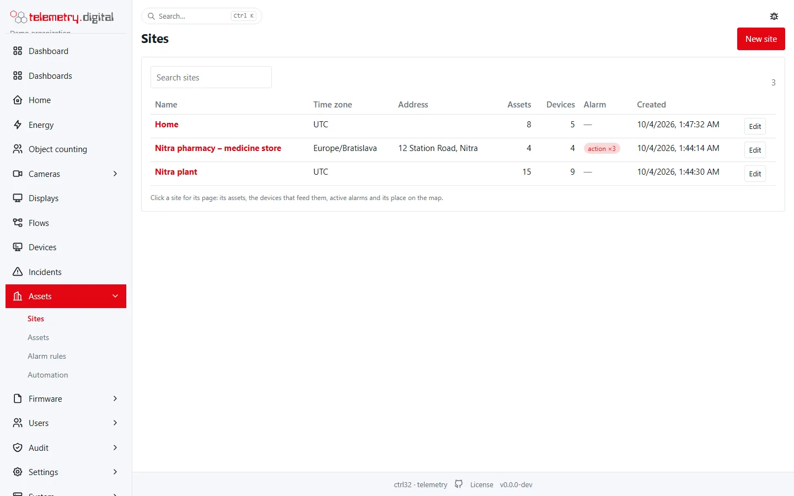
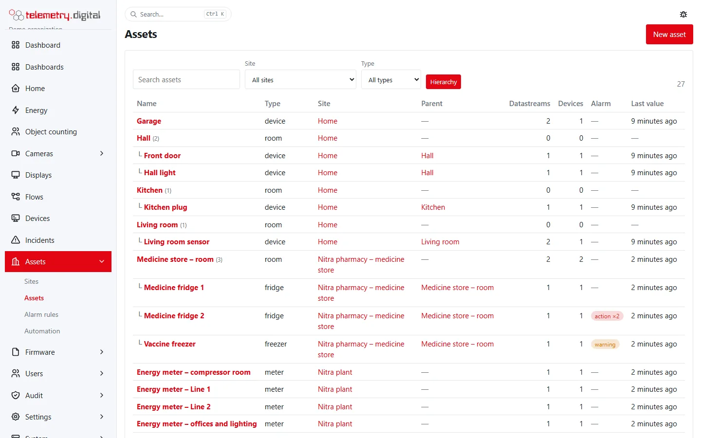
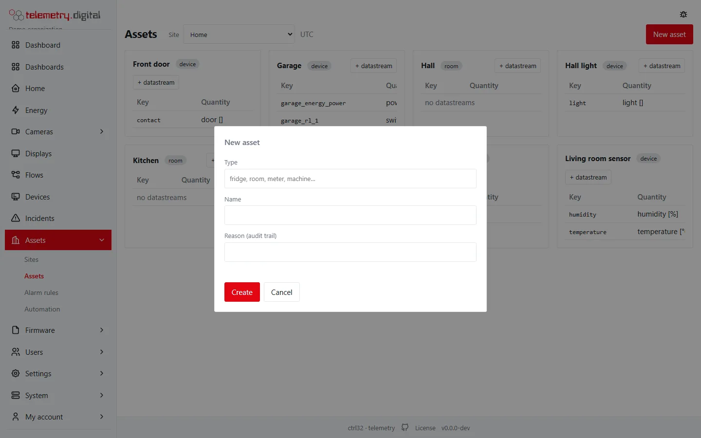

Measurements are not stored "per device" but per **datastream**. A datastream belongs to an **asset** (a fridge, a
room, a meter, a machine), an asset belongs to a **site** (a building, a plant, a branch). A device only *feeds*
datastreams: when you replace a broken sensor, you assign the same datastreams to the new device and the history
continues without a break.

Assets can contain other assets — a store room holds fridges, a hall holds machines — so a site carries a tree of
assets:

```text
site ─┬─ asset (room) ─┬─ datastream (key temp)   ◄── fed by device A since 2026-03-01
      │                └─ asset (fridge) ─── datastream (key temp) ◄── fed by device B
      └─ asset (meter) ─── datastream (key energy) ◄── fed by connector "modbus-meter"
```

All of it lives under **Assets** in the main menu, with the sub-pages **Sites**, **Assets**, **Alarm rules** and
**Automation** (automation rules are described in [Alarms, notifications and incidents](../automation/alarms.md)).
Every asset and every site has its own page — see [The asset and site pages](asset-page.md).

## Who can do what

| Action | Permission |
|---|:---:|
| See sites, assets, datastreams, alarm rules and values | `data.read` |
| Create and edit sites, assets, datastreams and alarm rules; attributes and positions | `config.write` |
| Assign a datastream to a device, remove an assignment | `device.manage` |
| The history of an asset | `audit.read` |

Every change asks for a **reason** (at most 200 characters) and is written to the audit trail with the old and new
values. With the four-eyes policy (see [Approvals](#four-eyes-approval)) alarm limits and assignments wait for a second
person.

## Sites

**Assets → Sites** is a table of the sites with their name, time zone, address, the number of assets and of the
devices feeding them, the worst active alarm and the creation time; click a row for the
[site page](asset-page.md#the-site-page). **New site** and **Edit** open the same dialog.



| Field | Default | Limits | Meaning |
|---|:---:|:---:|---|
| Name | — | required, 1–128 characters, unique in the organization | the name shown everywhere |
| Time zone | `Europe/Bratislava` in the form, `UTC` when sent empty | IANA name, letters, digits and `_ + - /`, at most 64 characters | local time of the site, used for day boundaries in reports and period tables |
| Address | — | at most 200 characters | free text, shown next to the site |
| Reason (audit trail) | — | required, at most 200 characters | why you made the change |

A site cannot be deleted from the interface. Its **position** for the map is set on the site page (*Change
position*, with a reason); assets without a position of their own show the site's.

## Assets

**Assets → Assets** is a table of every asset: name, type, site, parent asset, the number of datastreams and of the
devices feeding them, the worst active alarm and the time of the last value. Search, filter by site and type, show
the hierarchy or sort by a column; click a row for the [asset page](asset-page.md), where the datastreams, alarm
rules, attributes and position of the asset are managed.





| Field | Default | Limits | Meaning |
|---|:---:|:---:|---|
| Site | the site chosen in the filter | required | where the asset is |
| Parent asset | (top level) | an asset of the same site | the asset it belongs to, for example the room a fridge stands in |
| Type | — | required, at most 32 characters, stored in lower case | what the asset is; suggestions: fridge, freezer, room, meter, machine, building, vehicle — any word is allowed |
| Name | — | required, 1–128 characters, unique on the site | the name shown in dashboards, reports and alarms |
| Reason (audit trail) | — | required | why you made the change |

!!! note "Create a site first"
    The **New asset** button appears only when a site exists and your role has `config.write`.

On the asset page, **Edit** changes the name, the type and the parent asset (never the asset itself or an asset
below it, so the tree cannot loop), **Edit attributes** the free key–value data of the asset, and **Change
position** its place on the map; each with a reason.

## Datastreams

A datastream is one measured or reported value of an asset — the temperature of a fridge, the active energy of a
meter, the state of a door.

### New datastream

**New datastream** is on the *Datastreams* tab of the asset page.

| Field | Default | Limits | Meaning |
|---|:---:|:---:|---|
| Key (what the device publishes) | — | required, `^[a-z][a-z0-9_]{0,31}$`: a lower-case letter, then letters, digits or `_`, at most 32 characters; unique on the asset | the key in the device's telemetry, for example `temp` |
| Kind | gauge | gauge, counter, state, event | how the value behaves (see below) |
| Quantity | — | required, at most 64 characters, stored in lower case | what is measured; suggestions: temperature, humidity, energy_active_import, power_active, pressure, state, co2 |
| Unit | — | at most 16 characters | shown after the value, for example `°C`, `kWh`, `%` |
| Expected interval (gap detection) | — | at most 32 characters, a duration such as `5 minutes`, `30 seconds`, `1 hour` | how often a value should arrive; empty means no gap detection and no *stale* marking |
| Required accuracy | — | any number | the accuracy the measurement must have, recorded with the datastream |
| Physical range from, to | — | numbers, *from* below *to*; empty = no limit | what the sensor can measure at all (see below) |
| Reason (audit trail) | — | required | why you made the change |

| Kind | Use it for |
|---|---|
| gauge | an instantaneous value: temperature, pressure, power |
| counter | a value that only grows: an energy or water meter reading |
| state | a discrete state: on/off, open/closed, a mode |
| event | something that happened at a moment: a button press, a trip |

!!! tip "The expected interval makes missing data visible"
    With an expected interval, data that does not arrive becomes a visible **gap** in charts and reports instead of a
    silent hole. A gap opens when no value has arrived for 1.5 × the expected interval, and closes when data resumes
    or is backfilled, and the last value is shown as *stale* after the same time. Set it to the device's reporting
    period.

### Datastream detail

Clicking a datastream on the *Datastreams* tab of the asset page opens its detail:

- **Site**, **Quantity** with unit, **Expected interval** (or "no gap detection"), **Accuracy**, **Physical range**
  (or "not set").
- **Source device** — the device that currently feeds the datastream and since when, with a link to the device, or
  "none". With `device.manage` the form **Source device** assigns a device or ends the assignment, with a reason.
- **Last value** — value, unit, measurement time and its **quality**.
- **Rules** — automation rules that read the datastream or derive (write) it, with their state.
- **Id** — the datastream's identifier, for the API.
- **Edit** (with `config.write`): change **Unit**, **Expected interval** and the **Physical range** (*from* and
  *to*; empty = no limit), with a reason. The key, the kind and the asset cannot be changed after creation.

The **physical range** is what the sensor can measure at all — for example −40 to 85 °C for a PT1000 probe. It is
not an alarm limit: a value outside it cannot be a real reading, so it is stored with the quality *sensor_fault*.

#### Quality of a value

| Quality | Meaning |
|---|---|
| ok | a normal measurement |
| backfilled | a value replayed from the device's offline buffer (`bf: 1`) |
| clock_suspect | the device's time stamp was more than 5 minutes in the future |
| sensor_fault | the device marked the value as faulty (`fault` in its telemetry), or the value is outside the datastream's physical range |
| out_of_range | set by [object counting](../object-counting/index.md): more departures than arrivals would make an occupancy negative, so the stored value is kept at zero and flagged |
| stale | never stored: the **last value** is shown as *stale* when it is older than 1.5 × the datastream's expected interval |
| simulated | a simulated value |

**Stale values.** With an expected interval, the last value of a datastream that stopped sending is shown as *stale*
on the device page (*Telemetry* tab), in dashboard widgets, in overview tables and on public links, so an old number
is not taken for a current one. It uses the same tolerance as gap detection (1.5 × the expected interval) and is
worked out when the value is shown: the stored measurement keeps its own quality, and a value marked *sensor_fault*
keeps that mark. Without an expected interval a value never becomes stale. To be notified when data stops, use the
alarm rule *comm_loss* (see [Alarm rules](#alarm-rules-limits)).

A value has one quality. *sensor_fault* wins over the others, because the value is not a reading at all; a
backfilled value from a faulty sensor still counts as backfilled for gaps and retrospective alarms. Values with
*sensor_fault* are kept and exported, marked in red on charts, left out of minimum, maximum and average, and skipped
by the value alarm rules (see [Sensor faults](../automation/alarms.md#sensor-faults)).

## Alarm rules (limits)

Limits are **alarm rules** on a datastream. They are versioned: saving a rule of the same type on the same datastream
closes the current version and creates the next one, so you always know which limits applied when.

You create them in two places:

- **Assets → Alarm rules → New rule** — choose any datastream.
- The datastream detail → **New rule version** — for the open datastream; the form starts from the current version
  of the chosen type (limits, delay, hysteresis and escalation policy).

| Field | Default | Limits | Meaning |
|---|:---:|:---:|---|
| Datastream | — | required | the datastream the rule watches (only in **New rule**) |
| Type | high | see the table below | what the rule detects |
| Warning limit | — | a number | first, lower severity limit |
| Action limit | — | a number | second, higher severity limit; types high, low and low_battery need at least one of the two limits |
| Delay (s) | 0 | 0–604 800 (7 days) | how long the condition must last before the alarm is raised |
| Hysteresis | 0 | ≥ 0 | how far back the value must return before the alarm clears, so a value hovering at the limit does not flap |
| Escalation policy | none (global e-mail) | an active policy of the organization | who is notified and when (see [Alarms, notifications and incidents](../automation/alarms.md)) |
| Reason (audit trail) | — | required | why you made the change |

| Type | Detects |
|---|---|
| high | the value is at or above the warning limit (severity *warning*) or the action limit (severity *action*) |
| low | the value is at or below the warning limit (severity *warning*) or the action limit (severity *action*) |
| low_battery | the battery level is at or below the limits (in the datastream's unit, % or V) |
| power_loss | the value is 0 (false): the power supply failed; no limits |
| door_open | the value is other than 0 (true): a door is open; the delay is how long it may stay open; no limits |
| comm_loss | no new value for longer than the limits in seconds; without limits 1.5 × the expected interval |
| sensor_fault | a value with the quality *sensor_fault*; no limits; the next value with another quality clears it |

An alarm of type high clears when the value falls below the limit minus the hysteresis; an alarm of type low clears
when it rises above the limit plus the hysteresis.

Every type is described with examples in [Alarms](../automation/alarms.md). A rule the server could not evaluate
as given is refused when saved: limits or hysteresis on *power_loss*, *door_open* and *sensor_fault*, and hysteresis
on *comm_loss*.

**Assets → Alarm rules** lists the current versions: asset (a link to its page), datastream, type, warning, action,
delay, hysteresis, version (the reason as a tooltip) and since when. Clicking a row opens the datastream on the page
of its asset; the *Alarm rules* tab of an asset page lists the rules of that asset only. In the datastream detail,
**Disable** closes the current version of a rule (with a reason); the rule stops applying, its history stays.

## Assigning datastreams to devices

On the device page, tab **Datastreams**, you assign the datastreams a device feeds (see
[The device page](device-page.md)); the other way round, the datastream detail on the asset page assigns a device to
one datastream:

- Each key the device publishes must match the key of an assigned datastream; other keys are kept as raw messages
  with the status *unknown key*.
- A datastream has one source at a time. Assigning it to another device **closes the previous assignment**; the
  message says "assigned (previous source closed)".
- **Remove** ends an assignment (with a reason). The history of values stays with the datastream.

## Four-eyes approval

Under **Settings → Security policy** an administrator (`user.admin`) can switch on four-eyes approval separately for
commands, limits and assignments. Then:

- a new alarm rule version or disabling a rule (limits),
- assigning or removing a datastream (assignments),

is recorded as a **change request** — "waiting for approval by a second person" — and takes effect only after a
different user approves it under **Settings → Approvals**.
