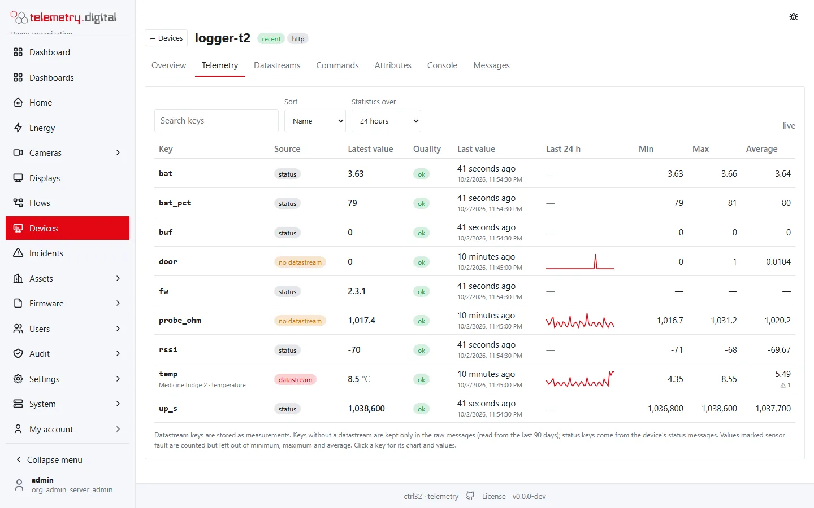
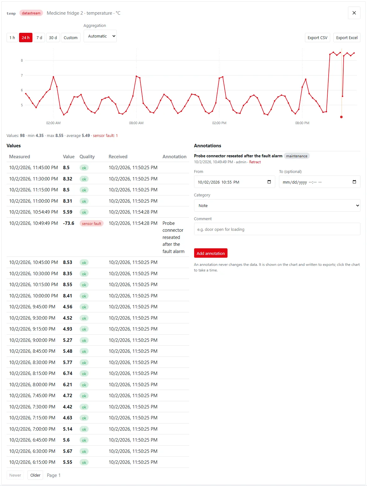
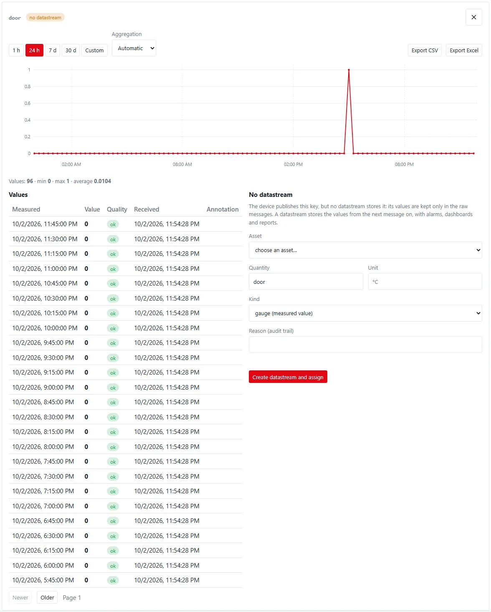

**Devices** in the main menu lists every device of the organization; clicking one opens its page with seven tabs:
**Overview**, **Telemetry**, **Datastreams**, **Commands**, **Attributes**, **Console** and **Messages**. This page
describes every field and button.

## Permissions

| What | Permission |
|---|:---:|
| See devices, their values (*Telemetry*), commands, attributes and messages | `data.read` |
| Export the values of one key to CSV or Excel | `data.export` |
| Annotate measurements | `data.annotate` |
| Create, rename, place, issue tokens, revoke; assign datastreams; create a datastream for a key; set shared attributes | `device.manage` |
| Send, approve and reject commands | `device.command` |
| Open the remote console | `device.console` |

Buttons and forms you have no permission for are not shown. Every change asks for a **reason** (at most 200
characters) and is written to the audit trail.

## The device list

| Column | Content |
|---|---|
| Device | the external id |
| Name | the display name |
| Transport | `mqtt`, `http`, `lorawan`, `opcua`, `modbus` or `mqtt_discovery` (a device found by automatic device discovery) |
| Last seen | time of the last contact, or — |
| Firmware | the firmware version the device reports (`fw` in its status) |
| State | see below |

| State | Meaning |
|---|---|
| online | the device has an open MQTT session right now |
| recent | no session, but the last contact was less than 15 minutes ago (HTTP, LoRaWAN and connector devices have no session) |
| offline | the last contact was 15 minutes ago or more |
| never connected | the device has not sent anything yet |
| revoked | the device was revoked |

**Revoked devices** (a collapsed section under the list, with their number) keeps revoked devices as records: their
credentials no longer work and they leave the active list. They can be removed only on the server, with the audited
command `admin purge`.

## New device

**New device** (with `device.manage`):

| Field | Default | Limits | Meaning |
|---|:---:|:---:|---|
| External id (MQTT client id / DevEUI / endpoint) | — | required, 1–64 characters, no spaces and no `/`, `#`, `+`; unique in the organization | the device's identity: its MQTT user name and the `{id}` in its topics |
| Name | the external id | at most 128 characters | the display name |
| Transport | MQTT | MQTT, HTTP, LoRaWAN, OPC UA, Modbus | how the device delivers data |
| Reason (audit trail) | — | required | why you created it |

After **Create** the dialog shows:

- a **claim code** — 12 characters, valid **24 hours**, usable once. The device exchanges it for its token with
  `POST /api/v1/provision` and `{"claim": "…"}`.
- a connection hint with the host, the port (8883 with TLS, otherwise 1883), the user name and the telemetry topic.
- **Issue a token now instead** — for devices you configure by hand; the token is shown **once**.

LoRaWAN, OPC UA and Modbus devices are usually created by their connector, not by hand (see
[Connectors](connectors.md)).

## Overview

The header shows the external id, the state badge and the transport.

### Device information

| Item | Content |
|---|---|
| Name | the display name |
| Created | when the device was registered |
| Last message | time of the last raw message |
| Messages 24 h | number of raw messages in the last 24 hours |
| Firmware | the reported firmware version, or — |
| Id | the internal identifier, used in the API |

**Rename** (with `device.manage`): a new name (at most 128 characters) and a reason.

### Credentials

The last 20 credentials of the device:

| Column | Content |
|---|---|
| Kind | `claim` (claim code), `token` (device token) or `cert` (certificate) |
| Issued | when it was issued |
| Valid to | expiry (claim codes: 24 hours), or — |
| State | active, used (a claim code already exchanged) or revoked |

Below the table, with a **reason**:

- **Issue / rotate token** — issues a new token and **revokes all previous tokens** of the device. The token is shown
  once, together with the connection hint (host, port, user name, telemetry topic); the server stores only its
  hash. Devices still using an old token are refused from now on.
- **Revoke device** — after a confirmation the device and all its credentials stop working immediately and an open
  MQTT session is disconnected. The device moves to *Revoked devices*. This cannot be undone in the interface.

### Reported status

The status document the device last reported (heartbeat on `d/{id}/status` or `POST /api/v1/d/status`): for example
battery, signal, uptime, firmware; LoRaWAN devices add `rssi`, `snr`, `fcnt` and, from status events, `battery` and
`margin`; provisioned devices `provisioned_at` and `provisioned_by`.

### Location

A device either has a **fixed position** set here or **reports** one — with the telemetry keys `lat`/`lon` (or
`latitude`/`longitude`) or in its status. A fixed position always wins over reported ones; positions appear on map
widgets. The current position is shown with its source (*fixed* or *reported*) and time, or "no position yet".

| Field | Limits | Meaning |
|---|:---:|---|
| Latitude | −90 to 90 | decimal degrees |
| Longitude | −180 to 180 | decimal degrees |
| Pick on map | — | opens a map; a click fills both fields (needs map tiles set under **Settings → Branding and theme**) |
| Reason (audit trail) | required | why you changed it |

- **Save fixed position** stores the position as *fixed*.
- **Use reported position** forgets the fixed position; reported positions apply again.

Reported positions of exactly 0, 0 are ignored.

## Telemetry

The **Telemetry** tab shows everything the device sends, in one table: every key it has published, with its latest
value, and how it changed.

### Where the keys come from

| Source | Badge | Meaning |
|---|:---:|---|
| Datastream | datastream | a key assigned to a datastream: its values are stored as measurements, with alarms, dashboards and reports |
| No datastream | no datastream | a key the device publishes but no datastream stores; its values are read from the raw messages of the last 90 days |
| Status | status | a key of the device's status (heartbeat) messages: battery, signal, uptime, firmware, buffer |

### The table

| Column | Content |
|---|---|
| Key | the key the device publishes; datastreams also show the asset and the quantity |
| Source | see above |
| Latest value | the newest value with its unit; texts and objects are shown as they came |
| Quality | *ok*, or the quality of the value, for example *sensor fault*, or *stale* when the last value is older than 1.5 × the expected interval (see [Data model](data-model.md#quality-of-a-value)) |
| Last value | how long ago (for example "4 minutes ago") and the exact time below |
| Last 24 h | a sparkline: averages per 30 minutes of the last 24 hours |
| Min, Max, Average | over the range chosen in *Statistics over*; values marked *sensor fault* are counted (⚠ with their number) but left out |

| Control | Default | Meaning |
|---|:---:|---|
| Search keys | — | filters by key, asset, quantity or source |
| Sort | Name | **Name**, or **Last update** (newest first) |
| Statistics over | 24 hours | 1 hour, 24 hours, 7 days, 30 days, or **Custom range** with *From*, *To* and **Apply** |

The table is **live**: new values of datastreams, keys without a datastream and status keys appear as they arrive,
without reloading ("live" and the time of the last update in the corner). A key the device starts sending appears at
once.

### A key: chart and values

Click a key to open its chart and values below the table.

| Control | Default | Meaning |
|---|:---:|---|
| 1 h, 24 h, 7 d, 30 d, Custom | the range of the table | the range of the chart and the values; *Custom* with *From* and *To* (at most 366 days) |
| Aggregation | Automatic | **Automatic**: every value up to 5000 in the range, otherwise averages per bucket (about 300 buckets, from 1 minute to 1 day) with a band from the minimum to the maximum; **Raw values**; **Average**, **Minimum** or **Maximum** per bucket |
| Export CSV, Export Excel | — | the values of the range, oldest first, at most 100 000 rows: measured and received time, value, unit, quality, time source and annotation (with `data.export`; written to the audit trail) |

- Moving the mouse over the chart shows the nearest value under it; clicking takes its time into the annotation
  form.
- Values marked *sensor fault* are red dots; they do not stretch the scale of the chart.
- Annotations are shaded on the chart; hovering one shows its text.
- **Values** lists them newest first, 25 to a page (**Newer**, **Older**), with the quality, the time the server
  received them and the annotation.

### Annotations

For a datastream key, users with `data.annotate` add **annotations**: a comment on one value or on a period, for
example "door kept open while unloading". An annotation never changes the data.

| Field | Default | Limits | Meaning |
|---|:---:|:---:|---|
| From | an hour ago | required | the time of the value, or the start of the period |
| To (optional) | — | at most 366 days after *From* | the end of the period; empty = one value |
| Category | Note | Note, Expected event, Maintenance, Calibration, Sensor fault, Data issue | what kind of comment it is |
| Comment | — | 1–1000 characters | the text |

Annotations are shown on the chart, in the table of values and in the exports of the key and of the datastream's
measurements (column *annotation*). They are records: **Retract** asks for a reason and adds a retraction; the
annotation is no longer shown or exported, but stays in the database and in the audit trail.

### Keys without a datastream

A key without a datastream is kept only in the raw messages. **Create datastream and assign** (with
`device.manage`) creates a datastream with the key on the chosen asset and assigns it to the device in one step:

| Field | Default | Meaning |
|---|:---:|---|
| Asset | — | where the datastream belongs (required) |
| Quantity | the key | for example `temperature` |
| Unit | — | at most 16 characters |
| Kind | gauge | gauge (measured value), counter (meter reading), state or event |
| Reason (audit trail) | — | required |

Values are stored as measurements from the next message on; earlier values stay in the raw messages. With *four
eyes for assignments* the action waits for a second person (see [Data model](data-model.md#four-eyes-approval)).

!!! note "Status keys"
    Status keys come from the device's status messages (`d/{id}/status` or `POST /api/v1/d/status`). Their latest
    value is the status the device reported last; the chart and values come from the stored status messages.

## Datastreams

The datastreams this device feeds: **key**, **asset**, **quantity** with unit and **since** when.

- The device publishes keys; each key must match the key of an assigned datastream.
- **add datastream…** lists the datastreams not yet assigned to this device (asset / key [unit]). Choose one, enter a
  reason and press **Assign**. If the datastream was fed by another device, that assignment is **closed**.
- **Remove** ends an assignment after asking for a reason.
- With the four-eyes policy for assignments the change is recorded as a request "waiting for approval by a second
  person".

Datastreams themselves are created on the asset page (see [The asset and site pages](asset-page.md)); the asset of
each datastream is a link to its page.

## Commands

### Command log

The last 30 commands, refreshed every 3 seconds:

| Column | Content |
|---|---|
| Issued | when the command was created |
| Method | for example `reboot` |
| Args | the JSON arguments (first 80 characters) |
| Status | see below; for a pending command **Approve** and **Reject**, and "by …" once approved |
| Result | the device's result or the error (first 80 characters) |
| By | who sent it |

| Status | Meaning |
|---|---|
| pending | waiting for approval by a second person (four-eyes policy) |
| queued | recorded, not yet delivered |
| sent | published to the device |
| acked | the device (or the connector after the read-back) confirmed it |
| failed | the device or the connector reported an error |
| expired | the time to live ran out before an acknowledgement or approval |
| rejected | a second person rejected it |

**Approve** and **Reject** appear only to a user with `device.command` who did not send the command; both ask for a
reason. The sender sees "waiting for approval by another user".

### Send command

| Field | Default | Limits | Meaning |
|---|:---:|:---:|---|
| Method | — | required, `^[a-z][a-z0-9_]{0,31}$`; suggestions: `ping`, `reboot`, `get_attrs`, `set_interval`, `fota_check`, `console_on`, `console_off` | what the device should do |
| TTL (s) | 300 | 1 – 604 800 (7 days) | the command expires if not acknowledged in time |
| Arguments (JSON) | `{}` | valid JSON, at most 8 KiB | parameters of the method |
| Reason | — | required | why you sent it |

For OPC UA and Modbus devices the only method is `write` with the arguments `{"key": "…", "value": …}`; the value is
checked against the node or register type and its min/max limits **before** anything is recorded (see
[Connectors](connectors.md)).

## Attributes

- **Shared attributes (server → device, retained)** — the configuration kept on the server.
- **Client attributes (reported by the device)** — what the device reports about itself.

The form (with `device.manage`):

| Field | Default | Limits | Meaning |
|---|:---:|:---:|---|
| Set attributes (JSON object, merged) | `{"interval_s": 60}` | a JSON object; keys 1–64 characters; the whole document at most 16 KiB | merged into the shared attributes |
| Remove keys (comma separated) | — | — | keys removed from the shared attributes |
| Reason | — | required | why you changed them |

**Publish** stores the document and publishes it **retained** on `d/{id}/attributes/shared` (and to devices with
ThingsBoard firmware on their attribute topic), so a device that reconnects always receives the current
configuration. The message says *published (retained)* or, when the broker is not available, *stored*.

## Console

A **remote console** is a text channel into the device's firmware — never a shell into the server. It needs the
permission `device.console` and a device that is not revoked.

- **Open console** starts a session. Only **one session per device** can be open; if another user has one open, the
  tab shows "open by …" and you cannot open another. Reopening by the same user continues the existing session.
- While a session is open, the server sets the shared attribute `console.enabled` so the device starts listening.
- Type a line (1–512 bytes, no control characters) and **Send**. At most **5 lines per second** are accepted. Your
  lines are shown with `>`, the device's answers without.
- **Close** ends the session. A session also closes after **15 minutes without activity**.
- Every opened session and every line is recorded.

## Messages

The **message viewer** shows the last 100 raw messages, newest first, refreshed every 3 seconds. **Pause** stops the
refresh, **Resume** starts it again.

| Column | Content |
|---|---|
| Received | when the server received it |
| Dir | `in` (from the device) or `out` (to the device, for example shared attributes) |
| Topic | the MQTT topic or the HTTP endpoint |
| Payload | the JSON or text (first 600 characters) |
| Status | the decode status |

| Decode status | Meaning |
|---|---|
| ok | decoded and stored |
| unknown_key | valid, but at least one key has no assigned datastream — assign it on the *Datastreams* tab |
| error | the payload could not be decoded (for example invalid JSON or limits exceeded) |
| duplicate | the same message arrived again |
| unauthenticated | the sender was not authenticated |
| simulated | a simulated message |
| pending | not yet processed |
