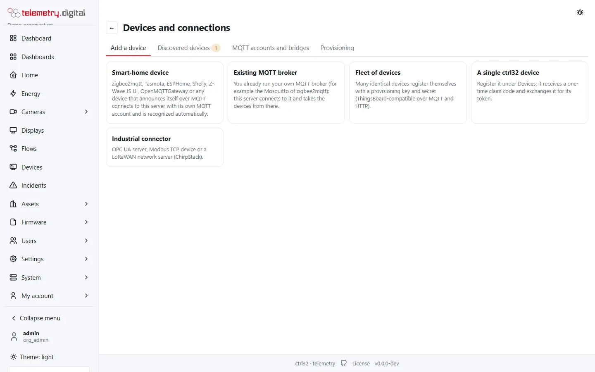
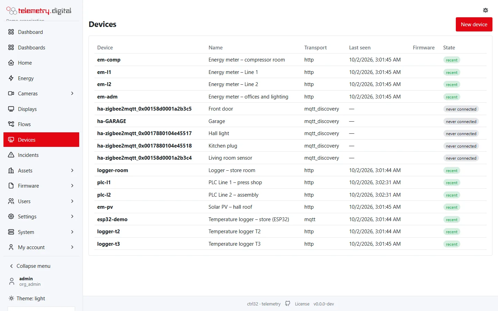

Devices send measurements to telemetry.digital, and telemetry.digital sends them configuration and commands. Every
measurement is stored as an **observation** that is never changed afterwards, with two timestamps (when it was
measured and when it arrived), its quality, and gaps where expected data is missing.

Measurements belong to **datastreams** of **assets** on **sites**; a device only feeds them. Replace a device and the
history continues — see [Sites, assets and datastreams](data-model.md).

## Ways to connect

| Device | How | Page |
|---|---|---|
| Your own device or firmware (ESP32, a PLC gateway, a script) | MQTT over TLS or HTTP with a device token | [MQTT and HTTP devices](mqtt-http.md) |
| zigbee2mqtt, Tasmota, ESPHome, Shelly and other devices that announce themselves over MQTT | automatic device discovery | [Automatic device discovery](automatic-discovery.md) |
| PLCs and controllers with OPC UA or Modbus TCP, LoRaWAN sensors through ChirpStack | a connector | [Connectors](connectors.md) |
| Many identical devices, devices with ThingsBoard firmware | a provisioning profile | [Fleets and provisioning](provisioning.md) |

All paths are shown with the actual host, ports and credentials under **Devices and connections → Add a device**
(the button **Devices and connections** on the **Home** page).

The **Devices** page lists every device with its external id, name, transport, last contact, firmware and state.

## Pages in this section

| Page | What you find there |
|---|---|
| [Sites, assets and datastreams](data-model.md) | every field of sites, assets, datastreams and alarm limits |
| [The asset and site pages](asset-page.md) | the assets and sites lists, and each asset's overview, telemetry, datastreams, alarm rules and history |
| [The device page](device-page.md) | the device list, New device, and the tabs Overview, Datastreams, Commands, Attributes, Console and Messages |
| [MQTT and HTTP devices](mqtt-http.md) | topics, payloads, HTTP endpoints and limits for your own devices |
| [Automatic device discovery](automatic-discovery.md) | MQTT accounts, bridges, the inbox of discovered devices and entities |
| [Connectors](connectors.md) | ChirpStack, OPC UA and Modbus TCP with every field, register profiles, writing values |
| [Fleets and provisioning](provisioning.md) | provisioning profiles, self-registration and approval |
| [Commands, settings and firmware updates](commands-and-firmware.md) | commands, shared attributes, the remote console, firmware images and campaigns |

## Permissions

| Permission | Allows |
|---|---|
| `data.read` | seeing devices, datastreams, values, commands and messages |
| `config.write` | sites, assets, datastreams, alarm limits and connectors |
| `device.manage` | creating and changing devices, tokens, assignments, shared attributes, MQTT accounts, bridges, discovery and provisioning |
| `device.command` | sending, approving and rejecting commands, including connector writes |
| `device.console` | the remote console |
| `fota.read` | seeing firmware images and campaigns |
| `fota.manage` | uploading firmware and running campaigns |

Which built-in role has which permission is listed in
[Users, roles and permissions](../administration/users-and-permissions.md).

## Good to know

- **Every change has a reason**: creating, changing and revoking anything on these pages asks for a reason and is
  written to the audit trail with the old and new values.
- **Reading and writing**: OPC UA and Modbus connectors write values too (for example set points on controllers).
  Every write is a command with your identity, a reason, an acknowledgement and an audit entry; with the four-eyes
  policy a second person approves it.
- **Nothing is lost silently**: every incoming message is kept as a raw message with the result of decoding, so a
  value with an unknown key or bad JSON is visible on the device page under *Messages*.
- **Client libraries**: C libraries for Arduino and ESP-IDF implement the device protocol. Nothing requires them —
  any device that speaks MQTT or HTTP works.

!!! danger "Not for safety functions"
    The server is not in the control loop. A command can be late, refused or lost. Emergency stops, interlocks and
    other safety functions are hard-wired, never built on telemetry.digital.
