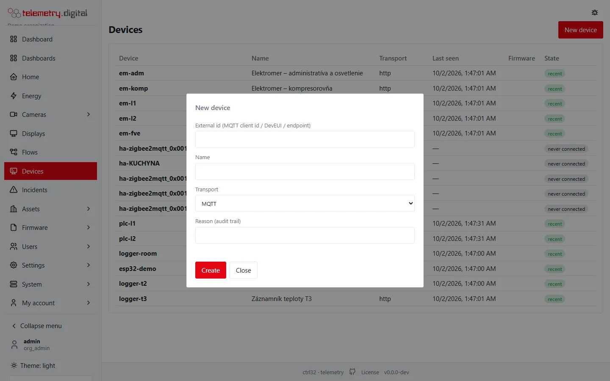
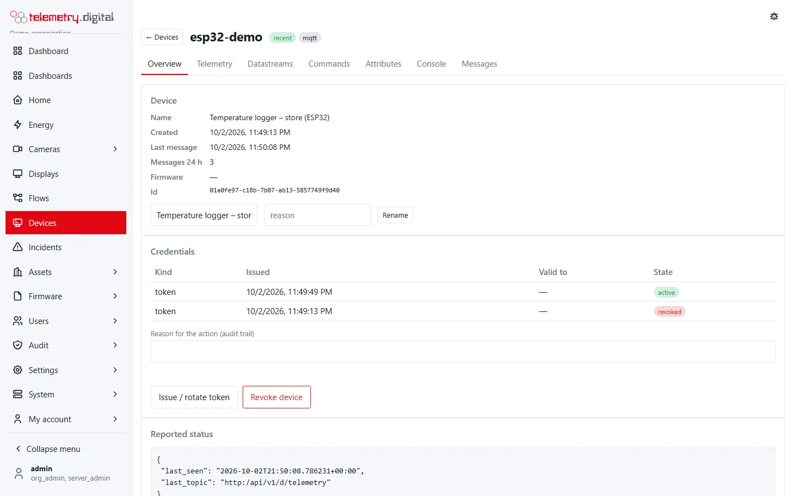
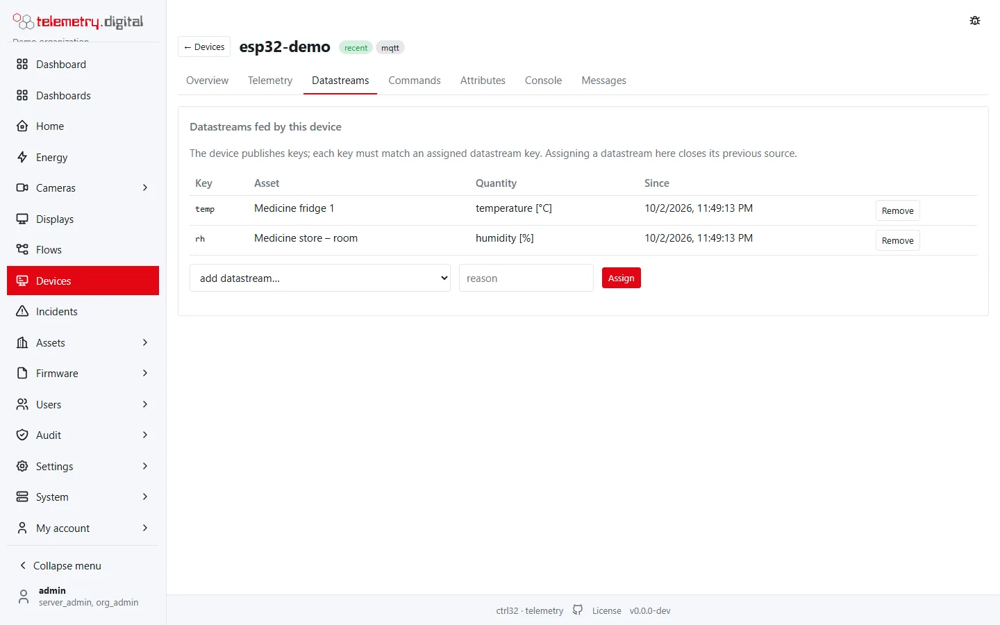
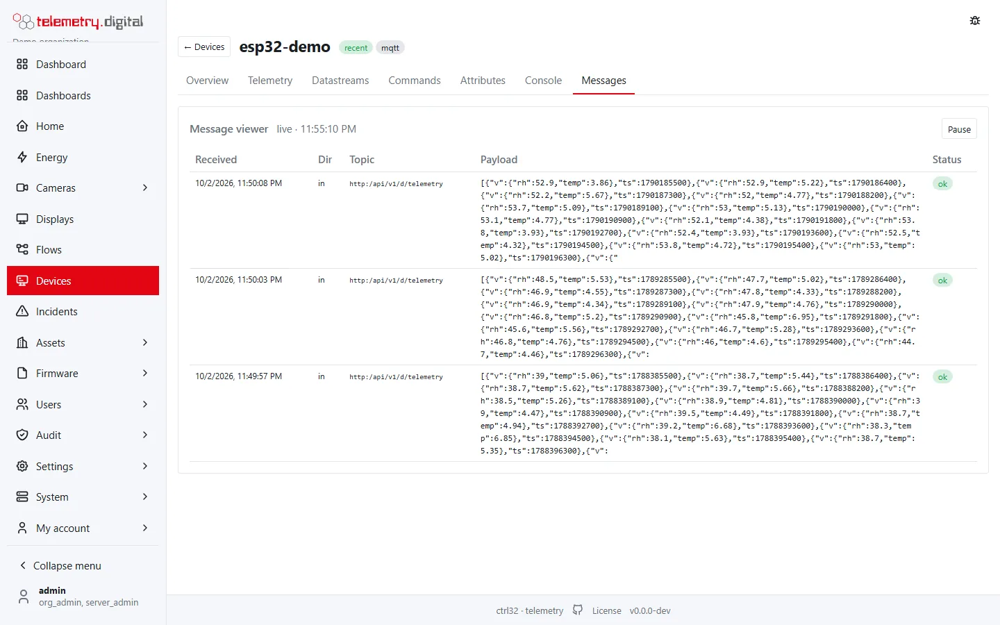

Any device of any maker, in any language, can send data — over **MQTT** (preferred) or **HTTP** for devices without
MQTT. The MQTT broker is built into the server; nothing else needs to be installed.

## 1. Register the device

1. **Devices → New device**: external id (for example a serial number, a DevEUI or `esp32-0b87b0`, at most 64
   characters), a name and the transport `mqtt` or `http`.

    

2. The dialog shows a **claim code** (valid 24 hours, one use), or press **Issue a token now instead** for a device
   token (later: **Issue / rotate token** on the device's *Overview*). A token is shown **once**; the server stores
   only its hash. Lost it? Issue a new one — the previous tokens stop working.

    

3. **Assets**: open your asset and, on its *Datastreams* tab, press **New datastream** for each value the device
   sends (a key such as `temp`, a quantity, a unit, a kind — gauge, counter, state or event — and the expected
   interval). Then, on the device's *Datastreams* tab, **assign** them to the device (or choose the device in the
   datastream's detail). All fields are described in [Sites, assets and datastreams](data-model.md) and
   [The asset and site pages](asset-page.md).

    

    

    *Each key the device sends must match an assigned datastream.*

The **expected interval** drives gap detection: when no value arrives for 1.5 × the interval, a visible gap opens
instead of a silent hole.

!!! tip "Self-provisioning with a claim code"
    A device that knows only its claim code (printed on a label, typed by the installer) trades it once for a token:
    `POST /api/v1/provision` with `{"claim": "…"}`. The answer carries the token and the MQTT host and port.

## 2. Connect over MQTT

| Setting | Value |
|---|---|
| Host and port | your server, **8883** with TLS 1.2+; plain 1883 only in the intranet profile or a VPN |
| User name | the device's external id |
| Password | the device token |
| Client id | any, use the external id |
| Protocol | MQTT 3.1.1 or 5, QoS 0 or 1, keep-alive 30–60 s |

Use the system's trusted certificate authorities (for Let's Encrypt certificates the roots *ISRG Root X1* and
*ISRG Root X2*); do not pin the server's own certificate, it rotates. Synchronize the device's clock before the first
TLS connection.

All topics of a device live under `d/<external id>/`:

| Topic | Direction | Purpose |
|---|:---:|---|
| `d/{id}/telemetry` | device → server | measurements, one sample or a batch |
| `d/{id}/attributes` | device → server | the device's own attributes (firmware, hardware, IP) |
| `d/{id}/attributes/shared` | server → device, retained | configuration set on the server |
| `d/{id}/status` | device → server | heartbeat: battery, signal, uptime; `lat`/`lon` set the position |
| `d/{id}/cmd` and `d/{id}/cmd/ack` | both | commands and their acknowledgement |
| `v1/devices/me/telemetry`, `v1/devices/me/attributes` | device → server | ThingsBoard-compatible topics — existing ThingsBoard firmware works unchanged |

A device can publish only to its own topics; anything else is refused and logged.

## 3. Send measurements

JSON, at most 64 KiB and 2000 samples per message. Any of these shapes works:

```json
{"temp": 4.2, "rh": 61, "door": false}
```

```json
{"ts": 1758620000, "v": {"temp": 4.2, "rh": 61.0}}
```

```json
[{"ts": 1758619400, "temp": 4.1, "bf": 1}, {"ts": 1758620000, "temp": 4.2}]
```

- `ts` is Unix time in seconds (milliseconds are recognized). Without it the server stamps the time of arrival.
- `bf: 1` marks a value replayed from the device's offline buffer: it closes the gap and is stored as *backfilled*.
- Keys are lower case (`temp`, `batt_level`); `Temp-1` is normalized to `temp_1`.
- A key without an assigned datastream is not stored as a measurement; the message shows on the device page under
  *Messages* with the status *unknown key*, and the key with its values under *Telemetry*, where a datastream can be
  created for it.
- `fault` marks values from a faulty sensor; they are stored with the quality *sensor fault*:

```json
{"ts": 1758620000, "v": {"temp": -127, "rh": 61}, "fault": ["temp"]}
```

  The list names the faulty keys; an object such as `{"temp": "open circuit"}` works too (`false` = no fault), and
  next to `v` or `values`, `"fault": true` marks every value of the sample. In a flat message a number, `true` or a
  text under `fault` stays an ordinary value called `fault`.

## HTTP instead of MQTT

All endpoints take `Authorization: Bearer <device token>` and JSON:

| Request | Purpose |
|---|---|
| `POST /api/v1/d/telemetry` | measurements (same shapes as above) |
| `POST /api/v1/d/status` | heartbeat |
| `POST /api/v1/d/attributes` | the device's own attributes |
| `GET /api/v1/d/attributes/shared` | configuration from the server |
| `GET /api/v1/d/cmd?wait=30` | wait up to 30 s for a command |
| `POST /api/v1/d/cmd/{id}/ack` | acknowledge a command |

```bash
curl -s -X POST https://telemetry.example.com/api/v1/d/telemetry \
  -H "Authorization: Bearer $TOKEN" -H 'Content-Type: application/json' -d '{"temp":4.2,"rh":61}'
```

## Check it

**Devices → the device** shows the state *online* (an open MQTT session) or *recent*, the last message, and on the
*Messages* tab the incoming messages with their decode status. See [The device page](device-page.md) for every tab.



!!! note "Limits to design for"
    Telemetry message ≤ 64 KiB and ≤ 2000 samples; string values ≤ 256 bytes; device time more than 5 minutes in
    the future is stored as *clock suspect*. Reconnect with a back-off from 1 second to 5 minutes and buffer values
    while offline. Wrong credentials are logged as security events and repeated failures are rate limited.
