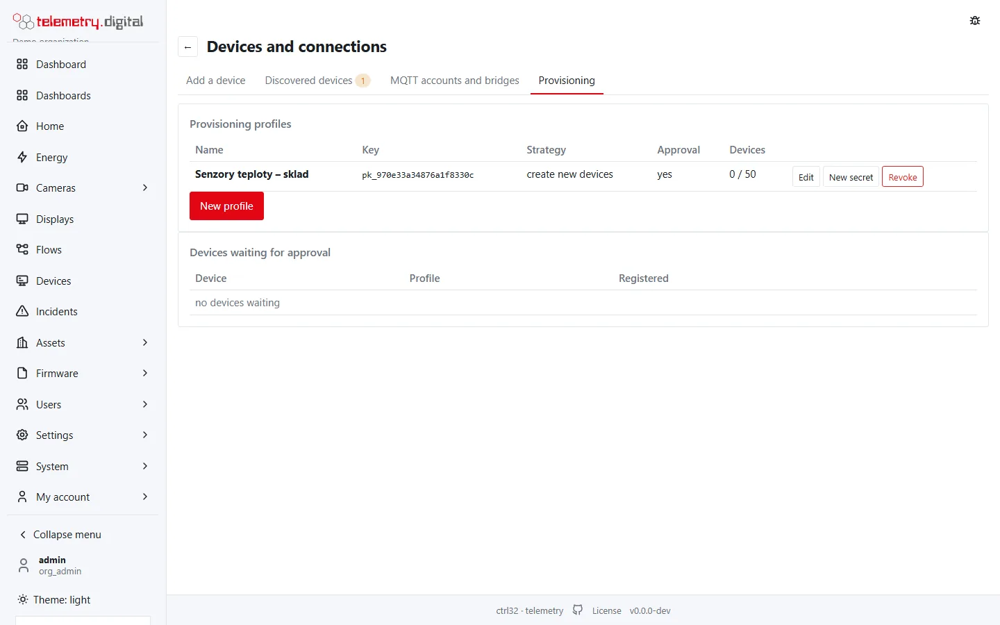

When you install tens or hundreds of identical devices, registering each one by hand is not practical. A
**provisioning profile** lets devices register themselves with a key and a secret built into their firmware.

Profiles are on the **Provisioning** tab of **Devices and connections** (from the **Home** page) and need the
permission `device.manage`. Every change asks for a **reason** and is in the audit trail.



## Provisioning profiles

The table shows each profile's name, **key** (`pk_` and 20 hexadecimal characters), strategy, approval and the number
of its devices (with the limit, if any).

| Field | Default | Limits | Meaning |
|---|:---:|:---:|---|
| Name | — | required, 1–128 characters, unique | for example "Room sensors 2026" |
| Strategy | create new devices | create new devices, only devices registered beforehand | whether an unknown device name creates a device, or only devices already registered under **Devices** can register |
| New devices wait for approval | off | — | a newly created device exists, but cannot connect until someone approves it |
| Create datastreams from the telemetry keys automatically | on | — | every new telemetry key creates a datastream (see below) |
| Site | — | a site of the organization | where the asset of a new device is created |
| Room / asset | — | an asset of the organization | the room the new device is placed in |
| Device names must match (regular expression) | — | a valid regular expression, at most 200 characters | for example `^sensor-[0-9]+$`; other names are refused |
| At most devices (0 = unlimited) | 0 | 0–1 000 000 | further new devices are refused when the limit is reached |
| Transport of the devices | MQTT | MQTT, HTTP | the transport of devices created by the profile |
| Reason (audit trail) | — | required | — |

After **Save** of a new profile a dialog shows the **key** and the **secret** — the secret is shown **once**.

| Button | Effect |
|---|---|
| Edit | change the fields above |
| New secret | issues a new secret (shown once); the old one stops working. Devices already provisioned keep their tokens |
| Revoke | the profile stops accepting registrations; its devices keep working |

### Automatic datastreams

With *Create datastreams from the telemetry keys automatically*, every new telemetry key of a provisioned device
creates a datastream under the device's own asset (created in the profile's site and room when missing) and assigns
it to the device:

- numbers become gauges, booleans states, texts and objects states with the text;
- keys that are not valid datastream keys are normalized (`Temperature 1` → `temperature_1`); the original key is
  remembered;
- at most **64** automatic datastreams per device.

## How a device registers

Over **MQTT**: connect with the user name `provision` (no password) and publish to `/provision/request`:

```json
{"deviceName": "sensor-001", "provisionDeviceKey": "pk_…", "provisionDeviceSecret": "…"}
```

The answer arrives on `/provision/response` — only on the requesting connection:

```json
{"status": "SUCCESS", "credentialsType": "ACCESS_TOKEN", "credentialsValue": "<token>"}
```

The device then connects with the token as its user name and publishes to `v1/devices/me/telemetry` (or the topics
under `d/<name>/`, see [MQTT and HTTP devices](mqtt-http.md)).

Over **HTTP**: `POST /api/v1/provision` with the same body.

The *Fleet of devices* path on **Add a device** shows both requests filled in with your host and the chosen profile.

### Rules the server applies

| Situation | Answer |
|---|---|
| wrong key or secret, or the organization is disabled | refused, logged as a security event |
| `deviceName` empty, longer than 64 characters, or with spaces, `/`, `#` or `+` | refused |
| `deviceName` does not match the profile's pattern | refused |
| strategy *only devices registered beforehand* and the name is unknown | refused, logged as a security event |
| the profile reached its device limit | refused |
| the device is revoked | refused |
| the device already has a token | refused ("already provisioned"), logged as a security event |
| otherwise | a token is issued; the device status records `provisioned_at` and `provisioned_by`; the registration is audited |

Failed attempts are limited to **10 per minute** per source address and per key. Successful ones are not limited, so
a fleet behind one NAT address registers at once.

## Devices waiting for approval

With *New devices wait for approval*, a newly provisioned device receives its token but cannot connect until it is
approved. The list **Devices waiting for approval** shows the device's name and external id, its profile and when it
registered; the **Provisioning** tab shows their number as a badge.

- **Approve** (with a reason) lets the device connect.
- **Reject** (with a reason) revokes the device and its credentials and disconnects it.

## ThingsBoard firmware works unchanged

Devices with ThingsBoard firmware need no changes: telemetry and attributes on `v1/devices/me/telemetry` and
`v1/devices/me/attributes`, attribute requests, and RPC — a command arrives on `v1/devices/me/rpc/request/{n}` and
the device's answer on `v1/devices/me/rpc/response/{n}` acknowledges it. Each device receives only its own messages
although all use the same topic names. The provisioning messages above are the ThingsBoard ones, too.

## A single device

For one device, a **claim code** is simpler — see [The device page](device-page.md#new-device).
