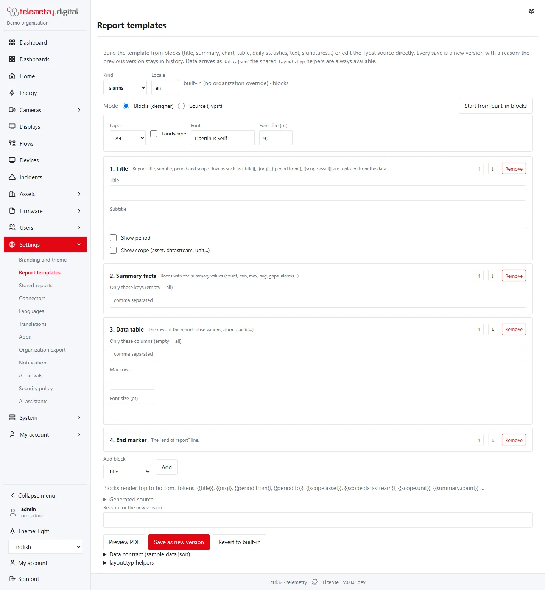
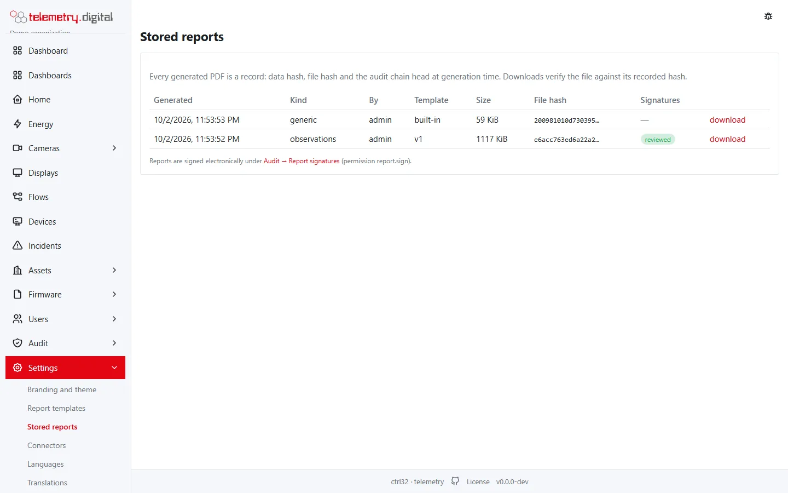
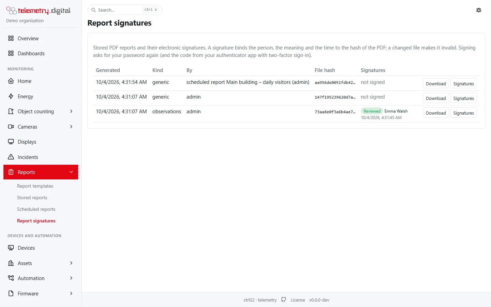
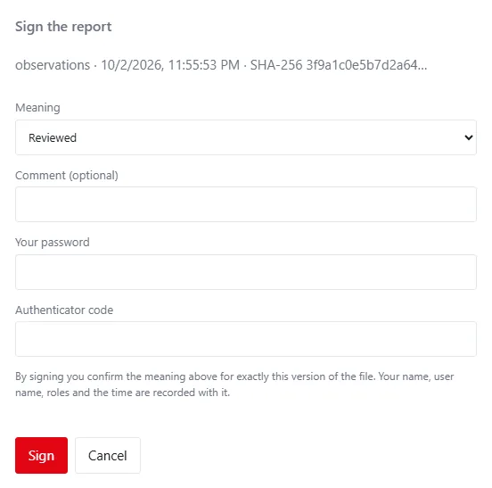
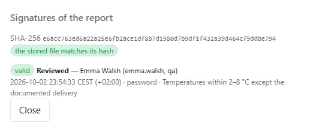
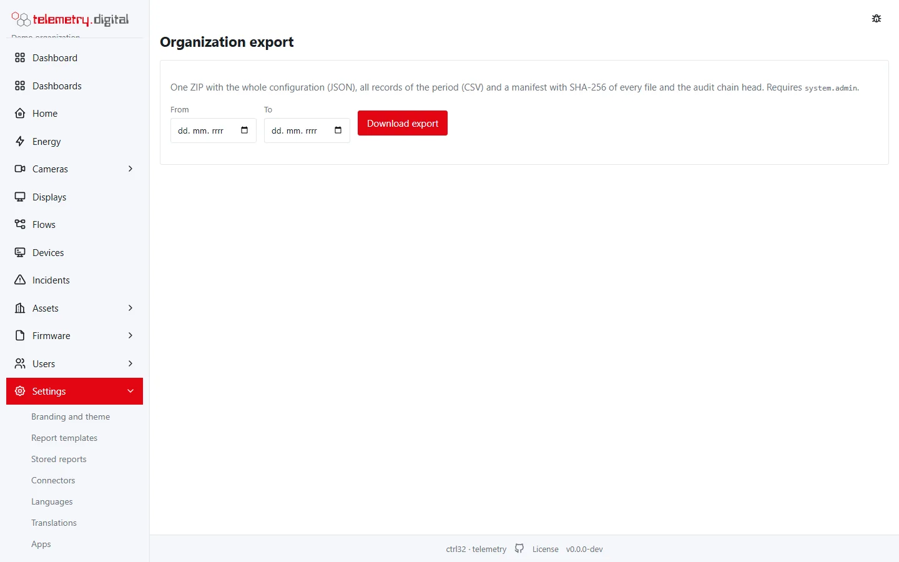
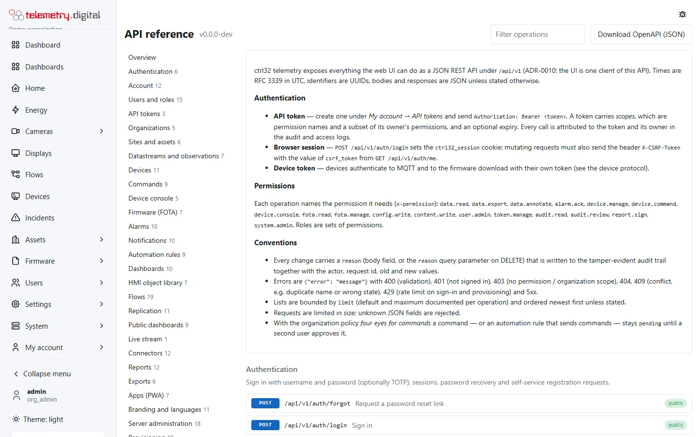

telemetry.digital produces **PDF reports** from templates you design yourself, and exports data to Excel and CSV.

## PDF reports

Report templates are designed from **blocks**: title, summary, chart, text, table, daily table, signatures, spacer
and page break, on A4, A3, A5, US Letter or US Legal paper, portrait or landscape. Templates are content like
dashboards — versioned, with a reason for every change.

Under *Settings → Report templates* a template is put together from blocks in the designer, or edited as Typst
source; *Preview PDF* shows the result before it is saved as a new version.

Generated reports are stored under **Settings → Stored reports** together with their hashes, so a stored report can
be shown to be unchanged. The column *Signatures* shows the meanings the report was signed with.

## Electronic signatures

A stored PDF report can be **signed electronically** under **Audit → Report signatures** by people with the
permission `report.sign` (the built-in *qa* role has it). The page lists the stored reports with their signatures;
reading it needs `data.export`.

**Sign** opens the signing dialog:

| Field | Meaning |
|---|---|
| Meaning | what the signature says: **Reviewed**, **Approved**, **Verified**, **Authored** or **Responsible** |
| Comment | optional, at most 500 characters |
| Your password | asked again for every signature |
| Authenticator code | the code from the authenticator app, when two-factor sign-in is on |

The signature records the **manifestation** — the signer's full name, user name and roles, the meaning and the time
in the organization's time zone — together with the **SHA-256 of the PDF file**. The server signs this record with
its own Ed25519 key, so a signature cannot be forged in the database either. One person signs a report with one
meaning only once; another meaning is another signature.

**Signatures** shows them with a badge:

- **valid** — the record matches what was signed, the server signature verifies and the stored PDF still has the
  signed hash;
- **invalid** — with the reason, for example "the record changed after it was signed" when the PDF file no longer
  matches. A changed file cannot be signed.

!!! note "Signing is personal"
    A signature is given by a signed-in person in the browser. API tokens and AI assistants cannot sign, even with
    the permission in their scopes. Failed password confirmations are limited to five a minute. Every signature is
    written to the audit trail.

Reviews of the audit trail are signed the same way, with the meaning *reviewed* — see
[Audit trail](../administration/audit.md#reviews).

With [white labeling](../administration/white-labeling.md) the footer of PDF reports names your product.

## Exports

- **Period tables** export to Excel (XLSX), CSV and PDF — see [Period tables](../dashboards/period-tables.md).
- **One key of a device** exports to CSV and Excel from the *Telemetry* tab of the device page — see
  [The device page](../devices/device-page.md#telemetry).
- **Measurements** of a datastream export to CSV, JSON Lines and PDF with the column *annotation*: the comments of
  the annotations covering each value.
- The **audit trail** and the **access log** export to CSV (see [Audit trail](../administration/audit.md)).
- Video clips export to MP4 and to signed evidence packages (see [Evidence](../video-nvr/evidence.md)).

Exporting data needs the permission `data.export`, and every export is written to the audit trail.

*Settings → Organization export* (permission `user.admin`) downloads one ZIP with the whole configuration as
JSON, all records of a chosen period as CSV and a manifest with the SHA-256 of every file and the head of the audit
chain.

## Through the API

Everything the user interface does is available in the REST API at `/api/v1`, described in OpenAPI at `/api/docs` on
your server — reports and exports included. API tokens are created under *My account → API tokens*.

