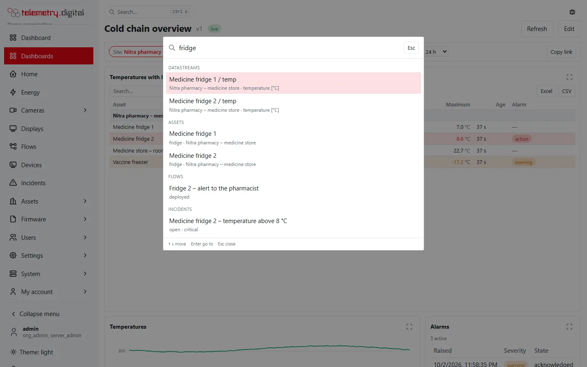

The installer creates one administrator, `admin`, with a **one-time password**.

## Sign in

1. Open the server's address in a browser: `https://<your domain>` or, in the intranet, `http://<server>:8080`.
2. Find the one-time password:
    - Linux: `/etc/ctrl32-telemetry/admin-bootstrap.txt`
    - Windows: `C:\ProgramData\ctrl32-telemetry\admin-bootstrap.txt`
3. Sign in as `admin` with that password and choose your own password when asked.
4. Set up **two-factor sign-in** with an authenticator app (TOTP). Keep the recovery codes somewhere safe.
5. **Delete `admin-bootstrap.txt`** from the server.

*The sign-in page, with a short overview of the system next to the form.*

The password and two-factor sign-in are under *My account → Password and MFA*: *Set up authenticator* starts the
registration of the authenticator app.

!!! warning "Two-factor sign-in is required for administrators"
    Administrators, engineers and quality reviewers must use two-factor sign-in by default. On a server in the
    internet profile (with a public domain or a Cloudflare Tunnel) every user must.

## Look around

The **menu** on the left (a drawer on phones) is grouped into sections. You see only what your permissions allow: a
section without anything for you is left out.

| Section | In the menu | Needs |
|---|---|---|
| — | **Overview** (the start dashboard of your organization), **Dashboards** (all of them) | signed in, `data.read` |
| Monitoring | **Home**, **Energy**, **Object counting**, **Cameras**, **Displays**, **Incidents**, **Reports** (report templates, stored reports, scheduled reports, report signatures) | `data.read`; Cameras `video.view`; Displays `display.control`; Reports `content.write`, `audit.read` or `report.sign` |
| Devices and automation | **Devices**, **Assets** (sites, assets), **Automation** (flows, alarm rules, automation rules), **Firmware** | `data.read`; automation rules `config.write`; Firmware `fota.read` |
| Administration | **Users**, **Audit**, **Settings**, **System** | `user.admin`; `audit.read` or `report.sign`; `content.write`; `system.admin` |
| Bottom of the menu | **My account**: **Profile**, **Password and MFA**, **API tokens**, **Browser notifications**, **AI assistants**, **API documentation** | signed in |

- A menu item with an arrow opens its pages underneath, e.g. *Object counting → Overview, Areas and entrances,
  Cameras, Sensors* and its *Scheduled reports*, or *Cameras → Live view, Video walls, Camera management, Evidence,
  Settings*. Every tab a page has is one of these entries, so *Cameras → Evidence* in this documentation means: open
  *Cameras* in the menu, then *Evidence*.
- A few pages appear in two places because they belong to both: *Object counting* under *Cameras*, *Scheduled
  reports* under *Object counting* and *Report signatures* under *Audit* lead to the same pages as under *Object
  counting* and *Reports*.
- **Reports** holds every report page in one place: *Report templates*, *Stored reports*, *Scheduled reports* and
  *Report signatures*. **Automation** holds *Flows*, *Alarm rules* and *Automation rules*.
- **My account** is at the bottom of the menu, next to *Sign out* (on a phone at the end of the menu). It holds your
  password and two-factor settings, API tokens, browser notifications on this device, connected AI assistants and
  the language. The interface is available in 19 languages.
- Two kinds of notifications have two names: *Settings → Notification channels* is where an administrator sets up
  e-mail, SMS, voice, webhook and Web Push channels and escalation; *My account → Browser notifications* is where you
  switch on Web Push in your own browser.
- Links and bookmarks from earlier versions keep working: for example `/settings/templates` opens *Reports → Report
  templates* and `/assets/rules` opens *Automation → Alarm rules*.
- Before anyone signs in, the address `/` shows the sign-in page with a short overview of the system, or your own
  front page once you publish one (see [Front page](../administration/front-page.md)).

### Search everything

The **Search…** field at the top of every page (the magnifier on a phone), or **Ctrl+K** (⌘K on a Mac), opens a
search over the whole system: devices (by name or external id), datastreams, assets, sites, dashboards and process
pictures, cameras, flows, incidents, users, and the pages of the menu.

- Results are grouped by kind, at most six per kind; *more…* next to a group means there are further hits — type a
  longer text.
- ↑ and ↓ move through the results, **Enter** opens the highlighted one, **Esc** closes the window. A click works too.
- A result opens its page: a device or a camera its page, a datastream its detail on the Assets page, an asset its
  card, an incident or a user its detail, a dashboard the dashboard.
- You find only what your permissions show elsewhere: cameras of your camera groups with `video.view`, users with
  `user.admin`, everything else with `data.read` — and only in your organization.

*Collapse menu* at the bottom of the menu shrinks it to a bar of icons (a second click hides it, a third brings it
back); on a narrow screen the menu shows icons by itself. The sections are thin lines then, an icon with pages under it
opens its first page, and the page shows its other pages as tabs at the top:

On a phone the menu opens as a drawer from the button at the top left. Only the item of the page you are on shows its pages;
tap another item with an arrow to see its pages (a second tap hides them):

## Set up e-mail

Password resets, account requests and alarm notifications go out by e-mail. Fill in the `[smtp]` section of
`config.toml` and restart the service; until then e-mail notifications cannot be delivered.

*Forgot password?* on the sign-in page sends a reset link that is valid for one hour — when the account has an
e-mail address and the server can send mail.

Next: [Organization and users](organization-and-users.md).
