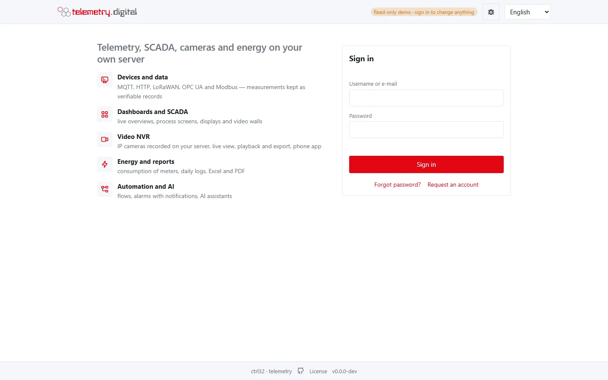
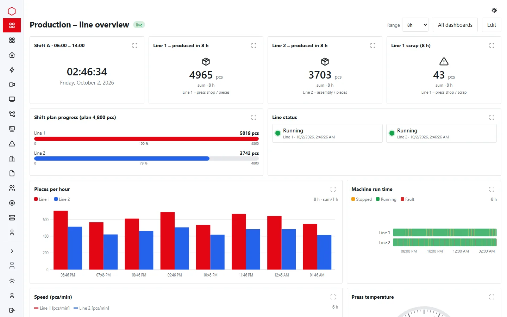
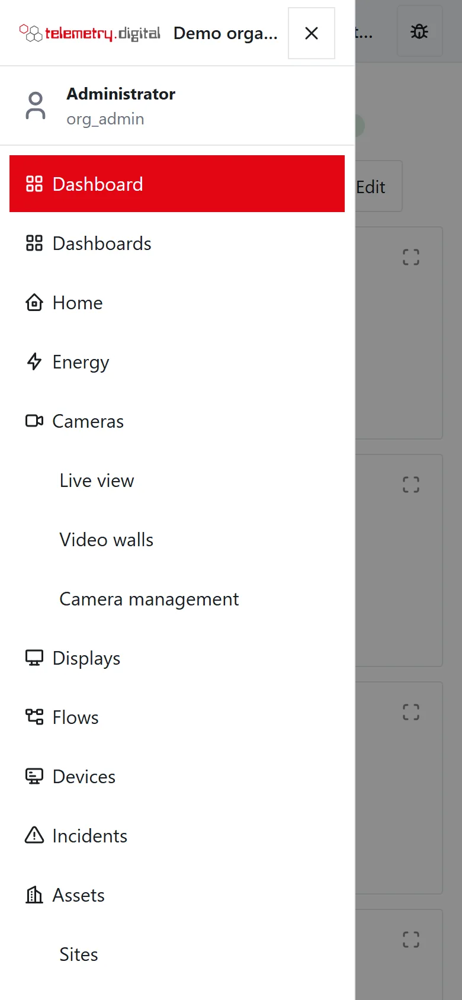
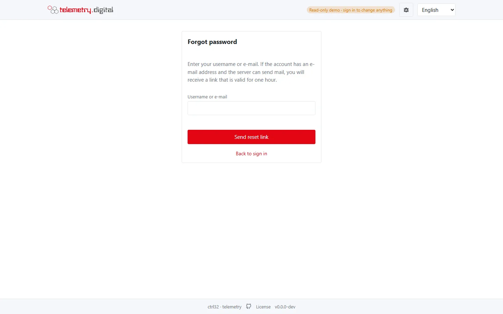

The installer creates one administrator, `admin`, with a **one-time password**.

## Sign in

1. Open the server's address in a browser: `https://<your domain>` or, in the intranet, `http://<server>:8080`.
2. Find the one-time password:
    - Linux: `/etc/ctrl32-telemetry/admin-bootstrap.txt`
    - Windows: `C:\ProgramData\ctrl32-telemetry\admin-bootstrap.txt`
3. Sign in as `admin` with that password and choose your own password when asked.
4. Set up **two-factor sign-in** with an authenticator app (TOTP). Keep the recovery codes somewhere safe.
5. **Delete `admin-bootstrap.txt`** from the server.

*The sign-in page, with a short overview of the system next to the form.*

The password and two-factor sign-in are under *My account → Password and MFA*: *Set up authenticator* starts the
registration of the authenticator app.

!!! warning "Two-factor sign-in is required for administrators"
    Administrators, engineers and quality reviewers must use two-factor sign-in by default. On a server in the
    internet profile (with a public domain or a Cloudflare Tunnel) every user must.

## Look around

- The **menu** on the left (a drawer on phones) holds Dashboards, Home, Energy, Cameras, Displays, Flows, Devices,
  Incidents, Assets, Firmware, Users, Audit, Settings and System — you see only what your permissions allow.
- **My account** holds your password and two-factor settings, API tokens, connected AI assistants and the language.
  The interface is available in 19 languages.
- Before anyone signs in, the address `/` shows the sign-in page with a short overview of the system, or your own
  front page once you publish one (see [Front page](../administration/front-page.md)).

*Collapse menu* at the bottom of the menu shrinks it to a bar of icons:

On a phone the menu opens as a drawer from the button at the top left:

## Set up e-mail

Password resets, account requests and alarm notifications go out by e-mail. Fill in the `[smtp]` section of
`config.toml` and restart the service; until then e-mail notifications cannot be delivered.

*Forgot password?* on the sign-in page sends a reset link that is valid for one hour — when the account has an
e-mail address and the server can send mail.

Next: [Organization and users](organization-and-users.md).
