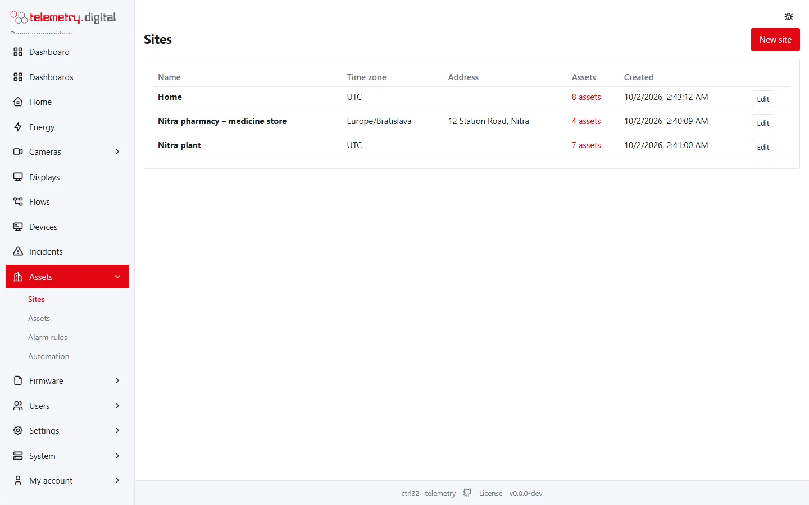
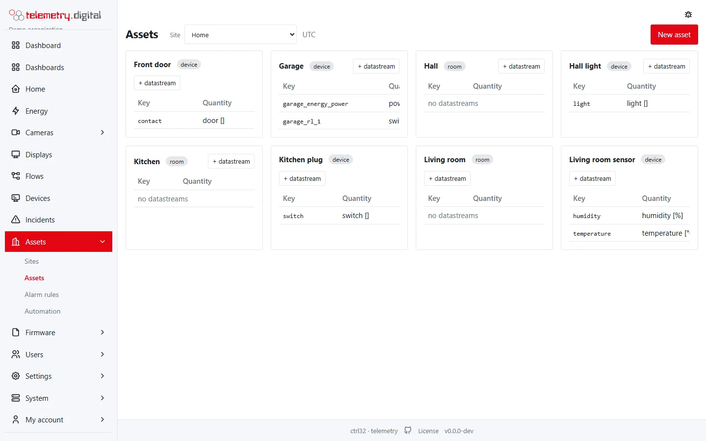
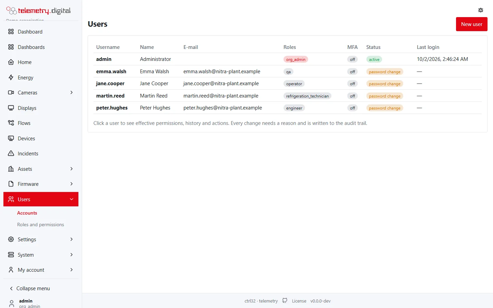
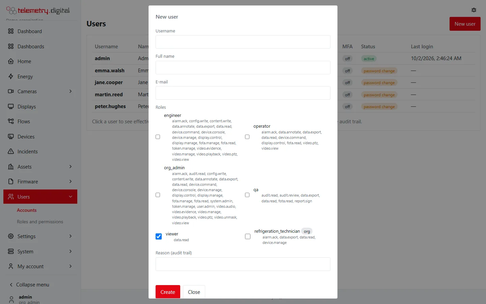
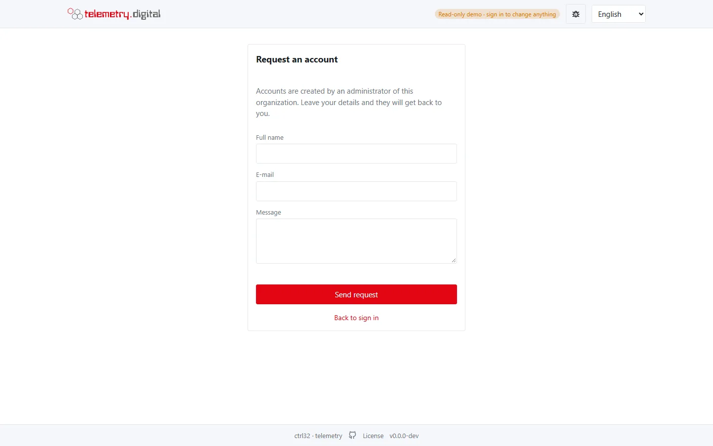

Everything in telemetry.digital belongs to an **organization**: its sites, assets, devices, dashboards, cameras and
users. Organizations on one server are separate tenants — users of one never see the data of another.

The installer creates the first organization (on Windows you can name it with `-OrgName`). Most installations need
only this one; an integrator running one server for several customers creates one organization per customer.

## Sites, assets and datastreams

The data model is simple:

- A **site** is a place (a plant, a building, a branch).
- An **asset** is a thing at a site you measure (a cold room, a mixer, a meter).
- A **datastream** is one measured quantity of an asset, with a key, a unit and a kind (gauge, counter, state or
  event) — for example `temp` in °C. Devices send values for datastream keys; see
  [Devices and data](../devices/index.md).

Sites are listed under *Assets → Sites*, each with its time zone and address; *Assets → Assets* shows the assets of
one site with their datastreams.

## Add users

1. **Users → New user**: name, user name, e-mail and one or more **roles**.
2. The user signs in, chooses a password and, where required, sets up two-factor sign-in.

*Every role in the dialog lists the permissions it grants.*

Built-in roles:

| Role | For | Can |
|---|---|---|
| viewer | anyone who only looks | read data |
| operator | operators on shift | read and export data, acknowledge alarms, annotate, send commands; watch live cameras, use PTZ, control displays |
| qa | quality reviewers | read and export data, read and review the audit trail, sign reports |
| engineer | whoever sets things up | everything of an operator plus devices, firmware, configuration, API tokens; cameras, recordings, evidence and displays |
| org_admin | the organization's administrator | everything in the organization, including users, the audit trail and its VPN |
| server_admin | the server's administrator | the *System* pages: every organization, server settings, the VPN of the whole server, backups, updates, licence |

Details of every permission: [Users and permissions](../administration/users-and-permissions.md).

!!! tip "Let people ask for an account"
    Self-service registration lets people request an account; an administrator approves the request before it can
    be used.

## Limit who sees which cameras

Put cameras into **camera groups** and limit a user to some groups (*Users → user → Cameras*). The user then sees
only those cameras — live, recordings, walls, events and PTZ, also through the API and AI assistants. See
[Privacy and permissions](../video-nvr/privacy.md).
