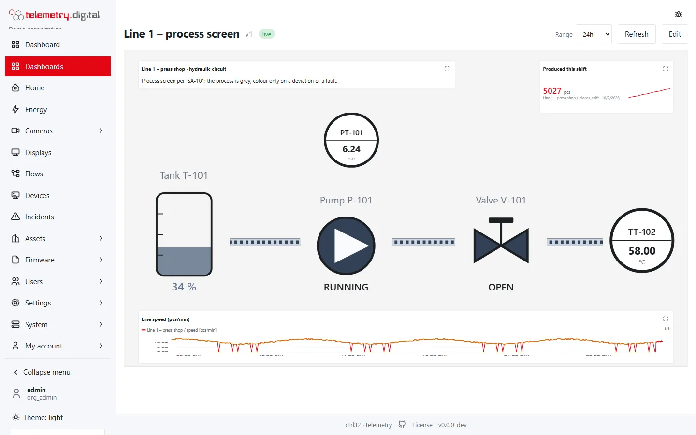

**Telemetry, SCADA, cameras and energy on your own server.** telemetry.digital collects data from devices and PLCs,
shows it on dashboards and process screens, records IP cameras, counts energy, runs automation flows and produces
reports — in one self-hosted system. Your data stays with you, and an AI assistant can work in it on your behalf.

The server is one program for Linux or Windows plus a PostgreSQL database. You install it with one command, on a PC
next to your machines and cameras or on a server in a data centre. It is free to use with up to 4 cameras; more cameras,
white labeling, changes through AI assistants and the larger VPN require a licence (see [Licence](licence/index.md)).

*A process screen with live values, a production counter and a speed trend.*

## What it does

| Area | In short |
|---|---|
| Devices and data | MQTT (TLS), HTTP, LoRaWAN through ChirpStack, OPC UA and Modbus TCP — reading and writing. Automatic device discovery for devices that announce themselves over MQTT. Firmware updates, remote console, commands with acknowledgement. |
| Dashboards and SCADA | Dashboards with more than 40 widget types, process screens drawn in a vector editor with industrial symbols, displays (kiosks) and video walls, daily and monthly period tables with export. |
| Video NVR | RTSP/ONVIF cameras with continuous or event recording, live view and playback, PTZ, motion detection, privacy masks, locked evidence, a phone app, and remote sites through an encrypted relay. |
| Energy and reports | Consumption per meter, hour, day and month with cost; PDF reports, Excel and CSV exports, reports mailed on a schedule. |
| Object counting | People and vehicles counted at the entrances of buildings and car parks by the server's own detector on any camera or by sensors; occupancy, shares of the entrances, vehicle speed. |
| VPN | Your server as a WireGuard hub: technicians reach PLCs and HMIs at your sites, routers connect whole site networks, devices send data through the tunnel — everything behind access rules that deny by default. |
| Automation and AI | Visual flows, alarm rules with escalation by e-mail, webhook, SMS, voice and Web Push; AI assistants (MCP clients) working through the same permissions as you. |
| Records you can prove | Append-only measurements, a hash-chained audit trail with a reason for every change, two-factor sign-in, roles, organizations as separate tenants. |

## Who it is for

- **A company that wants its own "ThingsBoard"** — devices, measurements, alarms and reports in one place, on its
  own hardware.
- **A warehouse, a yard, a shop or a whole site that needs a video recorder** — cameras recorded on your own server,
  watched in the browser and on phones.
- **Integrators** who install monitoring, SCADA screens and cameras at customers' sites and want to deliver them
  under their own brand.
- **A home or a small building** with zigbee2mqtt, Tasmota, ESPHome or Shelly devices — recognized automatically and
  controlled from one page.

## Where to start

- [Getting started](getting-started/index.md) — install on Linux or Windows, sign in, set up users, reach the server
  from the internet without opening ports.
- [Video NVR](video-nvr/index.md) — cameras, recording, playback, the phone app, privacy and evidence.
- [Devices and data](devices/index.md) — connect devices over MQTT, HTTP, OPC UA, Modbus and LoRaWAN.
- [Dashboards and SCADA](dashboards/index.md) — widgets, process screens, displays and period tables.
- [Energy](energy/index.md) — meters, consumption, cost and reports.
- [Object counting](object-counting/index.md) — people and vehicles at entrances, occupancy, speed, reports by e-mail.
- [Automation and alarms](automation/index.md) — flows, alarm rules, notifications and incidents.
- [AI assistants](ai-assistants/index.md) — let an AI assistant read and work in the system over MCP.
- [VPN](vpn/index.md) — remote access for technicians to PLCs and HMIs, site-to-site networks and devices, with
  access rules.
- [Administration](administration/index.md) — users and permissions, audit, white labeling, backups, updates and apps.
- [Licence](licence/index.md) — which features require a licence, the included updates, and how to activate it.

## Addresses

- Website: [telemetry.digital](https://telemetry.digital)
- Portal: [portal.telemetry.digital](https://portal.telemetry.digital)
- GitHub: [github.com/telemetry-digital](https://github.com/telemetry-digital)

!!! warning "Before you rely on it"
    telemetry.digital carries **no certification** — not a functional-safety rating, not a type approval, and it is
    not a validated GxP system by itself. Safety functions are hard-wired, never built through a dashboard, a widget
    or a flow: a command from the system can be late, refused or lost, and the system is not in the control loop.

    For recordings of people **you are the data controller**: set retention, privacy masks and access according to
    the law of your country. Whoever deploys the system takes responsibility for the deployment.

!!! note "Safety first, by default"
    Sensitive features — camera sound, unmasked video, evidence packages, changes through AI assistants, the VPN —
    are **off by default**, need their own permission and are written to the audit trail. Every configuration change asks for
    a reason, and the reason is stored with it.
