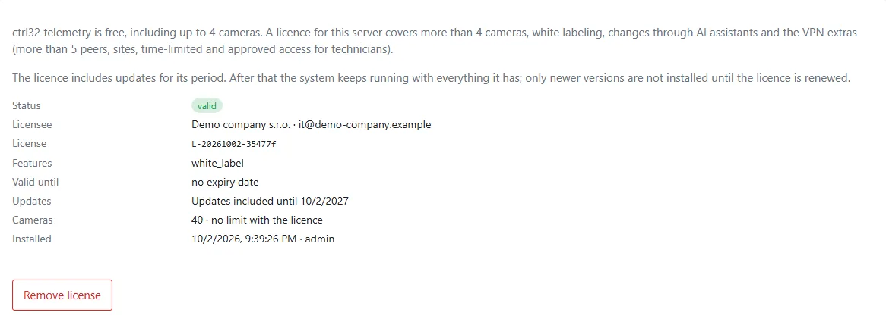
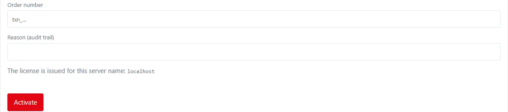
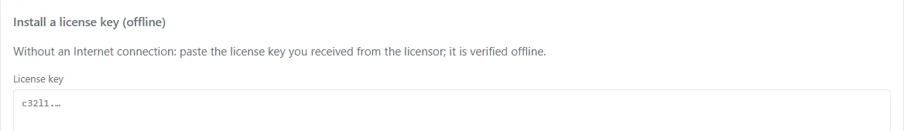

telemetry.digital is free to use, including **up to 4 cameras**. One licence per server unlocks everything else:

| Capability | Without a licence | With a licence |
|---|---|---|
| Cameras | up to 4 enabled cameras | no limit |
| [White labeling](../administration/white-labeling.md) | the product name and footer of telemetry.digital | your own product name, footer, icon and app name |
| [AI assistants](../ai-assistants/index.md) | reading | reading and changes |
| [VPN](../vpn/index.md) | up to 5 peers (devices and technicians) | more peers, sites, time-limited and approved technician access |
| Updates | every version | the versions released while the licence includes updates |

The cameras count over all organizations of the server. Everything else — devices, dashboards, SCADA screens,
energy, reports, automation, users and organizations — needs no licence.

## Nothing is switched off

A licence never takes anything away that already runs:

- Without a licence, adding a fifth enabled camera — or enabling a disabled one when 4 are enabled — is refused with
  a message that a licence is needed. A disabled camera can still be added, and every existing camera can be
  changed.
- Cameras or VPN peers beyond the free limits (for example after the licence was removed) keep working.
- *System → License* and *Cameras → Camera management* show how many cameras run: **Cameras: N of 4 without a
  licence**.

## Updates

The licence includes updates for its validity period. After it ends the system **keeps running with everything it
has** — every licensed feature stays — and only updates stop until the licence is renewed:

- *System → License* shows **Updates included until** a date, and after that day **Updates ended on** that date with
  the note that the system keeps running.
- *System → Updates* installs only versions released while the licence includes updates. A later version is refused
  before anything is replaced, and the running system stays as it is.
- A server without a licence can always install every version.
- A licence key whose updates ended before the installed version was released cannot be installed on that version;
  it can be installed on the versions it covers.

## Activate a licence

1. Check that `http.base_url` in `config.toml` holds the name the server is reached at — the licence is issued for
   that host name.
2. **System → License → Activate with the order number**: enter the order number and a reason, then *Activate*.
   The page shows the server name the licence will be issued for.

    

3. A server without internet access gets a licence key instead: **System → License → Install a licence key
   (offline)**, paste the key, give a reason, *Install*.

    

The License page shows the licensee, the validity, the included updates and the cameras; the activation is written
to the audit trail.
