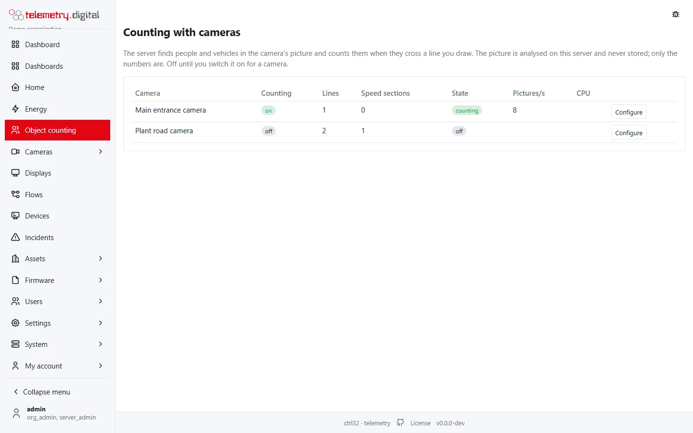
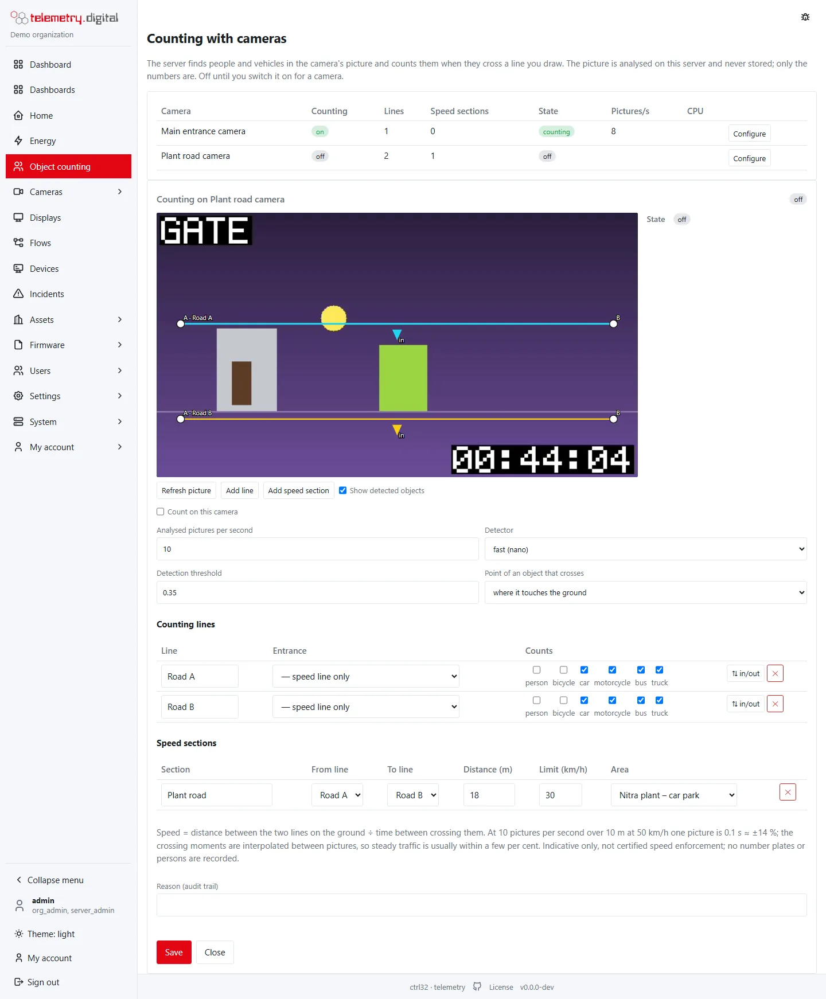
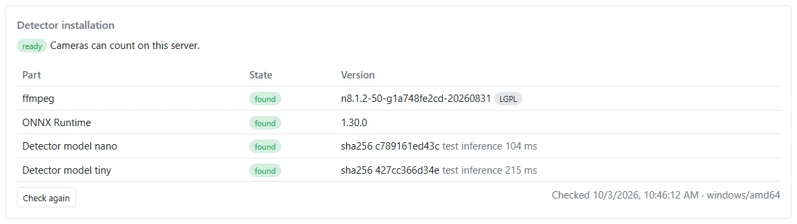

The server finds people and vehicles in the picture of a camera and counts them when they cross a **counting line**
that you draw on the picture. It works with any camera the server receives — RTSP (H.264, H.265, MJPEG), HTTP MJPEG,
and cameras at remote sites behind the [relay](../video-nvr/remote-sites.md). No analytics of the camera is used.



## Before you start

- The [areas and entrances](outputs.md#areas-and-entrances) exist.
- The camera is added under *Cameras → Camera management*. A **sub-stream** of 640 × 360 to 1280 × 720 is enough
  and costs the least CPU; counting uses the sub-stream when the camera has one.
- The detector is installed on the server (see [Install the detector](#install-the-detector)); without it the cameras
  show *not installed* and sensors still work.

## Draw a counting line

*Object counting → Cameras → Configure* on the camera.

1. The editor takes a picture from the live view (with the camera's privacy masks). *Refresh picture* takes a new one.
2. **Add line**, then click the start (A) and the end (B) of the line on the picture. Drag the white end points to
   move them.
3. The **arrow** points into the area: crossing the line in the direction of the arrow counts **in**, against it
   **out**. *⇅ in/out* swaps the sides.
4. In the table choose the **entrance** the line counts for and the **classes** it counts (person, bicycle, car,
   motorcycle, bus, truck).
5. Switch on **Count on this camera**, enter a reason and **Save**.


*Show detected objects* draws the boxes of the last analysed picture (people green, vehicles orange), so you can see
what the detector finds. The state shows the analysed pictures per second, the inference time, the CPU of the
detector and the decoder, the objects followed and the counts since the start.

| Setting | Default | Allowed values |
|---|:---:|---|
| Analysed pictures per second | 5 | 1–15; 10 or more for speed sections |
| Detector | fast (nano) | fast (nano), more accurate (tiny, about 3× the CPU) |
| Detection threshold | 0.35 | 0.1–0.95 |
| Point of an object that crosses | where it touches the ground | where it touches the ground; its centre (a camera above the door looking down) |

### Where to put the line

- Across the whole width of the door or the gate, a little **inside** the area, where people walk straight through.
- Where objects are **fully visible** — an object cut by the picture border is not counted until it is whole.
- Not on a place where people stand and wait: the line counts crossings, a person standing on it is counted once when
  leaving it.
- A camera above the entrance looking down at an angle gives the best results. A strictly vertical view from the
  ceiling works with *its centre*, but the detector recognizes people seen from the side better.

## How a crossing is counted

- An object must be seen at least **three times** before it counts (a flicker counts nothing).
- It counts when it moves from one clear side of the line to the other **through the drawn segment** (passing beside
  the line does not count). A dead band of 2 % of the picture around the line prevents counting jitter.
- Every object counts **once per line**, even when it seems to cross back.

## Speed sections

A speed section measures the speed of vehicles between two lines whose real distance on the ground you know.

1. Draw two lines across the road (they need no entrance — choose *— speed line only*).
2. **Add speed section**: the first and the second line, the **distance in metres** between them (measure it on the
   ground, 1–500 m), the **speed limit** in km/h (0 = none) and the **area** whose section stores the values.
3. Set the analysed pictures per second to 10 or more and save.



Each vehicle gets its speed on the datastream `vehicle_speed` (with its class and direction A → B or B → A); a vehicle
above the limit adds 1 to `over_limit`. Speeds below 1 km/h or above 250 km/h are discarded as errors.

!!! warning "Indicative, not enforcement"
    The speed is an indicative measurement from the camera picture, **not a certified speed measurement** and not for
    fines. No number plates and no persons are recorded.

**Accuracy.** Speed = distance ÷ time between crossing the two lines. Without interpolation the time is known to ±1
picture: at 10 pictures per second over 10 m at 50 km/h one picture is 0.1 s of 0.72 s, about ±14 %. The server
interpolates the moment of each crossing between two pictures, so steady traffic is usually within a few per cent;
perspective, the point of the box taken as the ground point and braking add to the error. More pictures per second
and a longer section make it better.

## Install the detector

The server runs the detector in a separate worker process per camera: an unmodified **ffmpeg** decodes the picture,
the **YOLOX** model finds people and vehicles through **ONNX Runtime** on the CPU. The installers set it up when you
ask for it; it is off by default.

```bash
curl -fsSL https://portal.telemetry.digital/install.sh | sudo bash -s -- --analytics
```

```powershell
.\install.ps1 -Analytics
```

On a server that is already installed the option adds only the detector and restarts the service; your
configuration, data and passwords stay. The installer downloads each part from its official release, checks its
SHA-256 against the value written in the installer, stores its licence next to it, writes the `[analytics]` section
of [config.toml](../administration/config-reference.md) and runs the self-check. None of these parts is shipped with
the product.

| Part | Version | Licence | Linux | Windows |
|---|:---:|:---:|---|---|
| ffmpeg, LGPL build | 8.1.2 | LGPL-3.0 | `/opt/ctrl32-telemetry/analytics` | `C:\Program Files\ctrl32-telemetry\analytics` |
| ONNX Runtime, CPU | 1.30.0 | MIT | `/opt/ctrl32-telemetry/analytics` | `C:\Program Files\ctrl32-telemetry\analytics` |
| YOLOX nano and tiny models | 0.1.1rc0 | Apache-2.0 | `/var/lib/ctrl32-telemetry/models` | `C:\ProgramData\ctrl32-telemetry\models` |

It downloads about 90 MB on Linux and 180 MB on Windows and needs about 200 MB of disk. Linux on x86-64 and on ARM64
(for example a Raspberry Pi 5) and Windows on x64 are supported; 32-bit ARM servers (an older Raspberry Pi OS)
cannot run the detector.

!!! note "Why not the ffmpeg package of the distribution"
    The `ffmpeg` packages of Debian and Ubuntu are GPL builds. The detector uses an unmodified LGPL build as a separate
    program, so the Linux installer downloads the same LGPL build as on Windows. With `--analytics --ffmpeg apt` it
    uses the distribution's package anyway; the self-check then shows it as a GPL build.

### Check the installation

*Object counting → Cameras* and *System → Server* show **Detector installation**: ffmpeg with its version and whether
it is an LGPL build, ONNX Runtime with its version, and each model — found, checked against its SHA-256 and run once
on an empty picture. **Check again** repeats the check (the server keeps a result for 5 minutes). A missing or broken
part says what to do; server administrators also see where the server looked for it.



The same check runs on the command line, for example after an update:

```bash
sudo ctrl32-telemetry analytics-worker -selfcheck -config /etc/ctrl32-telemetry/config.toml
```

It prints one line per part and ends with *Object counting on cameras: ready* (exit code 0) or *NOT ready* (exit
code 1).

### By hand

Without the installer, install the three parts yourself and name them in `config.toml`:

```toml
[analytics]
ffmpeg = "/opt/ctrl32-telemetry/analytics/ffmpeg-n8.1.2-50-g1a748fe2cd-lgpl/bin/ffmpeg"
onnxruntime = "/opt/ctrl32-telemetry/analytics/onnxruntime-1.30.0/lib/libonnxruntime.so"
model_nano = "/var/lib/ctrl32-telemetry/models/yolox_nano.onnx"
model_tiny = "/var/lib/ctrl32-telemetry/models/yolox_tiny.onnx"
nano_sha256 = "c789161ed43c8269fcd4e67c67eeeb4e80c622da2eb296a20bc6007bd18a0b7d"
tiny_sha256 = "427cc366d34e27ff7a03e2899b5e3671425c262ea2291f88bb942bc1cc70b0f7"
threads = 1
max_cameras = 4
```

| Key | Meaning |
|---|---|
| `ffmpeg` | the ffmpeg program — an **LGPL build** (no GPL options); it runs as a separate program |
| `onnxruntime` | the ONNX Runtime library, version 1.17 or newer, CPU package for 64-bit Linux, Windows or macOS (`onnxruntime.dll` on Windows) |
| `model_nano`, `model_tiny` | the YOLOX nano and tiny models (`yolox_nano.onnx`, `yolox_tiny.onnx`, YOLOX release 0.1.1rc0, Apache-2.0) |
| `nano_sha256`, `tiny_sha256` | optional: the worker refuses any other file |
| `threads` | inference threads per camera (default 1) |
| `max_cameras` | cameras analysed at the same time (default 4); more cameras show *over the camera limit* |

Restart the server after changing the file. Running the installer with the option again keeps `threads` and
`max_cameras`.

## CPU and accuracy

Measured on a PC with an Intel Xeon E3-1240 v3 (4 cores, 3.4 GHz, from 2013), one inference thread per camera,
sub-stream 640 × 352 H.264:

| Detector | Pictures per second | Inference per picture | CPU of one core |
|:---:|:---:|:---:|:---:|
| nano | 5 | about 65 ms | about 32 % |
| nano | 10 | about 45 ms | about 45 % |
| tiny | 5 | about 160 ms | about 80 % |
| tiny | 10 | about 140 ms | 100 % (reaches only 7 pictures per second) |

The decoder takes 1–5 % of it. With the nano model at 5 pictures per second a 4-core server counts about 8 cameras
next to its other work; a newer CPU is faster. The tiny model is more accurate on small or distant objects; use it
with 5 pictures per second.

On a recorded street scene with 7 people crossing a line, the nano model counted 6 — all 3 arrivals and 3 of 4
departures (two people walking side by side were seen as one) — and the tiny model all 7; neither counted anything
else. Accuracy depends on the view of the
camera, the light, crowding and the frame rate. **Compare the counts with a count by hand** when you put a camera in
service, and correct the occupancy when needed.
