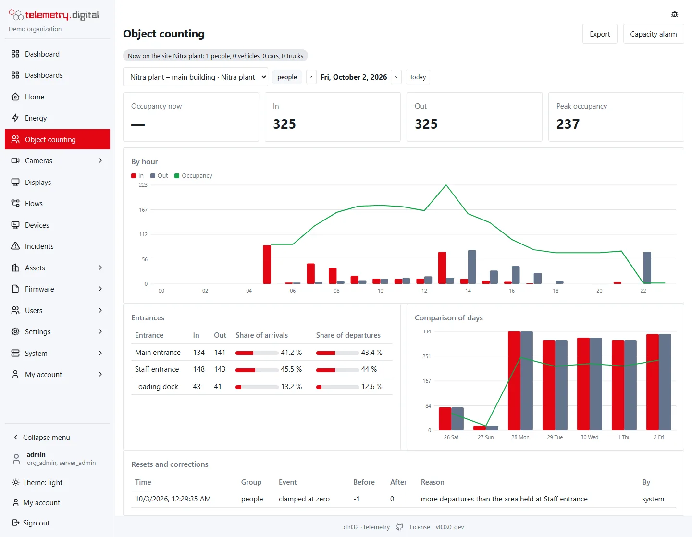

**Object counting** counts people and vehicles at the entrances of a building, a car park or any zone, keeps the
number of people or vehicles inside (the **occupancy**) and measures the speed of vehicles between two lines. The
server counts by itself: its own detector finds people and vehicles in the picture of **any IP camera**, and sensors
such as light barriers, turnstiles and induction loops count through the [device protocol](../devices/mqtt-http.md).

*One day of the main building: 325 arrivals and departures, a peak of 237 people, the shares of the three entrances.*

## What you get

| Need | Where |
|---|---|
| How many people are in the building now | the *Occupancy now* tile, the *Occupancy* widget, the `people_occupancy` datastream |
| Arrivals and departures per entrance and their share | the *Entrances* table and the *Share per entrance* widget |
| Traffic per hour and comparison of days | the charts of the page, [period tables](../dashboards/period-tables.md) with the value *sum* |
| Free spaces in a car park | a car park area counting vehicles, cars and trucks, with its capacity |
| Speed of vehicles on a plant road | a speed section of two lines on a camera picture |
| A capacity alarm | an ordinary [alarm rule](../automation/alarms.md) on the occupancy datastream |
| Statistics in the mailbox every morning | [scheduled reports](scheduled-reports.md) with PDF and Excel attachments |

Every number is an ordinary **datastream** of an asset, so everything else in the system works with it: dashboards,
period tables, alarm rules, flows, exports and the API.

## How it is organized

- An **area** is a building, a car park or a zone on a site. It counts **groups**: *people*, *vehicles* (cars,
  motorcycles, buses and trucks together) or single classes — *cars*, *trucks*, *buses*, *motorcycles*, *bicycles*.
- An area has **entrances**: doors, gates, a loading dock.
- **Sources** count passages through an entrance: a counting line on a [camera](cameras.md) or a
  [sensor](sensors.md).
- The **occupancy** is arrivals minus departures since the last reset.

| Object | Datastreams |
|---|---|
| Area | `people_in`, `people_out`, `people_occupancy` (for every group it counts) |
| Entrance | `people_in`, `people_out` |
| Speed section | `vehicle_speed` (km/h), `over_limit` |

## Occupancy rules

- **Never below zero.** A departure that would make the occupancy negative leaves it at zero. The stored value is
  flagged (quality *out of range*) and the page shows *clamped* with a note — usually a line or a sensor misses
  arrivals.
- **Daily reset** at a local time you choose, for example 03:00 when the building is empty. A reset that falls into
  the server's downtime is done when it starts again; on the day the clocks change it happens once.
- **Correction by hand**, for example after counting the people at the reception: *Correct occupancy* asks for the
  value and a reason; both go to the counting log and the audit trail.

## Privacy

Counts and speeds are **aggregate numbers**. No picture, face, number plate or track of a person is stored or sent
anywhere — the camera's picture is analysed on your server and only the numbers are kept. A camera used for counting
still films people: its recording (counting does not need it), [privacy masks](../video-nvr/index.md) and viewing
follow the camera's own rules, and the usual notice about the camera applies.

!!! note "Off by default"
    Counting on a camera is off until a user with the `config.write` permission switches it on for that camera, and
    every change of lines or settings asks for a reason that goes to the audit trail.

## Pages of this section

Everything for counting is under **Object counting** in the menu: *Overview* (the numbers of the day), *Areas and
entrances*, *Cameras*, *Sensors* and *Scheduled reports* — the last two need `config.write`. The counting cameras are
also under *Cameras → Object counting*.

- [Counting with cameras](cameras.md) — draw counting lines and speed sections on the camera picture, install the
  detector, accuracy and CPU.
- [Counting with sensors](sensors.md) — light barriers, turnstiles, door counters and other systems through MQTT or
  HTTP.
- [Outputs and widgets](outputs.md) — the page, widgets, period tables, exports and the capacity alarm.
- [Scheduled reports by e-mail](scheduled-reports.md) — statistics mailed every day, week or month.
