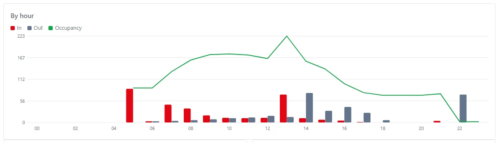
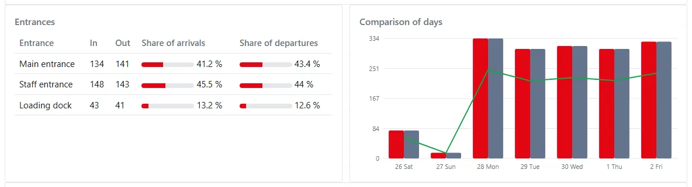
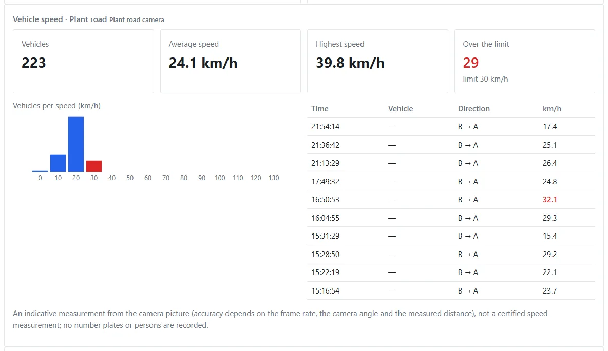
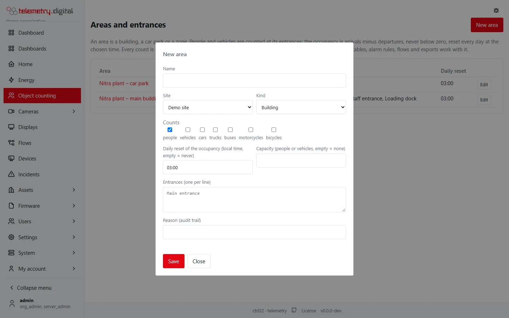
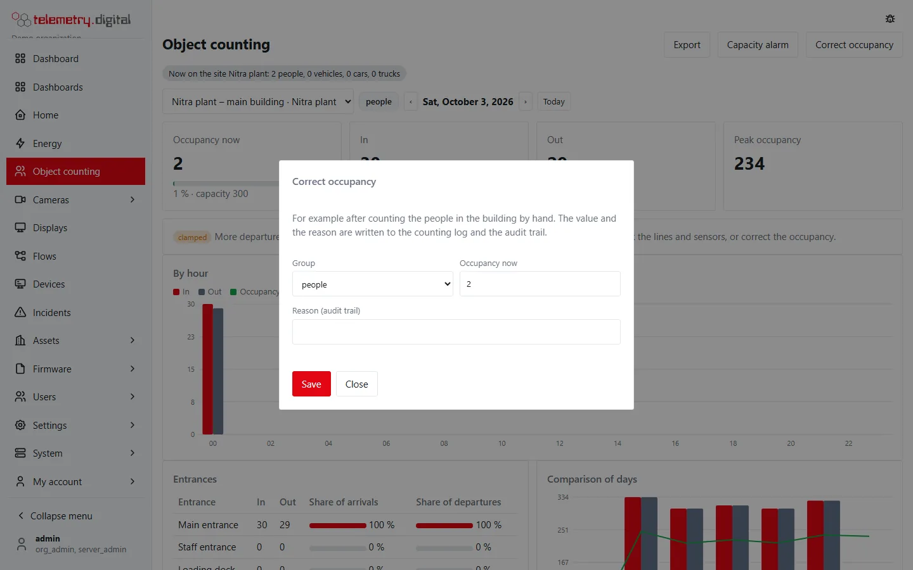
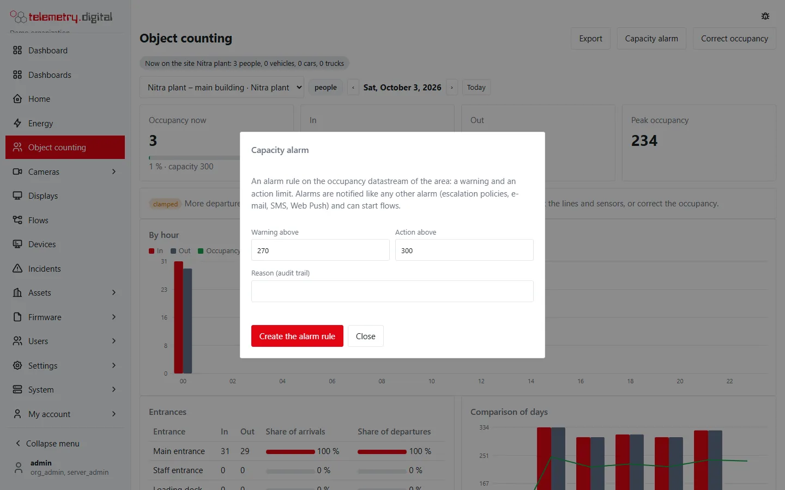
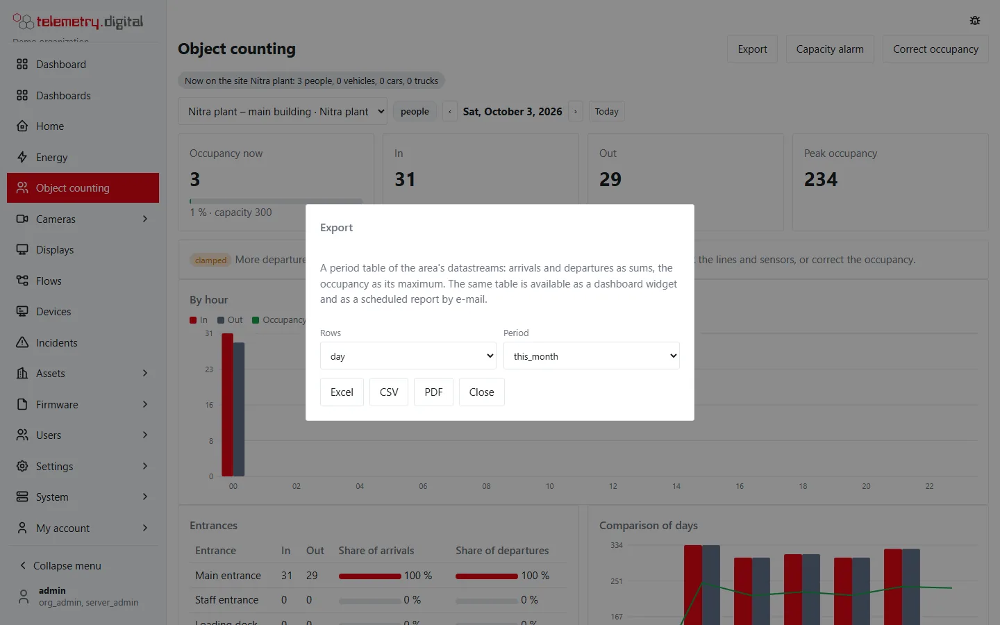
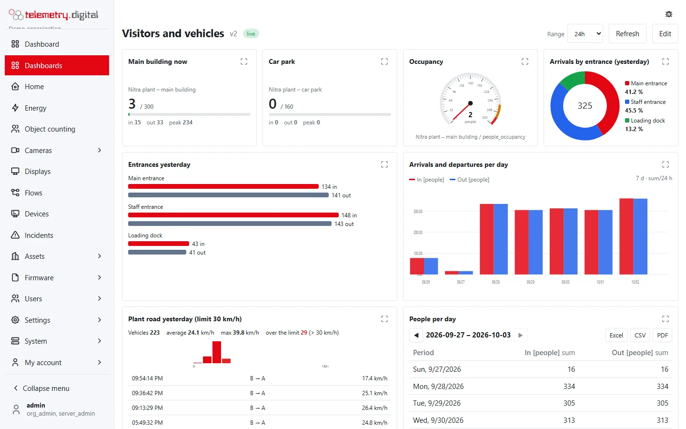
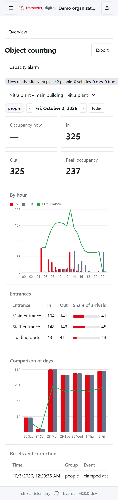

Everything counted shows on the **Object counting** page, in dashboard widgets, in period tables and exports, and
reaches alarm rules and flows like any other datastream.

## The Object counting page

*Object counting* in the menu (`data.read`). Choose the area, the group (people, vehicles, cars …) and the day.

- **Tiles**: *Occupancy now* with the capacity bar (green, amber from 80 %, red when full), *In*, *Out* and the
  *Peak occupancy* of the day.
- **By hour**: arrivals and departures as bars and the occupancy at the end of each hour as a line.
- **Entrances**: arrivals and departures of each entrance and its share of all arrivals and departures.
- **Comparison of days**: the last seven days with the peak occupancy of each day.
- **Vehicle speed** for every speed section of the area (see below).
- **Resets and corrections**: the daily resets, corrections by hand with their reason, and departures counted while
  the area seemed empty (*clamped at zero*).
- When a site has several areas, a badge at the top sums their occupancy.

### A car park and the plant road

A car park area counts vehicles, cars and trucks at its gate; with a capacity the tile shows how full it is. The speed
section of the plant road shows the number of vehicles, the average and highest speed, the vehicles over the limit, a
histogram per 10 km/h (over the limit in red) and the last vehicles.

## Areas and entrances

*Object counting → Areas and entrances* (`config.write`): **New area** — name, site, kind (building, car park,
zone), the groups it counts, the daily reset time (empty = never) and the capacity, and the entrances, one per line.
*Edit* renames, adds and archives entrances. Archiving an area stops counting; its datastreams and data stay.

The area and each entrance become **assets** of the site (types `counting_area` and `entrance`), with their
datastreams created at once.

## Correct the occupancy

*Correct occupancy* (`config.write`, today only) sets the occupancy of a group, for example after counting the people
in the building by hand. The value and the reason are written to the counting log and the audit trail.

## Capacity alarm

*Capacity alarm* creates an [alarm rule](../automation/alarms.md) on the occupancy datastream with a warning and an
action limit (proposed from the capacity). The alarm is notified like any other — escalation policies, e-mail, SMS,
Web Push — and can start a [flow](../automation/index.md).

## Export

*Export* makes a [period table](../dashboards/period-tables.md) of the area's arrivals and departures — a row per
hour, day, week or month, for today, yesterday, the last 7 days, this month, last month or the last 12 months — as
**Excel**, **CSV** or **PDF**.

## Widgets

Four widgets on [dashboards](../dashboards/widgets.md). Bind **any datastream of the area** (for example its
occupancy); the speed widget binds the `vehicle_speed` datastream of a speed section.

| Widget | Group | Shows | Settings |
|---|:---:|---|---|
| Occupancy | values | the occupancy now, the capacity bar, today's in, out and peak | Title, Counts (group), Show today's in and out |
| In and out per entrance | charts | today's arrivals and departures of each entrance as bars | Title, Counts |
| Share per entrance | charts | today's share of each entrance in the arrivals or departures | Title, Counts, Direction |
| Vehicle speeds | lists | today's count, average, maximum, over the limit, a histogram and the last vehicles | Title, Vehicles listed (1–10), Histogram |

The occupancy is also an ordinary datastream for the value, gauge and chart widgets — a radial gauge with the capacity
as the action limit, a chart of `people_in` with the aggregation *sum* per hour.

## Period tables

The [period table](../dashboards/period-tables.md) value **sum** adds the passages per hour, day, week, month or
year — people per day, vehicles per month. *max* of the occupancy datastream gives the peak of each period.

## Further aggregation

- **Several areas** (all buildings of a site): a period table with the `people_in` of each area and a total row.
- **Formulas** (a share in per cent, arrivals minus departures of several areas): an automation rule with a
  *derived datastream* and the expression language, or a flow with *Store value* — see
  [Automation and alarms](../automation/index.md).

## On a phone

