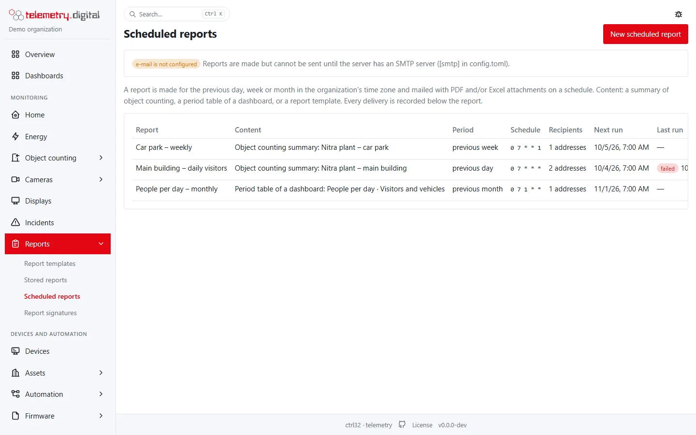
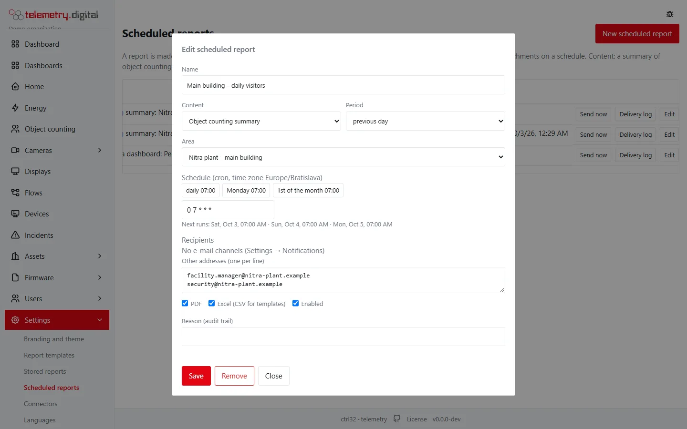
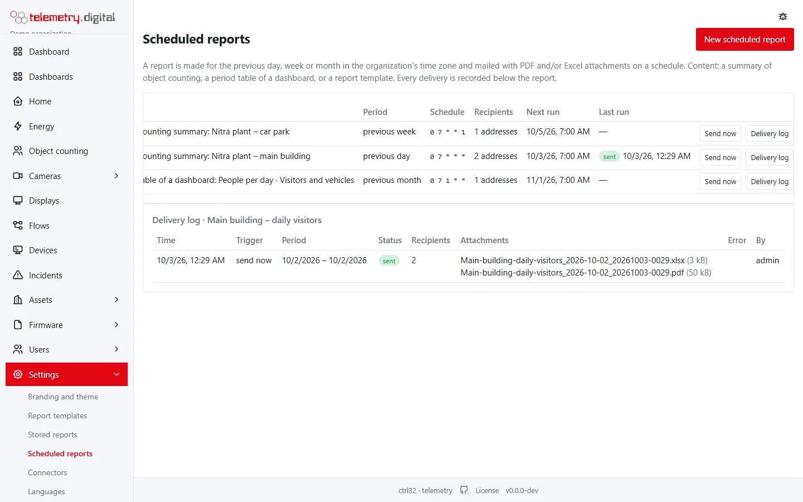

A **scheduled report** is made for the previous day, week or month and mailed with PDF and Excel attachments on a
schedule — for example yesterday's visitors every morning at 07:00. It works for object counting and for any period
table or report template.

*Reports → Scheduled reports*, also in the menu under *Object counting → Scheduled reports* (`config.write`).

## Create a report

**New scheduled report**:

| Field | Meaning |
|---|---|
| Name | up to 80 characters; the e-mail subject is the name and the period |
| Content | *Object counting summary* of an area; a *Period table of a dashboard* (a period table widget); a *Report template* — observations of a datastream, or alarms |
| Period | previous day; previous week (Monday to Sunday); previous month — in your organization's time zone |
| Schedule | a cron expression; presets *daily 07:00*, *Monday 07:00*, *1st of the month 07:00*; the next runs are shown below |
| Recipients | e-mail [notification channels](../administration/settings-reference.md#notifications) and other addresses, one per line |
| Attachments | PDF and/or Excel (CSV for report templates) |
| Enabled | a disabled report keeps its settings and log but is not sent |
| Reason | written to the audit trail |

### The schedule

Five fields: `minute hour day-of-month month day-of-week` — `*` for every value, lists `1,15`, ranges `MON-FRI`,
steps `*/15`.

| Schedule | Cron |
|---|:---:|
| every day at 07:00 | `0 7 * * *` |
| every Monday at 07:00 | `0 7 * * 1` |
| the 1st of every month at 07:00 | `0 7 1 * *` |
| working days at 06:30 | `30 6 * * MON-FRI` |

Times are local to your organization. On the night the clocks go forward a time that does not exist (02:30) runs at
03:00; on the night they go back a repeated time runs once.

## What the attachments contain

- **Object counting summary**: a row per hour (previous day) or per day (week, month) with arrivals, departures and
  the peak occupancy of every group, a total row, the entrances with their totals and shares, and the speed sections
  (vehicles, average, maximum, over the limit). The text of the e-mail repeats the totals.
- **Period table**: the widget's table for the report's period, as the Excel and PDF export of the widget.
- **Report template**: the observations of a datastream or the alarms of the period, as PDF (your report template)
  and CSV.

The files are made exactly like the exports of the user interface, as the author of the report with read and export
permissions. PDF needs the report renderer of the server (as every PDF export).

## Send now and the delivery log

**Send now** makes and mails the report for the period before now — a test. **Delivery log** lists every run: time,
trigger (schedule or send now), period, state (*sent*, *partial*, *failed*), recipients, the attachments with their
size, and the error.

!!! note "E-mail must be configured"
    Reports are sent through the server's SMTP settings (`[smtp]` in
    [config.toml](../administration/config-reference.md)). Without them the page shows a note and every run is
    logged as *failed* with the reason.

Every change of a report and every *Send now* is written to the audit trail.
