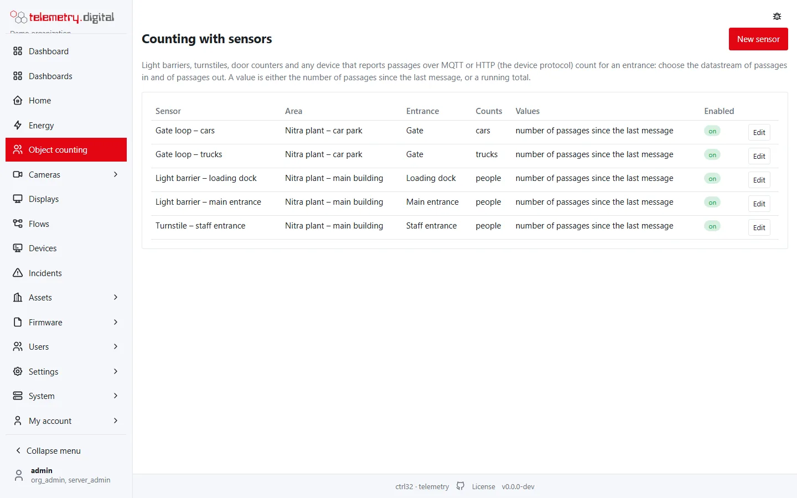
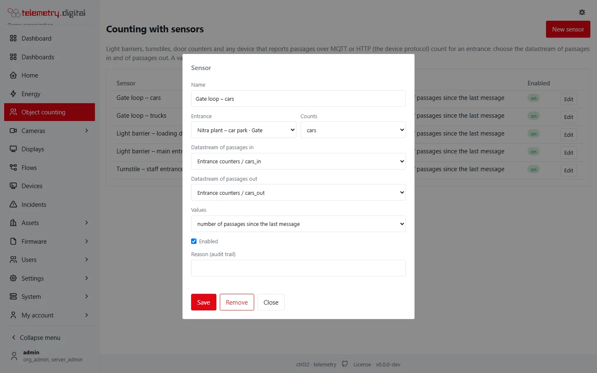

Light barriers, turnstiles, door counters, induction loops at a gate — and any other system that knows how many people
or vehicles passed — count for an entrance through the **device protocol**: the device sends its numbers as telemetry
over [MQTT or HTTP](../devices/mqtt-http.md), and a **sensor** maps its datastreams to the entrance.



## Connect the device

1. Add the device and its datastreams, for example `door_in` and `door_out`, as described in
   [Devices and data](../devices/index.md), and give it a token.
2. The device sends its counts:

```
POST /api/v1/d/telemetry
Authorization: Bearer <device token>
Content-Type: application/json

{"ts": 1759392000, "v": {"door_in": 3, "door_out": 1}}
```

Over MQTT the same payload goes to the device's telemetry topic. Readings with a time (`ts`, Unix seconds) are stored
at that time, so a counter that was offline can send its history later.

## Add the sensor

*Object counting → Sensors → New sensor*:

| Field | Meaning |
|---|---|
| Name | for example *Light barrier – main entrance* |
| Entrance | the entrance it counts for |
| Counts | the group: people, vehicles, cars, trucks, buses, motorcycles or bicycles |
| Datastream of passages in | the datastream with arrivals (optional when the sensor counts only one way) |
| Datastream of passages out | the datastream with departures |
| Values | *number of passages since the last message*, or *running total* |
| Enabled | a disabled sensor is kept but counts nothing |



**Values.** With *number of passages since the last message* every value is added (3 means three people). With
*running total* the difference to the previous reading is added; the first reading is the starting point, and a
counter that restarts from zero adds its new reading.

A sensor counting *cars* (or trucks, buses, motorcycles) also counts for *vehicles* when the area counts both.

!!! tip "Counts from another system"
    Any other software that counts people or vehicles can send its results the same way: one device per system, its
    counts as telemetry, a sensor per entrance and direction.

The results of counting cannot be chosen as a sensor — the server refuses a datastream of an area or an entrance, so a
loop cannot occur.
