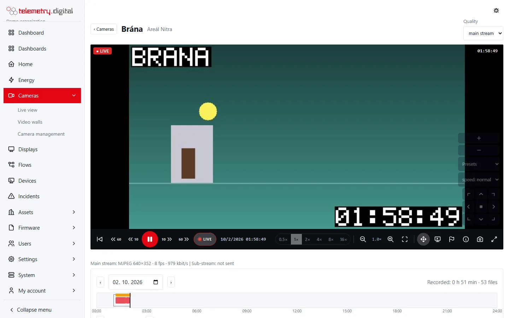

Events tell you **when something happened** on a camera. They outline the camera's tile in the live view and on
walls (with the kinds going on as a label), appear as marks on the timeline and in the event list of the camera page,
start recording on events, make floor-plan pins pulse, enlarge the camera on displays and can start flows.

## Event kinds and sources

| Kind | Shown as | Comes from |
|---|---|---|
| `motion` | Motion | ONVIF motion events, or motion detection on the server |
| `tamper` | Tampering | ONVIF tamper, global scene change, image too dark, image too blurry |
| `line` | Line crossing | ONVIF line detector or line crossing |
| `intrusion` | Intrusion | ONVIF field detector, intrusion or objects inside |
| `input` | Input | ONVIF digital input, logical state or relay trigger |
| `mark` | Mark | a person on the camera page, or a flow |
| `other` | Event | any other ONVIF event |

Each event stores its **source**: `camera` (ONVIF), `server` (motion detection on the server), `flow` or `user`, a
label of up to 200 characters, its start and its end. Single-moment events (a line crossing, a mark) have no
duration.

## Events from the camera (ONVIF)

Enter the camera's ONVIF address (`http://camera/onvif/device_service`) with the same user name and password as the
stream. The server subscribes to the camera's events and keeps the subscription; a lost subscription is retried with
a back-off from 1 second to 1 minute. *Camera management* shows the state of the event connection in the **ONVIF**
badge: *connecting*, *connected*, or the last error.

The server never decodes video, so event detection costs nothing per camera — **the camera's own analytics does the
work**. Set its sensitivity and zones in the camera itself.

- **Joining**: an event of the same kind that starts again within *Join events that start again within* (default
  5 s, 0–120 s, 0 = never join) continues the previous event instead of making a new one.
- **Camera clocks**: an event time in the future or more than an hour in the past is replaced by the server's time.
- **Clean ends**: when the camera disconnects, is changed or the server restarts, open events are closed, because
  their state is unknown.
- Events are deleted with the camera's recordings when its retention ends, except inside held evidence.

## Motion detection on the server

Cheap cameras, MJPEG cameras and older models without ONVIF events get motion events from the server: *Camera
management → Edit → Motion detection on the server (cameras without ONVIF events)*. The server looks at JPEG
pictures only:

- a camera with an **MJPEG stream** — its frames (the sub-stream is tried first), at most 2.5 pictures a second;
- an **H.264/H.265 camera** — its **snapshot address** (one JPEG picture), fetched once a second with the camera's
  user name and password. Never put the password into the address; the form refuses it.

| Setting | Default | Bounds | Meaning |
|---|:---:|:---:|---|
| Motion detection on the server | off | — | switches detection on for this camera |
| Sensitivity | 50 | 1–100 | higher = smaller changes count as motion |
| Snapshot address | empty | ≤ 500 characters | `http(s)://` address of one JPEG picture; not for cameras behind a relay |
| Motion zones | whole picture | ≤ 16 rectangles | only motion inside the zones counts |

**Motion zones** are drawn in the camera dialog after the camera is saved: choose **Motion zones** above the live
picture and drag rectangles (green); **✕** removes one, **Remove all** removes all zones.

How it decides:

- Each picture is reduced to a 64 × 36 grid of brightness cells and compared with a slowly adapting background.
- Motion is a share of changed cells inside the zones above a threshold set by the sensitivity; it must be seen in
  **3 pictures in a row**, so a single odd picture is not motion.
- Motion ends **4 seconds** after the last changed picture.
- An object that stops — a parked car — becomes background.
- A change of more than 70 % of the picture (lights, infrared switching, exposure) resets the background instead of
  raising an event.

These events have the kind `motion` and the source `server` and behave like the camera's own. The **motion** badge
in *Camera management* shows the state:

| State | Meaning |
|---|---|
| starting | detection is starting |
| watching (MJPEG) | frames of the MJPEG stream are examined |
| watching (snapshots) | the snapshot address is polled |
| needs an MJPEG stream or a snapshot address | the camera sends H.264/H.265 and has no snapshot address |
| snapshot: … | the snapshot address fails (the error follows) |
| picture: … | a picture could not be read |

!!! tip "Prefer the camera's own detection"
    Where a camera offers ONVIF motion events, use them. Server detection is the fallback and costs a little
    processor time per camera (little with a small MJPEG sub-stream; 320 × 180 is enough).

## Marks

The **flag button** on the camera page marks the camera with a label you type, for example "Delivery arrived". The
mark appears on the timeline and in the event list; on a camera recording on events with *marks* ticked it also
records **60 seconds** (with the pre-roll before). Marks need `video.view` and are written to the audit trail with the
label.

A flow marks a camera with the action **Camera mark**: label (a template, default `{{topic}}: {{value}}`) and *Record
for (s)* (default 30, 0–3600).

## PTZ

Cameras with pan, tilt and zoom are controlled from the player when the camera has an ONVIF address and you have
`video.ptz`:

- hold an arrow (eight directions) or **+** / **−** to move or zoom, release to stop; the middle button stops;
- **Presets** lists the presets stored in the camera; choosing one moves the camera there;
- **speed**: slow, normal or fast — remembered in your browser;
- the **PTZ** button in the control bar shows or hides the controls; they are shown by default on screens wider than
  700 px, and your choice is remembered.

*The PTZ controls over the live picture.*

Moves are audited **once per 5 minutes** per user and camera (adjustable, 0 = every move); going to a preset is
always audited. Presets are created in the camera itself.

## Events in flows

Flows have the trigger **Camera event** and the action **Camera mark**:

| Trigger setting | Default | Meaning |
|---|:---:|---|
| Camera | any | one camera, or empty for any camera |
| Kinds | motion, tamper, line, intrusion, input | which kinds start the flow (mark and other can be added) |
| When | start | start, end, or both |

The message value is `true` at the start and `false` at the end; `msg.kind`, `msg.phase`, `msg.camera_id`,
`msg.event_id` and `msg.label` carry the details. Example: a door contact opens → mark "Door opened" and record
30 seconds. See [Flows](../automation/flows.md).

## Floor plans and displays

On a floor plan the camera's pin pulses orange while an event is in progress. A display can enlarge a camera with an
event to the whole screen. See [Video walls, floor plans and widgets](video-walls.md) and
[Displays](../dashboards/displays.md).
