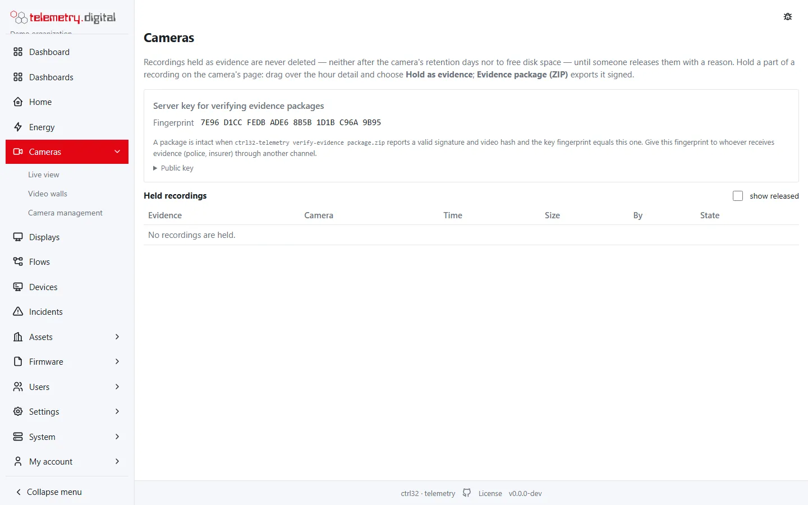

When a recording is needed by the police, an insurer or a court, it must not disappear with the retention and it
must be possible to prove that nobody changed it.

## Hold a recording as evidence

On the camera's page drag over the hour detail and choose **Hold as evidence**: a title, a case number and a reason.

- Held recordings are **never deleted** — not after the camera's retention days and not to free disk space. When only
  held recordings remain on a full disk, the disk incident tells administrators.
- **Release** (with a reason) hands them back to the normal retention.
- *Cameras → Evidence* lists all held recordings.




*Cameras → Evidence with the key fingerprint and the held recordings.*

## Fingerprints while recording

Every recorded file gets its **SHA-256** computed while it is written, without extra disk reads. An export can
therefore show that the file on disk is unchanged since it was recorded.

## Evidence package

Export the selection (at most one hour) as a **ZIP evidence package**:

| File | Content |
|---|---|
| `video.mp4` | the video, remuxed but never re-encoded — the pictures are the camera's own bytes |
| `manifest.json` | camera, time range, who exported it and why, the SHA-256 of the video and of each recorded file then and now, the events in the range |
| `manifest.sig` | Ed25519 signature by the server's key |
| `public_key.txt` | the server's public key |
| `README.txt` | how to verify the package |

The audit entry of the export carries the video's hash. Sound is included only for people with `video.audio`, and a
masked camera can be exported only with `video.unmask`.

## Verify a package

```sh
ctrl32-telemetry verify-evidence -key <public key> package.zip
```

The command checks the signature and the video hash. **Any changed byte of the video or of the manifest is
detected.** The key fingerprint must equal the one shown under *Cameras → Evidence* — hand it to the recipient
through another channel than the package itself.

## Permission and keys

Holding recordings and exporting evidence packages needs the permission `video.evidence` (engineers and
administrators).

!!! warning "Keep the server's secret key in your backup"
    The server's signing key is created on first use and stored encrypted with the server's secret key
    (`security.secret_key` in `config.toml`). Keep that secret in your backup. Without it, old packages can still be
    verified with the published public key, but new packages get a new key.
