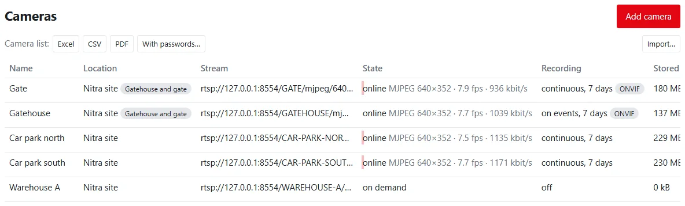
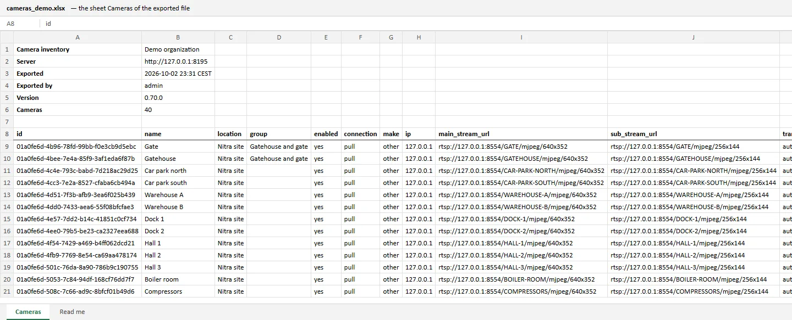
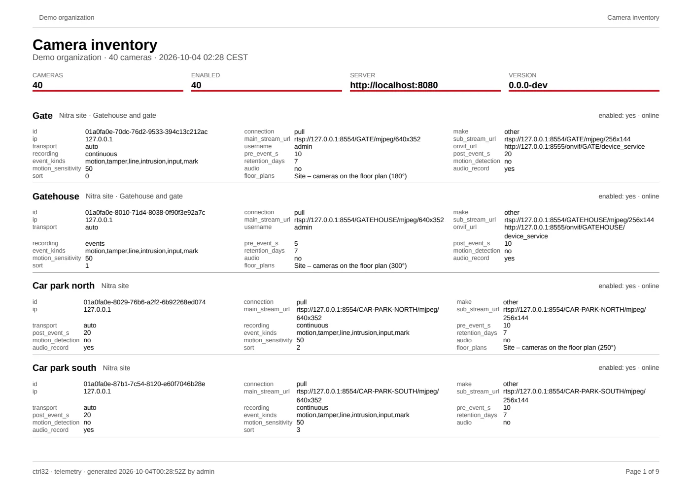
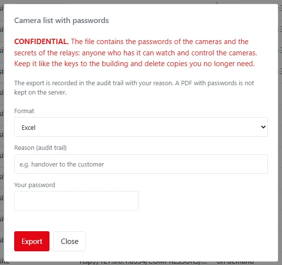
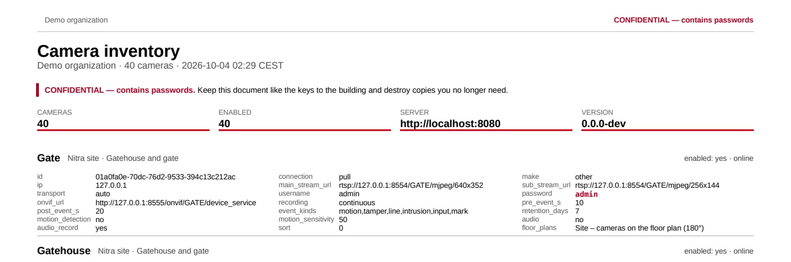
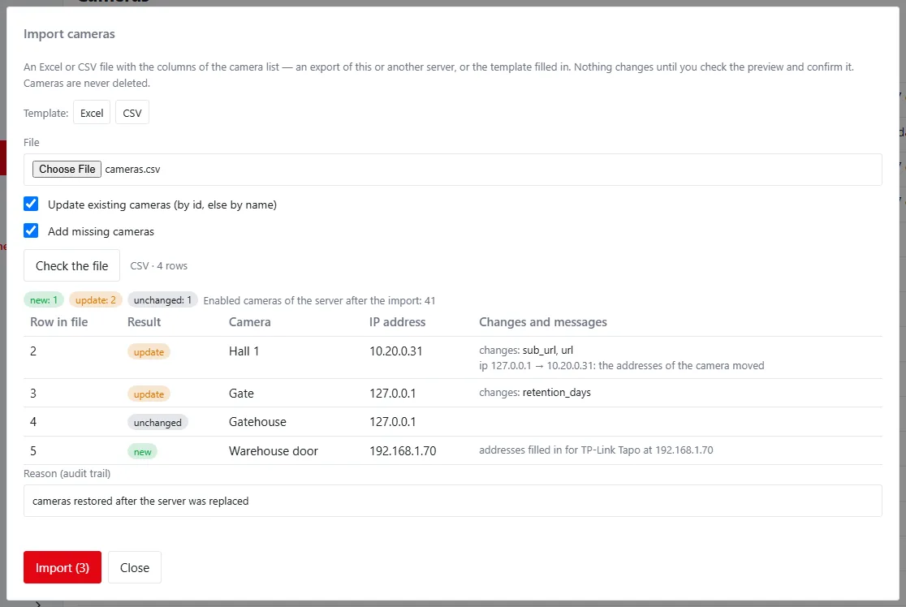
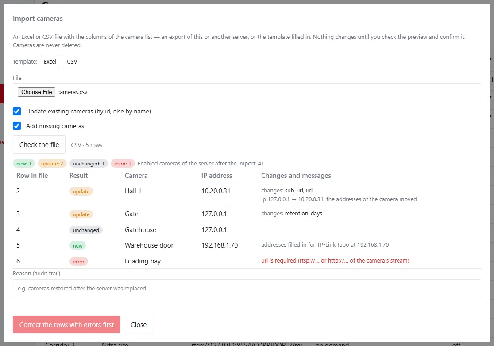

**One button gives the customer a list of every camera with all its settings** — the IP addresses, names, stream
addresses, user names and, when it is needed, the passwords. Keep it with the documentation of the building after the
installation company leaves, or use it to move the cameras to another system. And the same file brings the cameras
back: after a crash, import it and the cameras record again in a few minutes instead of searching for every address
and password again.



*Cameras → Camera management → Camera list.* Everything on this page needs the permission `video.manage`; the export
with passwords needs `video.credentials_export` as well.

## Export

| Button | File | Use it for |
|---|---|---|
| **Excel** | `cameras_<organization>_<time>.xlsx` with the sheets *Cameras* and *Read me* | keeping, editing, importing |
| **CSV** | the same table as text | other systems, scripts, importing |
| **PDF** | a card per camera on A4 landscape | the printed file of the building |
| **With passwords…** | the same, with the camera passwords and relay secrets | the handover to the customer, a restore on a new server |

The list holds the cameras of your organization that you may see (camera groups apply). Removed cameras are not in
it. On top of the *Cameras* sheet are the organization, the server, the time of the export, who exported it and the
version; the *Read me* sheet explains every column.



The **PDF** has the same header and one card per camera — the name, location, group and state on top, every setting
below. It is stored as a report like the other PDF exports.



!!! note "CSV and Excel"
    The CSV is UTF-8 with a byte-order mark and **semicolons** between the columns: Excel set to Slovak, Czech, German
    and the other languages with a decimal comma opens it straight in columns; LibreOffice and Google Sheets recognise
    it too. The lines of the header start with `#`. When Excel shows everything in one column (a language with a
    decimal point), open the file with *Data → From Text/CSV* and choose the semicolon — or use the Excel file.

## Export with passwords

Passwords never leave the server in the normal export. **With passwords…** adds the camera passwords and the relay
secrets of remote cameras, and only:

- for a user with the permission `video.credentials_export` (the built-in `org_admin` only) and `video.manage`,
- after typing their own password again (and the authenticator code with two-factor sign-in),
- with a reason, which goes to the audit trail with who, when, how many cameras and which format,
- in the browser — never with an API token or through an AI assistant,
- at most 3 times in a row, then once a minute.



The file is marked **CONFIDENTIAL — contains passwords** in its name, the sheet name, the first line, and in the PDF
in the header, the footer and a box above the cards. A PDF with passwords is **not** kept on the server.



!!! warning "Whoever has the file controls the cameras"
    Keep the file like the keys to the building, give it only to whoever needs it and delete copies you no longer
    need. After a handover consider changing the camera passwords.

## Import

**Import…** takes an Excel or CSV file with the columns of the camera list: an export of this or another server, or
the template filled in. Nothing changes until you have seen the preview and confirmed it, and an import never deletes
a camera.

1. *Cameras → Camera management → Import…*
2. Choose the file. The server reads it and checks every row with the same rules as the camera form.
3. Check the preview: what happens to each row, which settings change, and the messages.
4. Type a reason and choose **Import (N)**. All rows are stored at once — or none, when one fails.



| Result | Meaning |
|---|---|
| new | a camera that is not on this server is added |
| update | an existing camera changes; the changed settings are listed |
| restore | a removed camera of the organization comes back by its id, with the recordings that still exist |
| unchanged | the row equals the camera |
| skipped | updating or adding is switched off for this import |
| error | the row cannot be stored; the message says why |

While a row has an error, the import cannot be confirmed — correct the file or remove the row and choose the file
again.



### Options

| Option | Default | Meaning |
|---|:---:|---|
| Update existing cameras | on | change cameras found by id, else by name |
| Add missing cameras | on | add cameras that are not found |

### How rows find their camera

- By **id** — the camera with that id. An id from an export of another server is **kept** when it is free here, so
  dashboards, video walls and floor plans restored with the organization still show their cameras. An id of a removed
  camera restores it.
- Without an id, by **name** (capitals do not matter). When several cameras have the name, the **ip** column decides;
  when it does not, the row is an error.

### What the cells mean

| Cell | Meaning |
|---|---|
| empty | an existing camera keeps its value; a new camera gets the default |
| `-` | clears a text: location, group, sub_stream_url, username, onvif_url, ptz_profile, snapshot_url, note |
| `none` in event_kinds | no event starts recording |
| yes and no | also true and false, 1 and 0, and the usual words in other languages |
| an empty password | keeps the stored password; the same password is no change |
| a different ip | moves every address of the camera from the old address to the new one, ports and paths stay |
| make with ip | fills in the stream, ONVIF and snapshot addresses of a camera without a main stream |

Rows whose id starts with `#` are skipped — the example rows of the template. Columns the import does not know, and
the columns *floor_plans* and *state*, are ignored and listed in the preview.

### Remote cameras

A camera behind a relay keeps its relay working when the row has its **relay_secret** (the export with passwords has
it). Without it the camera gets a new secret and the preview says so: open the camera and choose *New secret* to get
the relay configuration for the site.

### Without a licence

A server without a licence runs up to 4 enabled cameras. Cameras that are enabled stay enabled; further rows take the
free places in the order of the file and the rest are **imported disabled**, each with a warning in the preview.
Enable them when the server has a licence. See [Cameras without a licence](index.md#cameras-without-a-licence).

### After the import

Changed cameras connect and record at once. The audit trail has `video.import` with the counts, the options and the
cameras, and every camera change as `camera.create`, `camera.update` or `camera.restore` with the reason
*import: …*.

## The template

*Import… → Template* gives an empty Excel or CSV file with every column and two example rows. The fastest way for a
new site is one row per camera with **name**, **make**, **ip**, **username** and **password** — the addresses of the
makes are filled in like in the camera form (see [The fastest way: camera make](cameras.md#the-fastest-way-camera-make)).

## Columns

| Column | Values | Meaning |
|---|---|---|
| `id` | id or empty | the camera's id; empty for a new camera |
| `name` | 1–80 characters | the name |
| `location` | ≤ 120 characters | where the camera is |
| `group` | ≤ 60 characters | camera group; a new group is created by using it |
| `enabled` | yes, no | whether the server runs the camera |
| `connection` | pull, push | the server connects, or a relay sends the video |
| `make` | tapo, hikvision, dahua, reolink, axis, uniview, ezviz, other | recognised from the addresses on export |
| `ip` | address or host name | of the main stream; of the ONVIF address for push cameras |
| `main_stream_url` | `rtsp://`, `rtsps://`, `http://`, `https://` | the main stream, never with user name and password |
| `sub_stream_url` | as above | the smaller stream for tiles |
| `transport` | auto, tcp, udp | RTSP transport |
| `username` | text | the camera account |
| `password` | text | only in the export with passwords; empty keeps the stored one |
| `relay_secret` | 16–200 characters | only in the export with passwords; push cameras |
| `onvif_url` | `http(s)://…/onvif/device_service` | events and PTZ |
| `ptz_profile` | ≤ 64 characters | ONVIF profile for PTZ; empty is automatic |
| `snapshot_url` | `http(s)://…` | one JPEG picture, for motion detection |
| `recording` | continuous, events, off | the recording mode |
| `pre_event_s` | 0–60 | seconds before an event |
| `post_event_s` | 1–600 | seconds after an event |
| `event_kinds` | motion, tamper, line, intrusion, input, mark, other, none | events that start recording, separated by commas |
| `retention_days` | 1–3650 | days the recordings are kept |
| `motion_detection` | yes, no | motion detection on the server |
| `motion_sensitivity` | 1–100 | its sensitivity |
| `motion_zones` | JSON | polygons of points from 0 to 1; `[]` is the whole picture |
| `privacy_masks` | JSON | polygons of points from 0 to 1; `[]` is none |
| `audio` | yes, no | take the camera's sound |
| `audio_record` | yes, no | record the sound too |
| `sort` | whole number | order in lists |
| `note` | ≤ 500 characters | mounting, cabling, recorder channel, warranty |
| `floor_plans` | text | export only: dashboards with a pin of the camera |
| `state` | text | export only: the state at the time of the export |

Masks and zones are written as coordinates of the picture, for example `[[[0,0],[0.25,0],[0.25,0.2],[0,0.2]]]` for a
rectangle in the top left corner. Floor-plan pins belong to the dashboards and come back with them.

## Restore the cameras in five minutes

The server is broken and the cameras are gone. With the camera list from the handover (the Excel file with
passwords):

1. Install the server again ([Linux](../getting-started/install-linux.md) or
   [Windows](../getting-started/install-windows.md)) and sign in.
2. Install the licence when you have one (*System → License*) — otherwise only 4 cameras come enabled.
3. *Cameras → Camera management → Import…*, choose the file.
4. The preview shows every camera as **new**. Type a reason, for example *cameras restored after the server was
   replaced*, and choose **Import**.
5. The cameras connect at once. Check *Cameras → Live view*; remote cameras whose relay secret was in the file
   connect as soon as their relays reconnect.

!!! tip "When the web interface does not start"
    The same import runs on the server's command line, with the same checks and audit:

    ```sh
    ctrl32-telemetry cameras import -org SLUG -file cameras.xlsx -dry-run
    ctrl32-telemetry cameras import -org SLUG -file cameras.xlsx -reason "cameras restored"
    ```

    `-dry-run` prints the plan without changing anything. A running server connects the imported cameras within a
    minute, a stopped one when it starts.

## Command line

| Command | What it does |
|---|---|
| `ctrl32-telemetry cameras export -org SLUG -file cameras.xlsx` | writes the camera list (`.xlsx`, `.csv` or `.pdf` by the file name, or `-format`) |
| `ctrl32-telemetry cameras export -org SLUG -file cameras.xlsx -passwords -reason "why"` | with passwords; the file is readable by its owner only and the export is audited |
| `ctrl32-telemetry cameras import -org SLUG -file cameras.xlsx -reason "why"` | imports; `-dry-run` only shows the plan, `-no-update` and `-no-create` switch the options off |

`-org` is the slug of the organization; it can be left out on a server with one organization. `-config` points to
`config.toml` when it is not in the default place. The audit trail names the command and the user of the operating
system.

## Limits

| Item | Limit |
|---|:---:|
| Import file | 2 MB |
| Rows per import | 1000 |
| Exports with passwords | 3 in a row, then 1 a minute per user |
| Note of a camera | 500 characters |

See also [Adding cameras](cameras.md) for every field of a camera and [Video reference](reference.md) for the
permissions and the API.
