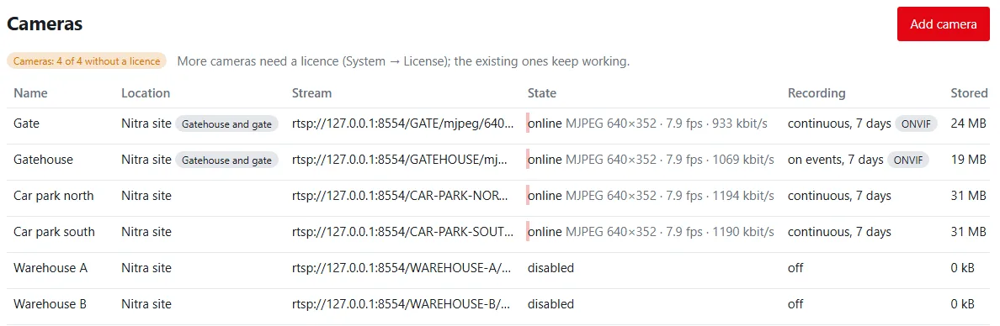

**A complete network video recorder on your own server** — for a warehouse, a yard, a shop or a whole site, with the
recordings staying with you. No cloud service and nothing to install in the browser.

The server receives each camera's stream, stores it and forwards it to browsers **as it is**: it never decodes or
re-encodes video. That is why one server records many cameras on little processor time, and why the picture you
play back is exactly the camera's own.

*Cameras → Live view — every camera you may see as a tile.*

## What you get

- **Cameras**: RTSP and ONVIF IP cameras (H.264, H.265, MJPEG) and HTTP MJPEG cameras, ONVIF discovery in the local
  network, address presets for common makes including TP-Link Tapo.
- **Recording**: continuous or on events (with pre- and post-recording), retention per camera and a disk limit for
  all cameras.
- **Events**: motion, tamper, line crossing, intrusion and digital inputs from the camera over ONVIF, motion detected
  on the server for cameras without it, and marks from people and flows.
- **Viewing**: live view and timeline playback in the browser, speeds 0.5× to 16×, digital zoom up to 8×, MP4
  export, PTZ with presets, sound (AAC, Opus, G.711).
- **Video walls and displays**: walls over up to 8 monitors, kiosk displays, cameras on a floor plan.
- **Phone app**: an installable camera app (PWA) for Android and iPhone that shows only the cameras.
- **Privacy and evidence**: privacy masks, access per camera group, an audit of who watched what, recordings held as
  evidence and exported as a signed package (SHA-256, Ed25519).
- **Remote sites**: an encrypted relay (Linux, Raspberry Pi, Windows, Home Assistant add-on) sends the video of
  cameras at another site — no open ports and no VPN there.

## Cameras without a licence

A server runs **up to 4 cameras without a licence** — the enabled cameras of all organizations of the server count.
More cameras require a [licence](../licence/index.md). Without one, adding a fifth enabled camera (or enabling a
disabled one) is refused with a message; a disabled camera can still be added. Nothing is switched off: cameras
beyond the limit, for example after a licence was removed, keep recording and can be changed.

## Where things are

| Place | What you do there | Needs |
|---|---|:---:|
| Cameras → Live view | all cameras as tiles | `video.view` |
| Cameras → Video walls | open, create and edit walls | `video.view` / `video.manage` |
| Cameras → Camera management | add, edit, remove cameras; storage; camera list export and import | `video.manage` |
| Cameras → Evidence | held recordings, the server's signing key | `video.playback` |
| Cameras → Settings | server-wide video settings | `video.manage` (change: `system.admin`) |
| Camera page (`/video/cameras/<id>`) | player, timeline, export, evidence, PTZ | `video.view` |

## Pages in this section

1. [Adding cameras](cameras.md) — every camera field, camera makes, TP-Link Tapo, discovery, camera states.
2. [Recording and storage](recording.md) — recording modes, pre- and post-roll, retention, files, disks, sizing.
3. [Events and motion](events-and-motion.md) — ONVIF events, motion detection on the server, marks, PTZ, flows.
4. [Live view and playback](watching.md) — every control of the live view and the camera page, timeline, export.
5. [Video walls, floor plans and widgets](video-walls.md) — walls, layouts, automatic sub-stream, camera widgets.
6. [Remote sites (relay)](remote-sites.md) — every `relay.toml` key, installer options, camera control through
   the relay.
7. [Phone app](phone-app.md) — install a camera-only app on phones and tablets.
8. [Privacy, sound and permissions](privacy.md) — masks, sound off by default, camera groups, audit.
9. [Evidence](evidence.md) — hold recordings, signed evidence packages and how to verify them.
10. [Video settings](settings.md) — every server-wide value with its default and bounds, `[video]` in
    `config.toml`, monitoring incidents.
11. [Camera list — export and import](export-and-import.md) — every camera with all its settings in Excel, CSV
    or PDF (passwords only on request), import with a preview, restoring the cameras after a crash.
12. [Video reference](reference.md) — permissions, audit entries and all limits on one page.

## Quick start

1. *Cameras → Camera management → Add camera*. Choose the **camera make**, type the IP address, user name and
   password — the stream addresses are filled in. *Test connection*.
2. Set **Recording** to continuous (or on events) and **Keep recordings (days)**, give a reason and save.
3. Open *Cameras → Live view* — every camera as a tile. Click one for the player with the timeline.
4. For phones: *Settings → Apps → New app → Cameras*, then install it on the phone.

!!! warning "Recording people is regulated"
    Recordings of people are personal data. You are the data controller: set the retention to what the purpose
    needs, mark the recorded area with signs, cover what must not be watched with privacy masks, and give access only
    to people who need it. Sound is **off by default** because recording conversations is regulated more strictly
    than pictures — switch it on only where it is lawful. See [Privacy, sound and permissions](privacy.md).
