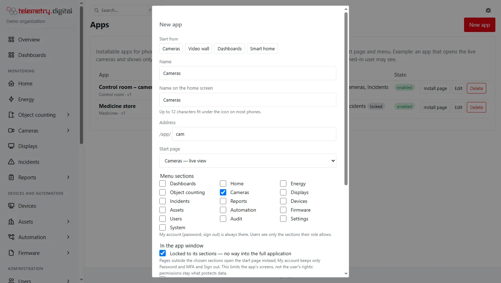
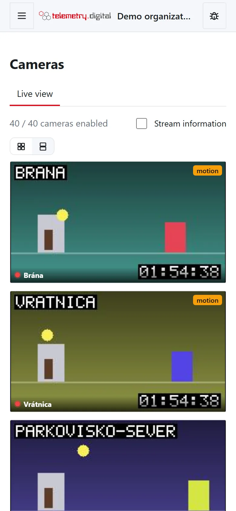
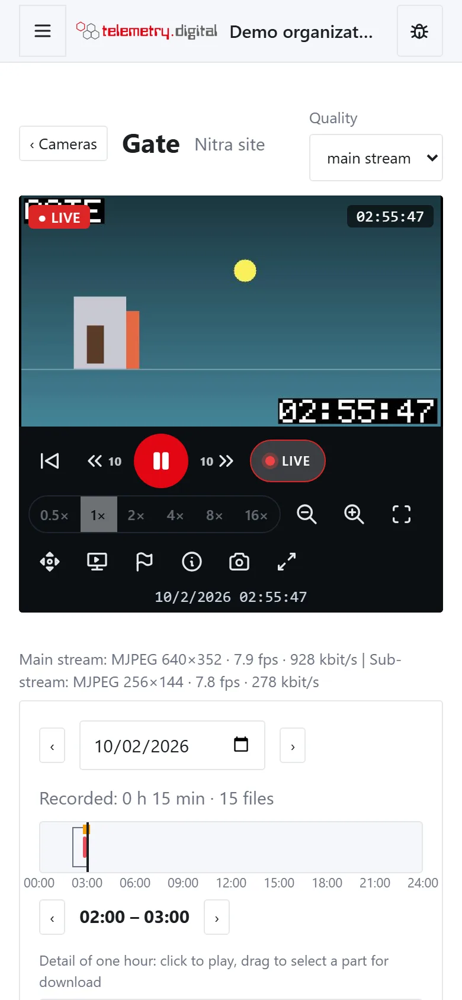

The web interface installs on a phone or tablet as an app (a PWA). For cameras the best choice is an **own app that
shows only the cameras** — the person opens it and sees the live view, nothing else.

## Create a camera app

1. *Settings → Apps → New app*, preset **Cameras** or **Video wall**.
2. Give it an address, for example `cam`, and a reason. The app lives at `https://<your server>/app/cam`.

| Preset | Start page | Sections | Locked | Page zoom | Cameras |
|---|---|---|:---:|:---:|:---:|
| Cameras | Cameras — live view (`/video`) | Cameras | yes | off | one per row |
| Video wall | the first video wall (or the wall list) | Cameras | no | on | automatic |

The option **Cameras in live view and on video walls** decides the layout inside the app:

| Value | Layout |
|---|---|
| automatic — one per row on phones | one camera per row on screens narrower than 700 px, a grid otherwise |
| one camera per row | always one camera per row |
| grid | always a grid |

A viewer's own choice of the layout buttons on the device wins over the app's setting. With page zoom off, the camera
picture still zooms with two fingers inside the player. See [PWA apps](../administration/pwa-apps.md) for all
options.

## Install it on the phone

Open `https://<your server>/app/cam` on the phone — on a computer the install page shows a QR code to scan.

- **Android** (Chrome, Edge, Samsung Internet): tap *Install*, or browser menu → *Install app* / *Add to Home screen*.
- **iPhone and iPad** (Safari): *Share* (the square with the arrow) → *Add to Home Screen* → *Add*.

## What it does

- The app window has no search field and no bug button in its header; a bug is reported with the bug icon in the
  footer.
- Pages of the app carry `?app=cam` in their address, so the phone stays in the app even when the browser opens the
  last page again in a new session (Firefox on iPhone, a bookmark on the home screen). *My account → Open the full
  application* leaves the app (not in a locked app).

- Live video, recordings with the same controls as in the browser (pinch to zoom) and video walls.
- On narrow screens the PTZ controls are hidden until you press the PTZ button.
- Live video on iPhone needs iOS 17.1 or later; MJPEG cameras work everywhere.
- **Nothing of the video or the data is stored on the phone** — the app caches only its own shell.
- Access from outside goes through the same HTTPS address as the web interface, with the same sign-in, two-factor
  sign-in and permissions. For a server without a public address, see
  [Cloudflare Tunnel](../getting-started/cloudflare-tunnel.md).

*The live view on a phone; tiles with an event carry a label.*

*The camera page on a phone.*

!!! warning "An app is a view, not a permission boundary"
    The app shows only the cameras a person may see, because the server checks permissions on every request. Locking
    an app to the Cameras menu does not take away rights the person's role has. To limit what someone can see, use
    roles and camera groups — see [Privacy, sound and permissions](privacy.md).
