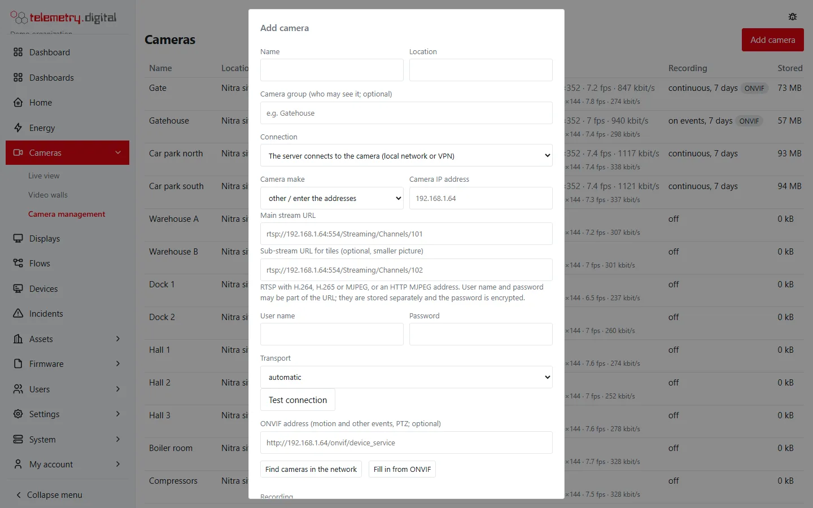

Recordings of people are personal data. telemetry.digital gives you the tools to keep them under control — and keeps
the sensitive ones **off by default, behind their own permission, and audited**: sound, unmasked pictures and
evidence.

## Privacy masks

*Camera management → Edit*: once the camera is saved, the dialog shows its live picture with **Draw over the
picture**. Choose **Privacy masks (GDPR)** and drag over the picture to cover areas that must not be watched — a
neighbour's window, a cash desk, a public street.

| Item | Limit |
|---|---|
| Masks per camera | at most 16 |
| Shape | rectangles drawn in the dialog (stored as polygons of 3–16 points; the API accepts any such polygon) |
| Coordinates | relative to the picture, 0 to 1, so masks fit every stream size |
| Remove | **✕** on a mask, or **Remove all** |

The editor shows the picture **without** masks so you can place them exactly — this needs `video.unmask` and is
audited; without that permission you draw over the masked picture. Saving needs a reason.

The masks travel with every live and recorded stream, and **every player covers them**: the camera page, video walls,
camera widgets, floor plans, displays and phones. Snapshots made by the server are masked in black on the server.

The recording itself stays complete. Therefore:

- seeing a masked camera **unmasked** needs the permission `video.unmask` (administrators only) and is audited
  (`video.unmask`);
- MP4 export and evidence packages of a masked camera need `video.unmask` — without it the server answers *this camera
  has privacy masks: exporting its recordings needs the permission video.unmask*;
- to keep the areas out of the recording altogether, set the privacy masks **in the camera itself** (its web page
  or ONVIF) — then they are missing from the recording and from every export.

## Sound is off by default

Recording sound — conversations — is regulated more strictly than pictures. A camera's sound stays **off** until a
manager switches it on per camera (*Camera management → Edit → Sound from the camera*). Do it only where it is lawful,
and inform people with a sign.

| Setting | Default | Options |
|---|:---:|---|
| Sound from the camera | off | on, off |
| Sound recording | record it | *record it with the picture*, or *live only — not recorded (saves disk space)* |

- Supported: **AAC**, **Opus** and **G.711** A-law and µ-law (TP-Link Tapo and most Hikvision and Dahua defaults).
  G.711 is expanded to uncompressed PCM for recording and playback. Other codecs (for example G.726) are named in the
  camera's status with a ⚠ — choose AAC or G.711 in the camera.
- Sound comes with the **main stream** only; a relay forwards it only with `audio = true`.
- **Live only**: heard live but never written to disk, so it is not in recordings, playback or exports.
- Hearing sound live or recorded, and exporting it, needs the permission `video.audio` (administrators). Each
  listening is audited (`video.listen`).
- Walls, widgets and displays never play sound. At speeds other than 1× there is no sound.

## Permissions

| Permission | Allows | operator | engineer | org_admin |
|---|---|:---:|:---:|:---:|
| `video.view` | live view, video walls, camera widgets, marks | yes | yes | yes |
| `video.playback` | recordings, timeline, events, playback, MP4 export, the Evidence list | no | yes | yes |
| `video.manage` | cameras, walls, storage, discovery, viewing video settings | no | yes | yes |
| `video.ptz` | PTZ control and presets | yes | yes | yes |
| `video.evidence` | hold and release recordings as evidence, signed evidence packages | no | yes | yes |
| `video.unmask` | see and export pictures without privacy masks | no | no | yes |
| `video.audio` | hear camera sound live and recorded, export it | no | no | yes |
| `display.control` | send cameras and commands to displays | yes | yes | yes |
| `display.manage` | pair, change and disconnect displays | no | yes | yes |
| `system.admin` | change the server-wide video settings | no | no | yes |

The built-in roles *viewer* and *qa* have no video permissions. Custom roles can combine them freely.

## Camera groups

A camera may belong to one **camera group** (*Camera management → Edit → Camera group*, up to 60 characters; the field
suggests the groups already in use).

On *Users → user → Cameras* (needs `user.admin`) choose:

- **All cameras of the organization** (the default), or
- **Only cameras of these groups** — tick the groups, including *(cameras without a group)*. An empty selection means
  no cameras.

Save with **Save camera access** and a reason; it applies at once. A user limited to some groups sees only those
cameras everywhere — live view, recordings, walls, events, PTZ, marks, floor plans, evidence and storage, also through
the API and AI assistants. Such a user can create cameras, walls, dashboards and display commands only with cameras of
their groups, and an administrator who is limited can hand out only their own groups. At most 100 groups per user.

## Audit: who watched what

| Audit entry | When |
|---|---|
| `video.playback` | every playback of a recording, with the camera, start time and speed |
| `video.export` | every MP4 export, with the time range |
| `video.evidence_export` | every evidence package, with the range, case number, video hash and key fingerprint |
| `video.hold`, `video.hold_release` | holding and releasing evidence |
| `video.unmask` | every unmasked view |
| `video.listen` | every listening to camera sound |
| `camera.ptz` | PTZ moves (once per interval per user and camera) and every preset |
| `camera.mark` | every mark, with the label |
| `camera.create`, `camera.update`, `camera.delete` | camera changes, with the old and new values and the reason |
| `camera.push_secret` | a new relay secret |
| `video_wall.create`, `video_wall.update`, `video_wall.delete` | wall changes, with the reason |
| `user.camera_groups` | changes of a user's camera access |
| `video.settings` | changes of the server-wide video settings |

!!! warning "You are the data controller"
    telemetry.digital does not decide for you what is lawful. Set the retention to what the purpose needs, mark the
    recorded area, mask what must not be watched, keep sound off unless it is lawful, and give `video.playback`,
    `video.unmask` and `video.audio` only to people who need them.
